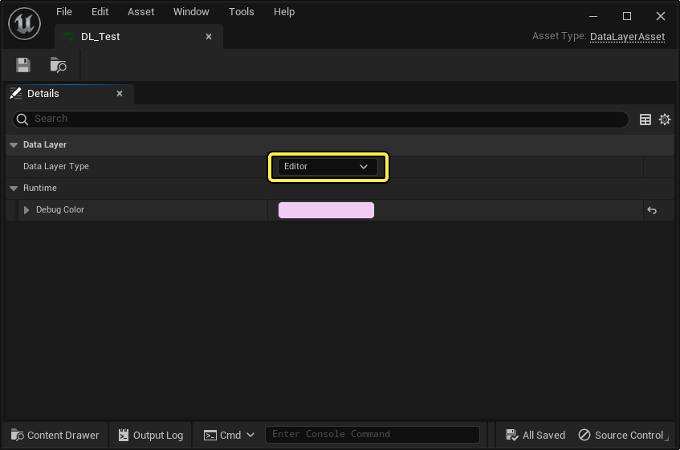
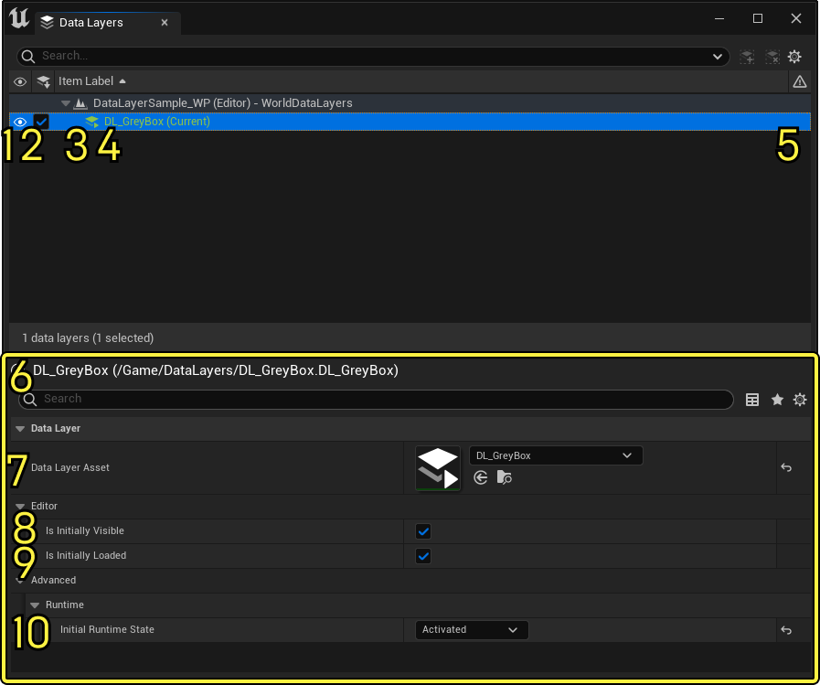
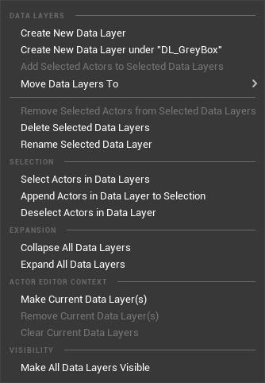
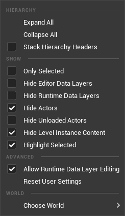
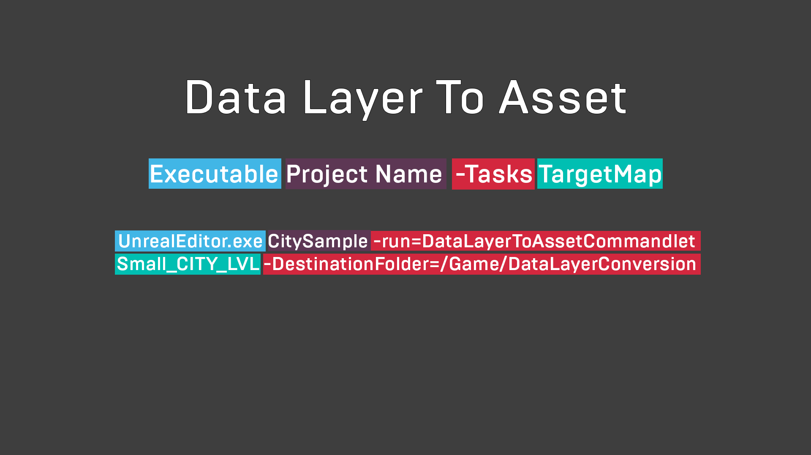
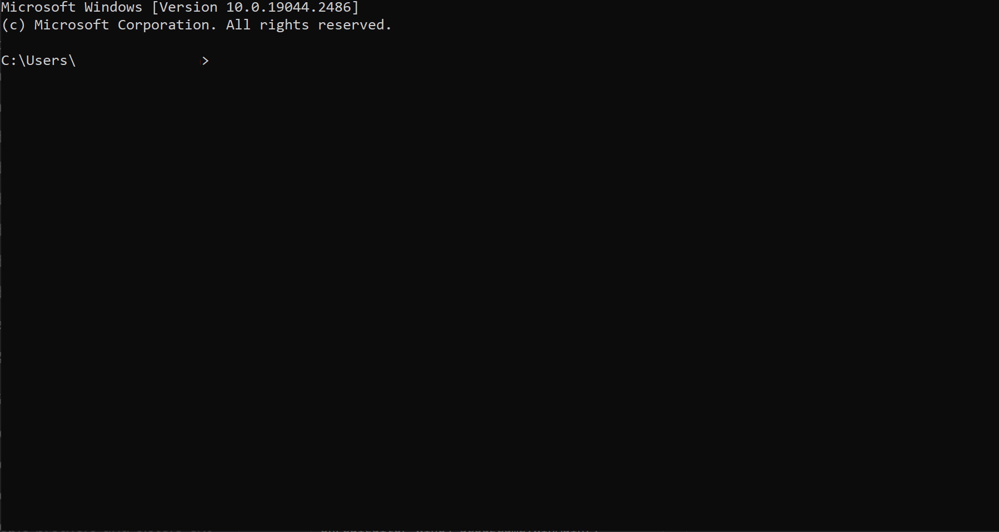
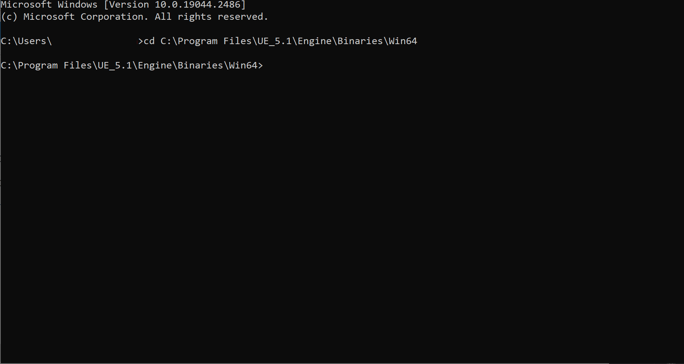
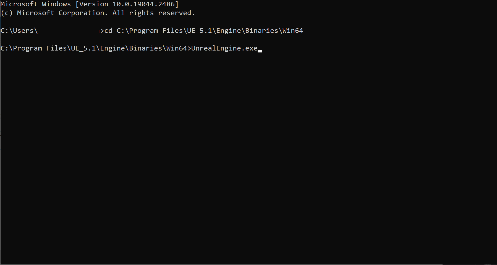

# 世界分区 - 数据层

> 路径：虚幻引擎5.7文档 / 构建虚拟世界 / 世界分区 / 世界分区 - 数据层

> 原始页面：https://dev.epicgames.com/documentation/unreal-engine/world-partition---data-layers-in-unreal-engine

**数据层（Data Layers）** 是[世界分区](../index.md)中的一个系统，用于在编辑器中和在运行时整理Actor。

> 图片已省略：Sample Level with Data Layers

一个使用数据层完成的示例关卡。

使用数据层资产和数据层实例，你可以在编辑器中动态加载和卸载层，以此实现复杂的关卡效果。该系统旨在取代旧版本虚幻引擎中先前的层系统。

借助数据层，你可以在编辑器中将游戏逻辑类元素和环境资产分隔开来。美术师可以单独处理特定元素，不会受到游戏逻辑触发器或游戏对象的干扰。设计师则可以借助数据层的动态加载来设计有趣的游戏体验，并让关卡过度更加丰富多变。

在运行时，你可以使用蓝图或C++代码切换数据层，进而驱动游戏逻辑（如任务、进度和游戏内事件）。数据层是在世界分区工作流程中管理资产流送的重要工具。

## 创建数据层

数据层分为两种类型的资产：数据层资产和数据层实例。数据层资产包含交叉世界数据，使用数据层大纲视图（Data Layers Outliner）或在 **内容浏览器（Content Browser）** 中创建。数据层实例包含世界特定数据，在 **数据层大纲视图（Data Layers Outliner）** 中创建。

> [!WARNING]
> 数据层（Data Layers）系统要求你在地图中启用 **世界分区（World Partition）** 。你可以使用 **工具（Tools）> 转换关卡（Convert Level）** 或使用命令将地图转换为世界分区。有关将现有关卡转换为世界分区的更多信息，请参阅[世界分区](../index.md)。

### 数据层资产

数据层资产是你可以在内容浏览器（Content Browser）中创建和查看的虚幻引擎资产。它们存在于项目级别，并非世界专用资产。它们包含以下数据：

- 数据层名称（Data Layer Name）
- 数据层类型（Data Layer Type）
- 调试颜色（Debug Color）

#### 数据层类型

数据层资产设置为以下两种不同类型之一：**编辑器（Editor）** 或 **运行时（Runtime）** 。你可以使用 **编辑器数据层（Editor Data Layers）** 使你项目中的资产井然有序。你可以从内存加载和卸载编辑器数据层，并使用数据层大纲视图（Data Layer Outliner）切换可见性。



设置数据层资产的选项。

> [!NOTE]
> 在内容浏览器（Content Browser）中打开时，编辑器数据层和运行时数据层具有相同的属性。

**运行时数据层（Runtime Data Layers）** 与编辑器数据层类似，不同的是，你可以在运行时使用蓝图或C++操控它们。你可以使用游戏内事件来加载或卸载指定给它们的资产，从而为复杂的游戏逻辑或关卡过渡开辟多种选择。例如，我们在[遗迹峡谷](../../../samples-and-tutorials/sample-game-projects/valley-of-the-ancient-sample-game/index.md)示例中使用了运行时数据层来创建光明世界与黑暗世界之间的过渡。

> 图片已省略：光明世界

> 图片已省略：黑暗世界

光明世界

黑暗世界

### 数据层实例

**数据层实例（Data Layer Instances）** 是数据层资产的世界专用实例。数据层资产可以利用实例存在于两个或更多个世界中，并引用相同的资产，但指定不同的实例属性。

例如，你可以在一个世界中创建一个附近区域兴趣点（POI），然后将这些资产指定给编辑器数据层，以使它们井然有序。然后，你可以使用节日专用资产装饰POI，并将这些资产指定给运行时数据层，以便在运行时加载和卸载。在你的标准版世界中，可以将运行时数据层的数据层实例设置为默认不加载，等到特定日期再切换，以在游戏内庆祝节日。在同一项目中，你随后可以使用一个始终启用的单独运行时数据层实例，从而创建不同于你的标准世界的节日主题版POI。

### 数据层大纲视图

**数据层大纲视图（Data Layers Outliner）** 用于查看你的所有现有数据层实例，以及创建新的数据层资产和数据层实例。要打开数据层大纲视图，请选择 **窗口（Window）> 世界分区（World Partition）> 数据层大纲视图（Data Layer Outliner）** 。



数据层大纲视图。

| **数字** | **说明** |
| --- | --- |
| **1** | 可视性 |
| **2** | 编辑器中已加载的数据层 |
| **3** | 数据层类型 |
| **4** | 数据层名称 |
| **5** | 数据层验证 |
| **6** | 数据层大纲视图选项 |
| **7** | 数据层资产 |
| **8** | 初始可见 |
| **9** | 初始加载 |
| **10** | 初始运行时状态 |

在数据层大纲视图中右键点击，可打开上下文菜单：



数据层大纲视图上下文菜单。

| **选项** | **说明** |
| --- | --- |
| **创建新数据层（Create New Data Layer）** | 新建空的数据层实例。 |
| **在"DL_Sample"下创建新数据层（Create New Data Layer under "DL_Sample"）** | 新建空的数据层实例，并将其作为所选数据层的子项。 |
| **将选定的Actor添加到选定的数据层（Add Selected Actors to Selected Data Layer）** | 将选定的Actor添加到选定的数据层实例。 |
| **将数据层移动到（Move Data Layers To）** | 使现有数据层实例成为另一个数据层的子项。 |
| **从选定数据层中移除选定Actor（Remove Selected Actors from Selected Data Layers）** | 从选定数据层实例中移除选定的Actor。 |
| **删除选定数据层（Delete Selected Data Layers）** | 删除选定的数据层。 |
| **重命名选定的数据层（Rename Selected Data Layers）** | 重命名选定的数据层。仅适用于旧版数据层。 |
| **选择数据层中的Actor（Select Actors in Data Layer）** | 选择所有指定给选定数据层实例的Actor。 |
| **将数据层中的Actor附加到选定项（Append Actors in Data Layer to Selection）** | 将选定数据层实例的内容添加到选定项。 |
| **取消选择数据层中的Actor（Deselect Actors in Data Layer）** | 从选定项中移除选定数据层的内容。 |
| **折叠所有数据层（Collapse All Data Layers）** | 折叠数据层层级。 |
| **展开所有数据层（Expand All Data Layers）** | 展开数据层层级。 |
| **设为当前数据层（Make Current Data Layer）** | 将选定数据层设置为当前Actor编辑器上下文。有关Actor编辑器上下文的更多信息，请参阅[Actor编辑器上下文](../../actor-editor-context/index.md)文档。 |
| **移除当前数据层（Remove Current Data Layer(s)）** | 从当前Actor编辑器上下文中移除选定的数据层。 |
| **清除当前数据层（Clear Current Data Layers）** | 从当前Actor编辑器上下文中清除所有数据层。 |
| **使所有数据层可见（Make All Data Layers Visible）** | 将所有数据层实例的可视性设置为可见。 |

点击齿轮图标会显示数据层大纲视图选项：



数据层大纲视图选项。

| **选项** | **说明** |
| --- | --- |
| **全部展开（Expand All）** | 展开数据层层级。 |
| **全部折叠（Collapse All）** | 折叠数据层层级。 |
| **堆叠层级标题（Stack Hierarchy Headers）** | 将层级项目固定到大纲视图的顶部。 |
| **仅选定项（Only Selection）** | 在大纲视图中仅显示选定的Actor。 |
| **隐藏编辑器数据层（Hide Editor Data Layers）** | 隐藏大纲视图中的编辑器数据层。 |
| **隐藏运行时数据层（Hide Runtime Data Layers）** | 隐藏大纲视图中的运行时数据层。 |
| **隐藏Actor（Hide Actors）** | 隐藏大纲视图中指定给数据层的Actor的列表。 |
| **隐藏未加载的Actor（Hide Unloaded Actors）** | 隐藏大纲视图中未加载的世界分区单元中的所有Actor。 |
| **隐藏关卡实例内容（Hide Level Instance Content）** | 隐藏关卡实例中包含的所有资产。 |
| **突出显示选定项（Highlight Selected）** | 突出显示包含选定Actor的数据层实例。 |
| **允许运行时数据层编辑（Allow Runtime Data Layer Editing）** | 允许编辑运行时数据层实例。 |
| **重置用户设置（Reset User Settings）** | 将数据层大纲视图设置重置为默认值。 |
| **选择世界（Choose World）** | 确定要显示哪个世界的数据层实例。 |

### 使用数据层命令更新旧版项目

要更新现有项目以使用数据层资产和数据层实例，请使用数据层到资产（Data Layer To Asset）命令：



数据层到资产（Data Layer To Asset）命令的格式。

请按照下面的步骤使用此命令：

1. 打开命令提示符窗口。



打开命令提示符。

1. 在提示符下，找到

   UnrealEditor.exe

   文件的位置。例如：

   C:\Program Files\UE_5.1\Engine\Binaries\Win64

   。



找到你的引擎可执行文件的位置。

1. 开始键入命令。先键入将运行命令的

   .exe

   文件的名称，即

   UnrealEditor.exe

   。



命令的开头键入 UnrealEditor.exe 。

1. 添加项目的名称。

> 图片已省略：Add the Project Name

添加项目名称（Project Name），如 UnrealEditor.exe CitySample 。

1. 接下来，添加要运行的命令的名称。

> 图片已省略：Add the commandlet name

添加命令名称。在本例中是 UnrealEditor.exe CitySample -run=DataLayerToAssetCommandlet 。

1. 最后，添加你想转换的关卡的名称和目标文件夹。

> 图片已省略：Add the Level name and destination folder

最后添加关卡名称和目标文件夹。UnrealEditor.exe CitySample -run=DataLayerToAssetCommandlet Small_CITY_LVL -DestinationFolder=/Game/DataLayerConversion。

1. 按

   Enter

   并运行命令。

所有以前的数据层都将转换为数据层实例和数据层资产。所有以前引用数据层的Actor现在都将引用数据层资产。

此命令具有以下可选参数：

| **可选参数** | **说明** |
| --- | --- |
| **-Verbose** | 转换时记录额外上下文。此参数将输出每个具有数据层的Actor的转换信息。 |
| **-NoSave** | 运行命令而不保存更改。 |
| **-IgnoreActorLoadingErrors** | 转换期间Actor加载失败时忽略错误。 |

## 使用数据层

### 创建新数据层

要在你的项目中使用数据层（Data Layers）系统，首先要创建数据层资产：

> 图片已省略：Creating a Data Layer Asset

创建数据层资产。

1. 在

   内容浏览器（Content Browser）

   中，找到你要用来存储数据层资产的文件夹，右键点击并选择

   杂项（Miscellaneous）> 数据层（Data Layer）

   以创建数据层资产。
2. 在

   数据层大纲视图（Data Layers Outliner）

   中，右键点击并选择

   创建新数据层（Create New Data Layer）

   。此操作会在大纲视图中创建一个名为

   未知（Unknown）

   的空白数据层实例。
3. 打开

   数据层资产（Data Layers Asset）

   旁的下拉菜单并选择你的数据层资产，将你的数据层资产指定给新实例。

> [!TIP]
> 或者，将数据层资产拖放到数据层大纲视图中，这会创建一个新的数据层实例，并为其指定选定的数据层资产。在现有数据层实例上执行此操作会创建一个新的子数据层实例，并为其指定选定的数据层资产。

> 图片已省略：Assigning a Data Layer Asset to a Data Layer Instance

将数据层资产指定给数据层实例。

### 将Actor指定给数据层

你可以使用以下选项将Actor指定给数据层：

- 使用数据层大纲视图中的上下文菜单添加资产。
- 使用

  细节（Details）

  面板中的

  数据层（Data Layers）

  分段添加资产。

#### 使用数据层大纲视图

> 图片已省略：Assigning Actors to a Data Layer Instance with the Data Layer Outliner

使用数据层大纲视图将Actor指定给数据层实例。

使用数据层大纲视图将资产添加到数据层实例：

1. 在

   视口（Viewport）

   中选择你要添加到数据层实例的资产。
2. 在

   数据层大纲视图（Data Layers Outliner）

   中右键点击你要添加到的数据层实例，然后选择

   将选定的Actor添加到选定的数据层（Add Selected Actors to Selected Data Layer）

   。

#### 使用细节面板

> 图片已省略：Assigning Actors to a Data Layer Instance with the Details Panel

使用细节（Details）面板将Actor指定给数据层实例。

使用细节（Details）面板将资产添加到数据层实例：

1. 在

   视口（Viewport）

   中选择你要添加到数据层实例的资产。
2. 找到

   细节（Details）

   的

   数据层（Data Layers）

   分段，然后打开

   数据层（Data Layers）

   资产。
3. 点击你要更改的

   索引（Index）

   的下拉菜单，然后选择要指定的数据层资产。此操作会将其指定给该数据层资产的实例。

> [!WARNING]
> 仅当世界中存在选定数据层资产的实例时，此方法才起作用。

> [!TIP]
> 你可以使用关卡编辑器中的Actor编辑器上下文，将任意数量的数据层实例设置为当前（Current）。在此上下文处于活动状态时，添加的所有Actor都将自动指定给设置为当前（Current）的数据层实例。有关Actor编辑器上下文的更多信息，请参阅[Actor编辑器上下文](../../actor-editor-context/index.md)。

### 性能问题

若使用数据层一次加载过多资产，可能会导致性能问题。

你应该密切监控运行时数据层实例的使用情况。若将广泛使用的资产分配给过多的运行时数据层实例，可能会降低世界分区流送性能。

### 在蓝图中使用数据层

你可以使用蓝图更改数据层资产和数据层实例的运行时状态。

在下例中，按住F键将停用 **灰盒（GreyBox）** 数据层并激活 **遗迹（Ruins）** 数据层。

> 图片已省略：A Blueprint using Data Layers

使用数据层的蓝图。

执行以下操作可使上述蓝图生效：

1. 按住

   F

   键访问

   数据层子系统（Data Layer Subsystem）

   。
2. 使用

   Set Data Layer Instance Runtime State

   节点，

   DL_GreyBox

   数据层实例的状态变为

   已加载（Loaded）

   。这会使其加载，但在关卡中不可见。
3. 第二个

   Set Data Layer Instance Runtime State

   节点会将

   DL_Ruins

   数据层实例的状态更改为

   已激活（Activated）

   。这会使其加载并可见。
4. 松开

   F

   键会反转该过程，将两个数据层实例重置为原始状态。

> 图片已省略：示例关卡灰盒

> 图片已省略：有内容的示例关卡

示例关卡灰盒

有内容的示例关卡

### 在C++中使用数据层

与上面的蓝图示例类似，你也可以使用C++访问项目的数据层。下面显示的示例代码会创建一个名为 **ADataLayerActivator** 的Actor。

```
	UCLASS()	class ENGINE_API ADataLayerActivator : public AActor	{		GENERATED_BODY()	public:	virtual void BeginPlay() override	{		//在客户端/服务器中，只有服务器可以激活数据层		if (HasAuthority())		{			if (UDataLayerSubsystem* DataLayerSubsystem = UWorld::GetSubsystem<UDataLayerSubsystem>(GetWorld()))			{				DataLayerSubsystem->SetDataLayerInstanceRuntimeState(DataLayerToActivate, EDataLayerRuntimeState::Activated);			}		}	}	private:		UPROPERTY(EditAnywhere, Category = "DataLayer")		TObjectPtr<const UDataLayerAsset> DataLayerToActivate;	};
```

当 **ADataLayerActivator** 调用 **BeginPlay** 时，它会引用特定数据层，并将其运行时状态设置为 **激活（Active）** 。

### 在关卡实例化中使用数据层

[关卡实例](../level-instancing/index.md)和 **打包型关卡蓝图（Packed Level Blueprints）** 支持数据层。

默认情况下，包含在关卡实例内的Actor会继承指定给其关卡实例Actor的数据层。关卡实例内的Actor还支持额外的数据层。

若关卡实例包含了数据层实例的引用，但该数据层实例在世界中不存在，那么这个关卡实例就不会让其数据层引用得到延续。

例如，若关卡实例包含的资产可以用于创建房屋兴趣点，你可以将该关卡实例指定给邻近区域数据层。关卡实例还可以包含指定给不同节日数据层、仅在数据层启用时可见的节日主题项目。

## 管理文件

由于遵循了世界分区系统的目标——将用户之间的文件冲突降到最低——数据层不再要求用户在进行更改时检出重要文件，例如地图文件或Actor文件。

每个数据层都有一个显示标签和一个内部唯一标识符。虚幻引擎将此信息存储在WorldDataLayer文件中的数据层列表中，这样做具有以下优势：

- 将数据层指定给某个Actor时，仅会影响该Actor的文件，这得益于在世界分区世界中使用一个Actor一个文件（One File Per Actor）。
- 重命名数据层仅影响其关联的标签。不必更新与该层关联的任何Actor。
- 删除数据层仅影响WorldDataLayer文件。先前与删除的数据层关联的Actor会被自动清理，无需修改或保存Actor。

## 调试和运行时覆盖

以下是几个可在运行时调试数据层的实用控制台命令。

| **控制台命令** | **说明** |
| --- | --- |
| **wp.DumpDatalayers** | 在日志中输出数据层及其运行时状态的列表。 |
| **wp.Runtime.DebugFilerByDatalayer** | 筛选运行时哈希2d调试显示中可见的数据层。 |
| **wp.Runtime.SetDataLayerRuntimeState [state] [layer]** | 强制将数据层设置为特定运行时状态。 |
| **wp.Runtime.ToggleDataLayerActivation [layer]** | 切换特定运行时数据层。 |
| **wp.Runtime.ToggleDrawDataLayers** | 在主视图中显示数据层及其状态的列表。 |
