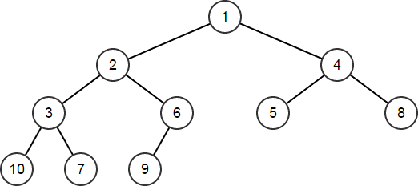
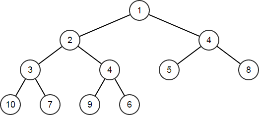
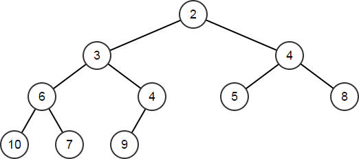
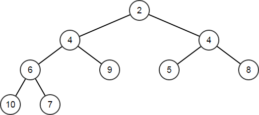

# 虚幻引擎中的数组

> 路径：虚幻引擎5.7文档 / 用C++编程 / 虚幻引擎中的容器 / 虚幻引擎中的数组

> 原始页面：https://dev.epicgames.com/documentation/unreal-engine/array-containers-in-unreal-engine

虚幻引擎中最简单的容器类是`TArray`。 `TArray`负责同类型其他对象（称为"元素"）序列的所有权和组织。 由于`TArray`是一个序列，其元素的排序定义明确，其函数用于确定性地操纵此类对象及其顺序。

## TArray

`TArray`是虚幻引擎中最常用的容器类。 其速度快、内存消耗小、安全性高。 `TArray`类型由两大属性定义：元素类型和可选分配器。

元素类型是存储在数组中的对象类型。 `TArray`被称为同质容器。换言之，其所有元素均完全为相同类型。单个`TArray`中不能存储不同类型的元素。

分配器常被省略，默认为最常用的分配器。 其定义对象在内存中的排列方式；以及数组如何进行扩展，以容纳更多的元素。 若默认行为不符合要求，可选取多种不同的分配器，或自行编写。 此部分将稍后讨论。

`Tarray`为数值类型。意味其与其他内置类型（如`int32`或`浮点`）的处理方式相同。 其设计时未考虑扩展问题，因此建议在实际操作中勿使用`新建（new）`和`删除（delete）`创建或销毁`TArray`实例。 元素也为数值类型，为容器所拥有。 `TArray`被销毁时其中的元素也将被销毁。 若在另一TArray中创建TArray变量，其元素将复制到新变量中，且不会共享状态。

## 创建和填充数组

如要创建数组，将其以此定义：

C++

```
TArray<int32> IntArray;
```

此操作会创建用于存储整数序列的空白数组。 元素类型是可根据普通C++值规则进行复制和销毁的数值类型，例如`int32`、`FString`、`TSharedPtr`等。 由于无指定分配器，因此`TArray`将采用基于堆的默认分配器。 此时尚未分配内存。

> [!WARNING]
> `TArray`（如许多虚幻引擎容器）假设元素类型是简单可重定位的，意味着元素可以通过直接复制原始字节安全地从内存中的一个位置移动到另一个位置。

有多种填充`Tarray`的方法。 一种方式是使用`Init`函数，将大量元素副本填入数组。

C++

```
IntArray.Init(10, 5);	// IntArray == [10,10,10,10,10]
```

`Add`和`Emplace`函数用于在数组末尾新建对象：

C++

```
TArray<FString> StrArr;	StrArr.Add    (TEXT("Hello"));	StrArr.Emplace(TEXT("World"));	// StrArr == ["Hello","World"]
```

新元素添加到数组时，数组的分配器将根据需要分配内存。 当前数组大小超出时，默认分配器将添加足够的内存，用于存储多个新元素。 `Add`和`Emplace`函数的多数效果相同，细微区别在于：

- `Add`（或`Push`）将元素类型的实例复制（或移动）到数组中。
- `Emplace`使用给定参数构建元素类型的新实例。

因此在`TArray<FString>`中，`Add`将用字符串文字创建临时`FString`，然后将该临时`FString`的内容移至容器内的新`FString`中；而`Emplace`将用字符串文字直接新建`FString`。 最终结果相同，但`Emplace`可避免创建临时文件。对于`FString`等非浅显数值类型而言，临时文件通常有害无益。

总体而言，`Emplace`优于`Add`，因此其可避免在调用点创建无需临时变量，并将此类变量复制或移动到容器中。 根据经验，可将`Add`用于浅显类型，将`Emplace`用于其他类型。 `Emplace`的效率始终高于`Add`，但`Add`的可读性可能更好。

利用`Append`可一次性添加其他`TArray`中的多个元素，或者指向常规C数组的指针及该数组的大小：

C++

```
FString Arr[] = { TEXT("of"), TEXT("Tomorrow") };	StrArr.Append(Arr, ARRAY_COUNT(Arr));	// StrArr == ["Hello","World","of","Tomorrow"]
```

仅在尚不存在等值元素时，`AddUnique`才会向容器添加新元素。 使用以下元素类型的运算符检查等值性：`operator==`:

C++

```
StrArr.AddUnique(TEXT("!"));	// StrArr == ["Hello","World","of","Tomorrow","!"] 	StrArr.AddUnique(TEXT("!"));	// StrArr is unchanged as "!" is already an element
```

与`Add`、`Emplace`和`Append`相同，`Insert`将在给定索引处添加单个元素或元素数组的副本：

C++

```
StrArr.Insert(TEXT("Brave"), 1);	// StrArr == ["Hello","Brave","World","of","Tomorrow","!"]
```

`SetNum`函数可直接设置数组元素的数量。如新数量大于当前数量，则使用元素类型的默认构造函数新建元素：

C++

```
StrArr.SetNum(8);	// StrArr == ["Hello","Brave","World","of","Tomorrow","!","",""]
```

如新数量小于当前数量，`SetNum`将移除元素。 移除元素的更多相关详情将稍后讨论：

C++

```
StrArr.SetNum(6);	// StrArr == ["Hello","Brave","World","of","Tomorrow","!"]
```

## 迭代

有多种方法可迭代数组的元素，建议使用C++的范围（ranged-for）功能：

C++

```
FString JoinedStr;	for (auto& Str : StrArr)	{		JoinedStr += Str;		JoinedStr += TEXT(" ");	}	// JoinedStr == "Hello Brave World of Tomorrow ! "
```

同时也可使用基于索引的常规迭代：

C++

```
for (int32 Index = 0; Index != StrArr.Num(); ++Index)	{		JoinedStr += StrArr[Index];		JoinedStr += TEXT(" ");	}
```

最后，还可通过数组迭代器类型控制迭代。 函数`CreateIterator`和`CreateConstIterator`可分别用于元素的读写和只读访问：

C++

```
for (auto It = StrArr.CreateConstIterator(); It; ++It)	{		JoinedStr += *It;		JoinedStr += TEXT(" ");	}
```

## 排序

通过调用`Sort`函数可以简单地对数组进行排序：

C++

```
StrArr.Sort();	// StrArr == ["!","Brave","Hello","of","Tomorrow","World"]
```

这里，数值按元素类型的`operator<`进行排序。 在FString的情况下，这是一个不区分大小写的字典序比较。 也可以实现二元谓词来提供不同的排序语义，如下所示：

C++

```
StrArr.Sort([](const FString& A, const FString& B) {		return A.Len() < B.Len();	});	// StrArr == ["!","of","Hello","Brave","World","Tomorrow"]
```

现在字符串按照长度进行排序。 注意具有相同长度的三个字符串——"Hello"、"Brave"和"World"——相对于它们在数组中的原始位置发生了顺序变化。 这是因为`Sort`是不稳定的，等价元素（这些字符串在此处是等价的，因为谓词只比较长度）的相对顺序无法得到保证。 `Sort`采用快速排序实现。

无论是否使用二元谓词，`HeapSort`函数都可以用于执行堆排序。 是否选择使用它，取决于你的特定数据以及相比Sort函数的排序效率。 与`Sort`一样，`HeapSort`同样不是稳定的。 如果我们在上面使用`HeapSort`而不是`Sort`，结果将是这样的（在这种情况下结果相同）：

C++

```
StrArr.HeapSort([](const FString& A, const FString& B) {		return A.Len() < B.Len();	});	// StrArr == ["!","of","Hello","Brave","World","Tomorrow"]
```

最后，`StableSort`可以用来保证排序后等价元素的相对顺序。 如果我们在上面调用`StableSort`而不是`Sort`或`HeapSort`，结果将如下所示：

C++

```
StrArr.StableSort([](const FString& A, const FString& B) {		return A.Len() < B.Len();	});	// StrArr == ["!","of","Brave","Hello","World","Tomorrow"]
```

也就是说，"Brave"、"Hello"和"World"在之前按字典序排序后保持了相同的相对顺序。 `StableSort`采用归并排序实现。

## 查询

我们可以通过使用`Num`函数来查询数组包含多少个元素：

C++

```
int32 Count = StrArr.Num();	// Count == 6
```

如果你需要直接访问数组内存，也许是为了与C API的互操作性，你可以使用`GetData`函数返回指向数组中元素的指针。 此指针仅在数组存在且在对数组进行任何变更操作之前有效。 只有从`StrPtr`开始的前`Num`个索引是可解引用的：

C++

```
FString* StrPtr = StrArr.GetData();	// StrPtr[0] == "!"	// StrPtr[1] == "of"	// ...	// StrPtr[5] == "Tomorrow"	// StrPtr[6] - undefined behavior
```

如果容器是const，则返回的指针也将是const。

你还可以查询容器元素的大小：

C++

```
uint32 ElementSize = StrArr.GetTypeSize();	// ElementSize == sizeof(FString)
```

要检索元素，你可以使用索引`operator[]`并传递你想要的元素的从零开始的索引：

C++

```
FString Elem1 = StrArr[1];	// Elem1 == "of"
```

传递无效索引——小于0或大于等于Num()——将导致运行时错误。 你可以使用`IsValidIndex`函数来查询容器特定索引是否有效：

C++

```
bool bValidM1 = StrArr.IsValidIndex(-1);	bool bValid0  = StrArr.IsValidIndex(0);	bool bValid5  = StrArr.IsValidIndex(5);	bool bValid6  = StrArr.IsValidIndex(6);	// bValidM1 == false	// bValid0  == true	// bValid5  == true	// bValid6  == false
```

`operator[]`返回引用，因此假设你的数组不是const，它也可以用于修改数组内的元素：

C++

```
StrArr[3] = StrArr[3].ToUpper();	// StrArr == ["!","of","Brave","HELLO","World","Tomorrow"]
```

与GetData函数一样，如果数组是const，`operator[]`将返回const引用。 你还可以使用`Last`函数从数组末尾向前索引。 索引默认为零。 `Top`函数是`Last`的同义词，只是它不接受索引：

C++

```
FString ElemEnd  = StrArr.Last();	FString ElemEnd0 = StrArr.Last(0);	FString ElemEnd1 = StrArr.Last(1);	FString ElemTop  = StrArr.Top();	// ElemEnd  == "Tomorrow"	// ElemEnd0 == "Tomorrow"	// ElemEnd1 == "World"	// ElemTop  == "Tomorrow"
```

我们可以查询数组是否包含某个元素：

C++

```
bool bHello   = StrArr.Contains(TEXT("Hello"));	bool bGoodbye = StrArr.Contains(TEXT("Goodbye"));	// bHello   == true	// bGoodbye == false
```

或查询数组是否包含与特定谓词匹配的元素：

C++

```
bool bLen5 = StrArr.ContainsByPredicate([](const FString& Str){		return Str.Len() == 5;	});	bool bLen6 = StrArr.ContainsByPredicate([](const FString& Str){		return Str.Len() == 6;	});	// bLen5 == true	// bLen6 == false
```

我们可以使用`Find`系列函数来查找元素。 要检查元素是否存在并返回其索引，我们使用Find：

C++

```
int32 Index;	if (StrArr.Find(TEXT("Hello"), Index))	{		// Index == 3	}
```

这会将`索引`设置为找到的第一个元素的索引。 如果有重复元素，我们想要查找最后一个元素的索引，我们使用`FindLast`函数：

C++

```
int32 IndexLast;	if (StrArr.FindLast(TEXT("Hello"), IndexLast))	{		// IndexLast == 3, because there aren't any duplicates	}
```

这两个函数都返回bool来指示是否找到了元素，同时在找到时将该元素的索引写入变量。

`Find`和`FindLast`也可以直接返回元素索引。 如果你不将索引作为显式参数传递，它们会按照这样的方式运行。 这可能比上述函数更简洁，你使用哪个函数取决于你的特定需求或风格。

如果没有找到元素，将返回特殊的`INDEX_NONE`值：

C++

```
int32 Index2     = StrArr.Find(TEXT("Hello"));	int32 IndexLast2 = StrArr.FindLast(TEXT("Hello"));	int32 IndexNone  = StrArr.Find(TEXT("None"));	// Index2     == 3	// IndexLast2 == 3	// IndexNone  == INDEX_NONE
```

`IndexOfByKey`工作方式类似，但允许将元素与任意对象进行比较。 对于`Find`函数，参数实际上在搜索开始之前会被转换为元素类型（在这种情况下为`FString`）。 对于`IndexOfByKey`，键会直接进行比较，支持即使键类型不能直接转换为元素类型的搜索。

`IndexOfByKey`适用于存在`operator==(ElementType, KeyType)`的任何键类型。 `IndexOfByKey`将返回找到的第一个元素的索引，如果没有找到元素则返回`INDEX_NONE`：

C++

```
int32 Index = StrArr.IndexOfByKey(TEXT("Hello"));	// Index == 3
```

`IndexOfByPredicate`函数查找与指定谓词匹配的第一个元素的索引，如果没有找到则返回特殊的`INDEX_NONE`值：

C++

```
int32 Index = StrArr.IndexOfByPredicate([](const FString& Str){		return Str.Contains(TEXT("r"));	});	// Index == 2
```

我们可以返回指向我们找到的元素的指针，而不是返回索引。 `FindByKey`的工作方式与`IndexOfByKey`相似，将元素与任意对象进行比较，但返回指向它找到的元素的指针。 如果它没有找到元素，将返回`nullptr`：

C++

```
auto* OfPtr  = StrArr.FindByKey(TEXT("of")));	auto* ThePtr = StrArr.FindByKey(TEXT("the")));	// OfPtr  == &StrArr[1]	// ThePtr == nullptr
```

`FindByPredicate`可以像`IndexOfByPredicate`一样使用，只是它返回指针而不是索引：

C++

```
auto* Len5Ptr = StrArr.FindByPredicate([](const FString& Str){		return Str.Len() == 5;	});	auto* Len6Ptr = StrArr.FindByPredicate([](const FString& Str){		return Str.Len() == 6;	});	// Len5Ptr == &StrArr[2]	// Len6Ptr == nullptr
```

最后，你可以使用`FilterByPredicate`函数检索与特定谓词匹配的元素数组：

C++

```
auto Filter = StrArray.FilterByPredicate([](const FString& Str){		return !Str.IsEmpty() && Str[0] < TEXT('M');	});
```

## 移除

你可以使用`Remove`系列函数从数组中删除元素。 `Remove`函数根据元素类型的`operator==`函数，删除所有被认为等于你提供的元素的元素。 例如：

C++

```
TArray<int32> ValArr;	int32 Temp[] = { 10, 20, 30, 5, 10, 15, 20, 25, 30 };	ValArr.Append(Temp, ARRAY_COUNT(Temp));	// ValArr == [10,20,30,5,10,15,20,25,30] 	ValArr.Remove(20);	// ValArr == [10,30,5,10,15,25,30]
```

`RemoveSingle`也可用于擦除数组中的首个匹配元素。 以下情况尤为实用——此函数在数组中可能存在重复，而只希望擦除一个时；或作为优化，数组只能包含一个匹配元素时：

C++

```
ValArr.RemoveSingle(30);	// ValArr == [10,5,10,15,25,30]
```

`RemoveAt`函数也可用于按照从零开始的索引移除元素。 可使用`IsValidIndex`确定数组中的元素是否使用计划提供的索引，将无效索引传递给此函数会导致运行时错误：

C++

```
ValArr.RemoveAt(2); // Removes the element at index 2	// ValArr == [10,5,15,25,30] 	ValArr.RemoveAt(99); // This will cause a runtime error as	                       // there is no element at index 99
```

`RemoveAll`也可用于移除与谓词匹配的元素。 例如，移除为3倍数的所有数值：

C++

```
ValArr.RemoveAll([](int32 Val) {		return Val % 3 == 0;	});	// ValArr == [10,5,25]
```

> [!NOTE]
> 在所有这些情况中，由于数组中不能出现空位，因此移除元素时其后的元素将被下移到更低指数中。

移动过程存在开销。 如不需要剩余元素排序，可使用`RemoveSwap`、`RemoveAtSwap`和`RemoveAllSwap`函数减少此开销。此类函数的工作方式与其非交换变种相似，不同之处在于其不保证剩余元素的排序，因此可更快地完成任务：

C++

```
TArray<int32> ValArr2;
	for (int32 i = 0; i != 10; ++i)
		ValArr2.Add(i % 5);
	// ValArr2 == [0,1,2,3,4,0,1,2,3,4]

	ValArr2.RemoveSwap(2);
	// ValArr2 == [0,1,4,3,4,0,1,3]

	ValArr2.RemoveAtSwap(1);
	// ValArr2 == [0,3,4,3,4,0,1]
```

最后，可使用`Empty`函数移除数组中所有元素：

C++

```
ValArr2.Empty();	// ValArr2 == []
```

## 运算符

数组是常规数值类型，可使用标准复制构造函数或赋值运算符进行复制。 由于数组严格拥有其元素，复制数组的操作是深层的，因此新数组将拥有其自身的元素副本：

C++

```
TArray<int32> ValArr3;	ValArr3.Add(1);	ValArr3.Add(2);	ValArr3.Add(3); 	auto ValArr4 = ValArr3;	// ValArr4 == [1,2,3];	ValArr4[0] = 5;	// ValArr3 == [1,2,3];	// ValArr4 == [5,2,3];
```

作为`Append`函数的替代，可使用`operator+=`对数组进行串联：

C++

```
ValArr4 += ValArr3;	// ValArr4 == [5,2,3,1,2,3]
```

`TArray`还支持移动语义，使用`MoveTemp`函数可调用这些语义。 移动后，源数组必定为空：

C++

```
ValArr3 = MoveTemp(ValArr4);	// ValArr3 == [5,2,3,1,2,3]	// ValArr4 == []
```

使用`operator==`和`operator!=`可对数组进行比较。 元素的排序很重要：只有元素的顺序和数量相同时，两个数组才被视为相同。 元素通过其自身的`operator==`进行比较：

C++

```
TArray<FString> FlavorArr1;
	FlavorArr1.Emplace(TEXT("Chocolate"));
	FlavorArr1.Emplace(TEXT("Vanilla"));
	// FlavorArr1 == ["Chocolate","Vanilla"]

	auto FlavorArr2 = Str1Array;
	// FlavorArr2 == ["Chocolate","Vanilla"]

	bool bComparison1 = FlavorArr1 == FlavorArr2;
	// bComparison1 == true
```

## 堆

`TArray`拥有支持二叉堆数据结构的函数。 堆是一种二叉树，其中父节点的排序等于或高于其子节点。 作为数组实现时，树的根节点位于元素0，索引N处节点的左右子节点的指数分别为2N+1和2N+2。 子节点彼此间不存在特定排序。

调用`Heapify`函数可将现有数组转换为堆。 此会重载为是否接受谓词，无谓词的版本将使用元素类型的`operator<`来确定排序：

C++

```
TArray<int32> HeapArr;	for (int32 Val = 10; Val != 0; --Val)	{		HeapArr.Add(Val);	}	// HeapArr == [10,9,8,7,6,5,4,3,2,1]	HeapArr.Heapify();	// HeapArr == [1,2,4,3,6,5,8,10,7,9]
```

下图为树的展示：



树中的节点按堆化数组中元素的排序从左至右、从上至下读取。 注意：数组在转换为堆后无需排序。 排序数组也是有效堆，但堆结构的定义较为宽松，同一组元素可存在多个有效堆。

通过HeapPush函数可将新元素添加到堆，对其他节点进行重新排序，以对堆进行维护：

C++

```
HeapArr.HeapPush(4);	// HeapArr == [1,2,4,3,4,5,8,10,7,9,6]
```



`HeapPop`和`HeapPopDiscard`函数用于移除堆的顶部节点。 这两个函数的区别在于前者引用元素的类型来返回顶部元素的副本，而后者只是简单地移除顶部节点，不进行任何形式的返回。 两个函数得出的数组变更一致，重新正确排序其他元素可对堆进行维护：

C++

```
int32 TopNode;	HeapArr.HeapPop(TopNode);	// TopNode == 1	// HeapArr == [2,3,4,6,4,5,8,10,7,9]
```



`HeapRemoveAt`将删除数组中给定索引处的元素，然后重新排列元素，对堆进行维护：

C++

```
HeapArr.HeapRemoveAt(1);	// HeapArr == [2,4,4,6,9,5,8,10,7]
```



> [!NOTE]
> 仅在结构已是有效堆时（如在`Heapify`调用、其他堆操作或手动将数组操作到堆中之后），才应调用`HeapPush`、`HeapPop`、`HeapPopDiscard`和`HeapRemoveAt`。

此类函数（包括`Heapify`）都可选择使用二元谓词决定堆中节点元素的排序。 堆操作默认使用元素类型的`operator<`来确定顺序。 使用自定义谓词时，在所有堆操作中使用相同的谓词很重要。

最后，你可以使用`HeapTop`检查堆的顶部节点，而不会改变数组：

C++

```
int32 Top = HeapArr.HeapTop();	// Top == 2
```

## Slack

由于数组可以调整大小，它们使用的内存量是可变的。 为了避免每次添加元素时都需要重新分配，分配器通常会提供比请求更多的内存，这样未来的`Add`调用就不必因为重新分配而承担性能代价。 同样，删除元素通常也不会释放内存。 这使得数组具有了Slack元素，这些元素实际上是当前未使用的预分配元素存储槽。 数组中的Slack量定义为：数组当前分配的内存可以存储的元素数量与实际存储的元素数量之间的差异。

由于默认构造的数组不分配内存，Slack最初为零。 你可以使用`GetSlack`函数来了解数组中有多少Slack。 可以通过`Max`函数获得数组在容器重新分配之前能够容纳的最大元素数。 `GetSlack`等于`Max`和`Num`之间的差异：

C++

```
TArray<int32> SlackArray;
	// SlackArray.GetSlack() == 0
	// SlackArray.Num()      == 0
	// SlackArray.Max()      == 0

	SlackArray.Add(1);
	// SlackArray.GetSlack() == 3
	// SlackArray.Num()      == 1
	// SlackArray.Max()      == 4
```

分配器确定重新分配后容器中的Slack量。因此，用户不应认为Slack是常量。

虽然无需管理Slack，但可管理Slack对数组进行优化，以满足需求。 例如，如需要向数组添加大约100个新元素，则可在添加前确保拥有可至少存储100个新元素的Slack，以便添加新元素时无需分配内存。 上文所述的`Empty`函数接受可选Slack参数：

C++

```
SlackArray.Empty();
	// SlackArray.GetSlack() == 0
	// SlackArray.Num()      == 0
	// SlackArray.Max()      == 0
	SlackArray.Empty(3);
	// SlackArray.GetSlack() == 3
	// SlackArray.Num()      == 0
	// SlackArray.Max()      == 3
	SlackArray.Add(1);
	SlackArray.Add(2);
```

`Reset`函数与Empty函数类似，不同之处是若当前内存分配已提供请求的Slack，该函数将不释放内存。 但若请求的Slack较大，其将分配更多内存：

C++

```
SlackArray.Reset(0);	// SlackArray.GetSlack() == 3	// SlackArray.Num()      == 0	// SlackArray.Max()      == 3	SlackArray.Reset(10);	// SlackArray.GetSlack() == 10	// SlackArray.Num()      == 0	// SlackArray.Max()      == 10
```

最后，使用`Shrink`函数可移除所有Slack。此才做将把内存分配调整为保存当前元素所需的最小内存。 `Shrink`不会对数组中的元素产生影响。

C++

```
SlackArray.Add(5);
	SlackArray.Add(10);
	SlackArray.Add(15);
	SlackArray.Add(20);
	// SlackArray.GetSlack() == 6
	// SlackArray.Num()      == 4
	// SlackArray.Max()      == 10
	SlackArray.Shrink();
	// SlackArray.GetSlack() == 0
	// SlackArray.Num()      == 4
```

## 原始内存

本质上而言，`TArray`只是分配内存周围的包装器。 直接修改分配的字节和自行创建元素即可将其用作包装器，此操作十分实用。 `Tarray`将尽量利用其拥有的信息进行执行，但有时需降低一个等级。

> [!WARNING]
> 利用以下函数可在较低级别快速访问`TArray`及其数据，但若利用不当，可能会导致容器无效和未知行为。 在调用此类函数后（但在调用其他常规函数前），可决定是否将容器返回有效状态。

`AddUninitialized`和`InsertUninitialized`函数可将未初始化的空间添加到数组。 两者工作方式分别与`Add`和`Insert`函数相同，只是不调用元素类型的构造函数。 若要避免调用构造函数，建议使用此类函数。 类似以下范例的情况中建议使用此类函数，其中计划用`Memcpy`调用完全覆盖结构体：

C++

```
int32 SrcInts[] = { 2, 3, 5, 7 };	TArray<int32> UninitInts;	UninitInts.AddUninitialized(4);	FMemory::Memcpy(UninitInts.GetData(), SrcInts, 4*sizeof(int32));	// UninitInts == [2,3,5,7]
```

也可使用此功能保留计划自行构建对象所需内存：

C++

```
TArray<FString> UninitStrs;	UninitStrs.Emplace(TEXT("A"));	UninitStrs.Emplace(TEXT("D"));	UninitStrs.InsertUninitialized(1, 2);	new ((void*)(UninitStrs.GetData() + 1)) FString(TEXT("B"));	new ((void*)(UninitStrs.GetData() + 2)) FString(TEXT("C"));	// UninitStrs == ["A","B","C","D"]
```

`AddZeroed`和`InsertZeroed`的工作方式相似，不同点是会将添加/插入的空间字节清零：

C++

```
struct S
	{
		S(int32 InInt, void* InPtr, float InFlt)
			: Int(InInt)
			, Ptr(InPtr)
			, Flt(InFlt)
		{
		}
		int32 Int;
		void* Ptr;
```

`SetNumUninitialized`和`SetNumZeroed`函数的工作方式与`SetNum`类似，不同之处在于新数量大于当前数量时，将保留新元素的空间为未初始化或按位归零。 与`AddUninitialized`和`InsertUninitialized`函数相同，必要时需将新元素正确构建到新空间中：

C++

```
SArr.SetNumUninitialized(3);
	new ((void*)(SArr.GetData() + 1)) S(5, (void*)0x12345678, 3.14);
	new ((void*)(SArr.GetData() + 2)) S(2, (void*)0x87654321, 2.72);
	// SArr == [
	//   { Int: 0, Ptr: nullptr,    Flt: 0.0f  },
	//   { Int: 5, Ptr: 0x12345678, Flt: 3.14f },
	//   { Int: 2, Ptr: 0x87654321, Flt: 2.72f }
	// ]

	SArr.SetNumZeroed(5);
```

> [!WARNING]
> 应谨慎使用"Uninitialized"和"Zeroed"函数族。 如函数类型包含要构建的成员或未处于有效按位清零状态的成员，可导致数组元素无效和未知行为。 此类函数适用于固定的数组类型，例如FMatrix和FVector。

## 杂项

`BulkSerialize`函数是序列化函数，可用作替代`operator<<`，将数组作为原始字节块进行序列化，而非执行逐元素序列化。 如使用内置类型或纯数据结构体等浅显元素，可改善性能。

`CountBytes`和`GetAllocatedSize`函数用于估算数组当前内存占用量。 `CountBytes`接受`FArchive`，可直接调用`GetAllocatedSize`。 这些函数常用于统计报告。

`Swap`和`SwapMemory`函数均接受两个指数并交换此类指数上的元素值。 这两个函数相同，不同点是`Swap`会对指数执行额外的错误检查，并断言索引是否超出范围。
