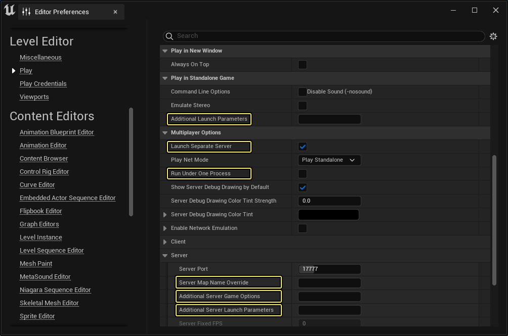

# 命令行参数

> 路径：虚幻引擎5.7文档 / 用C++编程 / 虚幻架构 / 命令行参数

> 原始页面：https://dev.epicgames.com/documentation/unreal-engine/command-line-arguments-in-unreal-engine

在虚幻引擎中， **命令行参数（Command-line Arguments）** 也称为 **其他启动参数（Additional Launch Parameters）** ，用于自定义引擎在启动时的运行方式。命令行参数和[控制台命令](../console-variables-cplusplus/index.md)相似，是用于测试和优化项目的实用工具。这些设置的范围广泛，有些操作较为粗略，例如强制 **虚幻编辑器（Unreal Editor）** 在游戏模式下运行，而不是在完整编辑器模式下运行，有些选项则更细致，例如选择要在游戏中按特定分辨率和帧率运行的特定地图。

## 通道命令行参数

有三种常见方法可将命令行参数传递到虚幻引擎项目或可执行文件。这些方法对应项目的不同运行方式：

- 从命令行

  。
- 从虚幻编辑器

  。
- 从可执行文件快捷方式

  。

### 从命令行

将命令行参数添加到从命令行运行的可执行文件的通用语法是：

```
<EXECUTABLE> [URL_PARAMETERS] [ARGUMENTS]
```

其中：

- EXECUTABLE

  是可执行文件的名称。

  - 示例：

    UnrealEditor.exe

    、

    MyGame.exe
- URL_PARAMETERS

  是可选的

  URL参数

  。

  - 示例：

    MyMap

    、

    /Game/Maps/BonusMaps/BonusMap.umap?game=MyGameMode
- ARGUMENTS

  包括其他可选命令行

  标记

  或

  键值对

  。

  - 示例：

    -log

    、

    -game

    、、

    -windowed

    、

    -ResX=400 -ResY=620

例如，以下输入在Windows上以 `MyGameMode` 游戏模式全屏在 `BonusMap` 上运行 `MyGame` 项目：

```
UnrealEditor.exe MyGame.uproject /Game/Maps/BonusMaps/BonusMap.umap?game=MyGameMode -game -fullscreen
```

### 从编辑器

虚幻编辑器支持使用命令行参数自定义独立游戏。在虚幻编辑器中，命令行参数称为 *其他启动参数* 。其他启动参数仅支持用于 **在独立游戏中运行（Play in Standalone Game）** 模式。虚幻编辑器还支持专门传递到单独的专用服务器来测试多玩家游戏的命令行参数。单独服务器的命令行参数在虚幻编辑器中的三个不同地方传递：

- 服务器地图名称覆盖：这是你可以将地图名称作为URL参数传递的地方。
- 其他服务器游戏选项：这是你可以传递其他URL参数的地方。
- 其他服务器启动参数：这是你可以传递其他额外命令行标记或键值对的地方。



在虚幻编辑器的编辑器偏好设置中自定义其他启动参数。

#### 游戏参数

要将命令行参数传递到从虚幻编辑器中启动的独立游戏，请执行以下步骤：

1. 找到

   编辑（Edit） > 编辑器偏好设置（Edit > Editor Preferences）

   。界面上将弹出新窗口，其中有

   编辑器偏好设置（Editor Preferences）

   选项卡。
2. 在左侧，选择

   关卡编辑器（Level Editor）> 运行（Play）

   。
3. 在右侧，找到

   在独立游戏中运行（Play in Standalone Game）

   分段。
4. 在此分段中，有一个名为

   其他启动参数（Additional Launch Parameters）

   的文本框。将你的命令行参数粘贴到此处。这些其他参数会作为命令行参数传递到独立游戏。

#### 服务器参数

如果你勾选了 **启动单独服务器（Launch Separate Server）** 并禁用了 **在一个进程下运行（Run Under One Process）** ，你可以指定 **服务器地图名称覆盖（Server Map Name Override）** 、 **其他服务器游戏选项（Additional Server Game Options）** 和 **其他服务器启动参数（Additional Server Launch Parameters）** 。要将命令行参数传递到从虚幻编辑器中启动的服务器，请执行以下步骤：

1. 找到

   编辑（Edit） > 编辑器偏好设置（Edit > Editor Preferences）

   。界面上将弹出新窗口，其中有

   编辑器偏好设置（Editor Preferences）

   选项卡。
2. 在左侧，选择

   关卡编辑器（Level Editor）> 运行（Play）

   。
3. 在右侧，找到

   多玩家选项（Multiplayer Options）

   分段。
4. 如果你还没有在此分段中执行以下操作，请立即执行：

   1. 启用

      启动单独服务器（Launch Separate Server）

      。
   2. 禁用

      在一个进程下运行（Run Under One Process）

      。
5. 找到

   多玩家选项（Multiplayer Options）> 服务器（Server）

   。
6. 此分段中有三个文本框，你可以在其中为专用服务器指定不同类型的命令行参数：

   服务器地图名称覆盖（Server Map Name Override）

   、

   其他服务器游戏选项（Additional Server Game Options）

   和

   其他服务器启动参数（Additional Server Launch Parameters）

   。

   1. 使用

      服务器地图名称覆盖（Server Map Name Override）

      文本框将

      地图名称

      作为

      URL参数

      传递。
   2. 使用

      其他服务器游戏选项（Additional Server Game Options）

      文本框传递

      其他URL参数

      。
   3. 使用

      其他服务器启动参数（Additional Server Launch Parameters）

      文本框传递其他命令行参数。

> [!WARNING]
> 仅当你选择 **启动单独服务器（Launch Separate Server）** 并禁用 **在一个进程下运行（Run Under One Process）** 时，其他服务器启动参数才可用。禁用"在一个进程下运行（Run Under One Process）"后，你的客户端运行会更慢，因为每个客户端会生成单独的虚幻编辑器实例。

### 从可执行文件快捷方式

要将命令行参数传递到可执行文件快捷方式，请执行以下步骤：

1. 创建你的可执行文件的快捷方式。
2. 右键点击快捷方式，然后选择

   属性（Properties）

   。
3. 在

   快捷方式（Shortcut）

   分段下，将你的命令行参数添加到

   目标（Target）

   字段末尾。
4. 运行此快捷方式时，命令行参数会传递到快捷方式指向的原始可执行文件。

## 非台式机平台上的命令行参数

要将命令行参数传递给非台式机平台，如主机、移动端和扩展现实（XR）平台，需要通过创建或编辑名为 `UECommandLine.txt` 的文件来设置命令行参数。UE会在启动时自动从 `UECommandLine.txt` 读入命令行参数。如果此文件不存在，请在项目根目录中创建一个，并在其中添加命令行参数。

## 创建你自己的命令行参数

虚幻引擎提供了实用的C++函数来解析命令行。你可以像操作其他命令行参数那样将所需标记或键值对传递到命令行，从而创建你自己的命令行参数。要使用你传递的命令行参数，你需要从代码中的命令行读取它们。如果你的项目代码不读取你的自定义命令行参数并解析它们，这些参数将被忽略。

### 标记

标记就是开关，能通过其在命令行上存在与否来打开或关闭设置。例如：

```
UnrealEditor.exe MyGame.uproject -game
```

在此示例中， `-game` 参数是标记，因为它在命令行上存在就相当于告知虚幻编辑器可执行文件你想在游戏模式下运行 `MyGame` 。

#### 解析标记

要从命令行解析标记，请使用 `FParse::Param` 函数。

例如，假设你想通过命令行将布尔标记 `-myflag` 传递到你的可执行文件，如下所示：

```
UnrealEditor.exe MyGame.uproject -myflag
```

你可以在项目中使用以下代码检查此标记是否存在：

```
bool bMyFlag = false;if (FParse::Param(FCommandLine::Get(), TEXT("myflag"))){	bMyFlag = true;}
```

如果命令行上存在 `-myflag` ， `bMyFlag` 的值为 `true` 。如果命令行上不存在 `-myflag` ， `bMyFlag` 的值为 `false` 。

### 键值对

键值对是为开关指定特定值的设置开关。除了存在开关之外，还必须为该开关提供设置。例如，在以下示例中：

```
UnrealEditor.exe MyGame.uproject -game -windowed -ResX=1080 -ResY=1920
```

`-ResX=1080` 和 `-ResY=1920` 参数是键值对，因为每个开关必须伴随有设置。具体来说，这些键值对将指示虚幻编辑器可执行文件按特定分辨率运行。

#### 解析键值对

要解析键值对，请使用 `FParse::Value` 函数。

例如，假设你想通过命令行将键值对 `-mykey=42` 传递到你的可执行文件：

```
UnrealEditor.exe MyGame.uproject -mykey=42
```

你可以使用以下代码解析此键值对：

```
int32 myKeyValue;if (FParse::Value(FCommandLine::Get(), TEXT("mykey="), myKeyValue)){	// 如果程序进入此"if"语句，命令行上存在mykey	// myKeyValue现在包含通过命令行传递的值}
```

如果命令行上存在 `-mykey=42` ， `myKeyValue` 的值为 `42` 。如果命令行上不存在 `-mykey=42` ， `myKeyValue` 的值未设置。

> [!TIP]
> 你可以在位于 `Engine\Source\Runtime\Core\Public\Misc` 的 `CommandLine.h` 中详细了解有哪些函数可用于与命令行交互。

## 从命令行自定义引擎配置

引擎配置通常在引擎配置 `.ini` 文件中设置。你还可以从命令行自定义引擎配置。请参阅[配置文件](../configuration-files/index.md#%E4%BB%8E%E5%91%BD%E4%BB%A4%E8%A1%8C%E8%A6%86%E7%9B%96%E9%85%8D%E7%BD%AE)文档，了解更多信息。

## 从命令行自定义控制台命令

控制台命令通常从虚幻编辑器中的控制台执行。你还可以从命令行自定义控制台命令。请参阅[控制台变量](../console-variables-cplusplus/index.md#%E5%91%BD%E4%BB%A4%E8%A1%8C)文档，了解更多信息。

## 命令行参数参考

### URL参数

URL参数将强制你的游戏在启动时加载特定地图。URL参数是可选的，但如果你提供它们，则必须紧跟在可执行文件名称或模式标记（如有）之后。

URL参数包含两个部分：

- 地图名称

  或

  服务器IP地址

  。
- 可选的一系列

  其他参数

  。

#### 地图名称

地图名称可以引用位于Maps目录中的任意地图。你可以选择包含 `.umap` 扩展名。要加载不在Maps目录中的地图，你必须使用绝对路径或相对于Maps目录的路径。在此情况下，必须包含 `.umap` 文件扩展名。

#### 服务器IP地址

你可以将服务器IP地址用作URL参数，将游戏客户端连接到专用服务器。

#### 其他参数

你可以将其他参数选项附加到地图名称或服务器IP地址来指定这些选项。每个选项开头带有? （问号），并使用=（表示等同性或赋值）设置。在选项前面附加-（短杠）会从缓存的URL选项中删除该选项。

#### 示例

##### 使用位于Maps目录中的地图打开游戏

```
MyGame.exe MyMap
```

##### 使用位于Maps目录之外的地图打开游戏

```
MyGame.exe /Game/Maps/BonusMaps/BonusMap.umap
```

##### 使用位于Maps目录之外的地图在虚幻编辑器中打开游戏

```
UnrealEditor.exe MyGame.uproject /Game/Maps/BonusMaps/BonusMap.umap?game=MyGameMode -game
```

##### 将游戏客户端连接到专用服务器

假设你有一个项目 `MyGame` ，你想使用位于 `/Game/Maps/BonusMaps/` 中的地图 `BonusMap.umap` 运行服务器。

你可以运行专用服务器并在本地连接客户端，如下所示：

```
UnrealEditor.exe MyGame.uproject /Game/Maps/BonusMaps/BonusMap.umap -server -port=7777 -logUnrealEditor.exe MyGame.uproject 127.0.0.1:7777 -game -log
```

此示例中的参数为：

- 服务器

  - MyGame.uproject

    ：运行

    MyGame

    项目。
  - /Game/Maps/BonusMaps/BonusMap.umap

    ：在你的游戏中打开

    BonusMap

    。这是

    URL参数

    。
  - -server

    ：将编辑器作为专用服务器运行。
  - -port=7777

    ：使用端口

    7777

    侦听客户端连接。这是虚幻引擎中服务器的默认端口。
  - -log

    ：显示服务器日志，以便你可以监控服务器活动。
- 游戏客户端

  - MyGame.uproject

    ：运行

    MyGame

    项目。
  - 127.0.0.1:7777

    ：连接到IP地址

    127.0.0.1

    的端口

    7777

    。这是

    服务器IP地址

    。
  - -game

    ：将编辑器作为游戏客户端运行。
  - -log

    ：显示游戏客户端日志，以便你可以监控客户端活动。

### 标记和键值对

在讲解如何[传递命令行参数](#%E4%BC%A0%E9%80%92%E5%91%BD%E4%BB%A4%E8%A1%8C%E5%8F%82%E6%95%B0)的小节中，概述了一些传递命令行参数的方法，而此小节介绍了一些实用的命令行参数，可供你在运行虚幻引擎时使用。

#### 从文件读取命令行参数

你可能需要使用非常多的命令行参数，或需要经常复用同一组参数。你可以将命令行参数存储在文本文件中，并在命令行中传递此文件以方便使用。如果你在测试期间发现达到Windows命令行长度限制，这也很有用。

传递包含命令行参数的文本文件的语法是：

```
<EXECUTABLE> -CmdLineFile=ABSOLUTE\PATH\TO\FILE.txt
```

##### 示例

如果你在目录 `D:\UnrealEngine` 中保存了名为 MyCmdLineArgs.txt`的文件，并想将其传递到`UnrealEditor.exe` ，你可以使用以下命令来传递：

```
UnrealEditor.exe -CmdLineFile=D:\UnrealEngine\MyCmdLineArgs.txt
```

### 可用命令行参数列表

关于所有可用命令行参数的完整列表，请参阅[命令行参数参考](unreal-engine-command-line-arguments-reference/index.md)。


- [命令行参数参考](unreal-engine-command-line-arguments-reference/index.md)
