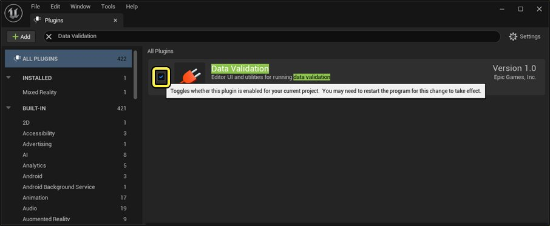

# 数据验证

> 路径：虚幻引擎5.7文档 / 用C++编程 / 虚幻架构 / 数据验证

> 原始页面：https://dev.epicgames.com/documentation/unreal-engine/data-validation-in-unreal-engine

**虚幻引擎编辑器** 提供了 **数据验证（Data Validation）** 插件，供开发人员使用自定义脚本规则集验证资产。常见的验证用例包括：

- 检查资产是否符合命名规范
- 强制执行空间和性能预算
- 捕获非循环依赖性以及其他内容

## 插件验证

要验证默认情况下是否已启用内置数据验证插件，请在主菜单中选择 **编辑（Edit）** > **插件（Plugins）**，然后在插件（Plugins）菜单中搜 **数据验证（Data Validation）**。

## 编辑器用法

开发人员可以将数据验证系统用于多种用途，包括测试单个资产、验证项目的所有资产等。

| 验证用例 | 用法 | 说明 |
| --- | --- | --- |
| 资产 | 在 **内容浏览器** 中，右键点击资产并选择 **资产操作（Asset Actions）** > **验证资产（Validate Assets）** | 这样可验证特定资产，也可选择多个资产进行验证。 |
| 资产和依赖性 | 在 **内容浏览器** 中，右键点击资产并选择 **资产操作（Asset Actions）** > **验证资产和依赖性（Validate Assets and Dependencies）** | 这样可验证特定资产及其依赖性，也可一次验证多个资产。 |
| 文件夹中的资产 | 在 **内容浏览器** 中，右键点击文件夹并选择 **验证文件夹中的资产（Validate Assets in Folder）** | 这样可验证特定文件夹，也可一次验证多个文件夹。 |
| 项目中的资产 | 从主菜单中，选择 **工具（Tools） > 验证数据……（Validate Data...）** | 这样可验证项目内容目录中的所有资产。 |

## 命令行用法

如果开发人员想把验证资产作为 **持续集成系统（CIS）** 的其中一环，那么从命令行运行插件就会非常有帮助。请使用以下命令（Commandlet）执行命令行验证：

`UnrealEditor-Cmd.exe <PROJECT_NAME>.uproject -run=DataValidation`

> [!NOTE]
> - 默认情况下，数据验证系统仅运行C++验证规则。
> - 开发人员可扩展数据验证系统，从而支持蓝图和Python验证规则。

## 验证规则

当前，有两种创建验证规则的方法：

- 让一个继承自UObject的自定义类重载

  IsDataValid

  。这种方法最适合项目中的自定义类。

  - 此方法允许访问

    UEditorValidatorBase

    方法所不支持的私有/受保护的类数据和函数。
  - 因为这种情况下你需要实现自己的类，所以你还可设置一个由

    IsDataValid

    调用的

    BlueprintImplementableEvent

    ，以便C++中有一些验证逻辑，然后在蓝图或Python中进一步添加验证逻辑。
- 使用C++、蓝图或Python创建一个继承自

  UEditorValidatorBase

  的类。这里的两个关键函数是

  CanValidateAsset

  和

  ValidateLoadedAsset

  ，这两个函数都会验证传入的

  Uobject

  指针参数。你可通过该系统验证任何资产，而无论该资产是基于默认引擎类还是基于自定义类。

  - ValidateLoadedAsset

    必须为其每个执行路径调用

    AssetPasses

    或

    AssetFails

    。
  - 你可以通过重载

    IsEnabled

    启用验证器。默认情况下，这样会返回受保护的变量

    bIsEnabled

    ，该变量也会在

    细节

    面板中公开。
  - C++和蓝图验证器会在编辑器启动时会被自动发现，而Python验证器需要使用

    AddValidator

    在

    UEditorValidatorSubsystem

    注册。

    - 默认情况下，出于性能原因，

      Fortnite

      中禁用了蓝图验证器自动注册。

两种类型的验证都由CIS在资产保存（默认启用）时通过编辑器和内容浏览器中的菜单选项运行。验证失败时，消息将在编辑器的消息日志以及CIS的控制台中显示。

如果你打算自己实现对`UEditorValidatorSubsystem`的调用，则你需要自行处理 `ValidationErrors` `Ftext` 数组的显示。用于验证资产（来自于 `FAssetData` 或加载的 `Uobject` ）的函数也可以供你编写。

> [!NOTE]
> 本节引述了这些API，请参阅它们了解更多信息：
>
> - IsDataValid
> - DataValidation
