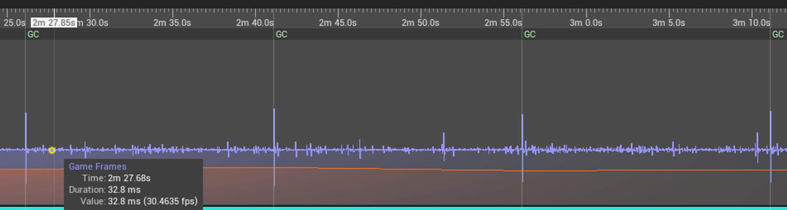
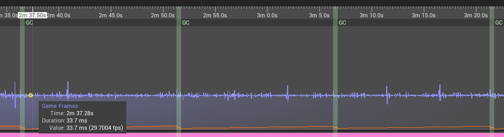

# 增量垃圾回收

> 路径：虚幻引擎5.7文档 / 用C++编程 / 虚幻引擎反射系统 / 对象 / 增量垃圾回收

> 原始页面：https://dev.epicgames.com/documentation/unreal-engine/incremental-garbage-collection-in-unreal-engine

虚幻引擎（UE）使用标记-清扫垃圾回收器来管理[UObject](../index.md)内存。 对于软实时应用程序，垃圾回收器一直有一个重大缺陷：当垃圾回收器确定可以回收哪些对象的内存时，可能会产生游戏性卡顿。 在UE中，这个过程称为**可达性分析（reachability analysis）**。 UE依赖垃圾回收的这个阶段在单帧内完成，这会暂时停止所有UObject处理（特别是Gameplay）。 可达性分析要扫描的对象越多，暂停时间就越长，结果可能会产生明显的Gameplay卡顿。 程序员可以采取多种方法来避免卡顿，例如：

- 保持紧张的UObject预算。
- 使用UObject池。
- 在正常Gameplay期间禁用垃圾回收。

但是，这些变通方法往往会增加代码复杂度和总体项目成本。

## 增量可达性分析

UE使用**增量可达性分析**对其进行了改进。 现在用户能够将垃圾回收器的可达性分析阶段分散到多帧，并可配置每帧的软时间限制。 引擎通过`TObjectPtr`属性跟踪可达性迭代之间的UObject引用。 这意味着对暴露了`TObjectPtr`的`UPROPERTY`进行任何赋值，都会在垃圾回收进行时立即将对象标记为可达。 这也被称为垃圾回收器**写屏障**。

引擎已转换为在将UObject暴露给垃圾回收器的所有地方使用`TObjectPtr`而不是原始C++指针，包括所有UObject或`FGCObject` `AddReferencedObjects`函数。 要在使用虚幻引擎编译的项目中使用增量可达性分析，必须将所有`UPROPERTY`实例转换为使用`TObjectPtr`而不是原始C++，否则垃圾回收可能过早回收一些UObject的内存。 我们目前初步将此功能发布为试验性的功能，因为可达性分析阶段仍有可能超出指定的时间限制。

## 启用增量可达性分析

增量可达性分析可以使用添加到项目的`DefaultEngine.ini`的以下控制台变量来启用：

C++

```
[ConsoleVariables]gc.AllowIncrementalReachability=1 ; enables Incremental Reachability Analysisgc.AllowIncrementalGather=1 ; enables Incremental Gather Unreachable Objectsgc.IncrementalReachabilityTimeLimit=0.002 ; sets the soft time limit to 2ms
```

## 附加控制台变量

你还可以使用控制台变量进行压力测试和调试：

| 控制台变量 | 说明 | 类型 |
| --- | --- | --- |
| `gc.DelayReachabilityIteration` | 将可达性分析延迟指定帧数。 用于对GC屏障进行压力测试。 | `<INTEGER>`：帧数（默认值：10） |
| `gc.VerifyNoUnreachableObjects` | 在可达性分析完成后运行测试，确保没有可达（有效）对象在引用不可达（很快将销毁）的对象。 | 0：禁用，1：启用 |
| `gc.ContinuousIncrementalGC` | 在上一次垃圾回收完成后继续重启增量垃圾回收。 | 0：禁用，1：启用 |

## 性能比较

下面使用[Unreal Insights](../../../../testing-and-optimizing-content/unreal-insights/index.md)展示了示例项目的性能图表，其中关闭了增量可达性。 蓝色线条表示总帧时间，橙色线条显示可达性分析耗用的时间。 Unreal Insights在由多帧分隔的单个事件之间绘制连续的图表线；尽管可能看起来在整个时间轴期间都在运行垃圾回收，但实际上一次只运行一帧。

在以下对比图表的第一张图片中，你可以看到每次运行垃圾回收时都有一个峰值（由时间轴顶部的**GC**标签表示）。





没有增量可达性

有增量可达性

在第二张图片中，打开了增量可达性，你可以看到，GC滞后峰值消失了，现在增量可达性分散到多个帧（由现在更宽的浅绿色条形表示）。

## 已知限制

增量可达性不是完全线程安全的。 在某些情况下，正在工作线程上被操作的对象在垃圾回收器扫描UObject图表时不会被标记为可达。 这可能导致对象被过早地垃圾回收。 我们建议仅在单线程构建中启用增量可达性（例如，专用服务器）。
