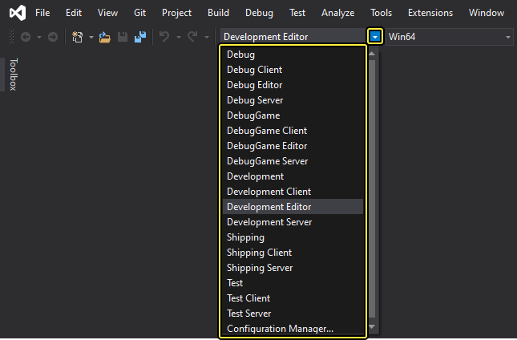
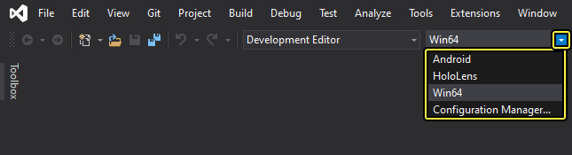

# 编译游戏项目

> 路径：虚幻引擎5.7文档 / 用C++编程 / 开发设置 / 编译游戏项目

> 原始页面：https://dev.epicgames.com/documentation/unreal-engine/compiling-game-projects-in-unreal-engine-using-cplusplus

虚幻引擎（UE）通过 **UnrealBuildTool** 使用自定义构建方法，该工具处理所有复杂的项目编译工作，并将项目与引擎关联起来。该过程以透明方式进行，这样，你只需通过标准的Visual Studio构建工作流程构建项目即可。

UnrealBuildTool使用 `.Build.cs` 和 `.Target.cs` 文件来构建游戏项目。这些文件在以下情况下会自动生成：使用C++模板创建项目；或者使用[CPP类向导](../using-the-cplusplus-class-wizard/index.md)向使用"仅蓝图"模板创建的项目添加代码。

## 构建配置

虚幻项目有多个由 `*.target.cs` 文件描述的目标（编辑器、客户端、游戏和服务器），其中每一个都可以使用不同配置来构建。在Visual Studio中，这表现为一个为每个目标安排不同配置的 `*.vcxproj`文件。解决方案配置的命名规则为 **[配置][目标类型]** （例如，"DevelopmentEditor"指代默认编辑器目标，而"Development"指代默认单机游戏目标）。你使用哪种配置将取决于想要创建的构建目的。

每种构建配置都包含两个关键词。第一个表示引擎状态和游戏项目。例如，如果使用 **调试（Debug）** 配置进行编译，构建过程会放弃优化，使调试过程更方便。要明确的是，如果配置以Visual Studio的格式构建，或者如果在虚幻编辑器中打开了 **项目设置（Project Settings）> 项目（Project）> 打包（Packaging）> 项目（Project）> 包括调试文件（Include Debug Files）** 选项，那么每个配置，甚至是发布构建都会生成用于调试的符号。这意味着你仍然可以调试开发和发布配置，只是它们可能不像调试配置那样容易。第二个关键词表示构建目标。例如，如果想要在虚幻中打开项目，需要使用 **编辑器（Editor）** 目标关键词进行构建。

| 构建配置——状态 | 说明 |
| --- | --- |
| **调试（Debug）** | 该配置在调试配置不进行优化的情况下，同时构建引擎和游戏代码。这使调试过程变得更慢，但更容易。如果通过 **调试（Debug）** 配置编译项目并打算用虚幻编辑器打开项目，则必须使用 `-debug` 标志查看项目中反映出来的代码变化。 |
| **调试游戏（DebugGame）** | 这种配置在构建游戏代码时不进行优化。此配置适用于调试游戏模块。 |
| **开发（Development）** | 该配置启用所有功能，但最费时间的引擎和游戏代码优化除外。从开发和性能角度看，它是最理想的配置。虚幻编辑器默认采用 **开发（Development）** 配置。如采用 **开发（Development）** 配置编译项目，可在编辑器中看到项目代码的变化情况。 |
| **交付（Shipping）** | 这是最佳性能配置，用于交付游戏。此配置剥离了控制台命令、统计数据和性能分析工具。 |
| **测试（Test）** | 该配置就是启用了一些控制台命令、统计数据和性能分析工具后的 **交付（Shipping）** 配置。 |

| 构建配置——目标 | 说明 |
| --- | --- |
| **游戏（Game）** | 该配置构建项目的独立可执行版本，但需要特定于平台的已烘焙内容。请参阅我们的参考页面，以进一步了解烘焙内容。 |
| **编辑器（Editor）** | 为了能够在虚幻编辑器中打开项目并看到反映出来的所有代码更改，项目必须以 **编辑器（Editor）** 配置构建。 |
| **客户端（Client）** | 如果你使用UE联网功能处理多人项目，该目标将指定项目用作面向多玩家游戏的UE客户端-服务器模型中的客户端。如果存在`<Game>Client.Target.cs`文件，则 **客户端（Client）** 构建配置将有效。 |
| **服务器（Server）** | 如果你使用UE联网功能处理多人项目，该目标将指定项目用作面向多玩家游戏的UE客户端-服务器模型中的服务器。如果存在`<Game>Server.Target.cs`文件，则 **服务器（Server）** 构建配置将有效。 |

## 使用Visual Studio进行构建

### 设置构建配置

构建配置可以在Visual Studio工具栏中设置。你可以找到以下这些设置。

### 设置解决方案平台

解决方案平台可以在Visual Studio工具栏中设置。

在使用虚幻引擎时，你通常使用 **Win64** 平台。这是生成项目文件时默认包含的唯一一个平台；[IDE的项目文件](../../../production-pipeline/using-the-unreal-engine-build-pipeline/unreal-build-tool/how-to-generate-unreal-engine-project-files-for-your-ide/index.md)页面包含为其他平台生成项目文件的说明。

### 构建项目

> [!NOTE]
> 在继续之前，请确保你运行的是适用于已安装的Windows桌面版的Visual Studio 2015或更高版本。如果使用Mac，请确保安装Xcode 9.0或更高版本。

1. 将 **解决方案配置（Solution Configuration）** 设置为你想要构建的配置。在该示例中，设置为了 **开发编辑器（Development Editor）**。请参考[构建配置](#%E6%9E%84%E5%BB%BA%E9%85%8D%E7%BD%AE)部分以了解每个可用配置的说明。
2. **右键单击** 游戏项目并选择 **重新构建（Rebuild）** 来重新编译。

现在，你可以通过编译好的项目[运行引擎](../../../understanding-the-basics/playing-and-simulating/running/index.md) 。

> [!NOTE]
> 当运行UE时，必须使用与你重建项目的构建配置相匹配的虚幻引擎可执行文件。 例如，如果你在 **DebugGame Uncooked** 构建配置 中编译了你的项目，就可以使用你的游戏信息作为参数运行 `UnrealEditor-Win64-DebugGame.exe` 可执行文件。关于二进制命名规则的更多信息请参阅[构建虚幻引擎](../../../get-started/install/downloading-source-code/building-unreal-engine-from-source/index.md)页面。

> [!NOTE]
> 当运行虚幻引擎时，如果你在任何 **未烘焙** 配置中重建你的项目，则必须添加 `-game` 标志；如果你在任何 **调试** 配置中重建你的项目，则必须添加 `-debug` 标志。

### Visual Studio已知问题

| 问题 | 解决方案 |
| --- | --- |
| 总是出现"项目过期（Project is out of date）"消息 | Visual Studio认为项目过期，但项目其实是最新状态。你可以选中 **不再显示该消息（Do not show this dialog again）** 框并按 **否（No）** 来安全禁止该消息。 |
| 使用_调试（Debug）_配置时出现 **无调试信息（No Debugging Information）** 窗口 | 原因是UE4editor.exe是使用_开发（Development）_配置编译的。尽管在使用_调试（Debug）_配置进行编译时出现这个警告，游戏项目也仍然可以调试。你可以选中 **不再显示该消息（Do not show this dialog again）** 框并按 **是（Yes）** 来安全禁止该消息。 |
