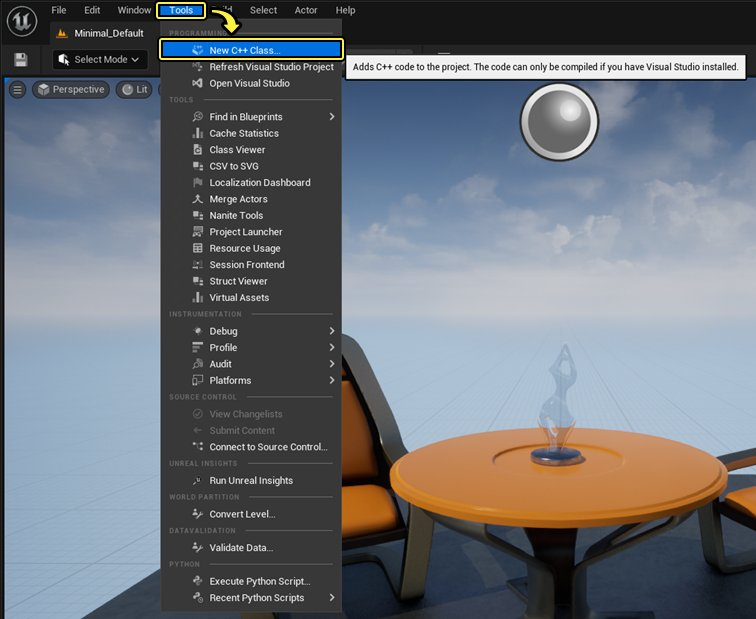
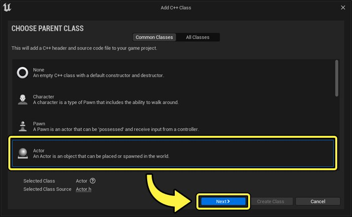
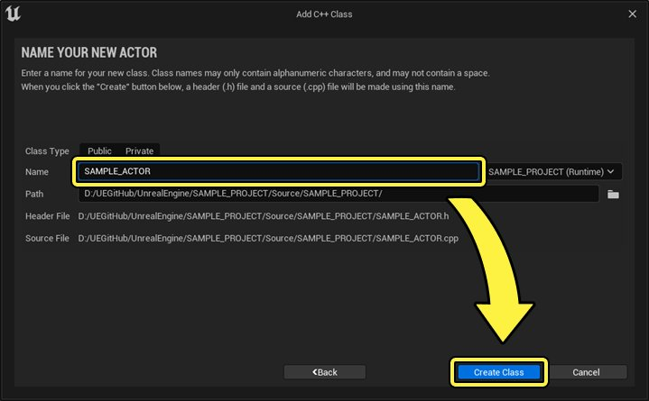
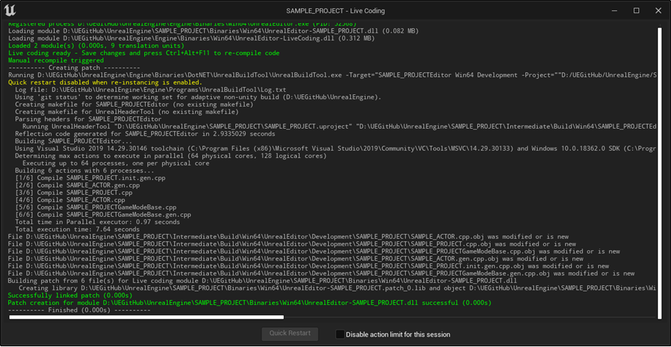
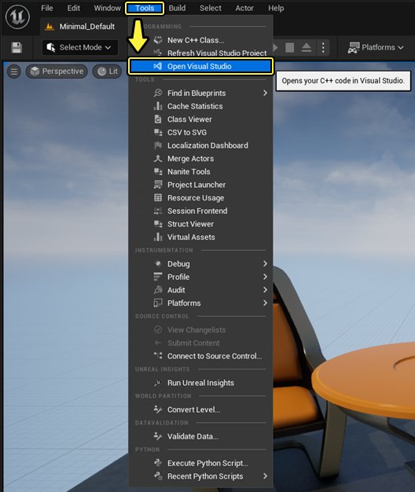
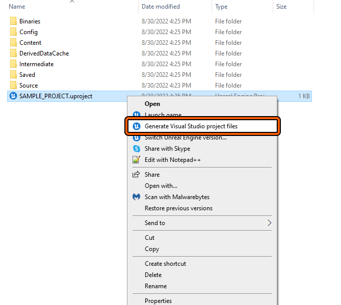
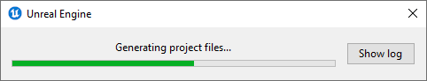

# 管理游戏代码

> 路径：虚幻引擎5.7文档 / 用C++编程 / 开发设置 / 管理游戏代码

> 原始页面：https://dev.epicgames.com/documentation/unreal-engine/managing-game-code-in-unreal-engine

选择操作系统：

Windows

macOS

Linux

## 将代码添加到项目

### C++类向导

**C++类向导** 提供了一种快速而简单的方法，可将本地C++代码类添加到项目中，以便用户对自有的功能进行延展。 这会将纯内容的项目转换为一个代码项目。你可以像这样访问C++类向导，然后参照下述步骤新建C++类：

> [!NOTE]
> 开始前请确保已安装Windows桌面版Visual Studio 2019或更高版本。如使用的是Mac，则必须安装Xcode 9或更高版本。

1. 在主编辑器中选择 **工具（Tool） > 新建C++类（New C++ Class...）**

   
2. **C++类向导** 将出现，并默认显示 **常用类（Common Classes）**。如果你没有找到所需的类，可以点击窗口右上角的 **显示所有类** 勾选框并查看所有类。

   | [undefined](https://d1iv7db44yhgxn.cloudfront.net/documentation/images/c3502128-3bc4-415d-b5cc-67181f3c49a1/common-classes.png) | [undefined](https://d1iv7db44yhgxn.cloudfront.net/documentation/images/f4c7b3a4-5096-43d4-93a9-aa335e7d6acc/all-classes.png) |
   | --- | --- |
   | 常用类 | 所有类 |
3. 选择你要添加的类。在本文中，我们将选择新建 **Actor** 类。选择 **Actor** 类，然后点击 **下一步（Next >）**。

   
4. 之后将弹出为新类输入 **命名** 的提示。执行此操作并点击 **创建类（Create Class）** 按钮。这将创建标头（`.h`）和源（`.cpp`）文件。

   

   > [!NOTE]
   > 类命名只包含字母数字字符，不包含空格。域将通知是否输入了无效命名。
5. 在虚幻引擎中，现在 **Live Coding** 会默认启用。新建类文件后，会显示Live Coding窗口并编译类文件。

   
6. 代码将立即在Visual Studio中打开，可进行编辑。

   代码将立即在Xcode中打开，可进行编辑。

### 开发环境

代码文件可通过 **Visual Studio** 创建并通过 **解决方案浏览器** 按常规方式添加到游戏项目。也可以将代码文件添加到Visual Studio之外的正确文件夹并自动重编译解决方案和项目文件。这样一来便能通过操作系统UI快速添加大量文件，并使团队工作更为简便，因为解决方案和项目文件不需要在团队成员之间同步。每个开发人员可在本地同步代码文件并重编译项目文件。

代码文件可通过 **Xcode** 创建并通过 **解决方案导航器** 按常规方式添加到游戏项目。也可将代码文件添加到Xcode之外的正确文件夹，并自动重编译项目文件。这样一来便能通过操作系统UI快速添加大量文件，并使团队工作更为简便，因为解决方案和项目文件不需要在团队成员之间同步。每个开发人员可在本地同步代码文件并重编译项目文件。

## 在开发环境中打开项目

如项目已在 **虚幻编辑器** 中打开，则可在 **文件（File）** 菜单中选择 **打开Visual Studio（Open Visual Studio）**，轻松将其在Visual Studio中打开。

可通过Windows浏览器或Visual Studio的 **文件（File） > 打开（Open） > 项目/解决方案（Project/Solution）**。

**如项目处于UE根目录中：**

* 打开UE根目录中的 `UE5.sln` Visual Studio解决方案。

**如项目处于UE4根目录之外：**

* 打开项目根目录中的 `PROJECT_NAME.sln` Visual Studio解决方案。

如项目已在编辑器中打开，则可在 **文件（File）** 菜单中选择 **在Xcode中打开（Open in Xcode）**，轻松将其在Xcode中打开。

也可通过查找器或Xcode的 **文件（File） > 打开（Open）** 在Xcode中打开项目。

* 打开项目根目录中的 `PROJECT_NAME.xcodeproj` Xcode项目。

## 生成项目文件

> [!WARNING]
> 项目文件被视为中间文件，放置于 `PROJECT_DIRECTORY\Intermediate\ProjectFiles` 中。这意味着如果删除 `Intermediate` 文件夹，则必须重新生成项目文件。

### .uproject文件

**如项目处于UE根目录之外：**

1. 在Windows浏览器中导航到 `PROJECT_NAME.uproject` 的路径。

1. **左键点击** `PROJECT_NAME.uproject` ，确保该文件处于高亮状态。在 `PROJECT_NAME.uproject` 文件上 **点击右键** 并选择 **生成Visual Studio文件（Generate Visual Studio Files）**。

1. **UnrealBuildTool** 更新项目文件和解决方案，包括生成Intellisense数据。

1. 打开项目根目录中的 `PROJECT_NAME.sln` Visual Studio解决方案，在Visual Studio中查看游戏项目。

1. 在查找器中导航到 `PROJECT_NAME.uproject` 的路径。

1. 在 `PROJECT_NAME.uproject` 文件上 **点击右键** 并选择生成Xcode文件（Generate Xcode Files）。

1. UnrealBuildTool更新项目

1. 打开项目根目录中的 `PROJECT_NAME.uproject` Xcode项目，在Xcode中查看游戏项目。
