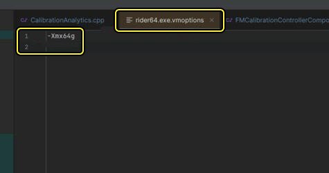
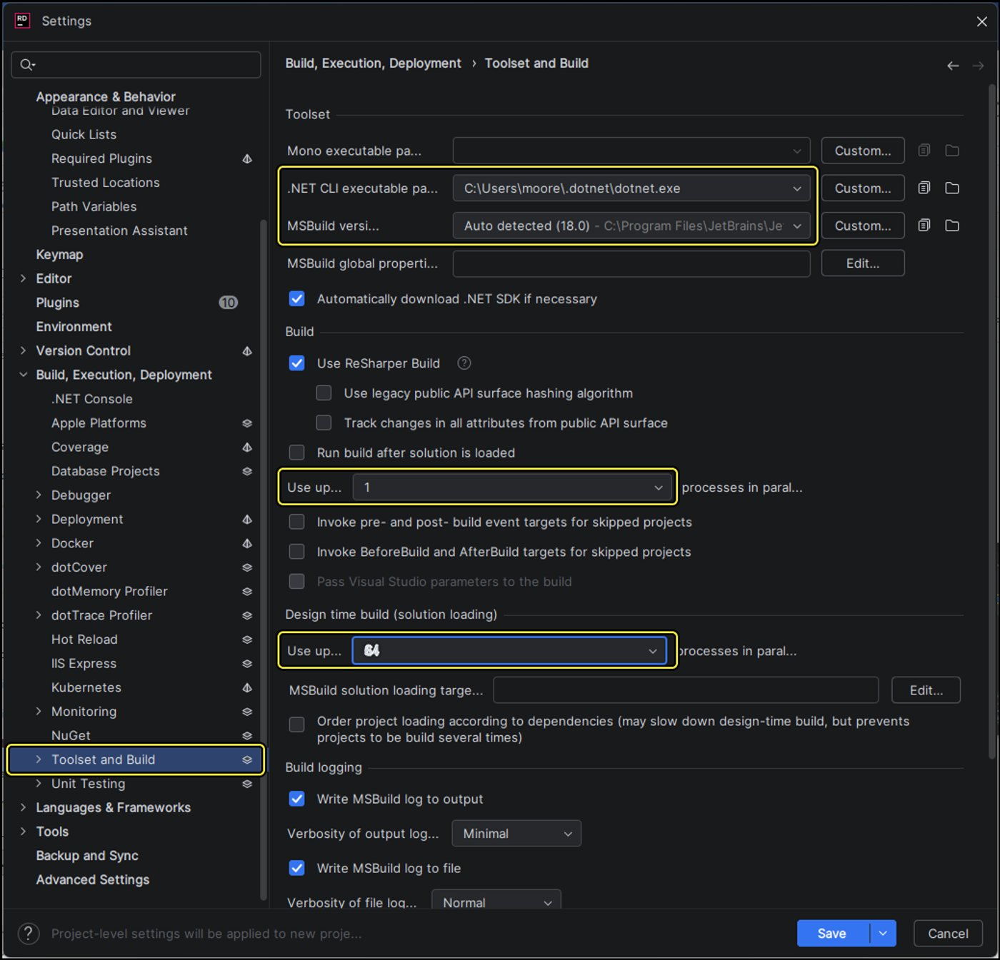
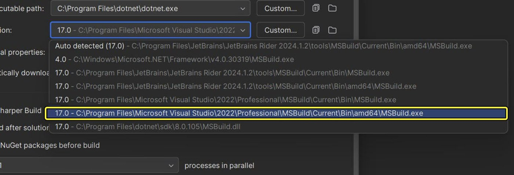
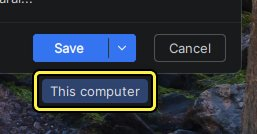
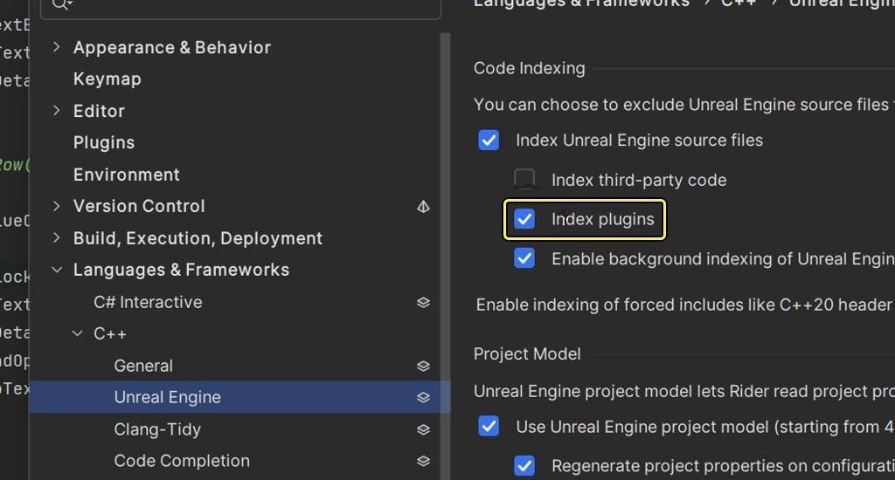
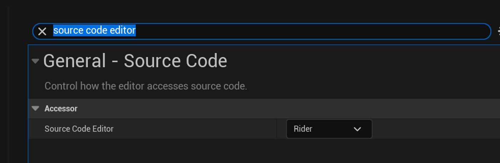
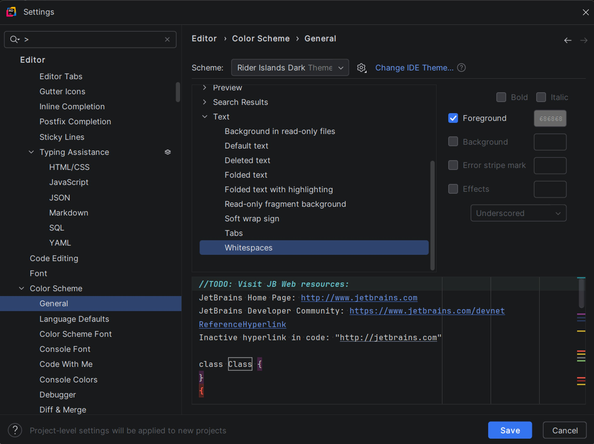

# Rider Setup Guide

> 路径：虚幻引擎5.7文档 / 用C++编程 / 开发设置 / Rider Setup Guide

> 原始页面：https://dev.epicgames.com/documentation/unreal-engine/rider-setup-guide

该页面没有可用的官方中文版本；以下内容保留原文，并按本项目人工译文规则逐步回译。

Rider is a fast and fully-featured IDE for Unreal Engine. It delivers insights on code and Blueprints, assists with reflection specifiers, provides safe refactorings, and offers advanced code completion. Try [Rider for Unreal](https://www.jetbrains.com/lp/rider-unreal/)! Compared to Visual Studio, Rider has:

- Better code navigation and auto-completion
- Better performance (less freezing)
- Better debugging and console support

## Step-by-step guide

1. Install Rider

   1. Get the latest version from the [Jetbrains website](https://www.jetbrains.com/lp/rider-unreal/) .
2. Visit the Jetbrains Marketplace

   1. Install the [EzArgs plugin](https://plugins.jetbrains.com/plugin/16411-ezargs).
3. Apply these setting for your RAM setup

   1. Set your RAM to 64 gb (Rider will not function with its default RAM settings).

      1. **Help > Edit Custom VM Options**
      2. Then enter `-Xmx64g`
      3. **Save** your modifications as a file

         
4. Configure your **dotnet.exe** and **MSBuild** version paths (these settings are not the default settings).

   1. Go to **Settings > Build, Execution, Deployment > Toolset and Build**
   2. Adjust your file paths (see step e for an example MSBuild file path)
   3. Under **Build**, set parallel process to **1**
   4. Under **Design Time Build**, set parallel processes to **64**

      

      Click image to expand.
   5. Select the **path** for the MSBuild version

      

      Click image to expand.
   6. Unlike with some tools, you need to explicitly save your settings changes. **Save to This computer** so that your settings carry over to all your work streams.

      
   7. Enable indexing on plugins so that you get full code support (syntax, refactoring, completion, finding definitions, dependency analysis etc.) in the Harmonic and other plugins. From **Settings > Languages & Frameworks > C++ > Unreal Engine**, under **Code Indexing**, select the checkbox for **Index plugins**.

      

## Remove Warning when Editing Files in a Changelist

By default Rider will warn you about editing files that are not in the **default** changelist. You can disable it by:

- Unchecking **Highlight files with changelist conflict**. (**Settings > Version Control > Changelists**)

  
- Alternately, use the Active/Inactive changelist system in Rider. Go to the Perforce icon in the lower left panel to see all your open changelists. Set one of them to be the “active” one, and only work within those files.

## Open Code in Rider from the Unreal Editor

When you click on a BP node in the editor or a C++ class from the Content Browser, you want it to open Rider, rather than MSVC (Microsoft Visual C+ compiler).

In the Unreal Editor, go to **Edit > Editor Preferences… > search for: source code editor**, and set the dropdown to **Rider**.

## Additional Options

### Show Whitespace and Set the Color

In **Rider’**s opening dialog box, go to **Configure > Settings > Editor** to access whitespace and text settings:

- Show/hide whitespace (and other text settings): **Color Scheme > General > Text > Whitespaces**

  
- Go to **Color Scheme > Color Scheme Font** to select from a menu of color options

  > 图片已省略：Color-scheme-fonts

### Show Selected in Explorer

In **Rider**, view where your currently open file is in the directory structure.

1. Select the **Folder icon** in the left side-menu for Explorer View.
2. (Usually) You can find your file in the left panel, two folders down in the file tree.

   > 图片已省略：Viewing-a-file-in-the-directory
3. When an editor tab is selected, you can use this setting to have the corresponding file in Project view be selected. From **Project View Options > Behavior > Always Select Opened File**, toggle the setting to **ON**.

   > 图片已省略：Always-select-open-file-option-toggled-on

### Highlighting

By default this is turned off, and files have minimal syntax highlighting.

In Rider’s opening dialog box, go to **Settings > Editor > Inspection Settings > Enable Code Analysis**

### Does Unreal Game Sync run into problems with Unreal Build Tool already running (while Rider is open)?

By default, Rider regenerates the project when it detects a change to the project files or configuration. This will invoke UBT at some point, and UBT will usually still be running when UGS gets to building post-sync.

**Settings > Languages & Frameworks > C/C++ > Unreal Engine**, under Project model, select/deselect (as needed) **Regenerate project properties on project files change**.

> 图片已省略：Regenerate-project-properties-checkbox
