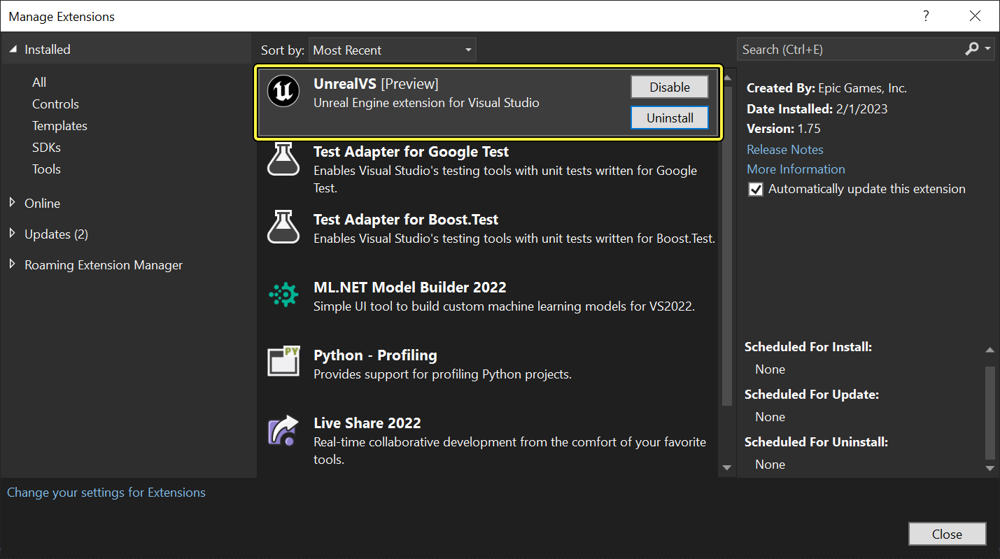
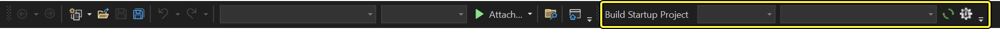
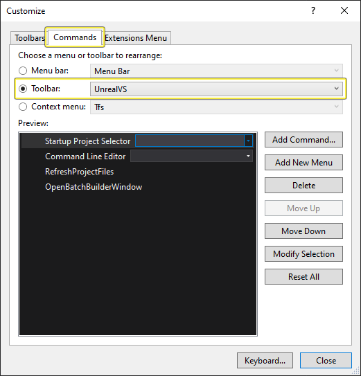
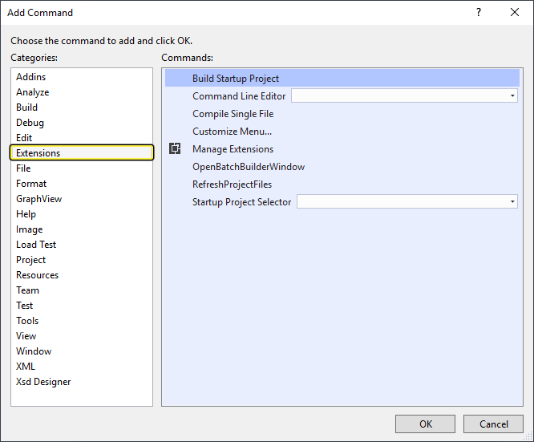
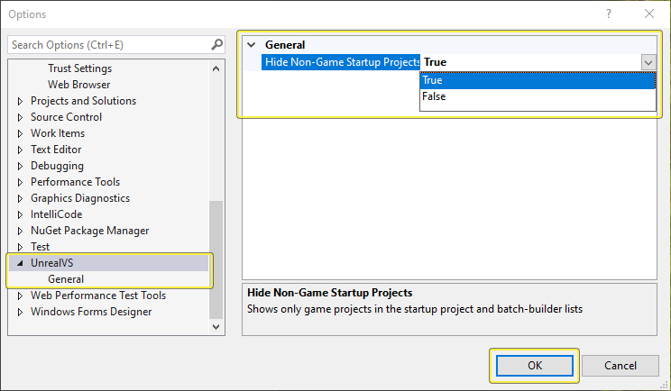
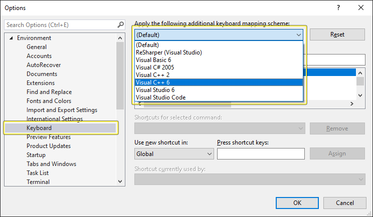
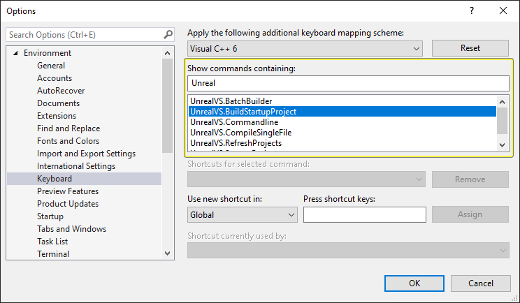
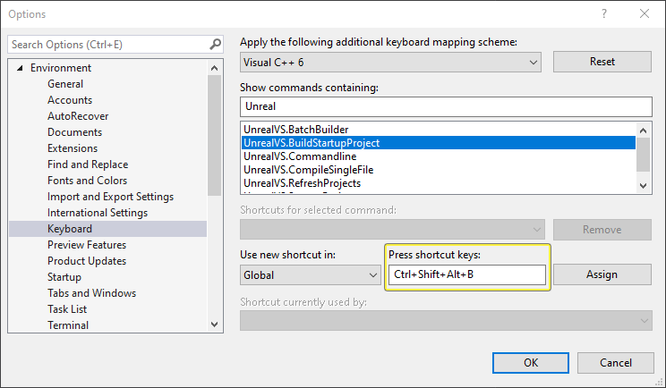

# UnrealVS扩展

> 路径：虚幻引擎5.7文档 / 用C++编程 / 开发设置 / 设置Visual Studio / UnrealVS扩展

> 原始页面：https://dev.epicgames.com/documentation/unreal-engine/using-the-unrealvs-extension-for-unreal-engine-cplusplus-projects

借助 **Visual Studio** （简称VS）的 **UnrealVS** 扩展，你可以在使用 **虚幻引擎（简称UE）** 进行开发时轻松访问诸多常见操作。本文将介绍如何安装扩展，以及如何将其用于项目。

内容包括：

- 扩展的安装和设置
- 设置启动项目
- 绑定构建启动项目的命令
- 设置命令行参数
- 批量构建项目
- 快速构建项目菜单

> [!NOTE]
> UnrealVS扩展不适用于Visual Studio Express。它只与Visual Studio社区版和专业版兼容。

## 安装及设置

> [!NOTE]
> 以下安装和设置步骤是在使用VS Community 2022版本17.4.1时起草的。根据使用的VS版本，这些步骤可能会有所不同。

### 安装UnrealVS Visual Studio扩展

1. 查找相应Visual Studio版本的扩展，位于 `<UNREAL_ENGINE_ROOT>\Engine\Extras\UnrealVS\VS_VERSION\UnrealVS.vsix`，例如，`C:\Program Files\Epic Games\UE5\Engine\Extras\UnrealVS\VS2019\UnrealVS.vsix`。
2. 运行 `UnrealVS.vsix` 文件开始安装，只需双击该文件即可。
3. UnrealVS扩展应该会自动检测到并定位你的VS版本。请确保安装程序定位到正确的VS版本，并选中该复选框。如一切正常，单击 **安装（Install）** 按钮继续。
4. 安装完毕后，单击 **关闭（Close）** 按钮。
5. 运行VS，在 **扩展（Extensions）** > **管理扩展（Manage Extensions）** > **已安装（Installed）** 中，你应该可以看到该扩展。

   

   > [!NOTE]
   > 如果Visual Studio已在运行中，则需要重新启动，然后才能加载和显示扩展。该扩展还会显示在 **帮助（Help）** > **关于Microsoft Visual Studio（About Microsoft Visual Studio）** 对话框的"已安装的产品（Installed Products）"列表中。
6. 转到 **视图（View） > 工具栏（Toolbars）** （或 **右键单击** Visual Studio工具栏区域），然后选择 **UnrealVS** 以显示扩展的工具栏。

   
7. 默认情况下，工具栏显示如上。不过，其内容可进行自定义，方法是打开 **工具（Tools）** > **自定义...（Customize...）** > **命令选项卡（Commands tab）** > **工具栏单选按钮（Toolbar radio button）** > **UnrealVS**。

   
8. 在 **自定义（Customize）** 对话框中选择 **添加命令...（Add Command...）**，然后从 **类别（Categories）** 列表中选择 **扩展（Extensions）** 来查看可添加到工具栏的UnrealVS命令列表。当你添加完命令后，点击 **确认**。

   

现在你可以添加各种命令，例如启动项目（Startup Project）、各种命令行参数、刷新项目、Batch Builder、以及Quick Build菜单。

## 设置启动项目

通过 **启动项目（Startup Project）** 下拉列表可快速设置和切换启动项目。它可以自动列出所有可用于在解决方案中构建可执行文件的项目。从列表中选择项目并将其设置为当前的启动项目。

你可以更改UnrealVS选项中列出的项目。要仅显示游戏项目，请转到 **工具->选项...（Tools->Options...）**，然后选择 **UnrealVS**。

## 构建启动项目

扩展还包含了构建当前启动项目的命令。这些命令可绑定到热键或其他运行自定义命令的方法上。

### 要将命令绑定到热键：

1. 转到 **工具 > 选项...（Tools > Options...）**，选择 **环境（Environment）** 树下的 **键盘（Keyboard）**。在 **应用以下额外键盘映射方案（Apply the following additional keyboard mapping scheme）** 下点击下拉菜单并选择 **Visual C++ 6**。

   
2. 在命令列表中选择 **UnrealVS.BuildStartupProject** 命令。

   

   > [!TIP]
   > 你可以在搜索框中输入"Unreal"来过滤列表。
3. 选中命令后，单击 **按下快捷键（Press Shortcut Keys）** 框，然后按下要用于执行命令的按键组合。（例如，下方示例中显示的 **Ctrl + Shift + Alt + B**）。

   

   > [!NOTE]
   > 请不要选择已分配给其他命令的按键组合。如果输入的按键组合已被使用，将显示 **快捷键当前正被使用（Shortcut currently used by）** 警告框。
4. 按下 **分配（Assign）** 按钮将按键绑定到命令。这些按键组合会显示在 **选定命令的快捷键（Shortcuts for selected command）** 下。

   > 图片已省略：Assigned Keys
5. 按下 **确定（OK）** 按钮保存更改。现在，当使用该快捷键时，将自动构建设置为"启动项目"的项目。

## 在单个源文件中迭代

如果你习惯于在Visual Studio中使用[Ctrl+F7](https://docs.microsoft.com/en-us/visualstudio/ide/default-keyboard-shortcuts-for-frequently-used-commands-in-visual-studio)对单个源（`.cpp`）文件进行迭代更新，则可以将 **Ctrl+F7** 绑定到 **UnrealVS.CompileSingleFile** 命令。这将使用当前解决方案配置、平台和 `-singlefile=PATH/TO/OPEN/FILE` 参数构建激活的项目。

## 命令行参数

**命令行** 功能按钮用于在运行调试会话时对当前项目设置 **命令参数**。你可以用这种快捷方法，而非通过项目 **属性** 来设置。实际上，这里所做的更改都会自动反映在 **属性** 中。

在文本框中输入参数，或从下拉列表中的最近参数列表中进行选择。调试会话启动时，这些参数将被传递给可执行文件。

> 图片已省略：Command Arguments

> [!NOTE]
> 对构建虚幻编辑器的游戏项目使用项目配置，项目名称会自动添加到命令行，以使编辑器可执行文件知道你正在使用哪个项目。
>
> 例如，如果你使用构建配置"调试编辑器（Debug Editor）"来构建QAGame，命令行会将QAGame.uproject添加到命令参数，而无需在框中输入。要启动QAGame编辑器，即使将 **命令行** 功能按钮留空，编辑器也会知道要运行哪个项目。

## 刷新项目

你可以使用[自动生成项目文件](../../../../production-pipeline/using-the-unreal-engine-build-pipeline/unreal-build-tool/how-to-generate-unreal-engine-project-files-for-your-ide/index.md)在Visual Studio中生成项目文件。由于不必手动查找和运行`.bat`文件，可以更快地同步和更新所有项目文件。

**要刷新项目文件：**

1. 按下 **UnrealVS** 工具栏上的 **刷新项目（Refresh Projects）** 按钮。
2. 项目生成过程的进度会显示在 **输出（Output）** 窗口中。
3. 出现提示时，重新加载任意必要的项目。

## 批量构建程序

**UnrealVS批量构建程序（UnrealVS Batch Builder）** 可以让我们创建和运行一组自定义构建作业。它比Visual Studio中的 **构建 > 批量构建...（Build > Batch Build...）** 选项更好用。

**要打开"批量构建程序"窗口：**

1. 按下 **UnrealVS** 工具栏上的"批量构建程序"按钮，或者使用分配给UnrealVS.BatchBuilder命令的键盘快捷键（有关为 **UnrealVS** 命令设置键盘快捷键的说明，请参阅上面的 **构建启动项目**）。

   > 图片已省略：Batch Builder
2. **UnrealVS批量构建程序** 窗口将出现。

   > 图片已省略：Batch Builder Window

   - 选择 **项目**、**配置**、**平台** 然后点击单选按钮来选择作业类型来创建 **构建作业**。
   - 使用 **>** 和 **<** 按钮来添加/移除作业。
   - 使用右侧箭头按钮把选择的作业在 **构建作业** 列表中上下移动。
   - 在 **构建作业** 列表的下拉菜单中选择想要编辑的 **作业集**。
   - 要创建新 **作业集**，在输入框中输入新的名称。
   - **删除（Delete）** 按钮会把选择的 **作业集** 从列表中删除。
   - 使用 **开始（Start）** 按钮来 **开始/停止** 当前作业集的批量构建任务。
   - 作业集存储在.suo文件中，以便下次继续用于载入的解决方案。
3. 单击 **开始（Start）** 时，显示的 **输出（Output）** 选项卡会显示批量构建的进度。

   > 图片已省略：Batch Builder Window running

   正在运行的作业集中的 **构建作业** 将显示在输出列表中。当前正在执行的构建作业显示为粗体。

   - Queued Build Job = 排队作业
   - Succeeded Build Job = 作业完成，成功作业
   - Failed Build Job = 失败作业
   - Cancelled Build Job = 取消作业

   当批量构建在运行时，会显示繁忙的动画和 **停止** 的按钮。
4. 通过双击 **输出选项卡** 中的条目，或者单击鼠标右键并从快捷菜单中选择 **显示输出（Show Output from）**，可以查看各个 **构建作业** 的输出。.

   > 图片已省略：BatchBuild Output Pane

   > [!NOTE]
   > 各条目的 **批量构建程序** 输出显示在Visual Studio **输出（Output）** 窗口中名为 **UnrealVS - BatchBuild** 的窗格中。不要将其与"构建（Build）"窗格弄混了，后者显示当前/上一构建作业的输出。

## 快速构建菜单

**快速构建（Quick Build）** 菜单可以使用任意配置和平台组合来构建项目，而无需变更主解决方案构建配置。

1. 在 **解决方案浏览器** 中右键单击项目节点。
2. **UnrealVS快速构建（UnrealVS Quick Build）** 菜单包含虚幻引擎解决方案中可用的平台和构建配置的子菜单。
3. 选择要用于构建所选项目、平台和配置的条目。这个方法比在IDE中变更解决方案配置和解决方案平台、开始构建然后切回配置和平台快得多。

> [!NOTE]
> 比起在IDE中更改解决方案配置和解决方案平台，开始编译，然后再切回配置和平台，这种方法显然更快。
