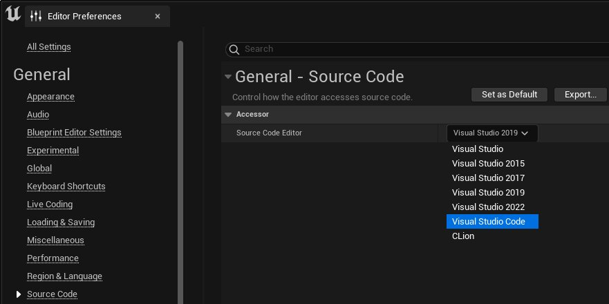
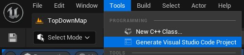
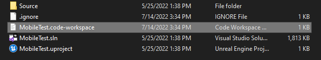
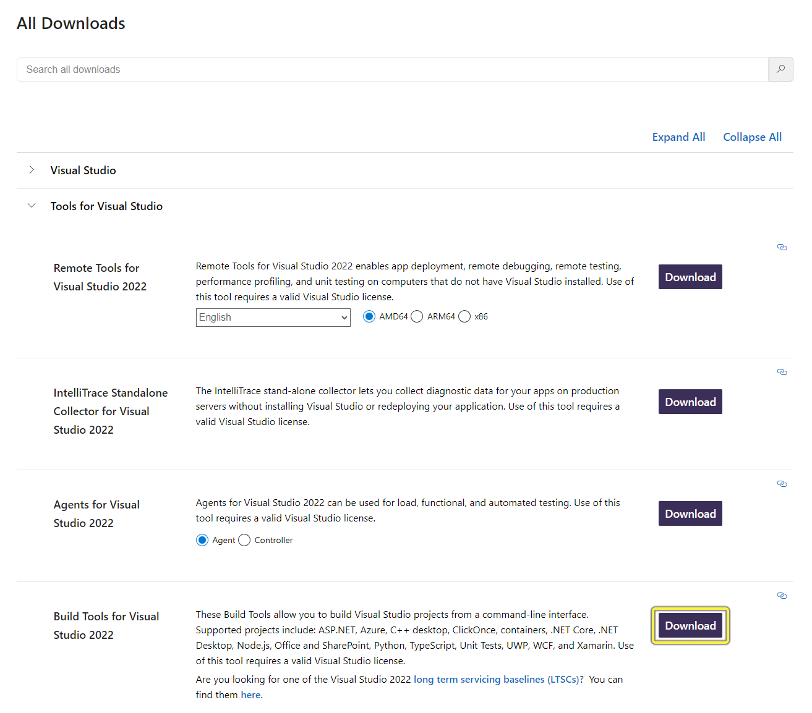
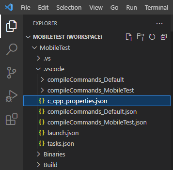
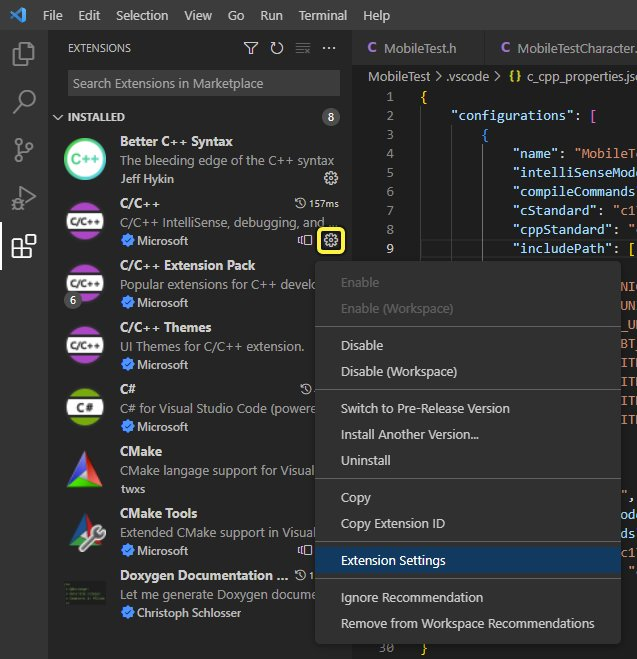
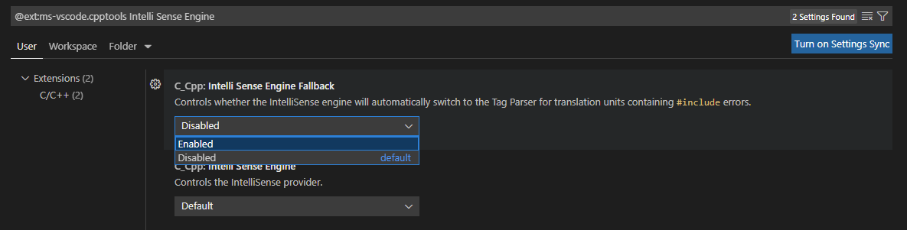
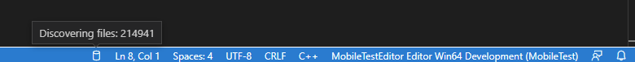

# 为虚幻引擎设置VS Code

> 路径：虚幻引擎5.7文档 / 用C++编程 / 开发设置 / 为虚幻引擎设置VS Code

> 原始页面：https://dev.epicgames.com/documentation/unreal-engine/setting-up-visual-studio-code-for-unreal-engine

**虚幻引擎(UE)）** 支持将 **Microsoft Visual Studio** 作为其在Windows系统上开发C++项目的默认IDE，同时还支持将 **Visual Studio Code (VS Code)** 作为更为轻量级的免费开源替代方案。尽管VS Code没有提供与Visual Studio完全相同的功能，但它高度可扩展，可用于Windows、MacOS、Linux，这为需要在多个平台中工作的开发人员提供了共同的工具。

VS Code需要额外手动设置，才会获得与Visual Studio for Windows等效的功能。本指南将详细介绍这些步骤，以便让你的VS Code环境足够齐全，适合进行UE开发。

> [!NOTE]
> 你不需要完整安装Visual Studio即可使用VS Code。

## 必需设置

本指南假定你已经安装了虚幻引擎，并使用它创建了C++项目。

## 安装适合你的操作系统的VS Code和所需扩展

1. 下载并安装[VS Code](https://code.visualstudio.com/)以及针对VS Code的官方[C/C++扩展包](https://marketplace.visualstudio.com/items?itemName=ms-vscode.cpptools-extension-pack)和[C#扩展](https://marketplace.visualstudio.com/items?itemName=ms-dotnettools.csharp)。这些是读取虚幻引擎及其 **编译工具（Build Tools）** 的源代码所必需的。
2. 针对你的操作系统，下载并安装对应的编译器工具集。

   - **Windows：**[Microsoft Visual C++ (MSVC)编译器工具集](https://visualstudio.microsoft.com/downloads/)。
   - **Mac：**[LLVM/Clang](https://code.visualstudio.com/docs/cpp/config-clang-mac)。
   - **Linux:** [LLVM/Clang](#compilertoolsetforlinux).

有关如何设置这些组件的详细信息，请参阅[安装编译器工具集](#%E5%AE%89%E8%A3%85%E7%BC%96%E8%AF%91%E5%99%A8%E5%B7%A5%E5%85%B7%E9%9B%86)。

1. 如果你是在Mac或Linux上调试，请下载并安装[LLDB扩展](https://marketplace.visualstudio.com/items?itemName=vadimcn.vscode-lldb)。
2. 如果你需要将VS Code设置为默认IDE，请打开 **虚幻编辑器（Unreal Editor）** 并转至 **编辑（Edit）** > **编辑器偏好设置（Editor Preferences）** > **通用（General）** > **源代码（Source Code）** ，然后将你的 **源代码编辑器（Source Code Editor）** 设置为 **Visual Studio Code** 。重启编辑器，使更改生效。这不是生成VS Code解决方案（参阅步骤5c）所必需的，但它会成为默认值，取代Visual Studio。

   

   点击查看大图。
3. 生成你的VS Code工作区。具体有三种做法：

   1. 打开 **虚幻编辑器（Unreal Editor）** 并点击 **工具（Tools）** > **刷新Visual Studio Code项目（Refresh Visual Studio Code Project）** 。

      
   2. 在Windows和Mac上，右键点击项目的 `.uproject` 文件并点击 **生成项目文件（Generate Project Files）** 。完成后，你应该会在项目的文件夹中看到 `.code-workspace` 文件。

      
   3. 在命令行中，运行 `GenerateProjectFiles.bat -vscode` 。添加 `-vscode` 参数将创建 `.vscode` 工作区而不是Visual Studio `.sln` 。如果你使用此方法，则不需要更改默认源代码编辑器。

## 安装编译器工具集

每个桌面操作系统使用不同的编译器工具集来编译VS Code中的项目。每个操作系统的安装过程都非常简单，但都要求你在不同的地方发起设置。

### 编译工具集 - Windows

VS Code在Windows上使用Microsoft Visual C++编译器(MSVC)工具集。

1. 打开[Microsoft Visual Studio下载页面](https://visualstudio.microsoft.com/downloads/)。
2. 向下滚动到 **所有下载（All Downloads）** 分段，然后展开 **Visual Studio的工具（Tools for Visual Studio）** 。
3. 点击 **Visual Studio 2022的编译工具（Build Tools for Visual Studio 2022）** 旁边的 **下载（Download）** 按钮并安装它。

   

   点击查看大图。

### 编译工具集 - MacOS

虚幻引擎使用LLVM/Clang作为其在MacOS上的编译器工具集。有关如何安装和启用的完整说明，请参阅Microsoft关于[将Clang用于Visual Studio Code](https://code.visualstudio.com/docs/cpp/config-clang-mac)的文档。

### 编译工具集 - Linux

虚幻引擎在Linux上需要使用LLVM/Clang工具集。要设置该工具，请执行以下步骤：

1. 打开终端，并运行以下命令：

   ```
        sudo apt install clang
   ```
2. 运行 `SetupToolchain.sh` 。它位于你的引擎安装目录中的 `Build/BatchFiles/Linux` 下。
3. 运行 `GenerateProjectFiles.sh` 以编译VS Code工作区。

## 为VS Code设置IntelliSense

VS Code可以使用 **IntelliSense** 进行代码提示，但将其用于虚幻引擎需要执行额外的设置步骤，向其公开你的项目的代码。

1. 在 **资源管理器（Explorer）** 中，打开 `.vscode/c_cpp_properties.json` 。

   
2. 按如下所示添加 `includePath` 属性：

   ```
        "includePath": [          "${workspaceFolder}\\Intermediate\\**",          "${workspaceFolder}\\Plugins\\**",          "${workspaceFolder}\\Source\\**"      ],
   ```

   这会向IntelliSense公开你的项目中的这些路径，以便它发现你的项目的代码。

   > [!NOTE]
   > `${workspaceFolder}` 不是占位符文本。它是一个快捷方式，指示你的工作区的当前目录，这样就不必在编辑这些文件时采用绝对路径。
3. 打开 **扩展（Extensions）** 面板。点击 **C/C++** 扩展的齿轮图标，然后点击 **扩展设置（Extension Settings）** 。

   

   点击查看大图。
4. 找到条目 **C_Cpp: IntelliSense Engine Fallback** 。点击下拉菜单并将其设置为 **启用（Enabled）** 。

   

   点击查看大图。
5. 在状态托盘中设置你的 **配置** 以匹配 `c_cpp_properties.json` 中你的配置的名称。
6. 现在，你会在VS Code窗口右下角的VSCode状态托盘（蓝色条）中看到一个小的数据库图标。将鼠标悬停在此图标上，可查看IntelliSense解析项目的进度。

   

### C/C++配置示例文件

下面是有效 `c_cpp_properties.json` 文件的示例：

```
{	"configurations": [ 		{ 			"name": "CustomGame Editor Win64 Development", 			"intelliSenseMode": "msvc-x64", 			"compileCommands": "", 			"cStandard": "c17",			"cppStandard": "c++17", 			"includePath": [ 				"${workspaceFolder}\\Intermediate\\**", 				"${workspaceFolder}\\Plugins\\**", 				"${workspaceFolder}\\Source\\**" 			],			"defines": [ 				"UNICODE", 				"_UNICODE", 				"__UNREAL__", 				"UBT_COMPILED_PLATFORM=Windows", 				"WITH_ENGINE=1", 				"WITH_UNREAL_DEVELOPER_TOOLS=1", 				"WITH_APPLICATION_CORE=1", 				"WITH_COREUOBJECT=1" 			] 		} 	],	"version": }
```

完成后，IntelliSense将为你的项目提供代码提示，包括上下文相关的自动完成功能。

## 在VS Code中编译和启动项目

要编译你的项目，请确保VS Code设置为正确的 **编译配置** ，否则它会尝试编译并运行你的独立或发布版本游戏，而不是编辑器。

1. 点击窗口左侧的播放按钮选项卡或按 **CTRL+SHIFT+D** ，打开 **运行和调试（Run and Debug）** 面板。
2. 点击面板顶部 **运行和调试（RUN AND DEBUG）** 旁边的下拉菜单。选择项目的开发编辑器（Development Editor）配置。例如，如果你的项目名为TestGame，你应选择 **启动TestGameEditor（开发）（TestGame）（Launch TestGameEditor (Development) (TestGame)）** 。

   > 图片已省略：设置编译配置

   有关这些选项的详细信息，请参阅[编译配置参考](https://dev.epicgames.com/documentation/404)页面。
3. 点击 **播放（Play）** 按钮或按 **F5** ，开始在编辑器模式下编译你的项目。项目将编译，完成后将打开虚幻编辑器。确保你尚未打开虚幻编辑器。

   > [!NOTE]
   > 无论你是否使用"运行和调试（Run and Debug）"面板，选择你的编译配置后，你可以按F5或点击工具栏中的 **运行（Run）** > **开始调试（Start Debugging）** 来编译和调试你的项目。
