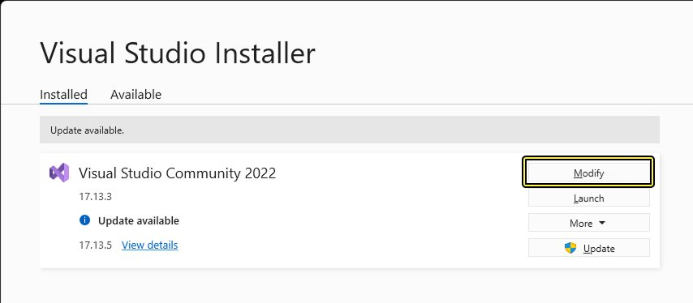
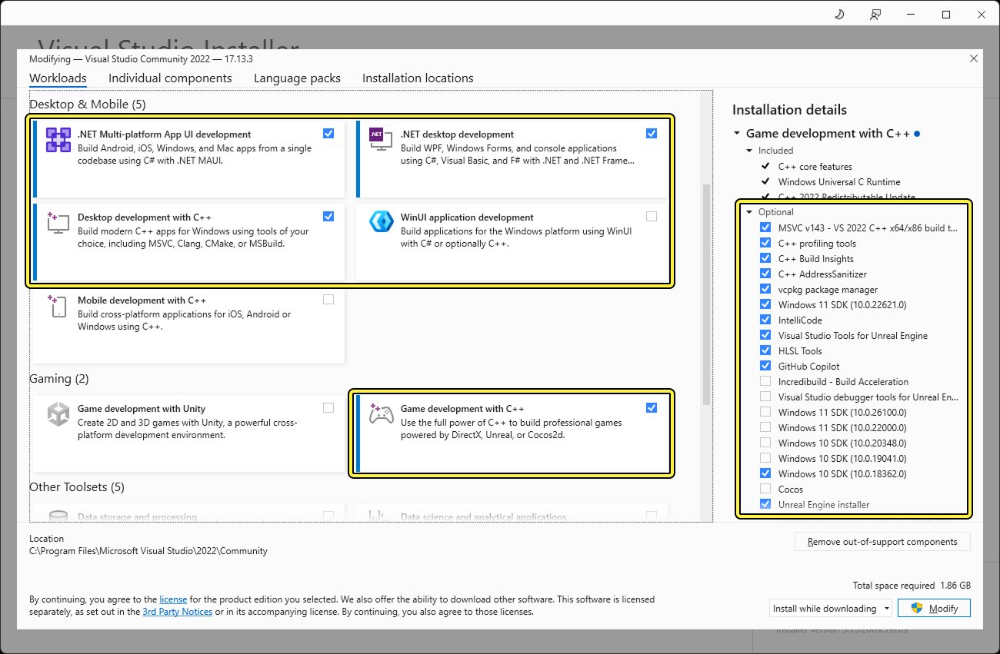
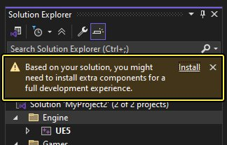
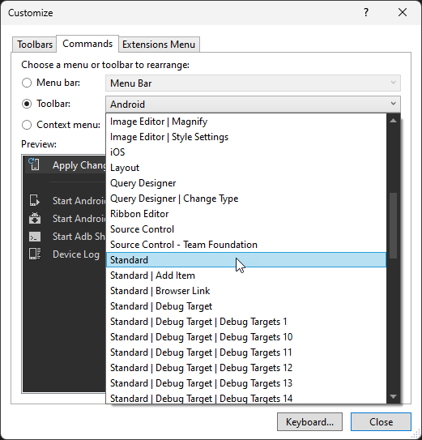
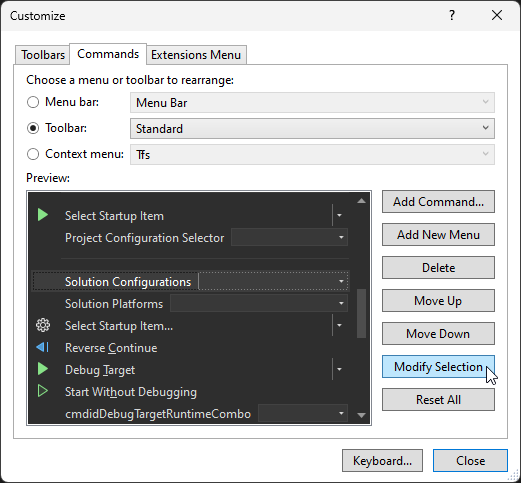
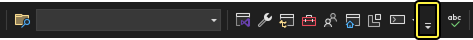

# 设置Visual Studio

> 路径：虚幻引擎5.7文档 / 用C++编程 / 开发设置 / 设置Visual Studio

> 原始页面：https://dev.epicgames.com/documentation/unreal-engine/setting-up-visual-studio-development-environment-for-cplusplus-projects-in-unreal-engine

虚幻引擎（UE）能与**Visual Studio（简称VS）**完美结合，使你能够快速改写项目代码，并即刻查看编译结果。 设置Visual Studio以使用虚幻引擎能提高开发者对虚幻引擎的利用效率和整体用户体验。

该文档介绍如何建立从虚幻引擎到Visual Studio的基本工作流程。

## 版本兼容性

下列表格列出了已集成二进制版虚幻引擎的Visual Studio版本。

| 虚幻引擎版本 | VS 2019版本 | VS 2022版本 |
| --- | --- | --- |
| 5.6 | 不支持 | 17.8或更高版本，推荐17.14（默认） |
| **5.5** | 不支持 | 17.8或更高版本，推荐17.10（默认） |
| **5.4** | 不支持 | 17.4或更高版本，推荐17.8（默认） |
| **5.3** | 16.11.5或更高版本 | 17.4或更高版本，推荐17.6（默认值） |
| **5.2** | 16.11.5或更高版本 | 17.4或更高版本（默认值） |
| **5.1** | 16.11.5或更高版本（默认值） | 17.4或更高版本 |

其他软件版本：

| 软件 | 最低版本 | 推荐版本 |
| --- | --- | --- |
| **MSVC** | 14.38.33130 | 14.38.33130 |
| **Windows SDK** | 10.0.19041.0 | 10.0.22621.0或更高版本 |
| **LLVM** | 18.1.3 | 18.1.8 |
| **.NET** | .NET 8.0 | .NET 8.0 |

## 验证虚幻引擎必备条件

当你使用Epic Games启动程序安装虚幻引擎，或从GitHub复制虚幻引擎时，虚幻引擎必备条件安装程序将自动安装所有引擎允许所必需的依赖项、库以及框架。 若通过Perforce安装或同步虚幻引擎，则必须在运行本地编译的虚幻引擎工具前运行必备条件安装程序。 安装程序位于`[虚幻引擎根目录]\Engine\Extras\Redist\en-us\`。

## 添加Visual Studio安装选项

如果你是初次安装Visual Studio（VS）或修改现存的安装版本，请确保启用下列工作负载和组件。

> [!TIP]
> 要修改Visual Studio的安装选项，请运行Visual Studio安装程序，然后点击最新版本旁的**修改（Modify）**。
>
> 

### 添加必要工作负载

转到安装程序**桌面端和移动端（Desktop & Mobile）**下的**工作负载（Workloads）**选项卡，启用下列选项：

- .NET桌面开发
- 使用C++的桌面开发
- .NET多平台App UI开发（.NET Multi-platform App UI development）

转到**游戏（Gaming）**，勾选**C++游戏开发（Game development with C++）**。

### 添加必要组件

转到安装程序的**安装细节（Installation Details）**面板，展开**C++游戏开发（Game development with C++）**并启用下列选项：

- C++分析工具
- C++ AddressSanitizer（可选）
- Windows 10或11 SDK（10.0.18362或更高版本）
- 虚幻引擎安装程序

点击查看大图。

> [!NOTE]
> 当你在VS中打开首个虚幻引擎C++项目时，你可能会在**解决方案浏览器**中看到一条"组件缺失"警告。 单击**安装（Install）**以允许VS安装项目所需的所有额外组件。
>
> 

## 推荐设置

下文的可选VS界面调整项能让你的开发体验更便捷。

### 关闭错误列表窗口

通常情况下，若代码出错，VS会自动弹出一个**错误列表（Error List）**。 然而在使用虚幻引擎时，错误列表窗口可能会显示一些额外的下游错误，这反而加大了找出根本原因的难度。 在使用虚幻引擎时，你可以禁用错误列表窗口，改为使用输出日志查看实际的代码错误。

要关闭错误列表窗口，请执行以下步骤：

1. 转到VS，前往**工具（Tools） > 选项（Options）**。
2. 转到**选项（Options）**窗口左侧，选择**项目和解决方案（Projects and Solutions）**。
3. 禁用**编译出错时始终显示错误列表（Always show Error List if build finished with errors）**。
4. （可选）更改下表中与项目相关的其他选项和功能。
5. 点击**确定（OK）**。

| 为： | 在选项栏中，转到： | 并修改此选项： |
| --- | --- | --- |
| 阻止文本编辑器中的代码块变为灰显 | **文本编辑器（Text Editor） > C/C++ > 视图（View）** | 将**显示非活跃代码块（Show Inactive Blocks）**设为**False** |
| 在解决方案浏览器（Solution Explorer）中隐藏不必要的文件夹 | **文本编辑器（Text Editor） > C/C++ > 高级（Advanced）** | 将**禁用外部依赖性文件夹（Disable External Dependencies Folders）**设为**True** |
| 启用智能感知（IntelliSense），即在你编写代码时提供代码补全、建议以及自动代码格式化。 | **文本编辑器（Text Editor） > C/C++ > 智能感知（IntelliSense）** | 开启**启用64位智能感知（Enable 64-bit IntelliSense）** |

### 增加解决方案配置下拉菜单的宽度

将VS工具栏的"解决方案配置（Solution Configurations）"下拉菜单的宽度适当放大可能会很有用，这样做可以方便你查看自定义配置的完整名称。

要增加解决方案配置菜单的宽度，请执行以下步骤：

1. 打开Visual Studio，右键点击主**工具栏**并选择上下文菜单底部的**自定义（Customize）**选项。
2. 转到**自定义（Customize）**窗口，点击**命令（Commands）**选项卡，选择**工具栏（Toolbar）**单选按钮，打开下拉菜单将**工具栏（Toolbar）**改为**标准（Standard）**。

   
3. 转到工具栏中的**预览（Preview）**，滚动选项找到并选择**解决方案配置（Solution Configurations）**选项，然后点击**修改选择（Modify Selection）**。

   
4. 将**宽度（Width）**变更为**200**并点击**确定（OK）**。 这时VS会将工具栏更新为新尺寸。
5. 关闭**自定义（Customize）**窗口。

### 添加解决方案平台下拉菜单

当你为多个平台进行开发时，便捷的做法是将解决方案平台下拉菜单加到VS的工具栏中。

如果解决方案配置（Solution Configurations）下拉菜单右侧未显示此菜单，请点击标准（Standard）工具栏右侧的小箭头按钮，转到**添加或删除按钮（Add or Remove Buttons）**，选择**解决方案平台（Solution Platforms）**，即可将其添加到工具栏中。

