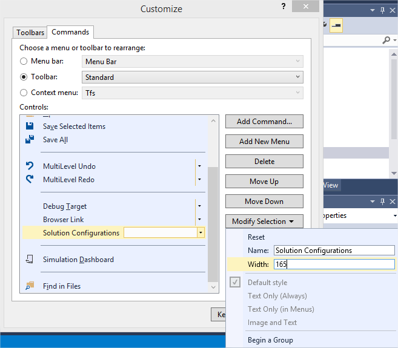
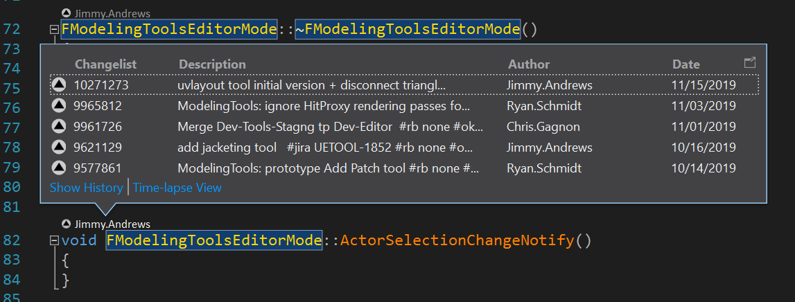

# Visual Studio使用技巧

> 路径：虚幻引擎5.7文档 / 用C++编程 / 开发设置 / 设置Visual Studio / Visual Studio使用技巧

> 原始页面：https://dev.epicgames.com/documentation/unreal-engine/visual-studio-tips-and-tricks-in-unreal-engine

## 即时窗口

| 命令 | 说明 |
| --- | --- |
| `{,,UnrealEditor-Core}::PrintScriptCallstack()` | 蓝图调用堆栈 |
| `{,,UnrealEditor-Core}::GFrameNumber` | 当前帧数（也可作为断点条件） |
| `{,,UnrealEditor-Core}::GPlayInEditorID` | PIE ID（适用于多玩家，也可作为断点条件） |
| `UnrealEditor-Engine!GPlayInEditorContextString` | PIE窗口名称（适用于多玩家） |

## 快速参考

### 禁用/启用优化

将以下宏添加到文件中将禁用和启用相应文件的编译器优化：

```
	PRAGMA_DISABLE_OPTIMIZATION	PRAGMA_ENABLE_OPTIMIZATION 
```

禁用优化之后，代码将严格按照你的编写来执行，不会删除你在追踪或逐步调试会话中需要使用的临时变量或调试变量。当你需要在不使用完整调试构建的情况下有选择地调试文件时，此功能很有用。

### 调试行

**调试行（Debug lines）** 指的是视口中绘制的行，通常用于显示线迹追踪的一个或多个路径。要使用调试行，你需要包含 `DrawDebugHelpers.h`。以下代码介绍如何使用 `DrawDebugLine`：

```
	#include "DrawDebugHelpers.h"	DrawDebugLine(GetWorld(), START, END, FColor::Green); 
```

除了标准的调试行，`DrawDebugHelpers` 还具有大量不同的调试绘制器。包括：

**Primitive形状（Primitive Shapes）**

```
	+ DrawDebugBox	+ DrawDebugSphere	+ DrawDebugCapsule	+ DrawDebugCylinder	+ DrawDebugPlane	+ DrawDebugCone	+ DrawDebugPoint
```

**固体形状（Solid Shapes）**

```
	+ DrawDebugSolidBox	+ DrawDebugSolidPlane
```

**其他常见形状（Other Common Shapes）**

```
	+ DrawDebugFrustrum	+ DrawDebugCamera	+ DrawDebugCrosshairs
```

**网格体（Meshes）**

```
	+ DrawDebugMesh 
```

### 调试文本

以下代码提供了如何将调试文本写入到界面的示例。此示例与 **Print String** 蓝图节点中的功能相对应。

```
	#include "Engine/Engine.h"	FString MyDebugString = FString::Printf(TEXT("MyVelocity(%s)"), *MyVelocity.ToCompactString());	GEngine->AddOnScreenDebugMessage(INDEX_NONE, 0.f, FColor::Yellow, MyDebugString, false, FVector2D::UnitVector * 1.2f); 
```

`FString::Printf` 函数可以获取字符串格式参数，让你可以快速编写包含变量的字符串。你需要包含 `Engine.h` 才能获得 `Gengine` 的访问权限，从而调用 `AddOnScreenDebugMessage`。如需有关如何使用字符串格式的信息，请参考[虚幻引擎中的String处理](../../../programming-in-the-unreal-engine-architecture/string-handling/index.md)。

### 枚举转换为字符串

从静态 `Uenum` 调用 `GetNameStringByValue` 并为其提供你要获取其名称的值，可以将枚举转换为字符串。初始化 `Uenum` 时使用的 `StaticEnum` 与传入其数值的枚举，两者的类型必须相同。

```
	EMyEnum::Type MyVariable;	static const UEnum* Enum = StaticEnum<EMyEnum::Type>();	Enum->GetNameStringByValue(MyVariable); 
```

## 修复配置组合框宽度

默认解决方案配置组合框太小，无法看到当前选择的选项的全名。为了解决该问题，请右键单击 **工具栏**，选择 **自定义（Customize）**，选择选项卡 **命令（Commands）**，选择 **单选工具栏（radio Toolbar） > 标准（Standard）**，向下滚动至 **解决方案配置（Solution Configurations）**，点击 **修改选择（Modify Selection）**，然后输入你需要的宽度。宽度200通常很有用。



## 加速Visual Studio 2019

处理虚幻项目时，Visual Studio 2019可能会比较慢。以下是一些可以提高性能的策略：

### 调试较慢

尝试在 **选项（Option）> 调试（Debugging）> 常规（General）** 中禁用以下设置

- 调试时，取消选中

  启用诊断工具（Enable Diagnostic Tools）
- 调试时，取消选中

  显示耗时PerfTip（Show elapsed time PerfTip）

### Perforce Visual Studio历史记录将显示上述每种方法



要停止Perforce Visual Studio历史记录显示上述每种方法，取消选中 **工具（Tools） > 选项（Options） > 文本编辑器\所有语言\CodeLens（Text Editor\All Languages\CodeLens）>启用CodeLens（Enable CodeLens）**。

### 打开解决方案或调试时，Visual Studio较慢

如果你正在使用另一个符号搜索插件，例如Visual Assist，你可以禁用Intellisense数据库来阻止它解析解决方案。步骤如下： **工具（Tools）** > **选项（Options）** > **文本编辑器（Text Editor）** > **C/C++** > **高级（Advanced）** > 设置 **禁用数据库 = 真（Disable Database = true）**。
