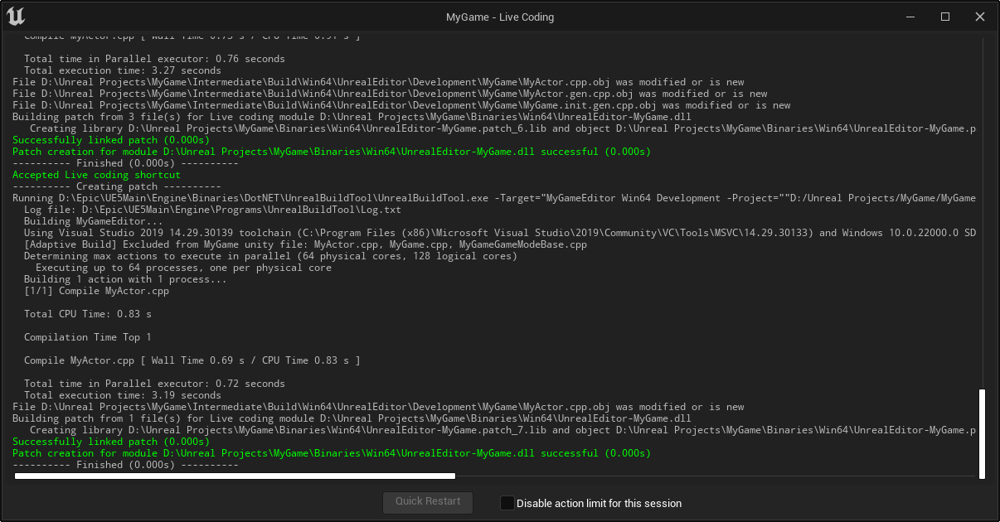
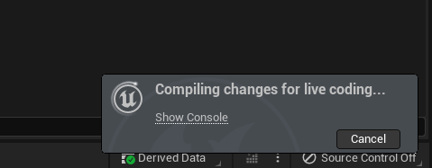
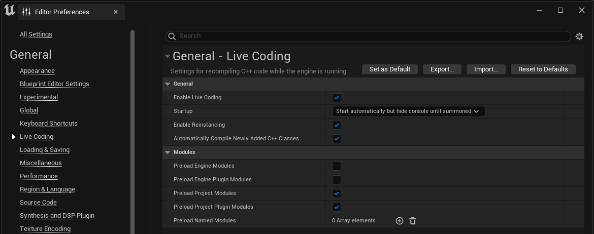
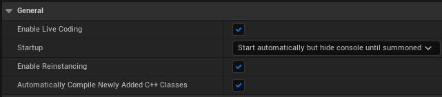
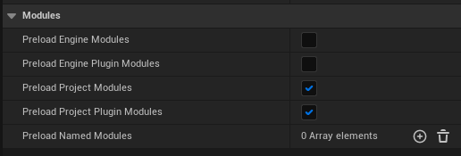

# Live Coding

> 路径：虚幻引擎5.7文档 / 用C++编程 / 开发设置 / Live Coding

> 原始页面：https://dev.epicgames.com/documentation/unreal-engine/using-live-coding-to-recompile-unreal-engine-applications-at-runtime

**虚幻引擎（UE）** 支持基于[Live++](https://liveplusplus.tech/index.html)的Live Coding方案。Live Coding系统可以在引擎运行的时候，重新编译你的应用的C++代码，并修正其二进制文件。该功能在以下情况下可用：

- 在虚幻编辑器中编辑你的应用。
- 用编辑器内游玩（PIE）运行你的应用。
- 在调试时运行附加到编辑器的应用程序打包的桌面构建。

这意味着你不需要中止游玩测试或者编辑器中的编写工作，就可以对C++的类进行修改，重新编译，然后立刻看到变动生效。这在使用C++运行时逻辑时对于迭代式开发非常有益，比如游戏代码或者前端用户交互。虽然 **热重载（Hot Reload）**系统仍然可用，但是Live Coding速度更快并且更加灵活。

## 如何使用Live Coding

所有的新版本虚幻引擎安装都默认启用Live Coding。当你打开IDE时Live Coding控制台会自动启动，但是处于隐藏状态。如果控制台隐藏了，它会在你启动Live Coding构建的时候打开。

Live Coding控制台为编译状态提供一个输出日志。这独立于通常的 **输出日志（Output Log）**，并且只显示Live Coding的构建信息。

要开始一个构建，在使用IDE或虚幻引擎时按下 **CTRL**+**ALT**+**F11**。一个通知信息会显示在屏幕右下角，显示构建的状态。在构建运行时，你可以继续在编辑器中工作或者测试项目，而不会受到干扰。

如果你的构建成功，将会立刻看到变动。

Live Coding在虚幻引擎打开时、在使用PIE时或者附加到你的原生桌面环境中的打包构建的时候都可用。在游戏主机或者移动设备上运行时不可用。

### 用Live Codeing修改变量的默认数值

修改变量的默认值时，`.cpp` 文件中应用的构建器所设置的数值不会在现有的对象实例中更新。然而，如果你在 `.h` 文件中进行修改，你将会看到变动。

## 配置

你可以在 **编辑器偏好（Editor Preferences）** > **通用（General）** > **Live Coding** 中找到Live Coding的相关设置。

### 通用Live Coding设置

**通用（General）** 设置控制Live Coding如何在你的开发环境中运作。

| 设置 | 描述 |
| --- | --- |
| 启用Live Coding（Enable Live Coding） | 启用时，Live Coding将作为虚幻编辑器的编译方法。如果停用，虚幻编辑器会后撤至使用热重载。 |
| 启动（Startup） | 控制虚幻编辑器启动时Live Coding如何运行，包括是否激活控制台或者令其可见。 |
| 启用重实例化（Enable Reinstancing） | 控制Live Coding是否使用对象重实例化。启用时，对象的实例会被替换，以此来让代码中的大型变动生效。我们不建议停用该设置，否则变动将会变动不稳定。更多细节请参考使用Live Coding进行对象重实例化小节。 |
| 自动编译新添加的C++类（Automatically Compile Newly Added C++ Classes） | 启用时，添加C++类将会自动令Live Coding将其编译并添加到应用。 |

### 模块

**模块（Modules）**部分决定在运行编辑器或者应用程序时为Live Coding预载哪些模块。这会让Live Coding在遍历这些模块时性能更快，但是预载的模块越多，启动编辑器或者游戏的时间就越长。

| 选型 | 描述 |
| --- | --- |
| 引擎模块（Engine Modules） | 虚幻引擎源代码中的模块。 |
| 引擎插件模块（Engine Plugin Modules） | 引擎安装目录中的插件所关联的模块，插件位于Engine/Plugins。 |
| 项目模块（Project Modules） | 当前项目源代码中的模块。这包括你的主要模块以及你在源目录中创建的任何额外模块。 |
| 项目插件模块（Project Plugin Modules） | 项目目录中的插件所关联的模块，插件位于（项目名称）/Plugins。 |

> [!NOTE]
> 你应该避免预载引擎模块，除非你要在引擎的源代码上进行迭代。

除了这几组模块，你还可以使用 **预载命名模块（Preload Named Modules）** 序列来指定要加载的模块。如果要在大型项目中使用几个特定的模块，或者要加载特定的引擎模块但不想加载整个引擎，该选项会非常有用。

> [!TIP]
> 更多关于使用模块的相关信息，请参考[虚幻引擎模块指南](https://dev.epicgames.com/documentation/404)。

## 使用Live Coding进行对象重实例化

**对象重实例化（Object Reinstancing）** 是一个额外的系统，用于在应用程序和编辑器中替代现有的对象实例。这意味着这些对象能够立刻参与Live Coding编译中大型的结构上的改变。重实例化的对象包括使用UCLASS、UFUNCTION、USTRUCT、UENUM和UDELEGATE宏，以及 **虚幻标题工具（Unreal Header Tool）** 用这些宏所生成的对象，比如蓝图节点。

对象重实例化默认启用。如果将其停用，Live Coding仍然能够轻松处理小型的代码修改，比如修改变量数值或者对现有函数进行小型变动。然而，如果对代码进行大型修改，比如增加新函数、新的变量组，或者进行重构，都会在不使用对象重实例化的情况下重新编译时产生不可预测的结果。这样通常会导致崩溃。

但是，启用对象重实例化时，你还需要执行额外的步骤来清理指针。如果你的代码仍然包含可以重实例化的对象上的指针，你需要使用 `ReloadReinstancingCompleteDelegate` 和 `ReloadCompleteDelegate` 来更新这些指针或者将缓存无效化，这样可以之后再重新使用它们。

热重载更能够承受重实例化的对象被错误地取消引用，但是Live Coding会在编辑器关闭时导致崩溃。这是由于任何已有类的析构函数都只能有一个版本，而没有清理干净的对象实例会导致旧版本的析构函数与重实例化的对象的新版本析构函数产生冲突。
