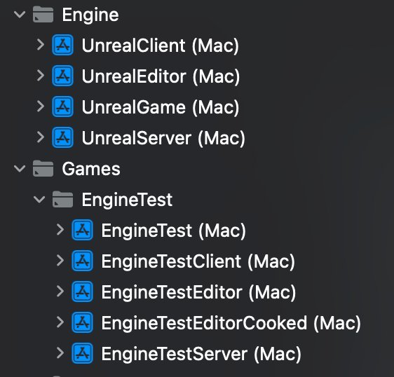
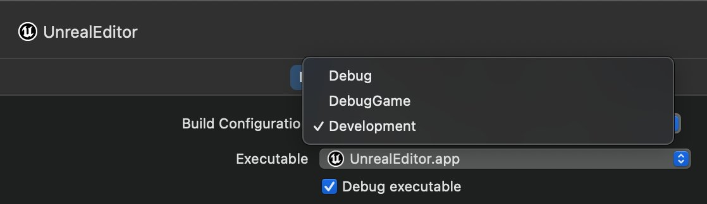
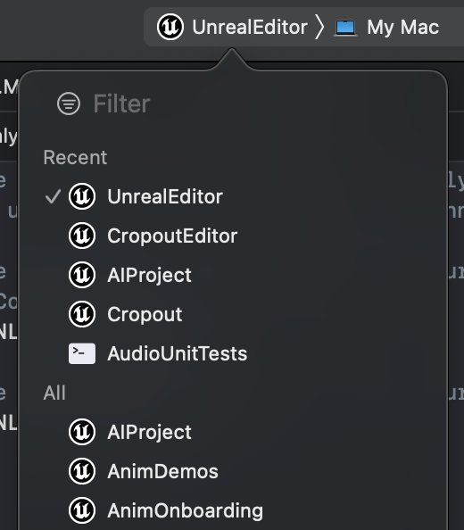
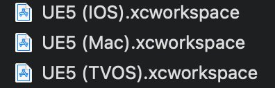
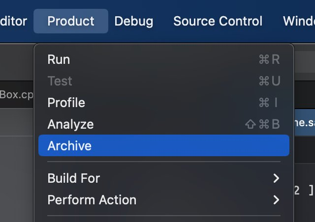
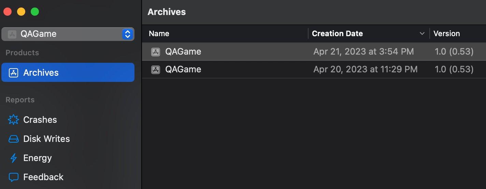
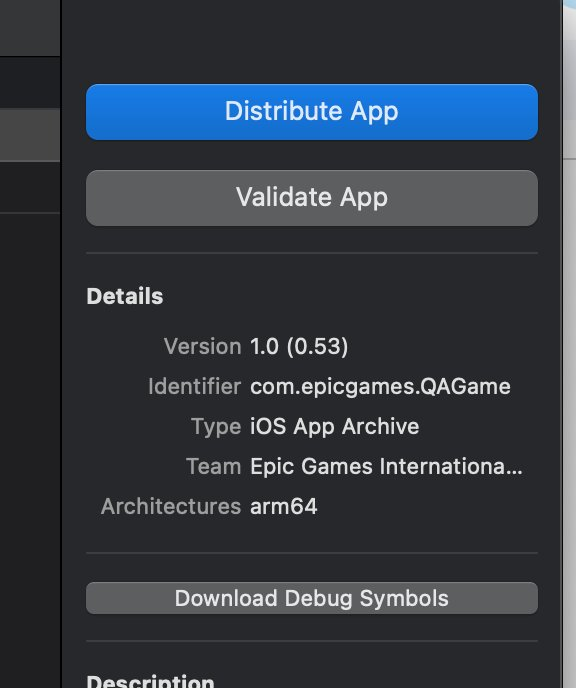
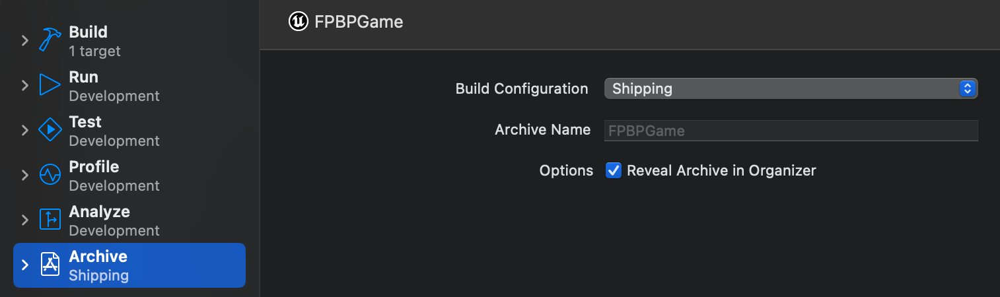

# 现代化Xcode工作流程

> 路径：虚幻引擎5.7文档 / 用C++编程 / 开发设置 / 现代化Xcode工作流程

> 原始页面：https://dev.epicgames.com/documentation/unreal-engine/using-modern-xcode-in-unreal-engine

**虚幻引擎（UE）**从5.3版本开始更新了虚幻引擎的Xcode项目工作流程，使其与标准的Xcode应用程序项目更加一致。 新的项目设置改善了Xcode开发人员的整理和编辑流程，并提供了Xcode中多种工具的访问权限，用于简化代码签名和配置，包括：

- 自动代码签名
- 管理权限
- 编辑`.plist`文件
- 标准Xcode框架处理

本页为从早期版本过渡到UE 5.3及更高版本（5.3+）的用户概述了不同版本间的差别。

## 先决条件

更新后的Xcode工作流程可用于UE 5.3及更高版本，并且默认对新项目启用。 如果你需要手动启用它，请遵循以下步骤：

1. 打开引擎的安装目录，打开`Engine/Config/BaseEngine.ini`，确保你设置了以下配置变量：

   Engine/Config/BaseEngine.ini

   C++

   ```
   [/Script/MacTargetPlatform.XcodeProjectSettings]     bUseModernXcode=true
   ```
2. 为引擎和项目重新生成你的Xcode项目文件。 如果你使用的是虚幻引擎的源代码版本，请在引擎安装目录中运行`GenerateProjectFiles.command`脚本，为虚幻引擎的源代码重新生成项目文件。 你应该在项目目录中看到三个Xcode工作空间文件：

   - `UE5 (Mac).xcworkspace`
   - `UE5 (TVOS).xcworkspace`
   - `UE5 (IOS).xcworkspace`

新的Xcode设置现已准备就绪。 以下各节将说明与旧项目设置相比新增的内容。

## 项目、方案和编译配置

以前，虚幻引擎的Xcode项目在**方案（Schemes）**下包含了**目标（Targets）**和**编译配置（Build Configurations）**。 例如，用户在单个项目（MyProject）下有一个"开发编辑器（Development Editor）"方案，用于构建编辑器目标的开发版本。

UE 5.3+为每个目标类型提供一个单独的Xcode项目（在同一个Xcode工作空间内）。 例如，一个名为"MyProject"的项目的Xcode工作空间将有分别用于MyProjectEditor、MyProjectGame、MyProjectClient和MyProjectServer的单独项目。



每个目标仅有其支持的构建配置。 例如，大多数编辑器不支持测试或发布配置，因此它们在编辑器项目下不可用。



更新的工作空间有大量方案。 浏览这些方案时，根据需要使用"筛选器"和"最近"分段来缩小列表范围。



## 一个平台，一个工作空间

以前在UE生成项目文件时，它会创建一个共用的工作空间，其中包括各个Apple平台的目标。

在UE 5.3+中，当UE生成项目文件时，它会为各个Apple平台创建一个单独的工作空间。



这简化了工作空间和项目，并且由于Xcode可以打开多个工作空间，你可以按Command + `（反引号）来切换平台。

每个工作空间仅包含支持该平台的目标，因此iOS和tvOS可用的方案较少。 它们的确有UnrealEditor目标，但无法成功构建。 相反，这些目标的存在是为了使源代码可用于搜索。

## 自包含式应用程序

以前的虚幻引擎会将运行iOS、iPadOS和tvOS应用程序所需的所有数据捆绑到其各自的`.app`文件中，使它们成为自包含式应用程序。 但是，macOS项目会将数据分割到`.app`、`Saved/Cooked/Mac`目录，以及引擎和项目目录中的其他位置中。

在UE 5.3+中，所有Mac平台使用相同的工作流程，将所需数据收集到一个位置，并将其捆绑到一个可以手动运行或使用Xcode运行的.app中。 要做到这一点，你需要在烘焙流程中使用暂存步骤。

> [!NOTE]
> 编辑器构建仍未经烘焙，并且包含在松散文件夹中。

## 打包和分发

macOS和iOS/tvOS/iPadOS的打包流程现在彼此间完全一致。

> [!NOTE]
> UE不再自动为iOS生成.ipa文件，因为它在macOS上不是必要的，只在Windows上有用。

### 分布

分发模式不再使用分发证书进行代码签名。 分发模式会创建一个标准的Xcode存档（`.xcarchive`）。你可以用该存档来将`.app`分发到各处目的地，比如App Store或你的团队。 在制作分发构建时，Xcode还会生成一个`.dSYM`文件放入Xcode存档，此文件适用于调试崩溃，还可以发送给Apple实时调试崩溃。 在将你的应用程序上传到Apple进行提交时，你同时也提交了你的`.dysm`文件。

> [!NOTE]
> 生成`.dSYM`文件需要数分钟时间。

要正常打包，请在虚幻编辑器中点击**平台（Platforms）** > **打包项目（Package Project）**，或在你的BuildCookRun命令行中添加`-package -clientconfig=Shipping`。

要打包以供分发，请在项目设置中勾选**分发（Distribution）**复选框，或在你的BuildCookRun命令行中添加`-package -clientconfig=Shipping -distribution`。

你也可以在Xcode中点击**产品（Product）** > **存档（Archive）**。



Xcode使用标准流程生成`.xcarchive`文件，包括引入暂存式目录和代码签名框架。 这使用的是发布配置，即使你将方案设置为开发（Development）也是如此。

如果在Xcode中使用存档，它会自动打开存档（Archives）窗口并选择新存档。 如果你使用其他虚幻引擎方法创建存档，则必须手动打开该窗口，方法是点击**窗口（Window） > 整理器（Organizer）**，然后选择你的项目和左上角的存档（Archives）按钮。



使用**存档（Archives）窗口**右侧的按钮**验证（Validate）**或**分发（Distribute）**你的应用程序。 你可以使用这种方法创建iOS的`.ipa`文件以供内部使用，按照各个选项的提示操作即可。 针对App Store的验证/分发，你必须在[appstoreconnect.apple.com](https://appstoreconnect.apple.com/)上制作一个App条目。



分发或验证应用程序时出现的提示可能会要求你选择分发证书或遵循其他配置步骤。 详情请参阅[Apple的文档](https://developer.apple.com/documentation/xcode/distribution)。

> [!NOTE]
> 在Xcode中进行存档使用的是发布（Shipping），因为对于UE生成的方案中的存档操作，这是默认配置。 此外，`-package -distribution`将在后台使用`archive` Xcode操作，而非`build`操作。
>
> 
>
> 如果测试需要，你可以在方案（Scheme）中更改它，但我们建议只分发发布版本。

### 在MacOS上配置应用程序的显示名称

应用程序的**显示名称**是指在制作存档构建时Mac的`.app`的名称。 在为分发打包（或使用Xcode中的存档菜单）时，显示名称就是用户在使用访达（Finder）时看到的`.app`的名称。 如果不设置此项，`.app`将使用`.uproject`文件的名称。 要在虚幻引擎5.3.2或更高版本中修改显示名称，请打开`MacEngine.ini`文件并设置配置变量`ApplicationDisplayName`：

MacEngine.ini

C++

```
[Xcode]	ApplicationDisplayName="Friendly Application Name"
```

> [!NOTE]
> `ApplicationDisplayName`与iOS使用的数据包显示名称不同，你需要为MacOS和iOS版应用程序分别配置该名称。

## 纯内容/纯蓝图项目

由于纯内容（或纯蓝图）项目没有Xcode项目或构建目标源文件，因此它们会重复使用来自引擎的通用UnrealGame目标，并结合项目特定数据来创建构建。

## 标准Xcode实践

更新后的Xcode工作流程使用Xcode根据标准Xcode工作流程处理尽可能多的组件，包括：

- 代码签名。
- `.plist`文件。
- 权限文件。
- 框架。

### 代码签名

以前只有iOS/iPadOS/tvOS需要代码签名。 自2023开始，Apple还要求macOS使用代码签名。 更新后的工作流程默认为所有平台使用Xcode的**自动代码签名（Automatic Codesigning）**功能。

要使用自动代码签名，请执行以下步骤：

1. 在Xcode中登录你的Apple开发者账号。
2. 打开项目设置（Project Settings），然后找到平台（Platforms）> Xcode项目（Xcode Projects），并设置以下属性：

   > 图片已省略：Xcode项目的项目设置

| 设置名称 | 控制台变量 | 说明 |
| --- | --- | --- |
| 使用现代代码签名（Use Modern Code Signing） | `bUseModernCodeSigning` | 为你的UE项目启用自动代码签名。 需要设置以下两个设置。 |
| 现代签名前缀（Modern Signing Prefix） | `ModernSigningPrefix` | 将你公司域名的词顺对调后形成的域名。 例如：`com.epicgames`。 UE会将其与项目名称结合起来，为你的游戏创建合成ID，除非你在plist中重写它。 请参阅下文的元数据（Metadata）了解详情。 |
| 现代签名团队（Modern Signing Team） | `ModernSigningTeam` | 你的应用程序在签名时使用的团队ID。 这与Xcode的签名和功能（Signing and Capabilities）部分中的团队ID相同。 请参阅下文的"查找团队ID"了解详情。 |

### 查找团队ID

要查找用于现代签名团队（Modern Signing Team）设置的团队ID，请打开[Apple开发者](https://developer.apple.com/account)页面，登录你的账号，然后点击**会员资格详细信息（Membership Details）**。 界面上将显示你的团队ID。

> 图片已省略：Xcode中的团队ID设置项

### .plist文件

所有应用程序都需要包括一个内嵌的`.plist`文件。 最终的`.plist`文件通常由一个部分（模板）制成，Xcode会根据Xcode项目设置修改该模板。 由于UE生成Xcode项目，这会是一个较为复杂的过程。

更新后的Xcode工作流程提供对`.plist`文件处理的高级控制。 此外，现在还支持在Xcode中编辑`.plist`的设置

> [!WARNING]
> 如果你编辑了`.plist`设置，默认将丢失iOS的更改。 详情请参阅下文的"MacOS与iOS"小节。

#### 模板与预制

Xcode更倾向于在应用程序中使用虚幻引擎生成的Xcode项目中的设置来完成`.plist`文件。 但虚幻引擎也支持预制的`.plist`文件，而Xcode不会修改这种文件。 这是一个高级功能，因此它不会在Xcode项目设置中显示，并且需要编辑配置文件。 如需相关说明，请参阅下文的"使用预制`.plist`"小节。

项目设置中的`.plist`设置（即`Mac Target Info.plist`和`IOS Target Info.plist`条目）让你可以指定默认的模板`.plist`或你自己的自定义模板`.plist`。

`Template.plist`文件的默认位置在你项目的`Build/IOS`目录中。 当虚幻引擎为你的项目生成Xcode项目文件时，它会查看你的项目中是否有模板`.plist`文件，如果没有，它将从引擎中复制一个`.plist`到你的项目文件夹。

> [!WARNING]
> 如果你在Xcode中编辑`.plist`的设置，且该设置指向虚幻引擎安装目录（而不是项目目录）中的`.plist`文件，则Xcode会将其标记为可写并修改它。所有使用该安装的虚幻引擎项目都会受到影响。 这就是虚幻引擎会把引擎的`.plist`文件复制到你的项目中的原因。 你可能会需要对比未来引擎版本的`.plist`文件，以查看我们是否更新了默认设置。
>
> 如果更新了，请参阅下文"将.plist恢复成默认值"小节。

UnrealEditor目标有唯一的`.plist`，因为`.app`在所有项目中共享。 大多数用户都不会遇到这个问题。

##### 使用预制.plist

如果你要使用预制的`.plist`文件，请修改你的`DefaultEngine.ini`文件，并将以下一项或两项设置更改为指向你要使用的文件的路径：

DefaultEngine.ini

C++

```
[/Script/MacTargetPlatform.XcodeProjectSettings]	PremadeMacPlist=(FilePath="/Game/Build/Mac/Resources/MyGameMac.plist")	PremadeIOSPlist=(FilePath="/Game/Build/IOS/Resources/MyGameIOS.plist")
```

#### 将.plist恢复为默认值

你还可以使用**将Info.plist恢复为默认值（Restore Info.plist to default）**按钮，将引擎目录的Mac默认模板`.plist`文件重新复制到你的项目，并设置合适的值。 如果你要在未来的虚幻引擎版本中使用更新后的默认`.plist`文件，这种方法将很有用。

你可以从生成的应用程序中取出`.plist`文件，并使用该文件作为预制`.plist`的源。

#### 隐私清单

Xcode使用**隐私清单（Privacy Manifests）**来总结你的应用程序收集了哪些关于用户的数据，以及为什么收集这些数据。 这包括你自己的代码收集的数据以及你使用的第三方SDK收集的数据。 当你分发应用程序时，Xcode会将SDK和应用程序的隐私清单合并为一份隐私报告，从而轻松地向用户提供关于该应用程序隐私实践的透明信息。

虚幻引擎在以下位置提供了默认的隐私清单：

- **MacOS**：`Engine/Build/Mac/Resources/UEMetadata/PrivacyInfo.xcprivacy`
- **iOS、tvOS和iPadOS**：`Engine/Build/iOS/Resources/UEMetadata/PrivacyInfo.xcprivacy`

使用其他隐私功能的项目需要在其虚幻引擎项目设置指定的位置提供额外的`PrivacyInfo.xcprivacy`文件。 默认情况下，这些位置是：

- **MacOS**：`/Game/Build/Mac/Resources/PrivacyInfo.xcprivacy`
- **iOS、tvOS和iPadOS**：`/Game/Build/IOS/Resources/PrivacyInfo.xcprivacy`

如需了解详情，请参阅[Apple关于隐私清单的文档](https://developer.apple.com/documentation/bundleresources/privacy_manifest_files/describing_data_use_in_privacy_manifests)。

#### MacOS与 iOS

在新的Xcode工作流程中，.plist文件的使用方式在macOS和iOS之间有所不同，因为针对生成iOS的`.plist`文件，虚幻编译工具（UBT）具有深度的嵌入式逻辑。 这种逻辑无法带到项目生成器/Xcode中。

如果你查看UBT的默认设置，你会发现它指向`/Game/Build/IOS/UBTGenerated/Info.Template.plst`,这意味着UBT每次运行时都可能更改iOS`.plist`文件的内容。

但你可以更改项目设置以使用你的模板（或预制）`.plist`文件，从而忽略UBT生成的内容。 如果这么做，你将可以使用Xcode编辑`.plist`文件。

下表概述了Mac和iOS的`.plist`文件的不同之处：

|  | Mac | iOS |
| --- | --- | --- |
| **默认.plist** | 从引擎目录复制的模板。 | UBT生成的模板。 |
| **Xcode .plist修改** | 是（Yes） | 如果使用UBT生成的模板，则为否 |

### 权限

每个应用程序会将权限指派为代码签名的一部分。 权限会控制某些Apple制造的功能或限制，如GameCenter支持或在Mac安全沙盒中运行。

虚幻引擎的Xcode项目生成处理权限的方式类似于处理上述（Mac）`.plist`文件的方式。 UE会生成Xcode项目，如果项目的默认位置没有权限文件，则从引擎目录复制默认文件。 然后你可以使用Xcode（或文本编辑器）修改权限，这些权限位于你项目的`Build/Mac/Entitlements`或`Build/IOS/Entitlements`目录下。

如果你向最终用户发布的内容中有不同的沙盒限制或其他差异，你可以为发布和开发设置单独的权限。 如果你不需要单独的功能，应将发布和开发指向同一文件。

> [!NOTE]
> 目前只有Mac权限在项目设置中公开。

以下是macOS和iOS的默认权限设置：

| 权限设置项 | Mac | iOS |
| --- | --- | --- |
| 默认开发（Default Development） | 沙盒化，允许客户端/服务器网络连接。 | 未设置特殊权限。 |
| 默认发布（Default Shipping） | 沙盒化，允许客户端网络连接。 | 未设置特殊权限。 |

> [!NOTE]
> 蹦扩报告器不兼容启用了沙盒资格的打包游戏（此为UE 5.3及更新版本中的默认设置）。

### 框架

框架是用于收集头文件、库和内容的Xcode系统。 新的Xcode工作流程现在使用标准Xcode方法处理框架，而不是像之前的工作流程一样手动进行复制和代码签名。 当UE生成Xcode项目时，它会使用构建系统找到各个构建源文件中设置的引用框架。 然后它会将Xcode项目设置为将动态库和内容复制到应用程序包中，并根据需要进行代码签名。

### 访问日志

根据你的沙盒设置及运行应用程序的方式，日志文件可能出现在不同位置：

- 如果启用了沙盒：

  - 通过xcode运行：~/Library/Logs/[项目名称]
  - 通过双击或使用终端运行：~/Library/Containers/[你的应用程序的数据包ID]/Data/Library/Logs
- 如果禁用了沙盒：

  - ~/Library/Logs/[项目名称]
