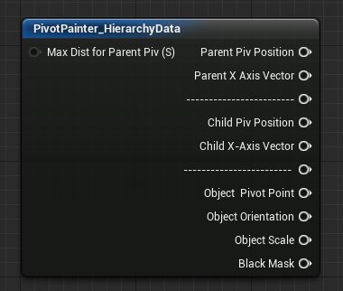
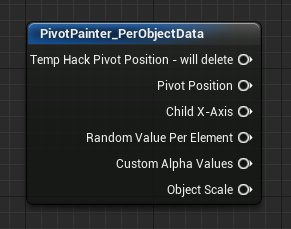
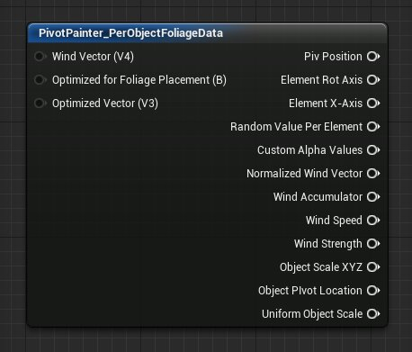
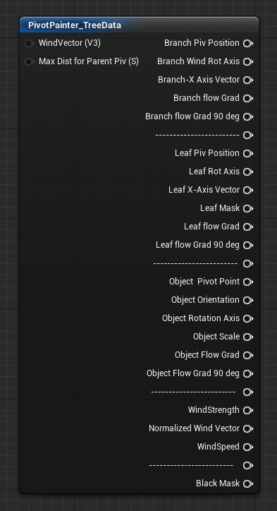

# 枢轴点绘制器工具1.0材质函数

> 路径：虚幻引擎5.7文档 / 设计视觉、渲染和图形效果 / 渲染相关的美术工具和流程 / 枢轴点绘制工具 / 枢轴点绘制器工具1.0 / 枢轴点绘制器工具1.0材质函数

> 原始页面：https://dev.epicgames.com/documentation/unreal-engine/painter-tool-1.0-material-functions-in-unreal-engine

**枢轴点绘制器** 材质函数使你能够接入[枢轴点绘制器 MAXScript](../../../../artists-tools-and-workflows-for-rendering/pivot-painter-tool/index.md)，后者将旋转信息存储在网格的顶点中。这种方法非常适合于处理静态网格上的动态运动。

虽然没有这些函数也可以利用枢轴点绘制器所提供的数据，但这些函数确实让使用过程更为简单。

## 枢轴点绘制器函数

以下是"枢轴点绘制器"类别下所有函数的列表。

这些函数可以处理并组织枢轴点绘制器 MAXScript 存储在模型 UV 中的全局位置及角度信息。

### PivotPainter_HierarchyData（枢轴点绘制器_层次结构数据）

这个特定的函数专门用来处理对象层次结构。

| 项目 | 说明 |
| --- | --- |
| 输入 |  |
| **父代枢轴点的最大距离（标量）（Max Dist for Parent Piv (Scalar)）** | 这个值应该与绘制资产时 MAXScript 旋钮"父代枢轴点的最大距离"（Max Dist for Parent Piv）中使用的值匹配。 |
| 输出 |  |
| **父代枢轴点位置（Parent Piv Position）** | 返回全局空间中每个父代的枢轴点信息。子代将返回其所连接的父代的枢轴点信息。 |
| **父代 X 轴矢量（Parent X Axis Vector）** | 返回指向父代 X 轴的规范化矢量。 |
| **子代枢轴点位置（Child Piv Position）** | 返回全局空间中每个子代的枢轴点位置信息。父代将返回值 (0,0,0)。 |
| **子代 X 轴矢量（Child X-Axis Vector）** | 返回指向父代 X 轴的规范化矢量。 |
| **对象枢轴点（Object Pivot Point）** | 对象枢轴点的位置。 |
| **对象方向（Object Orientation）** | 对象的方向。 |
| **对象比例（Object Scale）** | 对象的比例。 |
| **对象黑色蒙版（Object Black Mask）** | （当前不工作）返回由枢轴点绘制器工具绘制为黑色的表面的黑色值。 |

> [!NOTE]
> 标有 "-----------------" 的输出是列表中的分隔符，不应使用。

### PivotPainter_PerObjectData（枢轴点绘制器_每个对象的数据）

这个特定的函数设计成逐个对象地进行处理。

| 项目 | 说明 |
| --- | --- |
| 输出 |  |
| **枢轴点位置（Pivot Position）** | 返回全局空间中每个元素的枢轴点信息。 |
| **子代 X 轴（Child X-Axis）** | 返回指向元素 X 轴的规范化矢量，它从枢轴点指向网格的平均中心。 |
| **每个元素的随机值（Random Value Per Element）** | 返回每个元素的随机值（处于 0-1 范围内）。 |
| **定制阿尔法值（Custom Alpha Values）** | 返回模型的顶点阿尔法通道中存储的定制衰减值。 |
| **对象比例（Object Scale）** | 返回与对象的统一比例相等的比例值。 |

### PivotPainter_PerObjectFoliageData（枢轴点绘制器_每个对象的植物叶子数据）

此函数专门用于处理个别植物叶子对象。

| 项目 | 说明 |
| --- | --- |
| 输入 |  |
| **风矢量（矢量 4）（Wind Vector (Vector4)）** | 接收风向及量级的传入矢量。 |
| **针对植物叶子布局进行优化（静态布尔值）（Optimized for Foliage Placement (StaticBool)）** | 如果你已使用枢轴点绘制器在选中"针对植物叶子布局进行优化"（Optimize for Foliage Placement）选项的情况下处理网格，请设置为 *true*。默认值为 *false*。 |
| **优化矢量（矢量 3）（Optimized Vector (Vector3)）** | 请输入要用作元素旋转轴的局部矢量。仅当 *针对植物叶子布局进行优化（Optimized for Foliage Placement）*输入设置为 *true* 时，此输入才有效。 |
| 输出 |  |
| **枢轴点位置（Piv Position）** | 返回全局空间中每个元素的枢轴点信息。 |
| **元素旋转轴（Element Rot Axis）** | 返回要与 "RotateAboutAxis"（绕轴旋转）节点配合使用的分支旋转轴。叶子将返回相同的信息。注：角度是通过将矢量沿着分支 X 轴从局部空间转换到全局空间来确定的。然后，确定风向与所转换矢量之间的矢量积。 |
| **元素 X 轴（Element X-Axis）** | 返回指向元素 X 轴的规范化矢量。这个矢量从枢轴点指向网格的平均中心。 |
| **每个元素的随机值（Random Value Per Element）** | 返回每个元素的随机值（处于 0-1 范围内）。 |
| **定制阿尔法值（Custom Alpha Values）** | 返回模型的顶点阿尔法通道中存储的定制衰减值。 |
| **规范化风矢量（Normalized Wind Vector）** | 风向及量级的矢量（规范化到 0-1）。 |
| **风速（Wind Speed）** | 输出风速乘以时间再乘以 -1。 |
| **风力（Wind Strength）** | 返回风力。风矢量的量级是通过计算从风矢量到 0 的距离来确定的。 |
| **对象比例 XYZ（Object Scale XYZ）** | 返回与对象的统一比例相等的比例值。 |
| **统一对象比例（Uniform Object Scale）** | 返回与对象的统一比例相等的比例值。 |

### PivotPainter_TreeData（枢轴点绘制器_树数据）

以 *树（tree）*开头的输出用于处理由枢轴点绘制器 MAXScript 存储的模型 UV 信息。以 *叶（Leaf）*开头的输出用于处理由脚本中每个对象的枢轴点描画部分存储的 UV 信息。

| 项目 | 说明 |
| --- | --- |
| 输入 |  |
| **风矢量（矢量 3）（WindVector (Vector3)）** | 这是风向。 |
| **父代枢轴点的最大距离（标量）（Max Dist for Parent Piv (Scalar)）** | 这个值应该与绘制资产时 MAXScript 旋钮"父代枢轴点的最大距离"（Max Dist for Parent Piv）中使用的值匹配。 |
| 输出 |  |
| **分支枢轴点位置（Branch Piv Position）** | 返回全局空间中每个分支的枢轴点信息。叶子将返回其所连接的分支的枢轴点信息。 |
| **分支风旋转轴（Branch Wind Rot Axis）** | 返回要与 "RotateAboutAxis"（绕轴旋转）节点配合使用的分支旋转轴。叶子将返回相同的信息。注：角度是通过将矢量沿着分支 X 轴从局部空间转换到全局空间来确定的。然后，确定风向与所转换矢量之间的矢量积。 |
| **分支 X 轴矢量（Branch X-Axis Vector）** | 返回指向分支 X 轴的规范化矢量。除非定制矢量计算需要此输入，否则植物叶子动画通常不需要此输入。 |
| **分支流梯度（Branch Flow Grad）** | 返回风向中的梯度值。 |
| **分支流梯度旋转 90 度（Branch Flow Grad 90 Deg）** | 返回全局空间中与风向之间存在 90 度夹角的梯度值。 |
| **叶子枢轴点位置（Leaf Piv Position）** | 返回全局空间中每个叶子的枢轴点位置信息。分支将返回值 (0,0,0)。 |
| **叶子旋转轴（Leaf Rot Axis）** | 返回要与 "RotateAboutAxis"（绕轴旋转）节点配合使用的叶子旋转轴。分支将返回 (0,0,0)。注：角度是通过将沿着叶子 X 轴的矢量从局部空间转换到全局空间来确定。然后，确定风向与所转换矢量之间的矢量积。 |
| **叶子 X 轴矢量（Leaf X-Axis Vector）** | 返回指向分支 X 轴的规范化矢量。除非定制矢量计算需要此输入，否则植物叶子动画通常不需要此输入。 |
| **叶子蒙版（Leaf Mask）** | 对于叶子，返回白色的蒙版。所有分支均为黑色。 |
| **叶子流梯度（Leaf Flow Grad）** | 返回风向中的梯度值。 |
| **叶子流梯度旋转 90 度（Leaf Flow Grad 90 deg）** | 返回全局空间中与风向之间存在 90 度夹角的梯度值。 |
| **对象枢轴点（Object Pivot Point）** | 返回对象的枢轴点位置。 |
| **对象方向（Object Orientation）** | 返回对象的方向。 |
| **对象旋转轴（Object Rotation Axis）** | 返回对象的旋转轴。 |
| **对象比例（Object Scale）** | 返回对象的比例。 |
| **对象流梯度（Object Flow Grad）** | 与全局空间中对象级别的风矢量一致的梯度。 |
| **对象流梯度旋转 90 度（Object Flow Grad 90 deg）** | 与全局空间中对象级别的风矢量一致并旋转 90 度的梯度。 |
| **风力（WindStrength）** | 返回风力。风矢量的量级是通过计算从风矢量到 0 的距离来确定的。 |
| **规范化风矢量（Normalized Wind Vector）** | 返回量级介于 0 与 1 之间的规范化风矢量。 |
| **风速（WindSpeed）** | 风速乘以时间。 |
| **黑色蒙版（Black Mask）** | 返回由枢轴点绘制器工具绘制为黑色的表面的黑色值。此蒙版仅在顶点着色器中工作。 |

> [!NOTE]
> 标有 "-----------------" 的输出是列表中的分隔符，不应使用。
