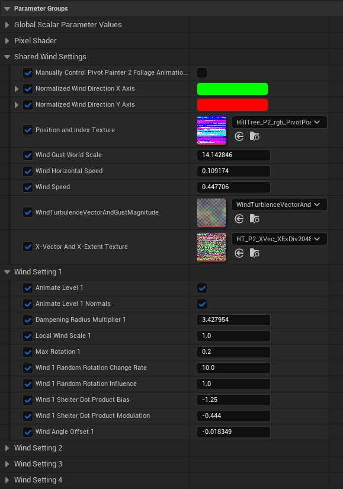

# 枢轴绘制器工具2.0材质函数

> 路径：虚幻引擎5.7文档 / 设计视觉、渲染和图形效果 / 渲染相关的美术工具和流程 / 枢轴点绘制工具 / 枢轴点绘制器工具2.0 / 枢轴绘制器工具2.0材质函数

> 原始页面：https://dev.epicgames.com/documentation/unreal-engine/painter-tool-2.0-material-functions-in-unreal-engine

枢轴绘制器2的材质函数可以访问和解码枢轴绘制器2 MAXScript存储在纹理中的有用模型信息。MAXScript输出的每个纹理都可以在材质中直接引用，但是如果在采样纹理之后没有应用适当的步骤，那么这些值将不正确。本页中给出的这些材质函数可让您轻松快速解码纹理信息。

本页中包含的很多材质函数都可以使用枢轴绘制器2枢轴和旋转信息在您的材质中生成特定的效果，然而， 枢轴绘制器2的更大的好处之一是它容易与提供的植物样本着色器 **PivotPainter2FoliageShader** 配合使用。该特定材质函数使您能够简化您的模型设置流程，其枢轴绘制器2生成的纹理可以被用于您的植被材质，以快速创建风和湍流，而无需创建您自己的材质网络。

## 枢轴绘制器2函数

以下是与枢轴绘制器2.0相关的所有函数的列表。

### PivotPainter2FoliageShader

此材质函数包含纹理和数值参数，这些参数应加以修改以适合您的特定资源。

#### PivotPainter2FoliageShader工作流

对于此特定函数，您应该为您的材质创建一个材质实例，这样您就可以访问材质函数已经设置好的关于风吹和湍流的参数。

此外，对于此特定函数，建议您创建一个材质实例，其中材质函数的参数将可用于对枢轴绘制器2着色器进行更改。

点击查看大图

| 项目 | 说明 |
| --- | --- |
| 输入 |  |
| **材质属性（Material Attributes）** | 确保您在材质中使用了切线空间法线，并且 **使用切线空间法线（Use Tangent Space Normals）** 选项未选中。法线将在内部转换为世界场景空间。 |
| **枢轴绘制器纹理坐标（Pivot Painter Texture Coordinate）** | 获取一个输入来引用正在使用的纹理坐标UV。 |
| 输出 |  |
| **具有世界场景法线的最终材质（Final Material with World Space Normals）** | 如果材质实例启用了 **Animate Level "X" Normals**，它将输出材质属性以取代输入材质属性的世界场景位置偏移和法线输出。 更新模型的法线开销非常高昂，可以有选择的执行。 |
| **修改的世界场景空间法线组件（Modified World Space Normal Component）** | 它输出本身返回修改后的资源法线。 |
| **世界场景位置偏移组件（World Position Offset Component）** | 它输出返回新世界场景位置偏移值。 |

### ms_PivotPainter2_CalculateMeshElementIndex

此材质函数从模型的UV中提取模型的元素ID。

| 项目 | 说明 |
| --- | --- |
| 输入 |  |
| **数据纹理维度（Data Texture Dimensions）** | 使用纹理属性节点来收集纹理的维度。 |
| **枢轴绘制器UV坐标（Pivot Painter UV Coordinates）** | 从模型的UV中提取模型元素ID。 |
| 输出 |  |
| **索引（Index）** | 此输出从模型的UV中提取模型元素ID。 |

### ms_PivotPainter2_Decode8BitAlphaAxisExtent

此材质函数将8位轴扩展纹理数据信息从枢轴绘制器2 MAXScript重新缩放到世界场景空间数据中。

| 项目 | 说明 |
| --- | --- |
| 输入 |  |
| **8位Alpha扩展值（8 Bit Alpha Extent Value）** | 从具有8位alpha扩展值的纹理中插入枢轴绘制器2 alpha纹理组件。这可以通过在渲染选项（Render Options）下的枢轴绘制器2 MAXScript中的alpha输出下拉选项内选择适当的选项来生成。 |
| 输出 |  |
| **重新缩放扩展（Rescaled Extent）** | 此输出值表示所选模型从对象的轴心点开始沿给定轴的长度。返回值可以8为增量表示8到2048之间的值。 |

### ms_PivotPainter2_DecodeAxisVector

此材质函数将枢轴绘制器2的局部空间矢量信息转换为世界场景空间矢量。

| 项目 | 说明 |
| --- | --- |
| 输入 |  |
| **轴矢量RGB（Axis Vector RGB）** | 从输出这些值的从枢轴绘制器2纹理中输入RGB矢量信息。 |
| 输出 |  |
| **结果（Result）** | 输入轴矢量信息现在已经转换到世界场景空间。 |

### ms_PivotPainter2_DecodePosition

此材质函数将枢轴绘制器2的局部空间信息转化为世界场景位置信息。

| 项目 | 说明 |
| --- | --- |
| 输入 |  |
| **位置RGB（Position RGB）** | 插入包含枢轴绘制器2 **枢轴位置（16位）** 数据的纹理的RGB值。 |
| 输出 |  |
| **结果（Result）** | 由于轴心点位置被枢轴绘制器2所捕获，因此输出值为每个模型的轴心点位置的世界场景空间位置。 |

### ms_PivotPainter2_ReturnParentTextureInfo

此材质函数使用枢轴绘制器2的 **父级索引（整数视为浮点数）** 纹理数据读取父级子对象的纹理数据。

| 项目 | 说明 |
| --- | --- |
| 输入 |  |
| **父级索引视为浮点数（Parent Index As Float）** | 此输入假设数据均以浮点形式表示。如果您正在从父级索引"整数存储为浮点数"纹理中读取数据，那么请首先使用材质函数 **ms_PivotPainter2_UnpackIntegerAsFloat** 对资源进行解码。 |
| **纹理维度（Texture Dimensions）** | 纹理的当前维度。 |
| **当前索引（Current Index）** | 只有当您想确定该资源是否是另一个组件的子项时，才需要提供此值。 |
| 输出 |  |
| **父级UV（Parent UVs）** | 它输出元素的父元素像素位置的UV坐标。 |
| **是否为子项？（Is Child?）** | 如果对象是另一个对象的子项，则返回1。否则返回0。这要求在 **当前索引（Current Index）** 输入中输入当前索引。如果您正在使用模型的UV引用纹理，则可以使用 **ms_PivotPainter2_CalculateMeshElementIndex** 找到当前索引。 |

### ms_PivotPainter2_UnpackIntegerAsFloat

此材质函数对枢轴绘制器2的 **整数视为浮点数（Integer as Float）** 纹理数据进行解码。

| 项目 | 说明 |
| --- | --- |
| 输入 |  |
| **整数视为浮点数（Integer as Float）** | 此函数将对整数数据进行解码，以便将其转换为浮点数据。 |
| 输出 |  |
| **结果（Result）** | 此函数将输出枢轴绘制器整数作为浮点数据。 |
