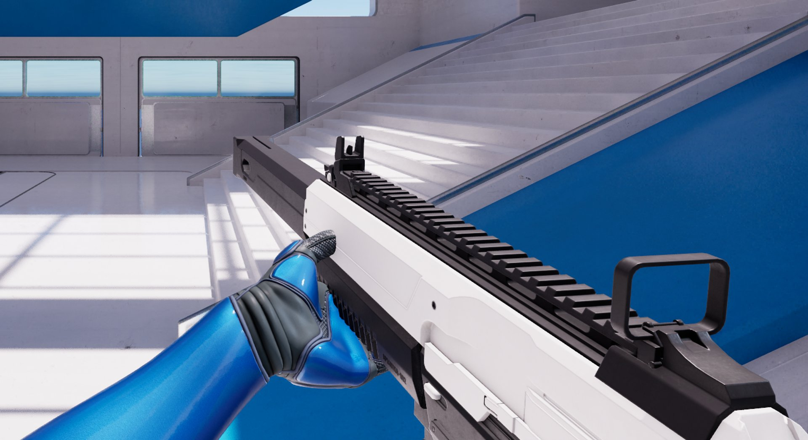
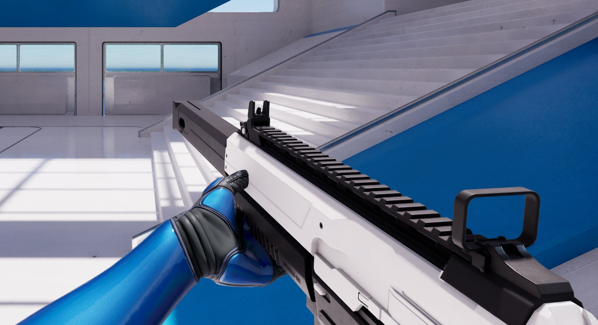
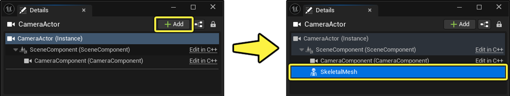
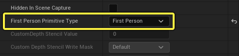
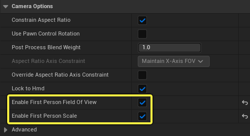
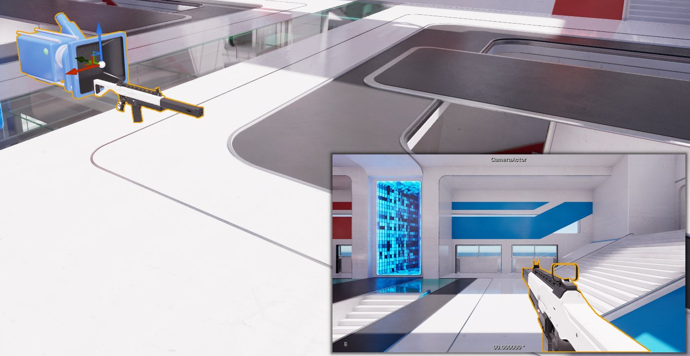
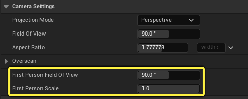
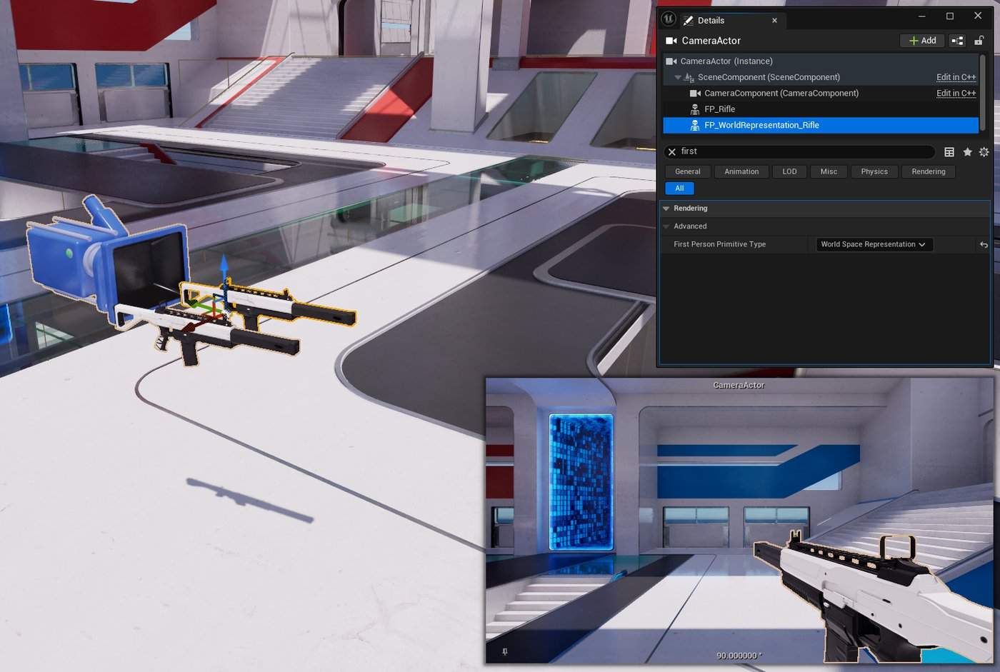

# 第一人称渲染

> 路径：虚幻引擎5.7文档 / 设计视觉、渲染和图形效果 / 渲染的通用功能 / 第一人称渲染

> 原始页面：https://dev.epicgames.com/documentation/unreal-engine/first-person-rendering

原生第一人称渲染支持使用第一人称摄像机视角创造体验时经常需要用到的功能，例如只渲染特定的对象，而渲染这些对象时所处的视野不同于渲染场景其余部分时所处的视野。 例如，第一人称渲染最为适合渲染角色的手、手臂或武器，这样当你靠近墙壁时，它们就不会与墙壁发生穿模（即伸入墙壁中）。

第一人称渲染提供了以下功能：

- 使用自定义视野（FOV）渲染第一人称图元。
- 为第一人称图元应用比例因子，使其在接近摄像机时能有效地缩小，从而避免大部分情况下第一人称几何体与场景相交的问题（即通常所说的穿模）。 这使得第一人称图元能始终在场景最上方渲染。
- 提供了完整的投影解决方案，在此方案中，第一人称几何体可以接收场景阴影，并为自身投射阴影，让玩家可以看到自己的阴影被投射到场景中。
- 集成[硬件光线追踪](../../../building-virtual-worlds/lighting-the-environment/ray-tracing-and-path-tracing-features/hardware-ray-tracing/index.md)（HWRT），让玩家可以看到自己在场景中的反射，同时让玩家可以投射光线追踪阴影。
- 与材质的整合：

  - 针对第一人称效果的逐顶点控制。 这种可选输出支持在世界空间和所谓的第一人称空间之间进行插值。 当需要让几何体的某些部分处于世界空间以实现与世界的衔接时，例如让角色的脚踩在地面上，该功能将非常实用。
  - 使用材质图表即可查询第一人称渲染参数，并将世界空间的任意位置变换为第一人称空间的位置。

- 这一点对大多数类型的图元都适用。 包括静态网格体、蒙皮网格体以及[Niagara粒子效果](../../../visual-effects/index.md)。

## 第一人称渲染的实现

在开发第一人称游戏时，你通常会希望玩家摄像机能够以自定义的视野渲染第一人称几何体，同时使其不与世界相交。 虚幻引擎对第一人称渲染的实现可以看作是对第一人称几何体进行变形，使其获得所需的自定义视野效果，并具有防穿模的行为。 这种变形发生在应用世界位置偏移之后，但先于顶点被投影到裁剪空间（Clip Space）内。

严格来说，这导致几何体存在于世界空间中，但在大多数情况下，它的渲染看起来就像是使用了不同的投影矩阵。 注意，这时的几何体非常小，而且略有倾斜。 这样做是为了改善从摄像机角度看到的效果，但这并不适合其他视角，因此不应在场景中投射阴影，也不应在硬件光线追踪反射中可见，而这一点是特意避免的。

以这种方式实现第一人称渲染的优势在于，它让第一人称图元能够与其他图元在同一通道中渲染，这样就不需要额外的渲染通道，也降低了复杂性，从而避免了对内存和性能产生影响。

### 第一人称图元设置

当**第一人称图元类型（First Person Primitive Type）**为**第一人称（First Person）**或**世界空间表示（World Space Representation）**时，组件会包含一个设置，而该设置会决定第一人称摄像机渲染组件的方式。

针对图元的第一人称设置。

此设置项的选项如下：

- **无（None）**：图元不与第一人称渲染交互。
- **第一人称（First Person）**：该图元以第一人称渲染，并受摄像机的第一人称视野（First Person Field of View）和第一人称比例（First Person Scale）属性的影响。这些属性用于以不同的视野和较小的深度范围渲染组件，从而避免与场景穿模。 该图元不会向场景投射阴影，在光线追踪世界中也不可见。
- **世界空间表示（World Space Representation）**：该图元代表世界空间中的第一人称图元。 该图元对其他玩家可见，用于将阴影投射到地面上，也可产生硬件光线追踪的反射等效果。 但该图元对其所属的第一人称摄像机不可见。 这实际上会在幕后将"投射隐藏阴影（Cast Hidden Shadow）"设置为false，同时将"所有者看不到"（Owner No See）设为true。而这对第一人称阴影能够正常使用虚拟阴影贴图而言是必须的。

### 第一人称阴影

使用第一人称渲染设置玩家角色时，你需要考虑两点关于投影的事项：

- 启用光源投射阴影，从而让被设为第一人称的图元能为自身投射阴影。
- 设置那些作为第一人称图元在世界空间中的表示形式的组件，以支持场景阴影和反射效果。

#### 第一人称自身阴影

**第一人称自投影**是一种投影解决方案，专门针对在第一人称视角下渲染的图元。 该方案能让这些第一人称图元对自身投射阴影，例如武器对自身和玩家的手臂投射阴影，但不对场景投射阴影。 这可以防止在第一人称摄像机视角下变形和倾斜的几何体在场景阴影中可见。

目前，第一人称自投影是通过屏幕空间追踪来实现的。 虽然这种方法的成本很低，但它仅支持屏幕上的阴影投射物。 对大多数第一人称设置来说，这在实践中并不构成问题，因为所有相关的阴影投射物通常都位于屏幕上。 请记住，屏幕空间渲染的其他典型限制也适用于第一人称渲染，例如单层深度缓冲区（即光线可能会穿透几何体）。

下图为使用定向光源且启用第一人称自身阴影的示例。

第一人称自身阴影：禁用

第一人称自身阴影：启用

第一人称自阴影目前（截至虚幻引擎5.6）由控制台变量控制。 这样做是为了方便在存在大量光源的地图中控制其效果。 只有当光源与第一人称几何体重叠时，该效果才会真正地产生性能开销，因此若几乎不存在重叠的光源，那么你完全可以为所有局部光源启用该效果。 不过我们可能会在将来改变该功能当前的控制方法。要设置第一人称自身阴影，请执行以下步骤：

1. 将`r.FirstPerson.SelfShadow`设为**`1`**。 这将启用投射阴影的光源（投射动态阴影），其具体由下列控制台变量决定：
2. 将`r.FirstPerson.SelfShadow.LightTypes`设为：

   1. `0`，仅对定向光源启用第一人称自身阴影
   2. `1`，仅对局部光源启用
   3. `2`，对所有光源启用（局部和定向光源）

> [!NOTE]
> 启用**第一人称自身阴影**确实会对性能产生一些微小的影响。 如果存在大量重叠的光源，那么启用该效果可能会对性能产生负面影响。 请留意你为哪些光源启用了此功能。 如需详细了解此功能的限制，请参阅下文的[限制](index.md#limitations-and-notes)小节。

#### 第一人称世界空间表示阴影

如果第一人称玩家角色的**第一人称图元类型（First Person Primitive Type）**属性被设为**第一人称（First Person）**，那么这些组件不会在场景中投射阴影。 要投射阴影，那么网格体必须对世界和其他玩家可见，同时其图元类型必须为**世界空间表示（World Space Representation）**。 设置完成后，该网格体就会在场景中投射阴影，且其图元会在硬件光线追踪反射中可见。

### 设置第一人称摄像机

为第一人称渲染设置摄像机的复杂程度取决于你要制作的游戏或体验的类型。 你可以按照下面的基础设置开始设置第一人称玩家角色。 高级设置将指导你如何将角色的部件设为对世界或多人游戏中的其他玩家可见。

例如，在基础设置中，你在创建角色时只需使其仅包含在第一人视角下能看到的组件即可。 这可以是一个骨架网格体，它只有手臂，用来握持武器。 在高级设置中，你可以在此基础上进一步添加内容，比如添加在第一人称视角下可见的腿部，以及添加一个对世界可见的完整角色网格体，并使其可以投射阴影并在反射中可见。

#### 第一人称摄像机的基础设置

创建第一人称摄像机设置的过程相当简单明了；你可以将图元标记为"第一人称"，为摄像机配置自定义视野，并针对这些资产使用单独的缩放比例，并与场景的其他渲染分开。

具体步骤可分为两类：

- 设置组件及其初始设置。
- 配置这些组件的属性以符合你的图元和第一人称游戏的外观

#### 设置摄像机和第一人称组件

执行以下步骤以设置摄像机及其第一人称组件：

1. 新建一个**摄像机**Actor。
2. 转到细节面板，点击**添加（Add）**并选择所需的**图元**组件（静态网格体、骨架网格体、粒子系统等等）并将其添加到该Actor中。

   

   1. > [!NOTE]
      > 虽然这并无必要，但这样做较为明智，因为这能确保摄像机是第一人称图元的所有者，而这一点对于需要使用**所有者看不到（Owner No See）**和**仅所有者能看到（Only Owner See）**标记的高级设置而言是重要的属性。
   2. 选择图元组件后，使用**细节**面板，在**渲染（Rendering） > 高级（Advanced）**属性下找到**第一人称图元类型（First Person Primitive Type）**属性。 使用下拉菜单将其设为**第一人称（First Person）**。

      
   3. 转到细节面板，点击**摄像机组件**，并勾选**摄像机选项（Camera Options）**属性下的**第一人称视野（Enable First Person Field Of View）**和**启用第一人称比例（Enable First Person Scale）**旁边的复选框。

      

选择**摄像机组件**后，你就可以在编辑器视口右下方的摄像机预览窗口中查看具体效果。

#### 配置第一人称视野和比例设置

为摄像机组件启用了**启用第一人称视野（Enable First Person Field Of View）**和**启用第一人称比例（Enable First Person Scale）**属性后，你可以在**摄像机设置（Camera Settings）**类别下使用名称相似的设置项来进行调整。

摄像机的第一人称视野和第一人称比例设置。

> [!NOTE]
> 这些设置适用于所有将**第一人称图元类型**设为**第一人称**的图元。 否则，这些图元将在世界空间内对摄像机可见。 请使用视口中的摄像机预览窗口来查看更改。 编辑器视口仍会显示未作更改的第一人称图元。 这是因为视口所用的隐式摄像机并未设置第一人称属性。

你可以调整**第一人称视野（First Person Field of View）**的值，以更改此第一人称摄像机渲染的所有图元的水平视野度数。 调整视野滑块时，你可以在摄像机预览窗口中看到图元视野的变化。

第一人称视野设置

你还可以调整**第一人称比例（First Person Scale）**的值，缩小朝向摄像机方向的"第一人称"图元，使其不会与第一人称摄像机的场景相交。 从摄像机的角度来看，该图元的大小并未变化，尽管它实际上已经变小了。 但当比例值过小时，该图元会消失。 这是因为当图元被缩放得足够小时，它就会与近裁剪平面相交。

第一人称比例设置

在调整缩放比例以正确设置摄像机和图元时，一方面，你必须让比例值足够小，使图元不会与场景穿模，另一方面比例值也不能过小，避免图元因近裁剪平面（Near Clip Plane）而消失。 在实践中，通常只需将第一人称几何体缩小到使其完全被玩家边界所包含的程度即可。

> [!NOTE]
> 根据你的内容和设置，你可能需要调整编辑器的"近裁剪平面（Near Clip Plane）"默认值。 在项目设置里找到**引擎（Engine） > 一般设置（General）**下的**近裁剪平面（Near Clip Plane）**即可对其进行调整，但请注意，这会全局调整整个项目。

第一人称视野和比例的配合

第一人称摄像机和组件的高级设置与你使用上文所述的基础设置对此视图进行设置的过程类似。 在使用下文的高级设置时，你需要考虑角色在多人游戏世界中的表示形式，或者其在使用硬件光线追踪功能的游戏场景中的表示形式。 这将确保玩家在周围世界（或其他玩家）眼中的形象保持一致。 这还将影响玩家在阴影和反射中看到的自身角色形象。

在使用高级第一人称工作流程时，请考虑以下情况：

- 添加世界空间表示（World Space Representation）图元，从而将阴影投射到世界中。
- 添加第一人称角色的脚，并让脚与玩家投射到地面上的阴影相连。
- 使用硬件光线追踪反射技术查看自己时的玩家反射。

以上所有功能都要求在世界中对第一人称图元使用合适的表示。 这种表示即多人游戏中的其他玩家观察该玩家时所看到的效果。 或者，你也可以将其视为玩家角色的第三人称版本。 在虚幻引擎中，这被称为**第一人称世界空间表示（First Person World Space Representation）**。 它用于在场景中投射阴影，也是玩家在光线追踪场景中的表现方式。

#### 第一人称几何体

第一人称几何体应包括下半身和腿部的网格体。 这个网格体可以完全位于世界空间中，也可以在材质中使用插值梯度，使双脚完全位于世界空间中，同时让身体的其他部分位于第一人称空间中（详情请参阅下文的[与材质的整合](index.md#integration-with-materials)小节）。

这种设置本身就能提高逼真度，因为这让玩家可以在第一人称视图中朝下看时看到自己的双腿。

#### 设置第一人称组件及其世界空间表示

在[第一人称摄像机的基础设置](index.md#basic-setup-of-a-first-person-camera)中，你将只有第一人称摄像机能看到的组件的**第一人称图元类型（First Person Primitive Type）**设为了**第一人称（First Person）**。 如果你希望几何体在世界空间中被硬件光线追踪反射等功能或多人游戏中的其他玩家看到，你可以将其图元类型设为**世界空间表示（World Space Representation）**，这样可以确保它们可以在世界中投射阴影，并在光线追踪反射中拥有玩家的表示。

在下方场景中，将组件设为**世界空间表示**（World Space Representation）时，你会立刻注意到两点：

- 在摄像机预览窗口中，该组件对第一人称摄像机不再可见。
- 该组件会在世界中投射阴影。

第一人称组件及其世界空间表示。

在幕后，这个世界空间表示选项会使用"所有者看不到（Owner No See）"功能来使几何体对摄像机不可见，而这要求图元为摄像机所有。要实现这一点，请将图元设为摄像机Actor的子组件。

为角色设置好第一人称网格体图元和世界表示网格体图元后，第一人称网格体的脚部就应该会与其世界表示对齐。 你可以在下图示例中看到这样的设置。首先只看第一人称图元，然后看第一人称图元和世界表示图元的组合，可以看到它们会将阴影投射到场景中，并将阴影"连接"到角色的脚部。

|  |  |
| --- | --- |
| [仅第一人称网格体。](https://dev.epicgames.com/community/api/documentation/image/f3136c38-0848-40f1-a4ae-0ffb56d3c6b7?resizing_type=fit) | [第一人称网格体和投射阴影的世界表示网格体。](https://dev.epicgames.com/community/api/documentation/image/26f81a14-b2d1-4c5d-9c36-c5912de8b053?resizing_type=fit) |
| **仅显示被设为"第一人称"的第一人称网格体图元。 此网格体不会在场景中投射阴影。** | **同时显示被设为"第一人称"的网格体图元和世界表示网格体。 世界表示网格体对第一人称摄像机不可见，但会向世界投射阴影。 这些阴影应当与第一人称图元网格体保持一致。** |

针对世界或多人游戏设置中的其他玩家，你都应该将角色的网格体和组件设为世界空间表示。

下面的演示视频展示了某个"世界"摄像机观察到了第一人称角色在类似镜面的表面上的反射。 你还可以看到第一人称摄像机的视图，以及当图元类型被设为"无（None）"、"第一人称（First Person）"或"世界空间表示（World Space Representation）"时，世界表示网格体被观察到的样子，以及这将如何影响其在场景中投射阴影的能力，或被第一人称摄像机渲染的能力。

第一人称和世界表示图元类型的设置

## 与材质的整合

材质图表提供了以下节点以支持第一人称渲染配置：

### First Person Output节点

**First Person Output**节点使用Alpha值在世界空间和第一人称空间之间插值。Alpha取值在0和1之间，取逐顶点的频率。 当第一人称几何体需要与场景其他部分相连时，这将非常有用。 例如，让第一人称角色几何体的脚部网格体与地面相连。 要达到此目的，你可以沿腿的长度（这时腿部被设为第一人称图元）应用从0.0（世界空间）到1.0（第一人称空间）的梯度。

> 图片已省略：First Person Output材质表达式。

First Person Output材质表达式。

或者，你也可以使用**Set Material Attributes**来设置相同的属性，而无需为材质添加First Person Output节点。 由于材质函数不允许使用自定义输出节点，因此在需要由材质函数设置数值的情况下，这种方法非常有用。

> 图片已省略：First Person Set Material Attributes材质表达式。

First Person Set Material Attributes材质表达式。

### Transform Position节点

**Transform Position**节点可以将任意位置变换为第一人称空间的位置。 这在计算以第一人称视角渲染的某个点会在屏幕的何处呈现时非常有用。

> 图片已省略：First Person Transform Position材质表达式。

First Person Transform Position材质表达式。

选择该节点后，请在**细节（Details）**面板中设置如下：

> 图片已省略：First Person Transform Position设置。

First Person Transform Position设置。

- **源（Source）**：摄像机相对世界空间（Camera Relative World Space）

  - 这规定了待变换位置的源格式。
- **目标（Destination）**：第一人称空间（摄像机相对世界空间）（First Person Space (Camera Relative World Space)）

  - 这规定了输入表达式将应用的变换类型。
- **（可选）第一人称插值Alpha（First Person Interpolation Alpha）**：将值从0改为1

  - 这会在平移后的世界空间和第一人称空间之间进行插值，其中0表示世界空间，1表示第一人称空间。 该节点可用于任何材质，包括后期处理材质，这时它可以将任意位置转换为第一人称，因此我们无法知道First Person Output节点的值。 用户可以根据自己游戏的实际情况提供该值，但在大多数情况下，最好还是使用默认值。
  - 举例说明何时该使用此节点：在计算武器瞄准镜等物体的后期处理材质时，你可以使用此节点得到第一人称十字线的位置。 在这种情况下，你可以假设所有需要关注的位置（枪上的点和瞄准镜上的点）都将完全处于第一人称视角下。

### Is First Person节点

**Is First Person**节点可为材质应用不同的效果，具体取决于当前被渲染的图元是否将其**第一人称图元类型**设为**第一人称**。

> 图片已省略：Is First Person材质表达式。

Is First Person材质表达式。

下方材质图表是一个简单的设置。该图表使用IsFirstPerson节点为在世界空间（红色）和第一人称空间（绿色）中渲染的几何体设置了颜色。

> 图片已省略：使用Is First Person材质表达式的示例。

使用Is First Person材质表达式的示例。

在下方场景中，你可以看到这个带有Is First Person节点的材质是如何被用来决定步枪的颜色的，而步枪正是该材质的世界空间表示和第一人称视图。 第一人称步枪图元（绿色）对玩家摄像机（右下角）可见，并使用摄像机的第一人称参数渲染。 世界空间表示步枪（红色）对玩家摄像机不可见，但它用于将阴影投射到地面上，并且对光线追踪世界中的硬件光线追踪反射和阴影可见。

> 图片已省略：使用第一人称摄像机高级设置的示例，使用第一人称和世界空间表示的网格体图元。

使用第一人称摄像机高级设置的示例，使用第一人称和世界空间表示的网格体图元。

### View Property节点

你可以使用**View Property**节点查询当前视图的**第一人称视野（First Person Field of View）**和**第一人称比例（First Person Scale）**。

- **First Person Field of View**会返回第一人称视野的水平和垂直角度（以弧度为单位）。

  > 图片已省略：First Person Field of View材质表达式
- First Person Scale会返回第一人称图元所应用的比例因子，以防止其与场景相交。

  > 图片已省略：First Person Scale材质表达式

选择该节点后，请在**细节（Details）**面板中将**视图属性（View Property）**下拉列表的值设为你需要查询的视图。

> 图片已省略：选择第一人称视图属性的值。

### Scene Texture节点

**Scene Texture**节点可以对GBuffer进行采样，以判断给定像素是否由使用不透明材质的第一人称图元所绘制。

> 图片已省略：Scene Texture: Is First Person材质表达式。

Scene Texture: Is First Person材质表达式。

选择该节点后，请在**细节（Details）**面板中将**场景纹理ID（Scene Texture Id）**下拉列表的值设为**IsFirstPerson**，从而设置场景纹理。

> 图片已省略：场景纹理ID设为IsFirstPerson

场景纹理ID设为IsFirstPerson

> [!NOTE]
> 如需了解详情，请参阅下文的[限制](index.md#limitations-and-notes)小节。

## 限制和说明

- 自定义第一人称视野（FOV）、防穿模缩放、逐顶点插值控制和大部分的材质图表集成功能对所有平台、在所有配置下都有效。
- **第一人称GBuffer位**

  - 某些高级第一人称渲染功能需要在GBuffer中用一个位来标记第一人称像素。
  - 这导致的第一个后果是，这些功能对移动渲染器或前向渲染不生效。
  - 第二个后果是，你需要在项目设置中将**允许静态光照（Allow Static Lighting）****禁用**。 为项目禁用静态光照即可释放部分GBuffer位，从而供第一人称渲染使用。
  - 这种情况在未来可能会有所改变，但截至5.6版本，这依然是你必须做出的取舍项。 另外，非常专业的用户也可以对虚幻引擎版本进行本地更改，并放弃GBuffer中对其项目而言并非必需的功能。
  - 受影响的功能如下：

    - 第一人称自身阴影
    - 使用世界空间表示图元将阴影投射到世界中。
    - 查看世界空间表示图元在场景中的反射。
    - 使用Scene Texture节点判断某像素是否为第一人称。
  - 在第一人称GBuffer位不可用的情况下，以上所有功能都有完备的退却方案：阴影和反射不会出现，而Scene Texture节点将始终返回0.0（false）。
- **常用功能支持**

  - 没有虚拟阴影贴图（或光线追踪阴影），地面上就不会有第一人称阴影。
  - 目前尚不支持Groom和基于发束的毛发。

## 其他资源

### 第一人称模板

**第一人称模板**专为原生的第一人称渲染而设置。 在创建第一人称模板时，你可以探索"第一人称射击游戏"的变体，以查看此功能的运行情况。

第一人称射击游戏模版

如需详细了解此模版，请参阅[第一人称模板](../../../understanding-the-basics/working-with-projects-and-templates/template-reference/first-person-template/index.md)。
