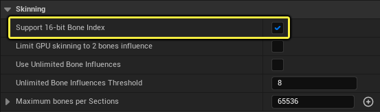
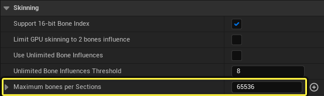
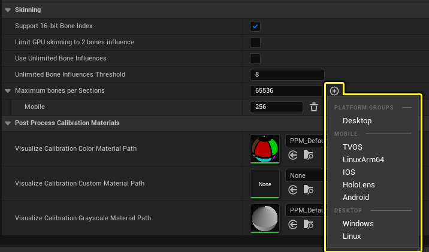
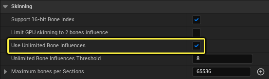
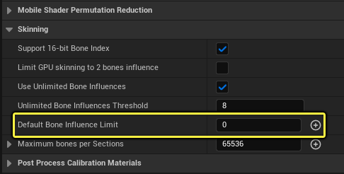
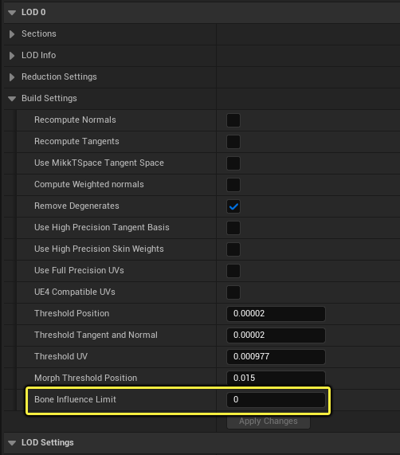
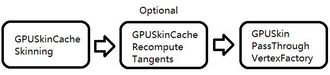
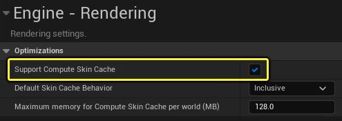

# 骨骼网格体渲染路径

> 路径：虚幻引擎5.7文档 / 设计视觉、渲染和图形效果 / 渲染的通用功能 / 骨骼网格体渲染路径

> 原始页面：https://dev.epicgames.com/documentation/unreal-engine/skeletal-mesh-rendering-paths-in-unreal-engine

在虚幻引擎中可以通过多种方法使用不同的路径渲染骨骼网格体。在本页面中，你将了解这些不同路径以及如何在项目中加以使用。

## 如何渲染骨骼网格体

骨骼网格体有三个渲染路径：

- GPUSkinVertexFactory
- 皮肤缓存系统
- 带变形器图表插件的网格体变形器

### 分段和数据块

骨骼网格体按以下两种方式分割： **分段** 或 **数据块** 。骨骼网格体的每个分段与一种材质相关联。如果一个分段的几何体太复杂，意味着每个骨骼的顶点影响太多，它会由几何体管线分割为数据块，且与网格体将创建的绘制调用数量相对应。

查看骨骼网格体编辑器中的骨骼网格体资产时，你可以在 **细节（Details）** 面板中大致了解网格体的材质是如何分割的。在每个 **LOD** 类别下，展开 **分段（Sections）** ，查看材质和数据块的列表。

下面是两个例子。第一个是最常见的结果，显示了每个骨骼网格体及其LOD的材质（或分段）列表。第二个是更高级的明细，在分段(1)分解为数据块(2)时显示。一般而言，骨骼网格体编辑器中的分段将映射到材质。在运行时，渲染代码中的分段指的是数据块。

| 仅带有材质分段的骨骼网格体 | 带有材质分段和数据块的骨骼网格体 |
| --- | --- |
| 仅带有材质分段的骨骼网格体资产 | 带有分段(1)和数据块(2)的骨骼网格体资产 |

### 8位和16位骨骼索引

导入骨骼网格体时，它们可以有 **8位** 或 **16位** 骨骼索引，用于设置一个分段可以支持的骨骼数量。8位骨骼索引最多支持每个分段256个骨骼，而16位骨骼索引支持高于256个骨骼的任何数量。

默认情况下，所有网格体都使用8位骨骼索引导入。在 **项目设置（Project Settings）** 中的 **引擎（Engine）> 渲染（Rendering）> 蒙皮（Skinning）** 下，选中 **支持16位骨骼索引（Support 16-bit Bone Index）** ，每个分段可支持更多的骨骼。

启用该设置时：

- 你需要重启编辑器，此更改才能生效。
- 若在发生此更改之前骨骼网格体已经位于项目中，则

  必须

  重新导入才能更新。
- 导入的骨骼网格体将根据分段是有最多256个骨骼还是更多，相应使用8位或16位。

### 每个分段的最大骨骼数量

骨骼网格体对于所导入的源网格体允许每个分段的骨骼上限。每个分段允许的骨骼数量是单个绘制调用中可以在GPU上蒙皮的骨骼数量。如果源网格体超出每个分段的骨骼上限，几何体管线会将分段分割为适配该限制的较小数据块。

控制每个分段的最大骨骼数量的典型用例是项目同时支持高端和移动平台的时候。你可以使用 **项目设置（Project Settings）** 在 **引擎（Engine）> 渲染（Rendering）> 蒙皮（Skinning）** 中为所有平台或单独的平台设置 **每个分段的最大骨骼数量（Maximum bones per Sections）** 。

默认情况下，每个分段的最大骨骼数量设置为65536。移动平台的封顶上限为每个分段75个骨骼。

你可以点击 **添加（Add）** ( **+** )图标并从列表选择平台，逐个平台覆盖该设置。

> [!NOTE]
> 逐个平台的值限制为全局设置 `Compat.MAX_GPUSKIN_Bones` 。默认情况下，它设置为65536，不应超过该值。如果未启用16位索引模式，上限为256（即8位骨骼索引）。

> [!TIP]
> 使用控制台命令 `SkeletalMeshReport` 可输出统计数据日志，其中包含项目中的每个骨骼网格体的明细。明细包含有关其设置和内存使用情况的信息。

## GPU蒙皮顶点工厂

**GPU蒙皮顶点工厂（GPU Skinned Vertex Factory）** 将使用顶点着色器对位置和法线/切线蒙皮，结果将根据需要在GPU上存储。每个顶点工厂同时支持 **默认骨骼影响（Default Bone Influences）** 和 **无限制骨骼影响（Unlimited Bone Influences）** 模式 。

- **默认骨骼影响（Default Bone Influences）** 模式控制每个顶点是可以按4个还是8个骨骼影响来蒙皮（视平台支持而定）。骨骼影响数量固定不变，如果骨骼网格体在渲染时每个顶点有四个骨骼，并且一个顶点仅使用一个骨骼，剩余三个插槽将填充零权重，并且仍用于蒙皮计算。骨骼索引和权重绑定到顶点流，因此该模式很适合较低端的硬件和平台。
- **无限制骨骼影响（Unlimited Bone Influences）** 将删除每个顶点的固定骨骼影响数量.这允许改用可变数量的骨骼影响（可为项目全局设置，并根据每个骨骼网格体设置）。骨骼索引/权重不必直接绑定到顶点流，每个顶点会存储打包为单个整数的索引偏移和骨骼影响数量。该值用于调查包含骨骼索引和权重数据的顶点缓冲区。

### 启用无限制骨骼影响模式

无限制骨骼影响模式从 **项目设置（Project Settings）** 中的 **引擎（Engine）> 渲染（Rendering）> 蒙皮（Skinning）** 分段下启用。

必须设置两个设置：

- 使用无限制骨骼影响（Use Unlimited Bone Influences）

  允许新导入（或重新导入）的骨骼网格体使用无限制骨骼缓冲区，而非默认最大骨骼影响数量来渲染。该设置不能在运行时更改，启用时需要重启编辑器。
- 无限制骨骼影响阈值（Unlimited Bone Influences Threshold）

  将使用每个缓冲区的固定骨骼影响，直至网格体的最大默认骨骼影响超出该限制。

> [!NOTE]
> 虽然理论上每个顶点的最大影响数量并无限制，但在实践中，受制于骨骼网格体源数据的存储方式，最大影响数量限制为12。

> [!TIP]
> 使用无限制骨骼影响模式时，我们推荐启用 **无限制骨骼影响（Unlimited Bone Influences）** ，并将 **无限制骨骼影响阈值（Unlimited Bone Influences Threshold）** 设置为 **8** 。带有9到12个骨骼影响的骨骼网格体会使用无限制骨骼影响路径渲染，而0到8个骨骼影响则使用固定的4/8个骨骼影响路径渲染。

### 设置骨骼影响限制

有时，你可能想控制骨骼影响的数量。你可以对每个项目和每个骨架网格的基础都这样做。默认情况下，默认模式的骨骼影响被限制为4个或8个。无限制骨骼影响模式允许网格体在整个项目中有更多的影响，同时出于性能和内存的原因，也允许骨骼网格体控制每个细节级别（LOD）的最大影响数。

例如，如果你在默认模式下导入了一个每个顶点有10个骨骼影响的骨骼网格体，那么根据目标平台的不同，影响的数量会被限制为4或8。如果启用了无限制骨骼影响，你会得到全部10个影响，并可以在需要时使用骨架网格体的LOD构建设置进一步限制影响的数量。

你可以在两个地方设置骨骼影响的数量：

- 在

  渲染（Rendering） > 蒙皮（Skinning）

  部分的项目设置中加入

  默认骨骼影响限制（Default Bone Influences Limits）

  。

  - 这为项目设置了一个全局默认值，可以被单个资产所覆盖。

  
- 为

  LOD构建设置

  部分的每个骨骼网格体加入

  骨骼影响限制

  。

  - 这设置了单个网格每个顶点的最大影响数。

  

在使用无限制骨骼影响模式设置骨骼影响时，请注意以下几点：

- 为项目设置一个

  默认骨骼影响限制

  。

  - 当设置为

    0

    时，则对骨骼影响没有任何限制。
  - 每个骨骼网格的骨骼影响限制设置在设置为

    0

    时，会退回至项目设置。
  - 你可以按平台指定一个全项目范围的默认限制，点击该设置旁边的

    添加

    （+）按钮。
- 在必要时，为每个骨骼网格体LOD设置一个

  骨骼影响限制

  。

  - 在设置一个数值后，它将被用来限制每个顶点的骨骼影响数量。
  - 当设置为

    0

    时，将使用默认的骨影响限制项目设置。

## 皮肤缓存系统

**皮肤缓存（Skin Cache）** 系统将使用 **计算着色器（Compute Shader）** 对位置和法线/切线蒙皮，结果会缓存在顶点缓冲区中，然后传递到 `GPUSkinPassThroughVertexFactory` （这是 `LocalVertexFactory` 的一种变体）进行渲染。

你可以在 **项目设置（Project Settings）** 中的 **引擎（Engine）> 渲染（Rendering）> 优化（Optimizations）** 分段下使用 **支持计算皮肤缓存（Support Compute Skin Cache）** 设置启用皮肤缓存系统。

你可以使用该系统灵活地定义项目层面的行为，并为单独的骨骼网格体定义行为来覆盖项目层面的行为。

使用以下项目设置可设置皮肤缓存行为和支持：

- 默认皮肤缓存行为（Default Skin Cache Behavior）

  将控制骨骼网格体如何通过皮肤缓存或GPUSkinVertexFactory路径。有两种行为可供选择：

  - 包容性（Inclusive）

    默认包含皮肤缓存中的所有骨骼网格体。单独的骨骼网格体可以选择退出，并改用GPUSkinVertexFactory路径。
  - 排他性（Exclusive）

    默认排除皮肤缓存中的所有骨骼网格体，并使用GPUSkinVertexFactory。单独的骨骼网格体可以选择加入，以使用皮肤缓存。
- **每个世界的计算皮肤缓存最大内存（Maximum memory for Compute Skin Cache per world (MB)）** 将设置每个世界/场景允许计算皮肤缓存生成输出顶点数据，并重新计算切线的最大内存（以兆字节为单位）。每个世界都有自己的皮肤缓存对象，其中骨骼网格体会按先来先服务的方式插入到皮肤缓存中。

  插入顺序取决于游戏。如果皮肤缓存已满，无法容纳另一个骨骼网格体，该网格体会转而通过GPUSkinVertexFactory路径传递。这样一来，细节级别(LOD)会出现的情况是，当网格体从更高（更低细节）LOD切换到更低（更高细节）LOD时，皮肤缓存会卸载更高LOD，但由于更繁重的内存要求而无法容纳更低LOD。

你可以使用以下控制台命令：

- r.SkinCache.Mode

  将设置是启用还是禁用皮肤缓存。默认情况下是启用的(1)。
- r.SkinCache.SkipCompilingGPUSkinVF

  在启用皮肤缓存系统时会跳过着色器排列的编译，从而减少GPU皮肤顶点工厂变体。

  - 使用

    0

    （默认值）时会编译所有GPU皮肤顶点工厂变体。
  - 使用

    1

    时不会编译所有GPU皮肤顶点工厂着色器排列。

### 覆盖骨骼网格体上的皮肤缓存

单独的骨骼网格体LOD可以使用 **皮肤缓存用法（Skin Cache Usage）** 下拉选择来覆盖皮肤缓存行为。

> 图片已省略：使用骨骼网格体设置皮肤缓存用法

从以下选项中选择：

- 自动（Auto）

  ：使用项目设置中为默认皮肤缓存行为设置的全局行为。
- 禁用（Disabled）

  ：该网格体不使用皮肤缓存。如果网格体上启用了硬件光线追踪，则表示启用了皮肤缓存。
- 启用（Enabled）

  ： 该网格体将使用皮肤缓存。

### 光线追踪和毛发发束皮肤缓存渲染要求

[硬件光线追踪](../../../building-virtual-worlds/lighting-the-environment/ray-tracing-and-path-tracing-features/hardware-ray-tracing/index.md)和[毛发发束渲染](https://dev.epicgames.com/documentation/404)等渲染功能需要皮肤缓存路径才能渲染。但是，使用变形器图表来驱动置换时，不会使用皮肤缓存路径。每当使用变形器图表时，光线追踪和毛发发束渲染仍将起作用。

使用硬件光线追踪时，所有骨骼网格体都自动通过皮肤缓存路径传递，并渲染为光线追踪效果。你可以使用 `r.RayTracing.Geometry.SupportSkeletalMeshes` 为硬件光线追踪禁用骨骼网格体，从而节省GPU内存和时间资源。此设置不会在运行时更改。

网格体还提供了使用不同于传统栅格LOD的光线追踪LOD的选项。你可以结合设置全局光线追踪LOD偏差(`r.RayTracing.Geometry.SkeletalMeshes.LODBias`)和单独的骨骼网格体设置 **光线追踪最小LOD（Ray Tracing Min LOD）** 来控制这一点。在栅格LOD索引和全局光线追踪LOD索引以及设定和光线追踪最小LOD之间选择时，将选择更高的LOD索引。

> 图片已省略：设置要用于骨骼网格体上的光线追踪的最小LOD

### 重新计算切线

**重新计算切线（Recompute Tangents）** 是蒙皮通道之后皮肤缓存的可选步骤。皮肤缓存将使用蒙皮三角形重新计算法线和切线，并通过两个计算着色器步骤来执行：

- 一个

  三角形通道（Triangle Pass）

  ，其中每个三角形通过蒙皮顶点位置计算其法线和切线，并将结果累积到所有三个顶点。
- 一个

  顶点通道（Vertex Pass）

  ，其中每个顶点会将累积的法线和切线规格化。网格体的顶点颜色缓冲区通道之一可选择用作蒙皮法线/切线与重新计算的法线/切线之间的混合任务。

你可以为项目全局设置重新计算切线，或逐个骨骼网格体进行设置。

**全局设置（Global Settings）** ：

- r.SkinCache.RecomputeTangents

  （默认为2）

  - 值为

    1

    时会强制在所有骨骼网格体上重新计算切线。
  - 值为

    2

    时仅在已在分段上启用切线的骨骼网格体上重新计算切线。

**逐个网格体设置（Per Mesh Settings）** ：

在 **LOD [n]** 类别下，使用分段设置如何为每个材质分段处理重新计算切线。

> 图片已省略：在骨骼网格体上设置重新计算切线

从以下选项中选择：

- 无（None）

  ：不重新计算切线。
- 全部（All）

  ：重新计算所有颜色通道的切线并使用重新计算的结果。
- 红色/绿色/蓝色（Red / Green / Blue）

  ：使用R/G/B顶点颜色缓冲区通道作为混合遮罩，通过蒙皮结果重新计算切线和插值。

> [!NOTE]
> 重新计算切线的一个局限性是，每个数据块独立于网格体的其他数据块进行处理。因此，与相邻数据块连接的数据块的顶点并不知道这种连接情况。这样一来，在两个数据块的边缘，可能会有明显的接缝。

### 调试皮肤缓存的提示

使用以下内容来调试项目中的皮肤缓存。

#### 控制台命令

- 使用 `profilegpu` 捕获带有单独皮肤缓存条目及其所属骨骼网格体的细节的GPU帧。

  > 图片已省略：捕获的GPU帧细节，用于分析皮肤缓存条目
- 使用 `r.SkinCache.PrintMemorySummary` 输出所有皮肤缓存条目的内存使用情况细目。

  - 使用

    0

    （默认值）时会禁用摘要。
  - 使用

    1

    时会在内存超出

    r.SkinCache.SceneMemoryLimitInMB

    或项目设置中

    每个世界的计算皮肤缓存最大内存（Maximum memory for Compute Skin Cache per world (MB)）

    设定的限制时打印帧上的摘要。
  - 使用

    2

    时会每帧打印摘要。

#### 皮肤缓存调试可视化

使用 **视图模式（View Modes）** 下拉菜单从 **GPU皮肤缓存（GPU Skin Cache）** 列表选择某个调试可视化，以通过着色将单独的骨骼网格体可视化。

> 图片已省略：皮肤缓存调试可视化菜单

> [!NOTE]
> 通过输入控制台命令 `r.SkinCache.Visualize` 并后跟 `概述` 、 `Memory` 或 `RayTracingLODOffset` 并使用 `-game` 命令行参数启动项目时，你可以使用这些可视化模式。在命令后使用 `None` 来禁用可视化。在打包构建中会禁用这些视图模式。

#### 概述可视化

**概述（Overview）** 可视化将在场景中显示已启用或已禁用皮肤缓存和重新计算切线的Actor。

> 图片已省略：皮肤缓存概述调试可视化。

视口左上角将显示场景中Actor的颜色引用。

> 图片已省略：皮肤缓存概述调试可视化统计数据。

#### 内存可视化

**内存** 可视化将显示栅格和光线追踪组合起来的低、中、高皮肤缓存内存使用情况。

> 图片已省略：皮肤缓存内存调试可视化。

视口左上角将显示皮肤缓存内存信息。

> 图片已省略：皮肤缓存内存调试可视化统计数据。

> [!NOTE]
> 你可以在 **DefaultEngine.ini** 配置文件的 `[/Script/Engine.Engine]` 分段下编辑 `GPUSkinCacheVisualizationLowMemoryThresholdInMB` 和 `GPUSkinCacheVisualizationHighMemoryThresholdInMB` 的值，逐个项目覆盖内存阈值。

#### RayTracingLODOffset可视化

**RayTracingLODOffset** 可视化将显示光线追踪皮肤缓存条目与栅格皮肤缓存条目之间的LOD索引差异，这在光线追踪使用的LOD不同于栅格化所用LOD时很有用。

> 图片已省略：皮肤缓存RayTracingLOD偏移调试可视化。

> [!NOTE]
> 仅当在项目设置中启用了[硬件光线追踪](../../../building-virtual-worlds/lighting-the-environment/ray-tracing-and-path-tracing-features/hardware-ray-tracing/index.md)时，此可视化模式才可用。

视口左上将角显示场景中Actor的光线追踪LOD偏移的颜色代码。

> 图片已省略：皮肤缓存RayTracingLOD偏移调试可视化统计数据。

## 变形器图表插件

> [!NOTE]
> 此功能目前为测试版。

**变形器图表（Deformer Graph）** 插件是一种编辑器，你可以使用它来构造专门在GPU上运行的顶点变形管线。它提供了图表编辑功能，用于即插即用，以及设置必需的数据流，根据它收到的一些输入来修改网格体顶点。

> 图片已省略：变形器图表
