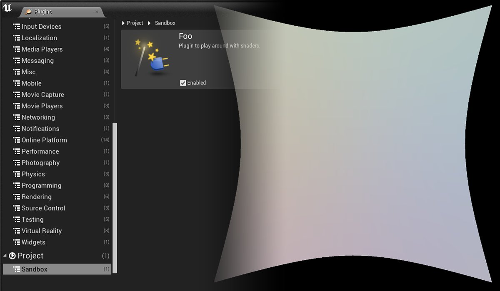
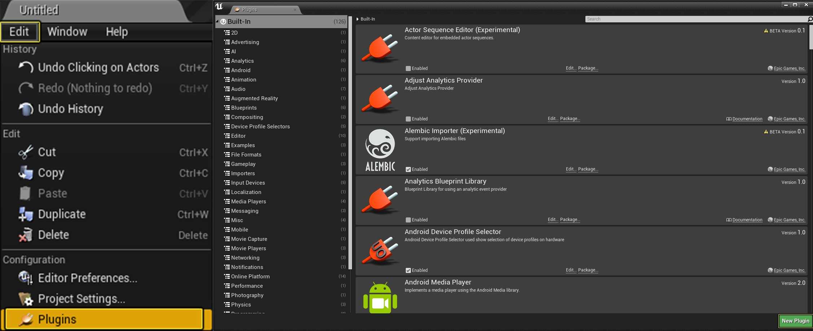
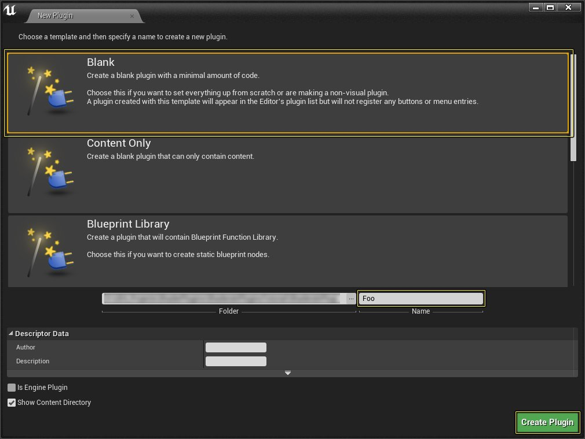
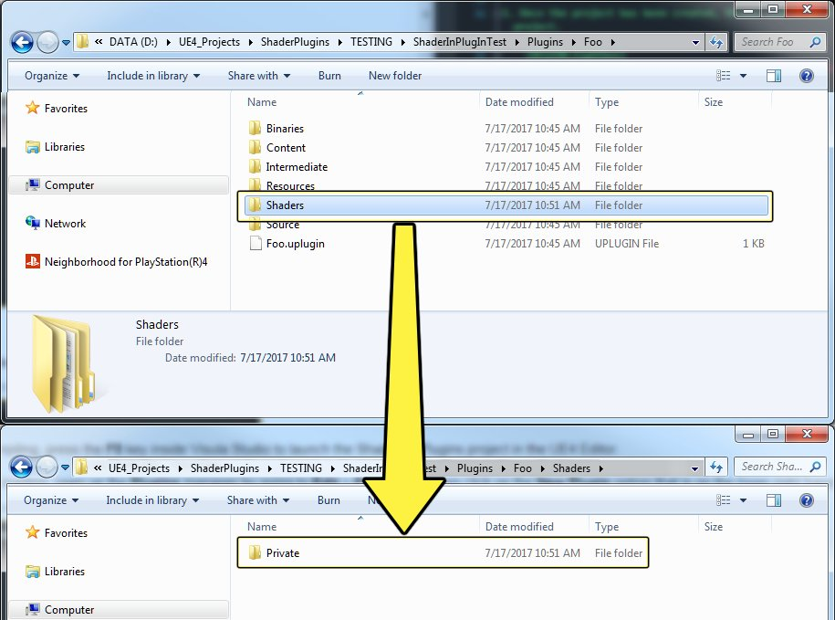
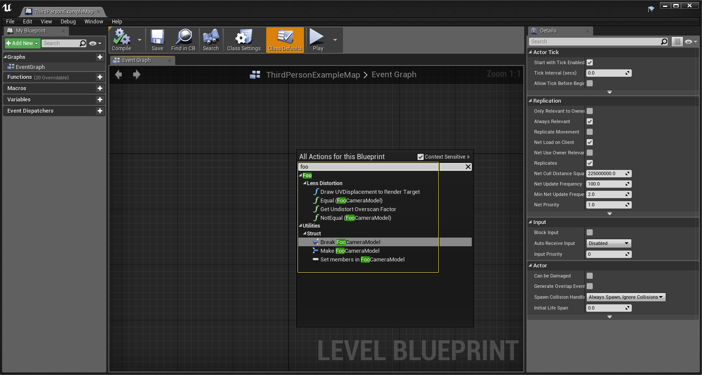
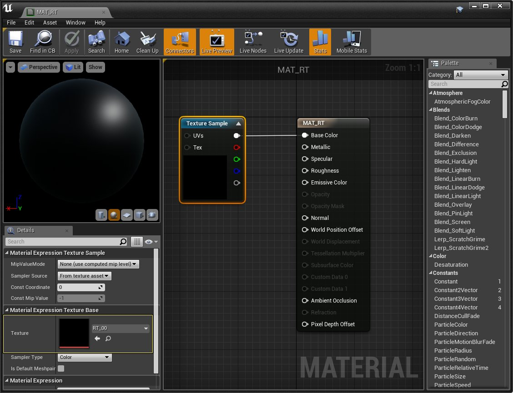
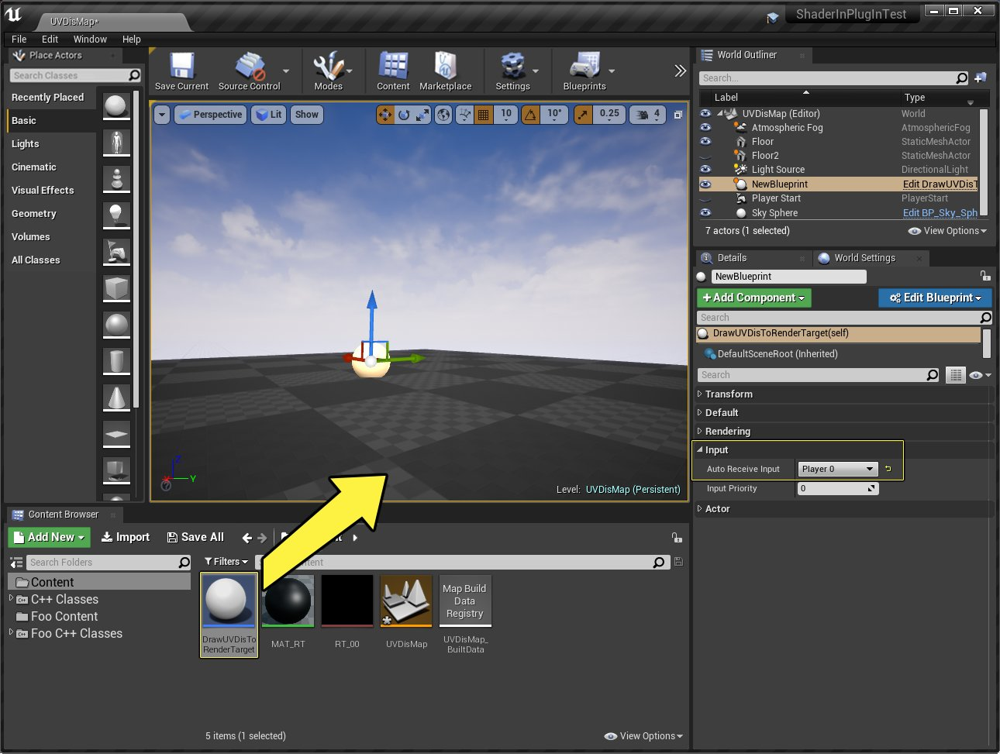
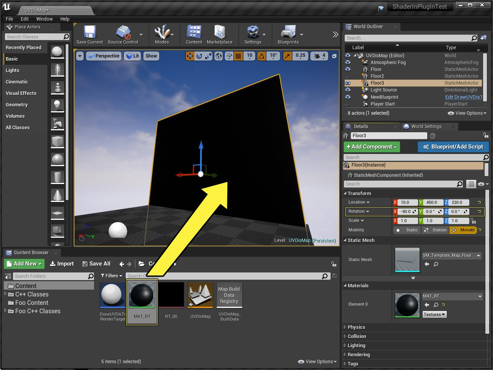

# 新建全局着色器并作为插件

> 路径：虚幻引擎5.7文档 / 设计视觉、渲染和图形效果 / 图形编程 / 新建全局着色器并作为插件

> 原始页面：https://dev.epicgames.com/documentation/unreal-engine/creating-a-new-global-shader-as-a-plugin-in-unreal-engine

虚幻引擎插件系统能帮助用户添加大量新功能，而无需重编译和发布整个引擎。以下指南中将重建光学变形（Lens Distortion）全局着色器，展示实现可由蓝图进行控制的全局着色器的方法。



点击查看大图。

> [!NOTE]
> 此例中将重建现有的Lens Distortion插件（位于 **Engine\Plugins\Compositing\LensDistortion** 中），将其改为名为 **Foo** 的新插件，展示此工作流的实现过程。

Shaders in 插件快速入门将对创建全局着色器并用作插件进行讲解。

## 1 - 代码设置

开始新建虚幻引擎4的插件之前，需要先安装 Visual Studio。此快速入门需要Visual Studio，用户需要对插件代码进行编译，使其能正常运行。如不了解此操作，请查阅[为虚幻引擎设置Visual Studio]](programming-and-scripting/development-environment-setup/visual-studio-setup/)文档。

1. 首先新建一个 **游戏** 项目并选择 **空白** 模板。确保将其设置为 **最高质量**，且不带 **初学者内容包**。
2. 项目创建后，Visual Studio将打开，之后即可右键点击ShadersInPlugins项目并选择 **编译** 选项编译项目。
3. 项目编译完成后，在Visual Studio中按下 **F5** 键在虚幻引擎编辑器中启动ShadersInPlugins项目。
4. 虚幻引擎编辑器完成加载后，前往 **编辑** > **插件** 打开 **插件** 管理器，然后点击"插件"窗口右下角的 **新建插件（New Plugin）** 选项，调出"新建插件"窗口。

   

   点击查看大图。
5. 在 **新建插件** 窗口中，选择 **空白（Blank）** 插件，将其命名为 **Foo** ，保留所有默认设置。所有操作完成后，按下 **创建插件** 键创建插件最初需要的全部内容。

   

   点击查看大图。
6. 完成后，关闭虚幻引擎和Visual Studio，前往在项目文件夹中创建的 **插件** > **Foo** 插件文件夹。
7. 在Foo plugins文件夹中添加一个名为 **Shaders** 的新文件夹，并在其中再新建一个名为 **Private** 的文件夹。

   

   点击查看大图。
8. 在Private文件夹中新建一个文本文件并将其命名为 **MyShader.USF**，然后将以下HLSL代码复制粘贴到此文件中，完成操作后保存文件。

   > [!NOTE]
   > 须将文件扩展名改为 **.USF**，否则虚幻引擎无法将其识别为着色器文件。

   ```
        // Copyright 1998-2018 Epic Games, Inc. All Rights Reserved.      /*=============================================================================         LensDistortionUVGeneration.usf:将光学变形和不         变形UV置换贴图生成到一个渲染目标中。          像素着色器直接计算变形视口UV，         不对使用Sv_Position和参考方程式的视口UV置换执行变形，         并将它们保存到红色和绿色的通道中。          为避免用费拉里法进行解析、         或在 GPU 上执行牛顿法计算不变形视口 UV 这两种方式         来对视口UV置换进行变形，这对着色器的工作方式如下：顶点着色器不对网格的顶点执行变形，         并下传到像素着色器视口 UV 应在屏幕上         所处的位置，而不进行变形。像素         着色器可生成不变形视口UV，         减去像素的视口UV后即可对视口UV置换进行变形。     =============================================================================*/      #include "/Engine/Public/Platform.ush"      // 视口UV坐标中的像素大小。     float2 PixelUVSize;      // K1, K2, K3     float3 RadialDistortionCoefs;      // P1, P2     float2 TangentialDistortionCoefs;      // 未变形视口的相机矩阵。     float4 UndistortedCameraMatrix;      // 变形视口的相机矩阵。     float4 DistortedCameraMatrix;      // 对渲染目标输出乘法和加法。     float2 OutputMultiplyAndAdd;      // 不对V.z=1视图位置进行变形。     float2 UndistortNormalizedViewPosition(float2 V)     {         float2 V2 = V * V;         float R2 = V2.x + V2.y;          // 径向变形（额外添加括号是为匹配 MF_Undistortion.uasset）。         float2 UndistortedV = V * (1.0 + R2 * (RadialDistortionCoefs.x + R2 * (RadialDistortionCoefs.y + R2 * RadialDistortionCoefs.z)));          // 切向变形。         UndistortedV.x += TangentialDistortionCoefs.y * (R2 + 2 * V2.x) + 2 * TangentialDistortionCoefs.x * V.x * V.y;         UndistortedV.y += TangentialDistortionCoefs.x * (R2 + 2 * V2.y) + 2 * TangentialDistortionCoefs.y * V.x * V.y;          return UndistortedV;     }      // 返回变形视口UV的未变形视口UV。     //     // 注意：     //        UV创建于左下角。     float2 UndistortViewportUV(float2 ViewportUV)     {         // 已变形视口UV -> 已变形视图位置（z=1）         float2 DistortedViewPosition = (ViewportUV - DistortedCameraMatrix.zw) / DistortedCameraMatrix.xy;          // 计算未变形的视图位置（z=1）         float2 UndistortedViewPosition = UndistortNormalizedViewPosition(DistortedViewPosition);          // 未变形的视图位置（z=1） -> 未变形的视口UV。         return UndistortedCameraMatrix.xy * UndistortedViewPosition + UndistortedCameraMatrix.zw;     }      // 翻转UV的y组件。     float2 FlipUV(float2 UV)     {         return float2(UV.x, 1 - UV.y);     }      void MainVS(         in uint GlobalVertexId :SV_VertexID,         out float2 OutVertexDistortedViewportUV :TEXCOORD0,         out float4 OutPosition :SV_POSITION         )     {         // 计算单元索引。         uint GridCellIndex = GlobalVertexId / 6;          // 计算网格中单元行和列的ID。         uint GridColumnId = GridCellIndex / GRID_SUBDIVISION_Y;         uint GridRowId = GridCellIndex - GridColumnId * GRID_SUBDIVISION_Y;          // 计算双三角形网格单元中的顶点ID。         uint VertexId = GlobalVertexId - GridCellIndex * 6;          // 计算单元中三角形顶点源自左下角的UV坐标。         float2 CellVertexUV = float2(0x1 & ((VertexId + 1) / 3), VertexId & 0x1);          // 计算网格中顶点源自左上角的UV。         float2 GridInvSize = 1.f / float2(GRID_SUBDIVISION_X, GRID_SUBDIVISION_Y);         float2 GridVertexUV = FlipUV(             GridInvSize * (CellVertexUV + float2(GridColumnId, GridRowId)));          // 标准不含半像素位移。         GridVertexUV -= PixelUVSize * 0.5;          // 输出顶点位置。         OutPosition = float4(FlipUV(             UndistortViewportUV(GridVertexUV) + PixelUVSize * 0.5) * 2 - 1, 0, 1);          // 输出顶点源自左上角的UV。         OutVertexDistortedViewportUV = GridVertexUV;     }      void MainPS(         in noperspective float2 VertexDistortedViewportUV :TEXCOORD0,         in float4 SvPosition :SV_POSITION,         out float4 OutColor :SV_Target0         )     {         // 计算像素源自左上角的UV。         float2 ViewportUV = SvPosition.xy * PixelUVSize;          // 标准不含半像素位移。         ViewportUV -= PixelUVSize * 0.5;          float2 DistortUVtoUndistortUV = (UndistortViewportUV((ViewportUV))) - ViewportUV;         float2 UndistortUVtoDistortUV = VertexDistortedViewportUV - ViewportUV;          // 输出置换通道。         OutColor = OutputMultiplyAndAdd.y + OutputMultiplyAndAdd.x * float4(             DistortUVtoUndistortUV, UndistortUVtoDistortUV);     } 
   ```
9. 现在找到 **Foo.uplugin** 文件并将其在文本编辑器中打开，用以下文本替代文件中的信息，完成后保存文件。

   ```
            {             "FileVersion" :3,             "Version" :1,             "VersionName" :"1.0",             "FriendlyName" :"Foo",             "Description" :"Plugin to play around with shaders.",             "Category" :"Sandbox",             "CreatedBy" :"Epic Games, Inc.",             "CreatedByURL" :"http://epicgames.com",             "DocsURL" :"",             "MarketplaceURL" :"",             "SupportURL" :"",             "EnabledByDefault" : false,             "CanContainContent" : true,             "IsBetaVersion" : false,             "Installed" : false,             "Modules" :             [                 {                     "Name" :"Foo",                     "Type" :"Developer",                     "LoadingPhase" :"PostConfigInit"                 }             ]         }		
   ```
10. 接下来前往 **Plugins\Foo\Source\Foo** 并新建文件夹 **Classes**，然后从 **Engine\Plugins\Compositing\LensDistortion** 路径下复制 **LensDistortionAPI.h** 和 **LensDistortionBlueprintLibrary.h** 文件到该新建文件夹中。

    > [!NOTE]
    > 要复制的文件位于 **Engine\Plugins\Compositing\LensDistortion** 中。

    - 类 - 新建文件夹

      - 复制 - LensDistortionAPI.h
      - 复制 - LensDistortionBlueprintLibrary.h
11. 然后前往 **Private** 文件夹并将 **LensDistortionBlueprintLibrary.cpp** 和 **LensDistortionRendering.cpp** 文件复制到此Private文件夹。

    - Private - 现有文件夹

      - 复制 - LensDistortionBlueprintLibrary.cpp
      - 复制 - LensDistortionRendering.cpp
12. 现在关闭虚幻引擎编辑器和Visual Studio，然后找到项目.U项目文件。找到以后，对其点击右键，选择 **生成Visual Studio项目文件（Generate Visual Studio project files）** 选项。
13. 重新打开Visual Studio解决方案，然后前往Foo > Classes并打开 **LensDistortionAPI.h** 文件。在此文件中，将 **FLensDistortionCameraModel** 替换为 **FFooCameraModel**。

    > [!NOTE]
    > 需在此文件中用FFooCameraModel替换FLensDistortionCameraModel **四次** 。

    ```
             // Copyright 1998-2018 Epic Games, Inc. All Rights Reserved.          #pragma once          #include "CoreMinimal.h"         #include "LensDistortionAPI.generated.h"          /** 光学变形/不变形的数学相机模型。         *         * 相机矩阵 =         *  | F.X  0  C.x |         *  |  0  F.Y C.Y |         *  |  0   0   1  |         */         USTRUCT(BlueprintType)         struct FFooCameraModel         {             GENERATED_USTRUCT_BODY()             FFooCameraModel()             {                 K1 = K2 = K3 = P1 = P2 = 0.f;                 F = FVector2D(1.f, 1.f);                 C = FVector2D(0.5f, 0.5f);             }              /** Radial parameter #1.*/             UPROPERTY(Interp, EditAnywhere, BlueprintReadWrite, Category = "Lens Distortion|Camera Model")             float K1;              /** 径向参数 #2。*/             UPROPERTY(Interp, EditAnywhere, BlueprintReadWrite, Category = "Lens Distortion|Camera Model")             float K2;              /** 径向参数 #3。*/             UPROPERTY(Interp, EditAnywhere, BlueprintReadWrite, Category = "Lens Distortion|Camera Model")             float K3;              /** 切向参数 #1。*/             UPROPERTY(Interp, EditAnywhere, BlueprintReadWrite, Category = "Lens Distortion|Camera Model")             float P1;              /** 切向参数 #2。*/             UPROPERTY(Interp, EditAnywhere, BlueprintReadWrite, Category = "Lens Distortion|Camera Model")             float P2;              /** 相机矩阵的Fx和Fy。*/             UPROPERTY(Interp, EditAnywhere, BlueprintReadWrite, Category = "Lens Distortion|Camera Model")             FVector2D F;              /** 相机矩阵的Cx和Cy。*/             UPROPERTY(Interp, EditAnywhere, BlueprintReadWrite, Category = "Lens Distortion|Camera Model")             FVector2D C;              /** 不在视图空间中进行3D向量变形（x, y, z=1.f）并返回（x', y', z'=1.f）。*/             FVector2D UndistortNormalizedViewPosition(FVector2D V) const;              /** 返回不变形渲染所需的过扫描因子，避免出现未渲染的变形像素。*/             float GetUndistortOverscanFactor(                 float DistortedHorizontalFOV,                 float DistortedAspectRatio) const;              /** 在输出渲染目标中绘制UV置换贴图。             * - 红色和绿色通道负责变形置换；             * - 蓝色和透明通道负责不变形置换。             * @param World 获取渲染设置的当前场景（如特征场景）。             * @param DistortedHorizontalFOV 变形渲染中理想的水平视野。             * @param DistortedAspectRatio 变形渲染中理想的高宽比。             * @param UndistortOverscanFactor 未变形渲染的过扫描因子。             * @param OutputRenderTarget 进行绘制的渲染目标。不必拥有和变形渲染相同的分辨率或高宽比。             * @param OutputMultiply 应用在置换上的乘法因子。             * @param OutputAdd 保存到输出渲染目标中之前被添加到相乘置换的值。             */             void DrawUVDisplacementToRenderTarget(                 class UWorld* World,                 float DistortedHorizontalFOV,                 float DistortedAspectRatio,                 float UndistortOverscanFactor,                 class UTextureRenderTarget2D* OutputRenderTarget,                 float OutputMultiply,                 float OutputAdd) const;              /** 对比两个光学变形模型并返回其是否相同。*/             bool operator == (const FFooCameraModel& Other) const             {                 return (                     K1 == Other.K1 &&                     K2 == Other.K2 &&                     K3 == Other.K3 &&                     P1 == Other.P1 &&                     P2 == Other.P2 &&                     F == Other.F &&                     C == Other.C);             }              /** 对比两个光学变形模型并返回其是否不同。*/             bool operator != (const FFooCameraModel& Other) const             {                 return !(*this == Other);             }         }; 
    ```
14. 接下来打开 **LensDistortionBlueprintLibrary.h** 文件。此文件控制此节点在蓝图中的显示方式，因此不仅需要将 **FLensDistortionCameraModel** 替换为 **FFooCameraModel**，还需要将 **Category = "Lens Distortion"** 改为 **Category = "Foo | Lens Distortion"**。

    > [!NOTE]
    > 需要在此文件中用FFooCameraModel替换FLensDistortionCameraModel **六次**。

    ```
         // Copyright 1998-2018 Epic Games, Inc. All Rights Reserved.      #pragma once      #include "CoreMinimal.h"     #include "UObject/ObjectMacros.h"     #include "Classes/Kismet/BlueprintFunctionLibrary.h"     #include "LensDistortionAPI.h"     #include "LensDistortionBlueprintLibrary.generated.h"      UCLASS(MinimalAPI)     class ULensDistortionBlueprintLibrary : public UBlueprintFunctionLibrary     {         GENERATED_UCLASS_BODY()          /** 返回不变形渲染所需的过扫描因子，避免出现未渲染的变形像素。*/         UFUNCTION(BlueprintPure, Category = "Foo | Lens Distortion")         static void GetUndistortOverscanFactor(             const FFooCameraModel& CameraModel,             float DistortedHorizontalFOV,             float DistortedAspectRatio,             float& UndistortOverscanFactor);          /** 在输出渲染目标中绘制UV置换贴图。         * - 红色和绿色通道负责变形置换；         * - 蓝色和透明通道负责不变形置换。         * @param DistortedHorizontalFOV 变形渲染中理想的水平视野。         * @param DistortedAspectRatio 变形渲染中理想的高宽比。         * @param UndistortOverscanFactor 未变形渲染的过扫描因子。         * @param OutputRenderTarget 进行绘制的渲染目标。不必拥有和变形渲染相同的分辨率或高宽比。         * @param OutputMultiply 应用在置换上的乘法因子。         * @param OutputAdd 保存到输出渲染目标中之前被添加到相乘置换的值。         */         UFUNCTION(BlueprintCallable, Category = "Foo | Lens Distortion", meta = (WorldContext = "WorldContextObject"))         static void DrawUVDisplacementToRenderTarget(             const UObject* WorldContextObject,             const FFooCameraModel& CameraModel,             float DistortedHorizontalFOV,             float DistortedAspectRatio,             float UndistortOverscanFactor,             class UTextureRenderTarget2D* OutputRenderTarget,             float OutputMultiply = 0.5,             float OutputAdd = 0.5             );          /* 如果A等于B（A == B）则返回true */         UFUNCTION(BlueprintPure, meta=(DisplayName = "Equal (LensDistortionCameraModel)", CompactNodeTitle = "==", Keywords = "== equal"), Category = "Foo | Lens Distortion")         static bool EqualEqual_CompareLensDistortionModels(             const FFooCameraModel& A,             const FFooCameraModel& B)         {             return A == B;         }          /* 如A不等于B（A != B），则返回true */         UFUNCTION(BlueprintPure, meta = (DisplayName = "NotEqual (LensDistortionCameraModel)", CompactNodeTitle = "!=", Keywords = "!= not equal"), Category = "Foo | Lens Distortion")         static bool NotEqual_CompareLensDistortionModels(             const FFooCameraModel& A,             const FFooCameraModel& B)         {             return A != B;         }     }; 
    ```
15. 现在前往 **Private** 文件夹打开 **LensDistortionBlueprintLibrary.cpp** 进行以下替换：

    - FLensDistortionCameraModel

      替换为

      FFooCameraModel
    - ULensDistortionBlueprintLibrary

      替换为

      UFooBlueprintLibrary

    > [!NOTE]
    > 应用FFooCameraModel替换FLensDistortionCameraModel **两** 次，用UFooBlueprintLibrary替换ULensDistortionBlueprintLibrary **四** 次。

    ```
             // Copyright 1998-2018 Epic Games, Inc. All Rights Reserved.          #include "LensDistortionBlueprintLibrary.h"          ULensDistortionBlueprintLibrary::ULensDistortionBlueprintLibrary(const FObjectInitializer& ObjectInitializer)             :Super(ObjectInitializer)         { }          // 静态         void ULensDistortionBlueprintLibrary::GetUndistortOverscanFactor(             const FFooCameraModel& CameraModel,             float DistortedHorizontalFOV,             float DistortedAspectRatio,             float& UndistortOverscanFactor)         {             UndistortOverscanFactor = CameraModel.GetUndistortOverscanFactor(DistortedHorizontalFOV, DistortedAspectRatio);         }          // 静态         void ULensDistortionBlueprintLibrary::DrawUVDisplacementToRenderTarget(             const UObject* WorldContextObject,             const FFooCameraModel& CameraModel,             float DistortedHorizontalFOV,             float DistortedAspectRatio,             float UndistortOverscanFactor,             class UTextureRenderTarget2D* OutputRenderTarget,             float OutputMultiply,             float OutputAdd)         {             CameraModel.DrawUVDisplacementToRenderTarget(                 WorldContextObject->GetWorld(),                 DistortedHorizontalFOV, DistortedAspectRatio,                 UndistortOverscanFactor, OutputRenderTarget,                 OutputMultiply, OutputAdd);         } 
    ```
16. 接下来，在 **Private** 文件夹中打开 **LensDistortionRendering.cpp** 文件，将 **FLensDistortionCameraModel** 替换为 **FFooCameraModel**

    > [!NOTE]
    > 需要在此文件中用FFooCameraModel替换FLensDistortionCameraModel **六次**。

    ```
             // Copyright 1998-2018 Epic Games, Inc. All Rights Reserved.          #include "LensDistortionAPI.h"         #include "Classes/Engine/TextureRenderTarget2D.h"         #include "Classes/Engine/World.h"         #include "Public/GlobalShader.h"         #include "Public/PipelineStateCache.h"         #include "Public/RHIStaticStates.h"         #include "Public/SceneUtils.h"         #include "Public/SceneInterface.h"         #include "Public/ShaderParameterUtils.h"          static const uint32 kGridSubdivisionX = 32;         static const uint32 kGridSubdivisionY = 16;          /**         * 派生自 FFooCameraModel 的中间结构体，         * 由游戏线程交付给渲染线程。         */         struct FCompiledCameraModel         {             /** 生成此编译模型的原始相机模型。*/             FFooCameraModel OriginalCameraModel;              /** 未变形和变形渲染光学变形的相机矩阵。             *  XY保存缩放因子，ZW保存平移。             */             FVector4 DistortedCameraMatrix;             FVector4 UndistortedCameraMatrix;              /** 对渲染目标输出通道的乘法和加法。*/             FVector2D OutputMultiplyAndAdd;         };          /** 不对源自左上角的视口UV进行变形，将其放入视图空间（x', y', z'=1.f）*/         static FVector2D LensUndistortViewportUVIntoViewSpace(             const FFooCameraModel& CameraModel,             float TanHalfDistortedHorizontalFOV, float DistortedAspectRatio,             FVector2D DistortedViewportUV)         {             FVector2D AspectRatioAwareF = CameraModel.F * FVector2D(1, -DistortedAspectRatio);             return CameraModel.UndistortNormalizedViewPosition((DistortedViewportUV - CameraModel.C) / AspectRatioAwareF);         }          class FLensDistortionUVGenerationShader : public FGlobalShader         {         public:             static bool ShouldCache(EShaderPlatform Platform)             {                 return IsFeatureLevelSupported(Platform, ERHIFeatureLevel::SM4);             }              static void ModifyCompilationEnvironment(EShaderPlatform Platform, FShaderCompilerEnvironment& OutEnvironment)             {                 FGlobalShader::ModifyCompilationEnvironment(Platform, OutEnvironment);                 OutEnvironment.SetDefine(TEXT("GRID_SUBDIVISION_X"), kGridSubdivisionX);                 OutEnvironment.SetDefine(TEXT("GRID_SUBDIVISION_Y"), kGridSubdivisionY);             }              FLensDistortionUVGenerationShader() {}              FLensDistortionUVGenerationShader(const ShaderMetaType::CompiledShaderInitializerType& Initializer)                 :FGlobalShader(Initializer)             {                 PixelUVSize.Bind(Initializer.ParameterMap, TEXT("PixelUVSize"));                 RadialDistortionCoefs.Bind(Initializer.ParameterMap, TEXT("RadialDistortionCoefs"));                 TangentialDistortionCoefs.Bind(Initializer.ParameterMap, TEXT("TangentialDistortionCoefs"));                 DistortedCameraMatrix.Bind(Initializer.ParameterMap, TEXT("DistortedCameraMatrix"));                 UndistortedCameraMatrix.Bind(Initializer.ParameterMap, TEXT("UndistortedCameraMatrix"));                 OutputMultiplyAndAdd.Bind(Initializer.ParameterMap, TEXT("OutputMultiplyAndAdd"));             }              template<typename TShaderRHIParamRef>             void SetParameters(                 FRHICommandListImmediate& RHICmdList,                 const TShaderRHIParamRef ShaderRHI,                 const FCompiledCameraModel& CompiledCameraModel,                 const FIntPoint& DisplacementMapResolution)             {                 FVector2D PixelUVSizeValue(                     1.f / float(DisplacementMapResolution.X), 1.f / float(DisplacementMapResolution.Y));                 FVector RadialDistortionCoefsValue(                     CompiledCameraModel.OriginalCameraModel.K1,                     CompiledCameraModel.OriginalCameraModel.K2,                     CompiledCameraModel.OriginalCameraModel.K3);                 FVector2D TangentialDistortionCoefsValue(                     CompiledCameraModel.OriginalCameraModel.P1,                     CompiledCameraModel.OriginalCameraModel.P2);                  SetShaderValue(RHICmdList, ShaderRHI, PixelUVSize, PixelUVSizeValue);                 SetShaderValue(RHICmdList, ShaderRHI, DistortedCameraMatrix, CompiledCameraModel.DistortedCameraMatrix);                 SetShaderValue(RHICmdList, ShaderRHI, UndistortedCameraMatrix, CompiledCameraModel.UndistortedCameraMatrix);                 SetShaderValue(RHICmdList, ShaderRHI, RadialDistortionCoefs, RadialDistortionCoefsValue);                 SetShaderValue(RHICmdList, ShaderRHI, TangentialDistortionCoefs, TangentialDistortionCoefsValue);                 SetShaderValue(RHICmdList, ShaderRHI, OutputMultiplyAndAdd, CompiledCameraModel.OutputMultiplyAndAdd);             }              virtual bool Serialize(FArchive& Ar) override             {                 bool bShaderHasOutdatedParameters = FGlobalShader::Serialize(Ar);                 Ar << PixelUVSize << RadialDistortionCoefs << TangentialDistortionCoefs << DistortedCameraMatrix << UndistortedCameraMatrix << OutputMultiplyAndAdd;                 return bShaderHasOutdatedParameters;             }          private:             FShaderParameter PixelUVSize;             FShaderParameter RadialDistortionCoefs;             FShaderParameter TangentialDistortionCoefs;             FShaderParameter DistortedCameraMatrix;             FShaderParameter UndistortedCameraMatrix;             FShaderParameter OutputMultiplyAndAdd;          };          class FLensDistortionUVGenerationVS : public FLensDistortionUVGenerationShader         {             DECLARE_SHADER_TYPE(FLensDistortionUVGenerationVS, Global);          public:              /** 默认构造函数。*/             FLensDistortionUVGenerationVS() {}              /** 初始化构造函数。*/             FLensDistortionUVGenerationVS(const ShaderMetaType::CompiledShaderInitializerType& Initializer)                 :FLensDistortionUVGenerationShader(Initializer)             {             }         };          class FLensDistortionUVGenerationPS : public FLensDistortionUVGenerationShader         {             DECLARE_SHADER_TYPE(FLensDistortionUVGenerationPS, Global);          public:              /** 默认构造函数。*/             FLensDistortionUVGenerationPS() {}              /** 初始化构造函数。*/             FLensDistortionUVGenerationPS(const ShaderMetaType::CompiledShaderInitializerType& Initializer)                 :FLensDistortionUVGenerationShader(Initializer)             { }         };          IMPLEMENT_SHADER_TYPE(, FLensDistortionUVGenerationVS, TEXT("/Plugin/Foo/Private/MyShader.usf"), TEXT("MainVS"), SF_Vertex)         IMPLEMENT_SHADER_TYPE(, FLensDistortionUVGenerationPS, TEXT("/Plugin/Foo/Private/MyShader.usf"), TEXT("MainPS"), SF_Pixel)          static void DrawUVDisplacementToRenderTarget_RenderThread(             FRHICommandListImmediate& RHICmdList,             const FCompiledCameraModel& CompiledCameraModel,             const FName& TextureRenderTargetName,             FTextureRenderTargetResource* OutTextureRenderTargetResource,             ERHIFeatureLevel::Type FeatureLevel)         {             check(IsInRenderingThread());          #if WANTS_DRAW_MESH_EVENTS             FString EventName;             TextureRenderTargetName.ToString(EventName);             SCOPED_DRAW_EVENTF(RHICmdList, SceneCapture, TEXT("LensDistortionDisplacementGeneration %s"), *EventName);         #else             SCOPED_DRAW_EVENT(RHICmdList, DrawUVDisplacementToRenderTarget_RenderThread);         #endif              // 设置渲染目标             SetRenderTarget(                 RHICmdList,                 OutTextureRenderTargetResource->GetRenderTargetTexture(),                 FTextureRHIRef(),                 ESimpleRenderTargetMode::EUninitializedColorAndDepth,                 FExclusiveDepthStencil::DepthNop_StencilNop);              FIntPoint DisplacementMapResolution(OutTextureRenderTargetResource->GetSizeX(), OutTextureRenderTargetResource->GetSizeY());              // 更新视口。             RHICmdList.SetViewport(                 0, 0, 0.f,                 DisplacementMapResolution.X, DisplacementMapResolution.Y, 1.f);              // 获取着色器。             TShaderMap<FGlobalShaderType>* GlobalShaderMap = GetGlobalShaderMap(FeatureLevel);             TShaderMapRef< FLensDistortionUVGenerationVS > VertexShader(GlobalShaderMap);             TShaderMapRef< FLensDistortionUVGenerationPS > PixelShader(GlobalShaderMap);              // 设置图像管线状态。             FGraphicsPipelineStateInitializer GraphicsPSOInit;             RHICmdList.ApplyCachedRenderTargets(GraphicsPSOInit);             GraphicsPSOInit.DepthStencilState = TStaticDepthStencilState<false, CF_Always>::GetRHI();             GraphicsPSOInit.BlendState = TStaticBlendState<>::GetRHI();             GraphicsPSOInit.RasterizerState = TStaticRasterizerState<>::GetRHI();             GraphicsPSOInit.PrimitiveType = PT_TriangleList;             GraphicsPSOInit.BoundShaderState.VertexDeclarationRHI = GetVertexDeclarationFVector4();             GraphicsPSOInit.BoundShaderState.VertexShaderRHI = GETSAFERHISHADER_VERTEX(*VertexShader);             GraphicsPSOInit.BoundShaderState.PixelShaderRHI = GETSAFERHISHADER_PIXEL(*PixelShader);             SetGraphicsPipelineState(RHICmdList, GraphicsPSOInit);              // 更新视口。             RHICmdList.SetViewport(                 0, 0, 0.f,                 OutTextureRenderTargetResource->GetSizeX(), OutTextureRenderTargetResource->GetSizeY(), 1.f);              // 更新着色器的统一参数。             VertexShader->SetParameters(RHICmdList, VertexShader->GetVertexShader(), CompiledCameraModel, DisplacementMapResolution);             PixelShader->SetParameters(RHICmdList, PixelShader->GetPixelShader(), CompiledCameraModel, DisplacementMapResolution);              // 绘制网格。             uint32 PrimitiveCount = kGridSubdivisionX * kGridSubdivisionY * 2;             RHICmdList.DrawPrimitive(PT_TriangleList, 0, PrimitiveCount, 1);              // 解析渲染目标。             RHICmdList.CopyToResolveTarget(                 OutTextureRenderTargetResource->GetRenderTargetTexture(),                 OutTextureRenderTargetResource->TextureRHI,                 false, FResolveParams());         }          FVector2D FFooCameraModel::UndistortNormalizedViewPosition(FVector2D EngineV) const         {             // 引擎视图空间 -> 标准视图空间。             FVector2D V = FVector2D(1, -1) * EngineV;              FVector2D V2 = V * V;             float R2 = V2.X + V2.Y;              // 径向变形（额外添加括号是为匹配 MF_Undistortion.uasset）。             FVector2D UndistortedV = V * (1.0 + (R2 * K1 + (R2 * R2) * K2 + (R2 * R2 * R2) * K3));              // 切向变形。             UndistortedV.X += P2 * (R2 + 2 * V2.X) + 2 * P1 * V.X * V.Y;             UndistortedV.Y += P1 * (R2 + 2 * V2.Y) + 2 * P2 * V.X * V.Y;              // 返回引擎V。             return UndistortedV * FVector2D(1, -1);         }          /** 编译相机模型。*/         float FFooCameraModel::GetUndistortOverscanFactor(             float DistortedHorizontalFOV, float DistortedAspectRatio) const         {             // 如光学变形模型为同一，则会及早返回1。             if (*this == FFooCameraModel())             {                 return 1.0f;             }              float TanHalfDistortedHorizontalFOV = FMath::Tan(DistortedHorizontalFOV * 0.5f);              // 获取变形视口UV坐标系统中不同关键点在z'=1处视图空间中所处的位置。             // 这非常近似于知晓未变形视口所需的过扫描缩放因子，但在实际操作中效果极佳。             //             //  视图空间中未变形UV位置：             //                 ^ 视图空间的Y轴             //                 |             //        0        1        2             //             //        7        0        3 --> 视图空间的X轴             //             //        6        5        4             FVector2D UndistortCornerPos0 = LensUndistortViewportUVIntoViewSpace(                 *this, TanHalfDistortedHorizontalFOV, DistortedAspectRatio, FVector2D(0.0f, 0.0f));             FVector2D UndistortCornerPos1 = LensUndistortViewportUVIntoViewSpace(                 *this, TanHalfDistortedHorizontalFOV, DistortedAspectRatio, FVector2D(0.5f, 0.0f));             FVector2D UndistortCornerPos2 = LensUndistortViewportUVIntoViewSpace(                 *this, TanHalfDistortedHorizontalFOV, DistortedAspectRatio, FVector2D(1.0f, 0.0f));             FVector2D UndistortCornerPos3 = LensUndistortViewportUVIntoViewSpace(                 *this, TanHalfDistortedHorizontalFOV, DistortedAspectRatio, FVector2D(1.0f, 0.5f));             FVector2D UndistortCornerPos4 = LensUndistortViewportUVIntoViewSpace(                 *this, TanHalfDistortedHorizontalFOV, DistortedAspectRatio, FVector2D(1.0f, 1.0f));             FVector2D UndistortCornerPos5 = LensUndistortViewportUVIntoViewSpace(                 *this, TanHalfDistortedHorizontalFOV, DistortedAspectRatio, FVector2D(0.5f, 1.0f));             FVector2D UndistortCornerPos6 = LensUndistortViewportUVIntoViewSpace(                 *this, TanHalfDistortedHorizontalFOV, DistortedAspectRatio, FVector2D(0.0f, 1.0f));             FVector2D UndistortCornerPos7 = LensUndistortViewportUVIntoViewSpace(                 *this, TanHalfDistortedHorizontalFOV, DistortedAspectRatio, FVector2D(0.0f, 0.5f));              // 寻找z'=1处视图空间中未变形视口的内方最大与最小值。             FVector2D MinInnerViewportRect;             FVector2D MaxInnerViewportRect;             MinInnerViewportRect.X = FMath::Max3(UndistortCornerPos0.X, UndistortCornerPos6.X, UndistortCornerPos7.X);             MinInnerViewportRect.Y = FMath::Max3(UndistortCornerPos4.Y, UndistortCornerPos5.Y, UndistortCornerPos6.Y);             MaxInnerViewportRect.X = FMath::Min3(UndistortCornerPos2.X, UndistortCornerPos3.X, UndistortCornerPos4.X);             MaxInnerViewportRect.Y = FMath::Min3(UndistortCornerPos0.Y, UndistortCornerPos1.Y, UndistortCornerPos2.Y);              check(MinInnerViewportRect.X < 0.f);             check(MinInnerViewportRect.Y < 0.f);             check(MaxInnerViewportRect.X > 0.f);             check(MaxInnerViewportRect.Y > 0.f);              // 计算正切（VerticalFOV * 0.5）             float TanHalfDistortedVerticalFOV = TanHalfDistortedHorizontalFOV / DistortedAspectRatio;              // 计算各轴上所需的未变形视口比例。             FVector2D ViewportScaleUpFactorPerViewAxis = 0.5 * FVector2D(                 TanHalfDistortedHorizontalFOV / FMath::Max(-MinInnerViewportRect.X, MaxInnerViewportRect.X),                 TanHalfDistortedVerticalFOV / FMath::Max(-MinInnerViewportRect.Y, MaxInnerViewportRect.Y));              // 将视图空间中未变形视口尺寸调大2%，             // 即可解决奇数未变形位置在切向             // 桶状光学变形中并不为最小的问题。             const float ViewportScaleUpConstMultiplier = 1.02f;             return FMath::Max(ViewportScaleUpFactorPerViewAxis.X, ViewportScaleUpFactorPerViewAxis.Y) * ViewportScaleUpConstMultiplier;         }          void FFooCameraModel::DrawUVDisplacementToRenderTarget(             UWorld* World,             float DistortedHorizontalFOV,             float DistortedAspectRatio,             float UndistortOverscanFactor,             UTextureRenderTarget2D* OutputRenderTarget,             float OutputMultiply,             float OutputAdd) const         {             check(IsInGameThread());              // 编译相机模型，以了解过扫描比例因子。             float TanHalfUndistortedHorizontalFOV = FMath::Tan(DistortedHorizontalFOV * 0.5f) * UndistortOverscanFactor;             float TanHalfUndistortedVerticalFOV = TanHalfUndistortedHorizontalFOV / DistortedAspectRatio;              // 输出。             FCompiledCameraModel CompiledCameraModel;             CompiledCameraModel.OriginalCameraModel = *this;              CompiledCameraModel.DistortedCameraMatrix.X = 1.0f / TanHalfUndistortedHorizontalFOV;             CompiledCameraModel.DistortedCameraMatrix.Y = 1.0f / TanHalfUndistortedVerticalFOV;             CompiledCameraModel.DistortedCameraMatrix.Z = 0.5f;             CompiledCameraModel.DistortedCameraMatrix.W = 0.5f;              CompiledCameraModel.UndistortedCameraMatrix.X = F.X;             CompiledCameraModel.UndistortedCameraMatrix.Y = F.Y * DistortedAspectRatio;             CompiledCameraModel.UndistortedCameraMatrix.Z = C.X;             CompiledCameraModel.UndistortedCameraMatrix.W = C.Y;              CompiledCameraModel.OutputMultiplyAndAdd.X = OutputMultiply;             CompiledCameraModel.OutputMultiplyAndAdd.Y = OutputAdd;              const FName TextureRenderTargetName = OutputRenderTarget->GetFName();             FTextureRenderTargetResource* TextureRenderTargetResource = OutputRenderTarget->GameThread_GetRenderTargetResource();              ERHIFeatureLevel::Type FeatureLevel = World->Scene->GetFeatureLevel();              ENQUEUE_RENDER_COMMAND(CaptureCommand)(                 [CompiledCameraModel, TextureRenderTargetResource, TextureRenderTargetName, FeatureLevel](FRHICommandListImmediate& RHICmdList)                 {                     DrawUVDisplacementToRenderTarget_RenderThread(                         RHICmdList,                         CompiledCameraModel,                         TextureRenderTargetName,                         TextureRenderTargetResource,                         FeatureLevel);                 }             );         } 
    ```
17. 最后，在 **LensDistortionRendering.cpp** 文件中第155和156行，将以下两行代码改为指向先前新建的MyShader.USF文件。

    修改：

    - IMPLEMENT_SHADER_TYPE(, FLensDistortionUVGenerationVS, TEXT("/Plugin/LensDistortion/Private/UVGeneration.usf"), TEXT("MainVS"), SF_Vertex)

    为：

    - IMPLEMENT_SHADER_TYPE(, FLensDistortionUVGenerationVS, TEXT("/Plugin/Foo/Private/MyShader.usf"), TEXT("MainVS"), SF_Vertex)

    修改：

    - IMPLEMENT_SHADER_TYPE(, FLensDistortionUVGenerationPS, TEXT("/Plugin/LensDistortion/Private/UVGeneration.usf"), TEXT("MainPS"), SF_Pixel)

    为：

    - IMPLEMENT_SHADER_TYPE(, FLensDistortionUVGenerationPS, TEXT("/Plugin/Foo/Private/MyShader.usf"), TEXT("MainPS"), SF_Pixel)
18. 现在前往 **Foo/Source** 文件夹打开 **Foo.Build.cs** 文件，在 **Foo.Build.cs** 中的 **PublicDependencyModuleNames.AddRange** 部分下添加以下代码行：

    ```
             PublicDependencyModuleNames.AddRange(         new string[]         {             "Core",             "RenderCore",             "ShaderCore",             "RHI",             // ... 在此处添加静态连接的其他公共依赖性 ...         }         );		
    ```
19. 然后在 **Foo.Build.cs** 文件中的 **PrivateDependencyModuleNames.AddRange** 部分移除 **Slate** 和 **SlateCore**。操作完成后Foo.Build.cs应如下：

    ```
             // Copyright 1998-2018 Epic Games, Inc. All Rights Reserved.		         using UnrealBuildTool;		         public class Foo :ModuleRules         {             public Foo(ReadOnlyTargetRules Target) : base(Target)             {                 PCHUsage = ModuleRules.PCHUsageMode.UseExplicitOrSharedPCHs;		                 PublicIncludePaths.AddRange(                     new string[] {                         "Foo/Public"                         // ... 在此处添加所需的公共包含路径 ...                     }                     );                 PrivateIncludePaths.AddRange(                     new string[] {                         "Foo/Private",                         // ... 在此处添加所需的其他私有包含路径 ...                     }                     );		                 PublicDependencyModuleNames.AddRange(                     new string[]                     {                         "Core",                         "RenderCore",                         "ShaderCore",                         "RHI",                         // ... 在此处添加静态连接的其他公共依赖性 ...                     }                     );                 PrivateDependencyModuleNames.AddRange(                     new string[]                     {                         "CoreUObject",                         "Engine",                         // ... 在此处添加静态连接的私有依赖性 ...                     }                     );		                 DynamicallyLoadedModuleNames.AddRange(                     new string[]                     {                         // ... 在此处添加模式动态加载的模式 ...                     }                     );             }         }		
    ```
20. 重新启动项目的Visual Studio解决方案文件，并按下 **CRTL + 5** 重新编译项目。编译完成后按下 **F5** 启动虚幻引擎编辑器。
21. 虚幻引擎编辑器完成加载后，前往 **编辑** > **插件** 以打开 **插件** 管理器。
22. 在Plugins管理器中向下滚动寻找 **Project** 部分，在此部分中找到插件。

    > [!NOTE]
    > 如插件未启用，则点击其命名旁边的勾选框将其启用，并重启虚幻引擎编辑器。
23. 打开关卡蓝图，在事件图表中点击右键，在搜索框中输入 **Foo** 即可检查是否所有内容均齐备。完成后，便可看到所有项目均被添加到Foo Camera。

    

    点击查看大图。

### 最终结果

恭喜，您已成功重建和编译了虚幻引擎Lense Distortion插件的新版本。下一部分将讲述如何从蓝图调用这个新全局着色器，以及其如何对渲染目标进行变形。

## 2 - 蓝图设置

验证插件正常工作后，以下部分将说明如何使用蓝图调用全局着色器。

1. 如需查看其工作原理，在 **内容浏览器** 中右键点击并新建 **蓝图类**，以 **Actor** 作为父类，命名为 **DrawUVDisToRenderTarget**。
2. 接下来，新建名为 **RT_00** 的 **渲染目标** 和名为 **MAT_RT** 的材质。
3. 打开MAT_RT材质，然后将RT_00渲染目标添加到材质图表，将其输出连接到主材质节点上的"Base Color"输入，完成后按 **应用** 和 **保存** 按钮。

   

   点击查看大图。
4. 接下来打开DrawUVDisToRenderTarget蓝图并将以下变量和节点创建/添加到事件图表。

   | 变量 | 默认值 |
   | --- | --- |
   | K1 | 1.0 |
   | K2 | 1.0 |
   | inc | 1.0 |

   | 节点 | 默认值 |
   | --- | --- |
   | W | 不适用 |
   | S | 不适用 |
   | Event Tick | N/A |
   | Draw UVDisplacement to Render Target | 在视野（FOV）、高宽比（Aspect Ratio）、过扫描因子（Overscan Factor）中输入 **1** |
   | Make FooCameraModel | N/A |
   | Clear Render Target 2D | N/A |
5. 为简单地展示Draw UVDisplacement to Render Target节点如何对提供的渲染目标进行变形，用户需要对蓝图进行设置，使此节点上 **K1** 和 **K2** 输入中输入的值能够通过按键进行增加或减少。为完成此操作，需要在事件图表中设置节点，使其与下图相匹配：

   可直接将此蓝图代码复制粘贴到蓝图中。

   > [!NOTE]
   > 需要将渲染目标输入 **Output Render Target**，否则不会有效果。
6. 所需的蓝图逻辑设置完成后，**编译** 并 保存 **蓝图**，然后将蓝图从 **内容浏览器** 拖入 **关卡。完成后，选择蓝图，在**输入**下将**自动接收输入（Auto Receive Input）**从**禁用（Disabled）**改为**Player 0**。

   

   点击查看大图。
7. 接下来选中地面，按下 **CTRL + W** 复制，然后在 **X** 轴中将其旋转 **-90 度**，然后将材质 **MAT_RT** 拖到其上方，即可看到Draw UVDisplacement to Render Target的效果。

   

   点击查看大图。
8. 所有内容设置完成后，按下 **Play** 按钮，再按下 **W** 和 **S** 键对输入Draw UVDisplacement to Render Target节点的渲染目标执行变形，效果与以下视频相似。

### 最终结果

此时您便已学习到如何通过蓝图对渲染目标中的内容执行变形，创建各种有趣的形状。下一步可以尝试新建一个插件，或对现有插件进行编辑，看能否创建出有趣的图像和效果。
