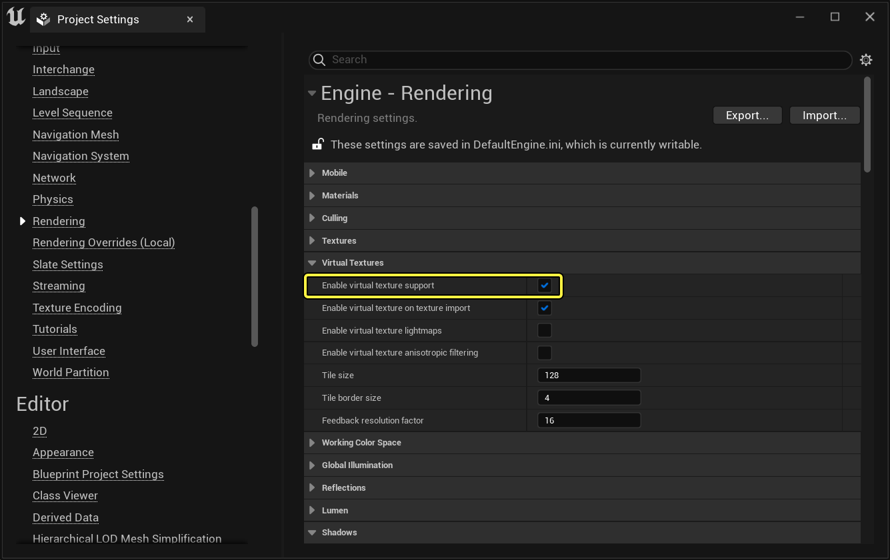
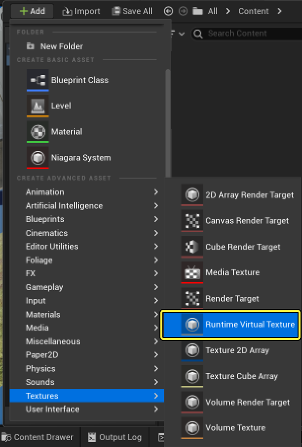
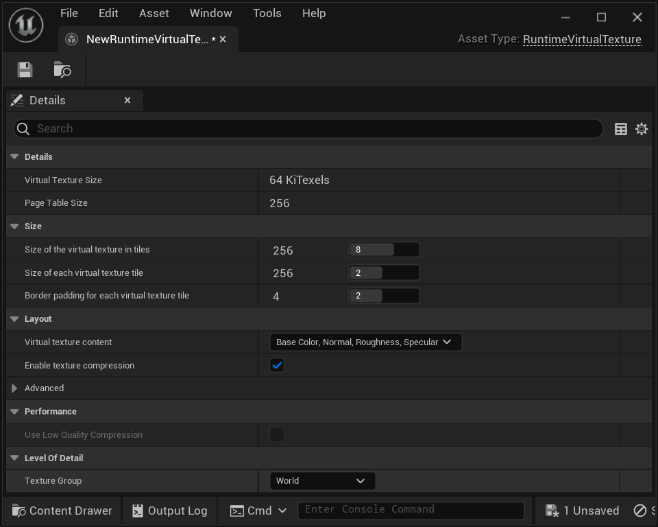
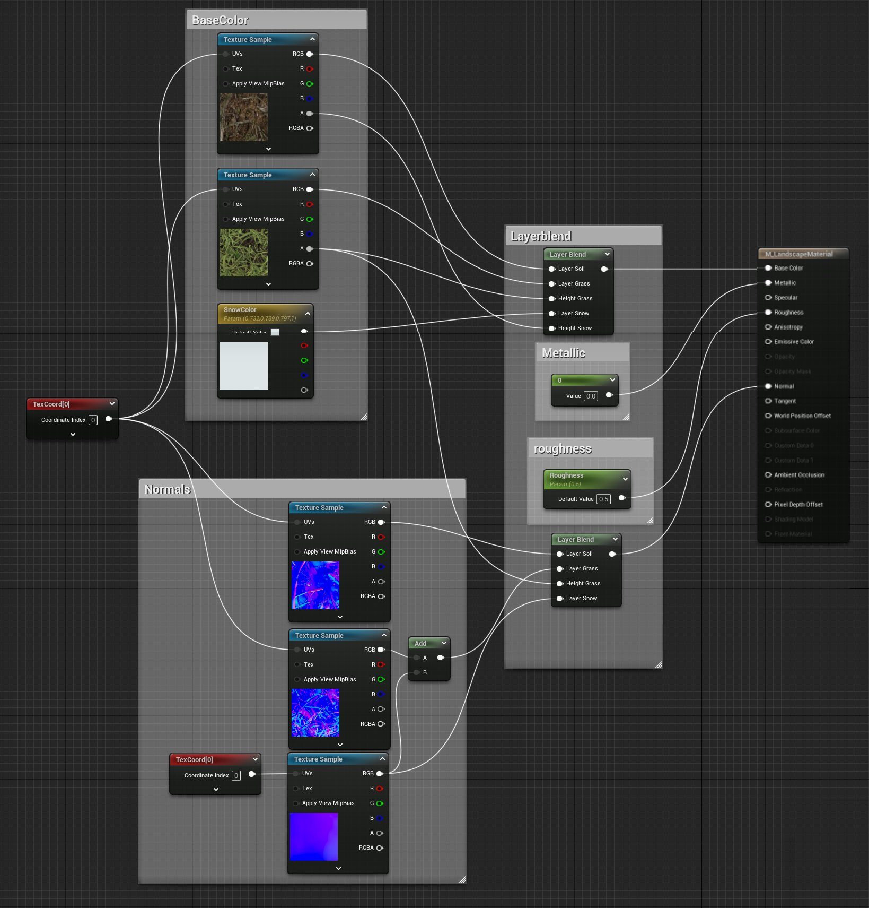
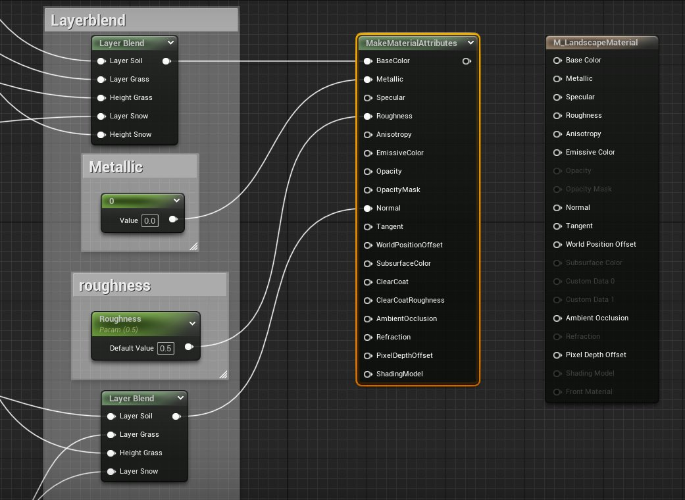
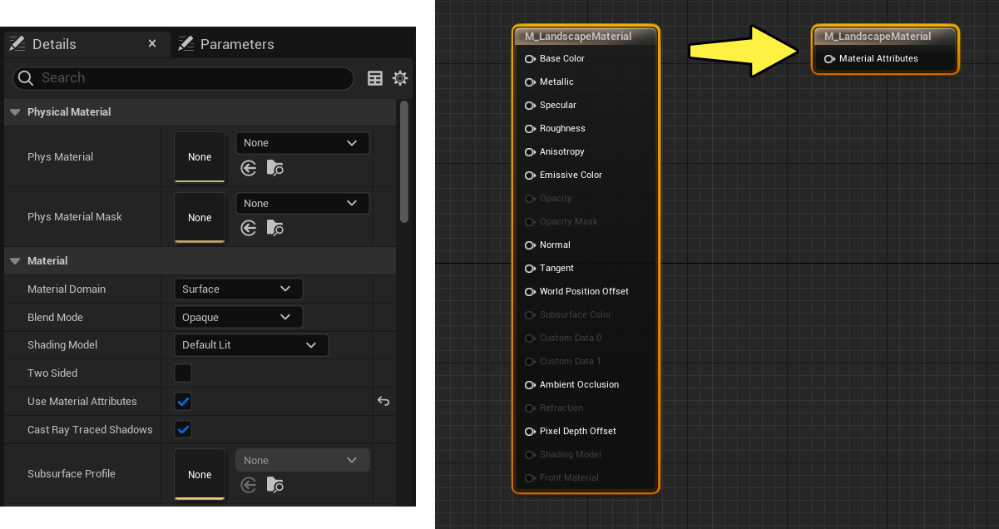
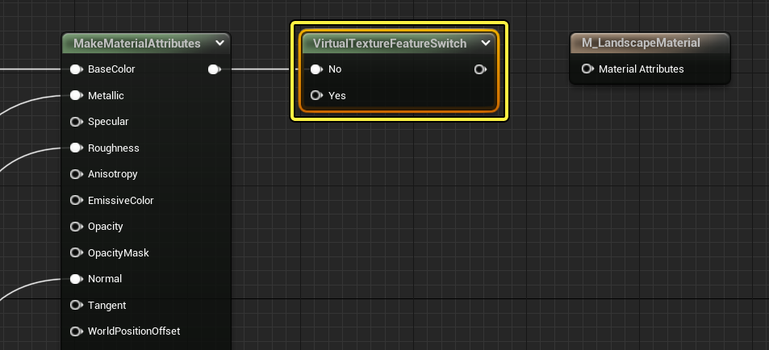
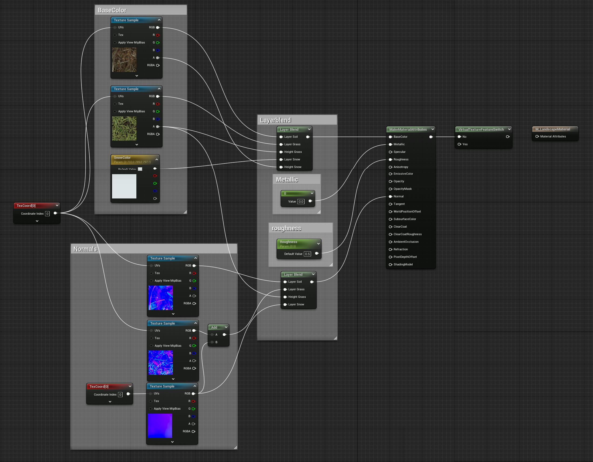

# 运行时虚拟纹理快速入门

> 路径：虚幻引擎5.7文档 / 设计视觉、渲染和图形效果 / 优化和调试实时渲染项目 / 虚拟纹理 / 运行时虚拟纹理 / 运行时虚拟纹理快速入门

> 原始页面：https://dev.epicgames.com/documentation/unreal-engine/runtimevirtual-texturing-quick-start-in-unreal-engine

> [!NOTE]
> 本指南要求使用了在Epic Games启动程序中示例选项卡下的内容示例项目中的材质。虽然不使用这些材质也可以完成以下步骤，但为了设置地形，使其正常生效，需要使用绘制好的地形材质。在继续前，请先参阅[地形快速入门指南](https://dev.epicgames.com/documentation/404)，或打开 **示例** 选项卡下的内容示例项目 **Landscapes** 地图，以配合本指南的学习。

在运行时 **虚拟纹理（RVT）** 快速入门中，将介绍在你的项目中针对地形和非地形组件设置和使用RVT的过程。

在开始本指南前，出于以下原因，理解运行时虚拟纹理最适用于地形十分重要：

- 复杂的地形材质缓存着色效果，可提高性能。
- 使用样条型和贴花类效果可提高质量和加强变体。
- 由同一RVT资产处理非地形Acor与地形的混合。

完成本指南后，你会更了解：

- 设置运行时虚拟纹理资产以及它连接到不同组件的方式。
- 为地形材质启用运行时虚拟纹理。
- 在关卡中设置运行时虚拟纹理体积。
- 设置更多Actor以渲染至运行时虚拟纹理。

## 1 - 项目设置

使用运行时虚拟纹理前，必须先为项目启用它。执行以下步骤：

1. 在主菜单中，选择 **编辑（Edit）** 菜单并选择 **项目设置（Project Settings）**。在 **引擎（Engine）** > **渲染（Rendering）** > **虚拟纹理（Virtual Textures）** 类目下，将 **启用虚拟纹理支持（Enable Virtual texture support）** 设为true。

   
2. **重启** 项目。

## 2 - 创建运行时虚拟纹理资产

**运行时虚拟纹理** 资产包含指定给运行时虚拟纹理体积的RVT资产的配置详情。RVT资产的工作原理是链接场景中需共享数据的材质和其他Actor。

1. 在 **内容侧滑菜单** 中，利用右键点击快捷菜单或 **添加（+Add）** 按钮从 **纹理（Textures）** 类目创建 **运行时虚拟纹理** 资产。

   
2. 为 **运行时虚拟纹理** 资产命名。在本指南中，命名为 `VT_Test`。
3. 双击打开此 **运行时虚拟纹理** 资产编辑器，以配置其可用属性。

   

   在此窗口中，你可以定义运行时虚拟纹理（RSV）支持的大小、图块大小和材质属性类型。这些熟悉可以实时调整，并在编辑器中实时查看改动效果。

   > [!NOTE]
   > 欲知这些设置的详情和用途，参阅[虚拟纹理设置](../../../../optimizing-and-debugging-projects-for-realtim-ea5cf1b9/virtual-texturing/virtual-texturing-settings-and-properties/index.md)页面。

## 3 - 创建运行时虚拟纹理材质

> [!WARNING]
> 关于这些设置的具体用法，请参阅[虚拟纹理设置](../../../../optimizing-and-debugging-projects-for-realtim-ea5cf1b9/virtual-texturing/virtual-texturing-settings-and-properties/index.md)。

这一步将使用一个简单的地形材质来获得运行时虚拟纹理支持。此外，还将使用一些RVT特定的材质表达式来设置逻辑，当虚拟纹理在受支持平台上不可用时，这些表达式能将材质退却到原始使用状态。

设置材质使用RVT需要考虑两个情境：

- 部分材质将

  写入

  RVT资产。
- 部分材质将从RVT资产

  采样

  ，并应用进一步的逻辑。

在本示例中，地形材质来自 **内容示例（Content Examples）** 项目，它拥有一个雪、草地和岩石的简单图层混合设置。

点击查看大图

> [!NOTE]
> 若未使用内容示例中的材质，可如上所述重新创建。但记住，仍需正确设置材质以便于用于地形。可参阅[地形快速入门指南](../../../../../building-virtual-worlds/landscape-outdoor-terrain/index.md)作为起点。

接下来将分解此材质的各个部分，演示在RVT资产中进行写入和采样的方式。

#### 必要材质设置

设置地形材质用于RVT资产的方式与设置传统材质相同，但有一个例外：应启用 **使用材质属性（Use Material Attributes）**。此选项允许使用 **建立材质属性（Make Material Attributes）** 表达式来重建和输出材质用于不同的使用情况。

1. 打开已创建或可用的地形材质。右键点击图表并搜索 **建立材质属性（Make Material Attributes）** 表达式。在图表中添加一个材质。
2. 将引线从主属性（Main Attributes）节点移至 **建立材质属性（Make Material Attributes）** 节点。应显示类似如下：

   

   点击查看大图
3. 选择 **主属性（Main Attributes）** 节点后，利用 **细节（Details）** 面板启用 **使用材质属性（Use Material Attributes）**。

   
4. 从 **建立材质属性（Make Material Attributes）** 节点拉出引线，并创建 **虚拟纹理功能切换（Virtual Textures Feature Switch）** 节点。此操作会将其插入 **No** 输入中。然后，将其连接至 **材质属性（Material Attributes）** 输出。

   

材质应如下所示：

点击查看大图。

### 写入运行时虚拟纹理资产

接下来，材质需通过 **运行时虚拟纹理输出（Runtime Virtual Texture Output）** 表达式 *写入* RVT资产。此节点引用本指南前面创建的RVT资产，并允许将相应材质属性（如底色、粗糙度和法线）用作此节点的输入属性。

1. 在图表中右键点击并添加一个 **运行时虚拟纹理输出（Runtime Virtual Texture Output）** 节点。

   > 图片已省略：undefined

   点击查看大图。
2. 连接节点上列出的每个材质属性输入的节点引线。对于基础材质中未用到的属性输入，在其位置上使用常量值。

   > 图片已省略：连接节点上列出的每个材质属性输入的节点引线

材质应如下所示：

> 图片已省略：undefined

点击查看大图。

所有图层混合和逻辑发生在此材质的第一部分。此部分全部是 *与摄像机无关的* 着色，可缓存到RVT资产，其他对象（如样条和贴花）应被RVT系统合成到此节点的输出中。

### 从运行时虚拟纹理资产采样

接下来，材质需通过 **运行时虚拟纹理采样（Runtime Virtual Texture Sample）** 表达式从RVT资产 *采样*。

在图表的这一部分，RVT资产接受采样，并在此处应用 *与摄像机相关的* 或其他着色操作。RVT资产属性为采样内容，将被传送至最终材质输出，因此在图表的这一部分所做的操作越少，此材质的渲染开销就越低。

1. 点击右键并添加一个 **运行时虚拟纹理采样（Runtime Virtual Texture Sample）** 节点。

   > 图片已省略：undefined

   点击查看大图。
2. 点击右键并创建另一个 **建立材质属性（Make Material Attributes）** 节点。将 **运行时虚拟纹理采样（Runtime Virtual Texturing Sample）** 节点的输出连接到 **建立材质属性（Make Material Attributes）** 节点的相应输入。

   > 图片已省略：将
3. 将 **建立材质属性（Make Material Attributes）** 节点的输出连接到 **虚拟纹理功能切换（Virtual Texture Feature Switch）** 节点的 **Yes** 输入。

   > 图片已省略：undefined

   点击查看大图。
4. 选择 **运行时虚拟纹理采样（Runtime Virtual Texture Sample）** 节点。在 **细节（Details）** 面板中，利用 **虚拟纹理（Virtual Textures）** 资产选择框来指定先前在本指南中创建的RVT资产。

   > 图片已省略：利用
5. 将 **虚拟纹理功能切换（Virtual Texture Feature Switch）** 节点的输出连接到 **材质属性（Material Attributes）** 主节点的输入。

   > 图片已省略：将
6. **保存** 并 **关闭** 此材质。

材质应如下所示：

> 图片已省略：undefined

点击查看大图。

## 4 - 放置运行时虚拟纹理体积

为材质设置了RVT后，你可以在关卡中放置 **运行时虚拟纹理体积**，以便将RVT材质应用到表面上。在此示例中，就是应用到地形表面上。

1. 在 **放置Actor（Place Actors）** 面板中，在 **体积（Volume）** 类目下搜索 **运行时虚拟纹理体积（Runtime Virtual Texture Volume）**，并将其拖入场景。

   > 图片已省略：undefined

   点击查看大图。
2. 选中RVT体积后，在 **虚拟纹理（Details）** 分段下，将 **虚拟纹理** 材质分配框设置使用为你在本指南步骤2中创建的运行时虚拟纹理资产。

   > 图片已省略：将
3. RVT体积还需要进一步缩放，以便完全覆盖需要应用RVT材质的区域。选中RVT体积，在其 **细节** 面板的 **从边界变形（Transform from Bounds）** 分段中，将 **源Actor（Source Actor）** 设置为你要使用的Actor。在本例中是 **Landscape_2**。

   > 图片已省略：在
4. 点击 **设置边界（Set Bounds）** 按钮将运行时虚拟纹理体积缩放至所选Actor的边界。

   > 图片已省略：点击设置边界按钮将运行时虚拟纹理体积缩放至所选Actor的边界

   > [!NOTE]
   > 所有需要从RVT采样或写入RVT的Actor都必须位于RVT体积内。
5. 在 **虚拟纹理（Virtual Texture）** 分段下的 **细节** 面板中，选中场景Actor（Landscape_2），然后点击 **在虚拟纹理中绘制（Draw in Virtual Textures）** 旁边的 **添加元素（Add Element）**。

   > 图片已省略：点击

   在资产指定下拉菜单中选择你的 **运行时虚拟纹理资产**。

   > 图片已省略：点击

将运行时虚拟纹理体积放置在地形中后并将运行时虚拟纹理资产指定给地形后，地形材质应当会立即显示。如果设置错误，则地形会以黑色显示。

## 5 - 将Actor渲染至运行时虚拟纹理

设置完地形材质后，你可以设置其他场景Actor并渲染到RVT中，例如道路曲线。所有被设置成输出到RVT并位于RVT体积内的Actor，都会被捕获并作为地形RVT资产的一部分渲染。

> [!NOTE]
> 本小节中的样条线是一种地形样条线，已经在内容示例中设置好。此处的步骤也可应用于其他Actor及其材质，以便实现相同的效果。

1. 找到 **模式（Modes）** 下拉菜单并选择 **地形（Landscape）**。

   > 图片已省略：找到
2. 在 **地形（Landscape）** 工具栏中，点击 **样条（Splines）**。

   > 图片已省略：点击样条
3. 在关卡视口中，选择样条的任何部分。在关卡的 **细节（Details）** 面板中，点击 **片段（Segments）** 按钮，选择构成此样条的所有片段。

   > 图片已省略：点击
4. 在 **地形样条网格体（Landscape Spline Meshes）** 类目下，展开 **样条网格（Spline Meshes）** 排列。应指定静态网格体 **SM_Street**。双击它打开静态网格体编辑器。

   > 图片已省略：应指定静态网格体SM_Street并双击它打开静态网格体编辑器

   然后在 **材质插槽（Material Slots）** 下，双击元素0 **M_Street** 材质在材质编辑器中打开它。

   > 图片已省略：双击元素0 M_Street材质在材质编辑器中打开它

   > [!NOTE]
   > 对于此静态网格体和指定材质，由于元素0是插槽0和插槽1使用的父材质，且元素1是元素0的子材质实例，因此选择元素0。请注意，要渲染到RVT资产的材质都需要使用以下步骤进行设置。
5. 在材质编辑中，右键点击并添加一个 **运行时虚拟纹理输出（Runtime Virtual Texture Output）** 节点。将 **颜色（Color）** 和 **粗糙度（Roughness）** 节点的输出连接到 **运行时虚拟纹理输出（Runtime Virtual Texture Output）** 节点的 **基础颜色（BaseColor）** 和 **粗糙度（Roughness）** 输入。

   > 图片已省略：将
6. **保存并关闭** 材质和静态网格体编辑器。
7. 在关卡视口，选择"地形样条"的任意部分。在 **细节** 面板中，点击 **分段（Segments）** 按钮选择附加的所有样条分段。

   > 图片已省略：在
8. 仍保持选中地形样条，在 **细节（Details）** 面板中下拉至 **虚拟纹理（Virtual Textures）** 分辨，并点击 **添加元素（+）（Add Elements (+)）** 图标。从指定下拉菜单中选择你的 **运行时虚拟纹理资产（Runtime Virtual Texture Asset）**。

   > 图片已省略：指定下拉菜单中选择你的
9. 图元（本示例中的地形样条）已被渲染到RVT中。但是，图元仍然可见。如果你不希望图元在主通道中可见，只希望将其渲染到RVT中，请使用 **模式（Modes）** 下拉菜单将关卡视口退回到 **选择（Select）** 模式，并选择关卡中的 **运行时虚拟纹理（Runtime Virtual Texture Volume）** 体积。在 **虚拟纹理（Virtual Texture）** 分段的高级属性中，启用 **隐藏图元（Hide Primitives）**。

   > 图片已省略：在

在关卡视口中，当你用游戏视图查看时，应看到样条线被渲染到RVT资产中并被应用于地形表面上，样条线图元应该看不到了。

> 图片已省略：未采用运行时虚拟纹理

> 图片已省略：采用运行时虚拟纹理

未采用运行时虚拟纹理

采用运行时虚拟纹理

下面是使用RVT将样条材质应用到地形表面的详细介绍。

> 图片已省略：不含运行时虚拟纹理

> 图片已省略：含运行时虚拟纹理

不含运行时虚拟纹理

含运行时虚拟纹理

## 6 - 自己动手操作！

完成本指南且已设置使用运行时虚拟纹理的地形材质之后，便可以开始探索将自己的Actor材质渲染到RVT。开始时可使用下面的一些建议：

- 将RVT添加到另一个静态网格体，RVT可以像贴花一样应用。了解如何使用带遮罩材质的静态网格体平面向地形添加类似贴花的细节。
- 使用植物实例来绘制网格体，该网格体可渲染到RVT，创建地形的独特变体。
- 利用多个运行时虚拟纹理资产来管理不同类型的Actor、以及它们渲染到运行时虚拟纹理体积的方式。
- 通过

  半透明排序优先级（Translucency Sort Priority）

  为Actor渲染到RVT的方式设置图层顺序。举例而言，0表示底层，更高的值则表示堆叠在另一层之上。
