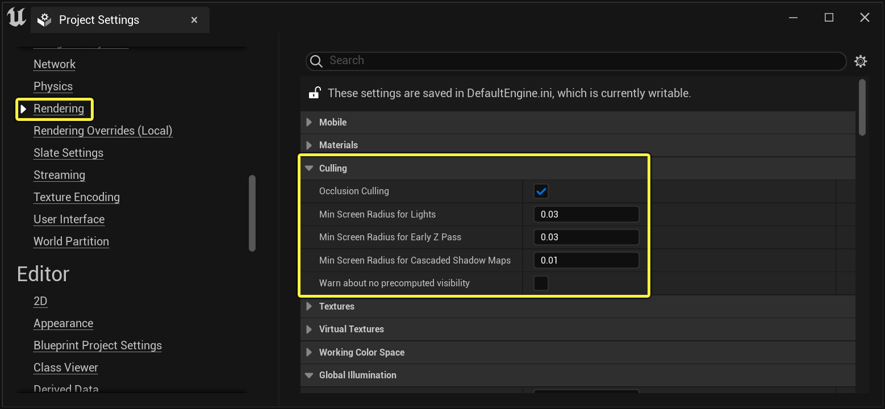
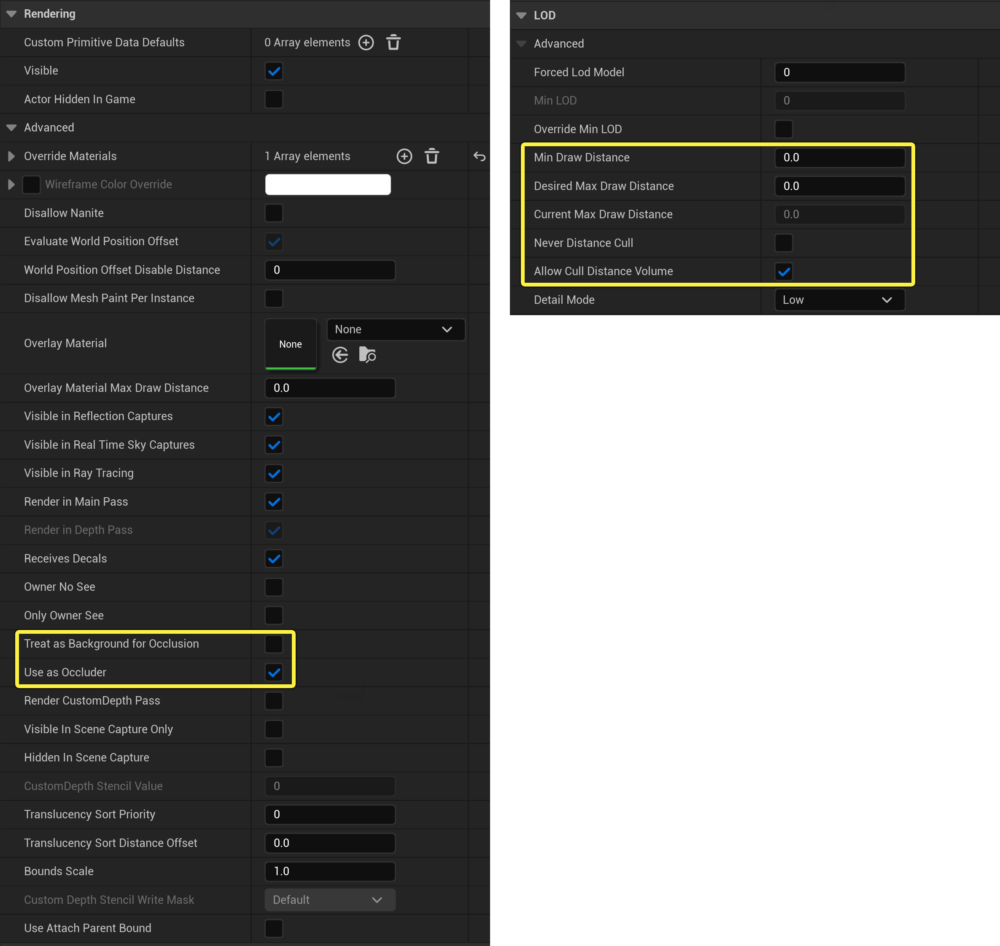
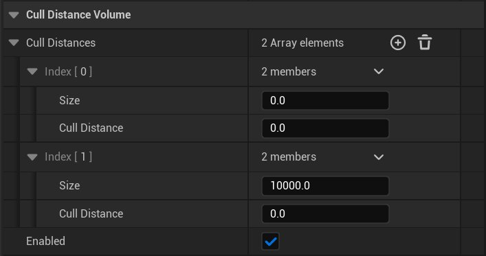
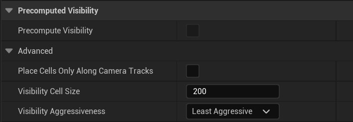
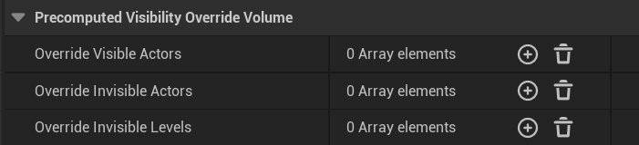

# 可视性和遮挡剔除参考

> 路径：虚幻引擎5.7文档 / 设计视觉、渲染和图形效果 / 优化和调试实时渲染项目 / 可视性和遮挡剔除 / 可视性和遮挡剔除参考

> 原始页面：https://dev.epicgames.com/documentation/unreal-engine/visibility-and-occlusion-culling-reference-in-unreal-engine

在本页面，你将会了解项目和虚幻引擎项目中用于可视性和遮挡剔除的不同体积类型的设置。

## 项目设置

**项目设置** 包含会影响项目整体的剔除设置，例如对硬件遮挡查询的支持、应剔除照明的屏幕尺寸等等。

你可以打开"项目设置"（Project Settings）窗口，选择 **渲染（Rendering）** 并找到 **剔除（Culling）** 部分来查看这些设置。

单击查看大图。

| 属性 | 说明 |
| --- | --- |
| **遮挡剔除** | 允许遮挡查询方法（如硬件、软件和循环遮挡查询）来剔除Actor。该设置不禁用基于距离的剔除方法，如剔除距离或预计算可视性体积。 禁用遮挡剔除可能会对项目和关卡产生明显的性能影响，具体取决于被渲染的Actor数量。 |
| **照明的最小屏幕半径（Min Screen Radius for Lights）** | 设置应从视图剔除照明的最小屏幕半径。值越大，越能更快速剔除照明来提高性能。但是，如果不渲染大型遮挡物，值过大可能会导致性能下降。 |
| **早期Z通道的最小屏幕半径（Min Screen Radius for Early Z Pass）** | 设置对象将被早期Z通道遮挡的最小屏幕半径。值越大，越能更快速剔除对象来提高性能。但是，如果不渲染大型遮挡物，值过大可能会导致性能下降。 |
| **级联阴影贴图的最小屏幕半径（Min Screen Radius for Cascaded Shadow Maps）** | 设置要针对级联阴影贴图深度通道遮挡对象的最小屏幕半径。较大的值可以改善性能。但是，它们可能会瑕疵，因为在靠近摄像机时对象会停止投射阴影。 |
| **无预计算可视性的警告（Warn about no precomputed visibility）** | 当前摄像机位置没有可用的预计算可视性数据时启用警告。如果项目依赖于预计算可视性进行遮挡，这可能是十分有用的提醒。 |

## Actor设置

关卡或蓝图中的所选Actor包含可通过其 **细节（Details）** 面板访问的距离设置。它们支持设置按实例距离，或者是否使用剔除距离体积来剔除Actor。

单击查看大图。

| 属性 | 说明 |
| --- | --- |
| **最小绘制距离（Min Draw Distance）** | 设置将在场景中渲染对象的最小绘制距离。该距离以场景空间单位（厘米）测量，具体是指从对象边界球体中心到摄像机位置。 |
| **所需最大绘制距离（Desired Max Draw Distance）** | 设置关卡设计器的最大绘制距离。"真实"最大距离是 **最小绘制距离（Min Draw Distance）**（忽略0）。 |
| **当前最大绘制距离（Current Max Draw Distance）** | 将开始剔除对象的只读距离。该值表示的是 **最小绘制距离（Min Draw Distance）** 或者剔除距离体积为参照而设置的 **剔除距离（Cull Distances）**。显示值0时，表示不应剔除该对象。 |
| **从不距离剔除（Never Distance Cull）** | 启用时，该对象不会按距离剔除。如果它是层级细节层次（LOD）网格体的子代，也会被忽略。 |
| **允许剔除距离体积（Allow Cull Distance Volume）** | 是否接受剔除距离体积的剔除距离值修改缓存的剔除距离。 |
| **视为遮挡背景（Treat as Background for Occlusion）** | 允许将该对象视为部分背景以达到遮挡目的。这可以用作一种优化方法，降低天空盒、大型地面（远景的一部分）等内容的渲染开销。 |
| **用作遮挡物（Use as Occluder）** | 是否渲染仅深度通道中的图元（Primitive）。这通常对于所有对象都是成立的，让渲染者决定是否渲染仅深度通道中的对象。 |

## 剔除距离体积

**剔除距离体积** 使你能够指定不应再绘制Actor的尺寸和剔除距离的范围。

| 属性 | 说明 |
| --- | --- |
| **剔除距离（Cull Distances）** | 一个尺寸和剔除距离对的数组列表，用于根据对象在剔除距离体积内的大小来设置对象的绘制距离。代码将计算对象的边界箱体的球体直径，并在该数组中寻找最合适的数据对来确定要分配给对象的剔除距离。 **尺寸（Size）** --- 要与剔除距离关联的尺寸。 **剔除距离（Cull Distance）** --- 要与Actor边界尺寸关联的距离。 |
| **启用（Enabled）** | 当前是否启用体积。 |

## 预计算可视性场景设置

在 **世界场景设置（World Settings）** 的 **预计算可视性（Precomputed Visibility）** 下面，你可以访问用来更改预计算可视性生成方式的设置。

| 属性 | 说明 |
| --- | --- |
| **预计算可视性（Precomputed Visibility）** | 是否在预计算可视性体积内以及沿着该关卡的摄像机轨道放置可视性单元格。预计算可视性能够缩短渲染线程时间，但代价是占用运行时内存和延长照明构建时间。 |
| **仅沿着摄像机轨道放置单元格（Place Cells Only Along Camera Tracks）** | 启用时，仅沿着摄像机轨道放置可视性单元格。 |
| **可视性单元格（Visibility Cells）** | 用x和y表示的预计算可视性单元格的场景空间大小。大小越小，遮挡剔除效率越高，代价是运行时内存占用量和照明构建时间都会增加。 |
| **可视性强度（Visibility Aggressiveness）** | 确定预计算可视性的强度。设置强度越大，剔除的对象越多，但也会导致更多的可视性错误，例如弹出。 |

> [!NOTE]
> 有关更多信息，请参阅[预计算可视性体积](../../../optimizing-and-debugging-projects-for-rea-ea5cf1b9/visibility-and-occlusion-culling/precomputed-visibility-volumes/index.md)。

## 预计算可视性覆盖体积

**预计算可视性覆盖体积（Precomputed Visibility Override Volumes）** 使你能够覆盖现有预计算可视性体积内的Actor和关卡的可视性控制。

| 属性 | 说明 |
| --- | --- |
| **覆盖可见Actor（Override Visible Actors）** | 从该体积内部查看时，预计算可视性始终视为可见的Actor数组。 |
| **覆盖不可见Actor（Override Invisible Actors）** | 从该体积内部查看时，预计算可视性始终视为不可见的Actor数组。 |
| **覆盖不可见关卡（Override Invisible Levels）** | 从该体积内部查看时，预计算可视性始终视为不可见的Actor所属的关卡名称数组。 |

> [!NOTE]
> 有关更多信息，请参阅[预计算可视性体积](../../../optimizing-and-debugging-projects-for-rea-ea5cf1b9/visibility-and-occlusion-culling/precomputed-visibility-volumes/index.md)。
