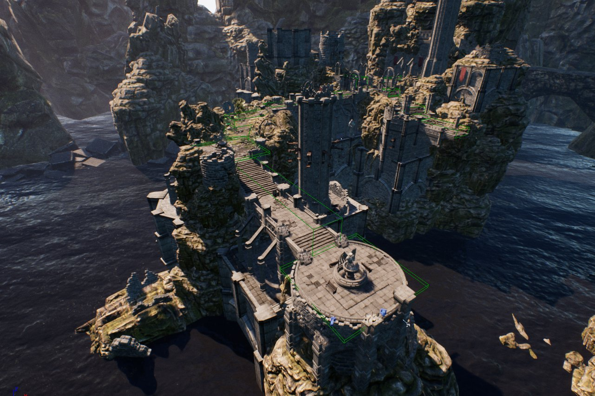
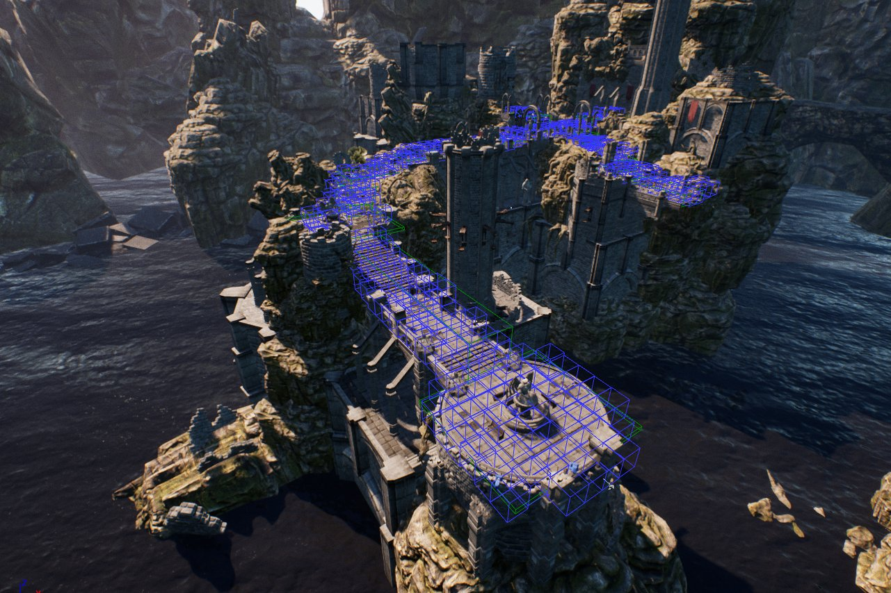
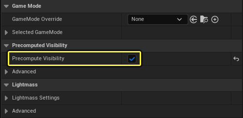
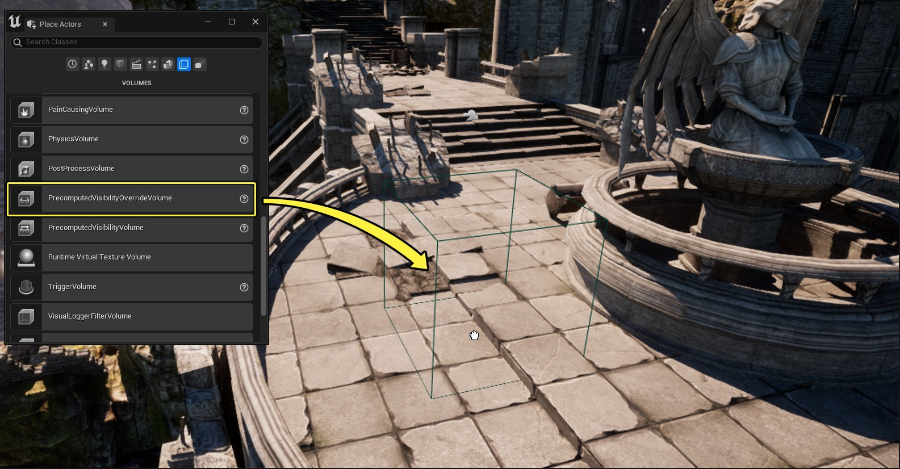
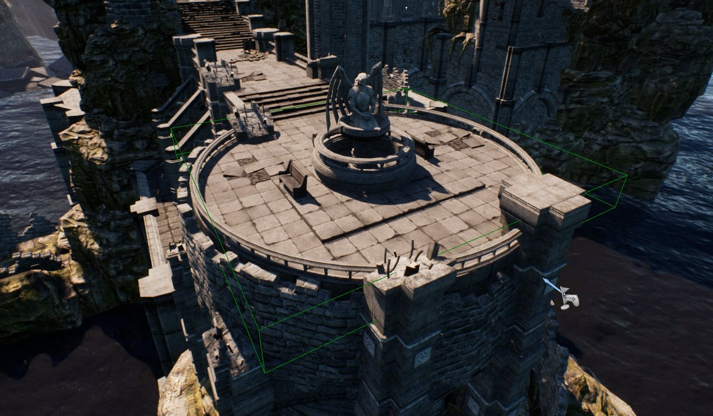
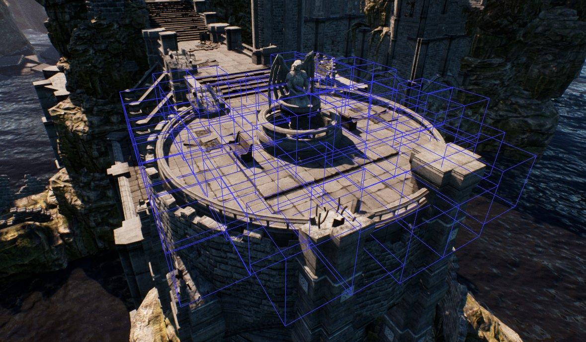
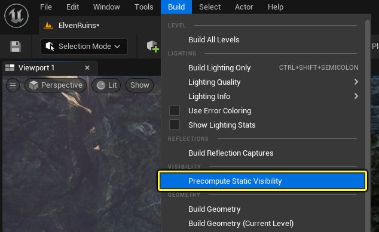
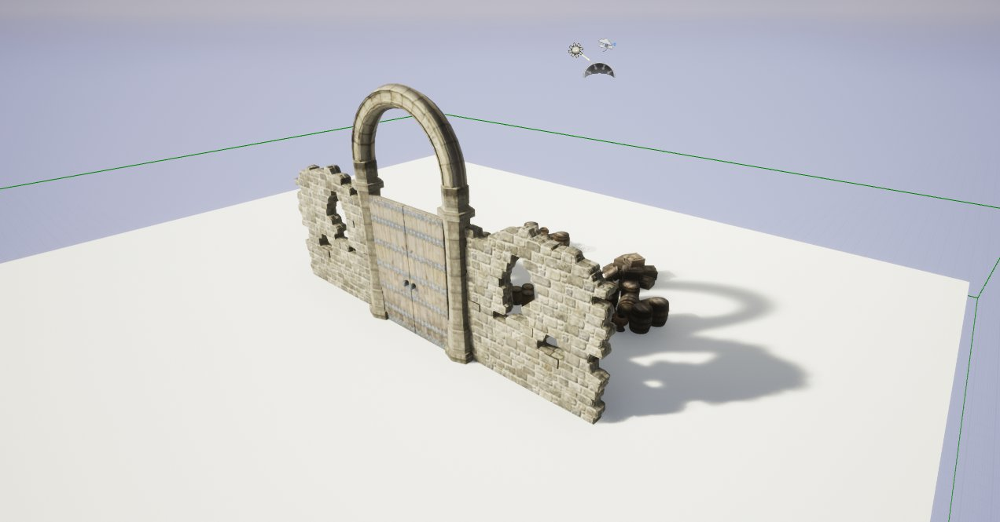

# 预计算可视性体积

> 路径：虚幻引擎5.7文档 / 设计视觉、渲染和图形效果 / 优化和调试实时渲染项目 / 可视性和遮挡剔除 / 预计算可视性体积

> 原始页面：https://dev.epicgames.com/documentation/unreal-engine/precomputed-visibility-volumes-in-unreal-engine

像其他剔除方法一样，**预计算可视性体积** 用于实现中小型场景的性能优化，通常用于因为硬件问题而使动态遮挡剔除受到限制的移动平台。预计算可视性体积根据玩家或摄像机的位置，将Actor位置的可视性状态存储在场景中。因此，预计算可视性对于主要为静态点亮的环境的项目、玩家运动受限和某些2D游戏区域最有用。

在照明构建期间，会在阴影投射几何体上方生成可视性单元格。Actor可视性从每个单元格位置存储。由于预计算可视性是在线下生成的，因此你省去的是通常用于硬件遮挡查询的渲染线程时间，但代价是会增加运行时内存和照明构建时间。基于这一点，建议仅在玩家或摄像机可访问区域放置体积来保持可视性剔除。





示例场景视图

启用了预计算可视性可视化

## 设置和用法

首先，需要为关卡启用预计算可视性。方法是打开 **世界场景设置（World Settings）** 并找到 **预计算可视性（Precomputed Visibility）** 部分。找到后，启用 **预计算可视性（Precomputed Visibility）** 旁边的复选框。



从 **模式（Modes）** 面板中，将 **预计算可视性体积（Precomputed Visibility Volume）** 拖到关卡并调节以适应可游戏区域。

> [!NOTE]
> 请参阅下文的[放置](#%E6%94%BE%E7%BD%AE)以了解获得最佳效果的提示和建议。



在预计算可视性发挥作用前，需要先 **构建照明** 并前往 **显示（Show）>高级（Advanced）>预计算可视性（Precomputed Visibility）** 使用关卡视口来启用预计算可视性单元格（蓝色框）。

> [!NOTE]
> 当你放置体积时，请在玩家可访问区域放置，而不是单个全包含体积。这样，你就不会在运行时存储和加载永远不会用到的可视性数据。





照明构建前的预计算可视性可视化

照明构建后的预计算可视性可视化

> [!TIP]
> 如果你已经构建了照明，可以使用主工具栏中的 **构建（Build）** 下拉菜单，然后选择 **预计算静态可视性（Precompute Static Visibility）** 来生成可视性单元格，而不必每次重新构建照明。
>
> 

### 可视性单元格

在为关卡构建至少一次照明信息后，可以放置任意数量的预计算可视性体积，然后生成可视性单元格来填充任何静态阴影投射Actor的表面。你可以从主工具栏的"构建（Build）"下拉菜单选择 **预计算静态可视性（Precompute Static Visibility）** 选项来生成静态可视性。



> 图片已省略：预计算可视性单元可视化：启用

预计算可视性单元格可视化：禁用

预计算可视性单元可视化：启用

> [!TIP]
> 使用 **r.ShowRelevantPrecomputedVisibilityCells**，以在启用了 **显示预计算可视性单元格（Show Precomputed Visibility Cells）** 的显示标志时，仅在摄像机附近显示可视性单元格。这有助于减少屏幕上一次性呈现的单元格数量。

就这个场景而言，已经放置了预计算可视性体积（绿色），构建了照明，并且墙壁和门遮挡了部分Actor。

下面，为了让你理解预计算可视性如何通过在单元格格中存储Actor位置，隐藏了部分墙壁和门。拖动滑块来移动摄像机位置，查看基于摄像机位置及其所在单元格的可视性状态变化。

> [!NOTE]
> 示例图像中看不到预计算可视性单元格，这是为了更好地显示被遮挡的Actor的可视性状态。

> 图片已省略：undefined

生成预计算可视性后，单元格存储应该从这个单元格位置看到的Actor。在该示例中，由于单元格知道哪些可见哪些不可见，因此遮挡Actor（比如墙壁和门）可以隐藏，被遮挡Actor在摄像机位于预计算可视性单元格中时不可见，因此，这种剔除方法就是非常适用于部分游戏类型和平台的折中方法。

### 为Gameplay设置单元格游戏区域高度

在使用预计算可视性时需要记住的是，缩放与游戏有关，因此，可视性参数将需要针对每个游戏相应设置。

为此，需要更改 `[虚幻引擎根目录]/Engine/Config` 文件夹中的`BaseLightmass.ini`文件中的设置。找到 `DevOptions.PrecomputedVisibility` 部分。

```
[DevOptions.PrecomputedVisibility]bVisualizePrecomputedVisibility=FalsebCompressVisibilityData=TruebPlaceCellsOnOpaqueOnly=TrueNumCellDistributionBuckets=800CellRenderingBucketSize=5NumCellRenderingBuckets=5PlayAreaHeight=220MeshBoundsScale=1.2VisibilitySpreadingIterations=1MinMeshSamples=14MaxMeshSamples=40NumCellSamples=24NumImportanceSamples=40
```

在这些设置中，需要重点关注设置 `PlayAreaHeight`。该值表示可视性单元格位于表面上的高度（虚幻单位）。对于游戏，这应该是摄像机能够位于表面上的最高高度，通常是最高玩家的眼高加上跳跃高度。

> [!TIP]
> 在配置文件中设置 `PlayAreaHeight` 或任何其他设置不需要重新启动引擎。你可以编辑并保存.ini文件，然后使用主工具栏 **构建（Build）** 下拉菜单中的 **预计算静态可视性（Precompute Static Visibility）**。

> 图片已省略：游戏区域高度：220（默认）

> 图片已省略：游戏区域高度：650

游戏区域高度：220（默认）

游戏区域高度：650

使用 **第三人称（ThirdPerson）** 模板，需要考虑几点因素来确定该游戏类型的PlayAreaHeight值应该为多少：

> 图片已省略：pvis_findingcameraheight.png

1. 查找摄像机的最高旋转点。

   - 摄像机可以绕着ThirdPerson模板中的角色360度旋转。最高点大约是距离地面

     395

     个单位。
2. 玩家的跳跃高度。

   - 玩家可以跳到约

     210

     个单位的高度。
3. 摄像机可以到达的最高高度。

   - 用最高摄像机位置（365个单位）加上玩家的跳跃高度（210个单位），摄像机可以到达的最高位置而不会超出单元格的高度就是

     615

     个单位。

知道PlayAreaHeight必须至少为615个单位才能保持摄像机位置（任意垂直旋转），就需要增加一点缓冲才能将摄像机保持在可视性单元格中。有缓冲的高度是 **650** 个单位。对于该游戏类型和摄像机运动，单元格达到这个高度是很合理的。但是，需要记住的是，PlayAreaHeight值越大，需要的运行时内存就越多，因为必须存储更多的Actor可视性状态。

## 使用预计算可视性覆盖体积

通过 **预计算可视性覆盖体积**，如果预计算可视性体积的自动生成结果不是你需要的结果，则可以手动覆盖Actor在场景位置中的可视性。这些也用于性能优化，只应放置在玩家能够访问的区域。

### 放置

要使用这个体积，从 **模式（Modes）** 面板中，将 **预计算可视性覆盖体积（Precomputed Visibility Override Volume）** 拖到关卡并调节以适应可游戏区域。

> 图片已省略：pvis_overridevolume_addtoscene.png

使用 **加号**（**+**）按钮向数组列表添加任意数量的元素。

> 图片已省略：pvis_override settings

对于添加的每个元素，使用拾取器或下拉选择菜单来添加Actor或关卡。

> 图片已省略：pvis_overridesettings_selectActor.png

> [!NOTE]
> 有关更多信息，请参阅[可视性和遮挡剔除设置](../../../optimizing-and-debugging-proj-ea5cf1b9/visibility-and-occlusion-culling/visibility-and-occlusion-culling-reference/index.md)。

## 相关统计信息

在检查预计算可视性的性能时，首先需要查看 **初始视图（Initviews）** 和 **内存（Memory）** 的一些统计信息。这两个统计信息面板用于告知你，预计算可视性的表现情况以及在进程中运行时使用的内存量。

### Stat Initviews

使用命令 **stat initviews** 查看预计算可视性在关卡中的效率。

> 图片已省略：Pvis_StatInitviews.png

点击查看大图。

| 统计信息 | 描述 |
| --- | --- |
| **统计遮挡Primitive（Statically Occluded Primitives）** | 显示截头锥体剔除发生后，预计算可视性确定不可见的Primitive数量。仅当摄像机视图在可视性单元格内部时才可见。 |
| **遮挡Primitive（Occluded Primitives）** | 显示预计算可视性和动态遮挡系统确定不可见的Primitive数量。 |
| **解压遮挡（Decompress Occlusion）** | 显示解压预计算可视性所用的时间。大体积或较小单元格大小可以增大所用内存，从而影响解压所需的时间。 |

> [!NOTE]
> 如果你看不到任何值，很可能是摄像机超出可视性单元格或没有生成预计算可视性。

> 图片已省略：StatInitviews2.png

如果"统计遮挡Primitive（Statically Occluded Primitives）"低于预期值，检查 **世界场景设置（World Settings）>预计算可视性(Precomputed Visibility）** 并查看 **可视性加强（Visibility Aggressiveness）**。设置强度越高，就会剔除越多Actor，但会引起更多可视性错误，例如角落突然跳出Actor。

### Stat Memory

使用命令 **stat memory** 了解为游戏分配的内存使用，更具体地说，是了解预计算可视性。

> 图片已省略：StatMemory.png

点击查看大图。

统计信息 **预计算可视性内存（Precomputed Visibility Memory）** 显示当前用于预计算可视性的实际运行时内存使用。

> 图片已省略：StatMemory2.png

> [!TIP]
> 该统计信息在"在编辑器中运行（PIE）"模式下 **不** 可靠，因为会同时计算编辑器和PIE的内存用量。相反，仅使用"游戏视图中的编辑器"模式或"独立游戏"来获取最准确的结果。

## 限制

预计算可视性具有以下限制：

- 不处理可移动Actor。
- 不处理透光材质，如半透明或遮罩材质。
- 单元格仅放置在表面上方。对启用飞行模式的项目益处不大。
- 不能有效处理流送关卡。所有数据存储在持久关卡。
- 只有静态阴影投射三角形会发生遮挡。
