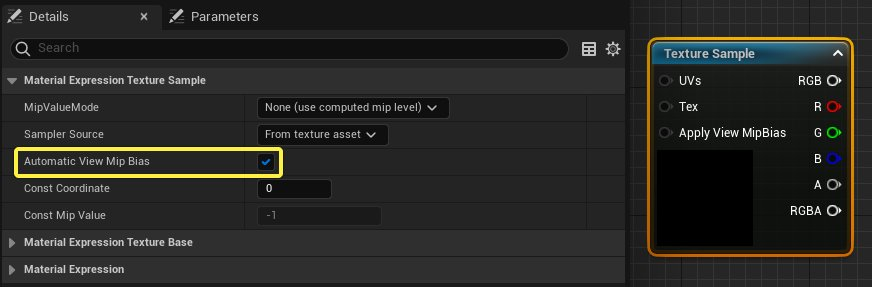
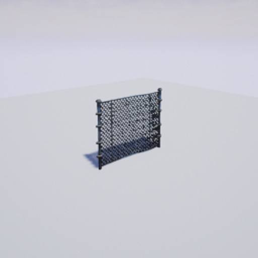
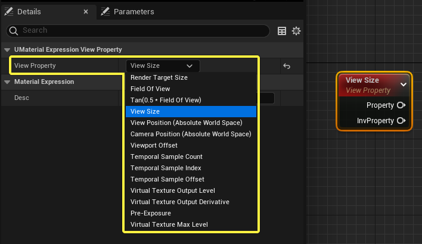
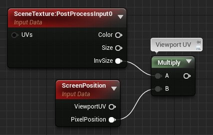
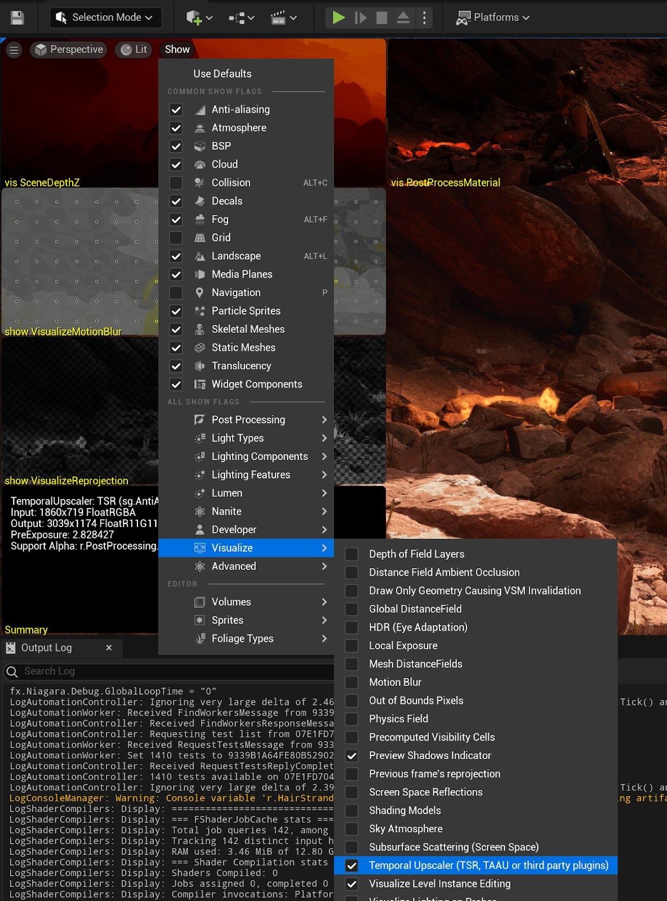
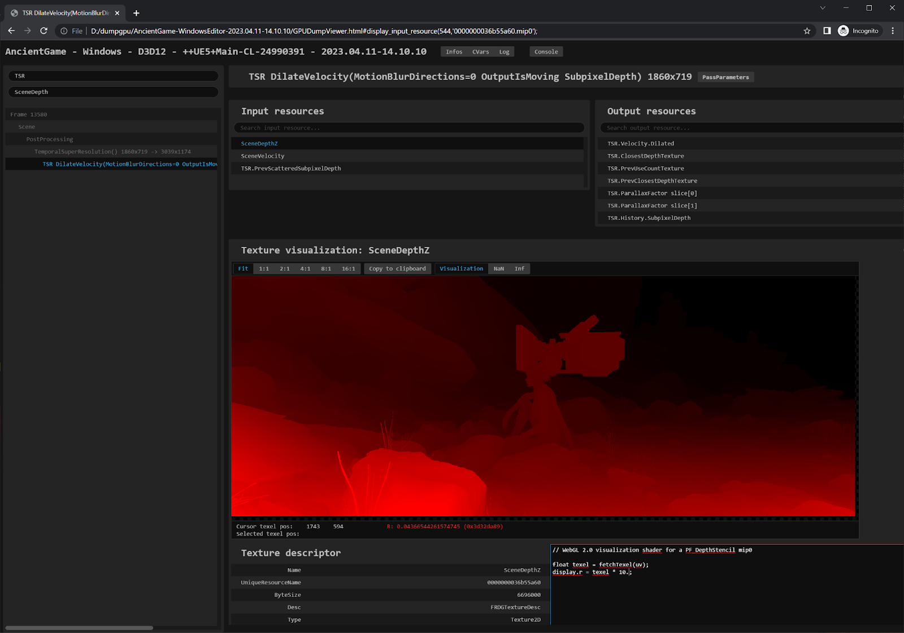
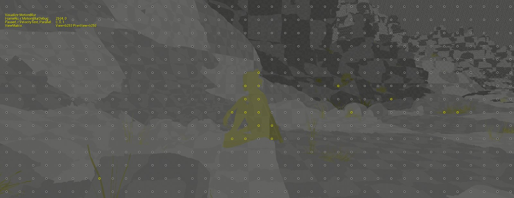
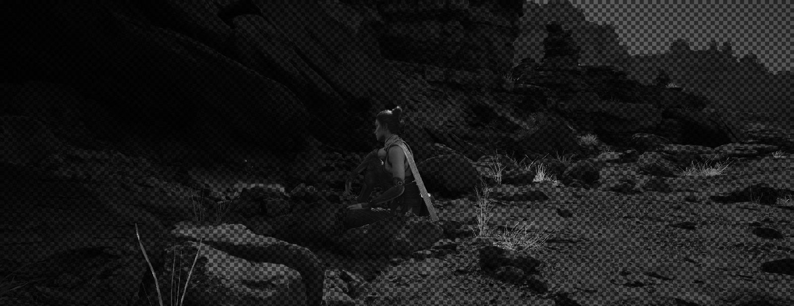

# 时序上采样器

> 路径：虚幻引擎5.7文档 / 设计视觉、渲染和图形效果 / 优化和调试实时渲染项目 / 抗锯齿和上采样 / 时序上采样器

> 原始页面：https://dev.epicgames.com/documentation/unreal-engine/temporal-upscalers-in-unreal-engine

**时序上采样器（Temporal Upscalers）** 使用来自当前和之前帧的数据来产生高质量的增强结果。 无论是虚幻引擎4的Temporal Anti-Aliasing Upscaling (TAAU)、虚幻引擎5的[Temporal Super Resolution](../temporal-super-resolution/index.md)，还是诸如NVIDIA的DLSS 2+ Super Resolution、AMD的FSR 2.0+和Intel的XeSS等第三方插件，时序上采样器都在虚幻引擎里以相同方式运作。它们都在同一位置插入后期处理链--在景深和动态模糊之间。

无论使用哪种时序上采样器，渲染分辨率都是由[Screen Percentage](../../screen-percentage-with-temporal-upscale/index.md)，或在支持时同时由[Dynamic Resolution](../../dynamic-resolution/index.md)来控制。

## 自动视图纹理Mip偏移

屏幕的百分比导致几何体以较低的像素密度进行渲染，所以时序上采样需要更多地从 **表面** 和 **延迟贴花** 材质域中获得每个渲染像素的纹理信息，以保持相同的输出清晰度。

在材料图中选择了 **纹理取样** 节点后，你可以用 **细节** 面板来启用 **自动视图纹理Mip偏移**，设置是否用每个视图Mip偏移来对纹理进行取样，以便用TSR和TAAU等时间抗锯齿方法进行更清晰的输出。

当自动视图Mip偏移结合较低的主屏幕百分比时，它面对大量小的或高频率细节的纹理可能会成为问题，因为更清晰的细节可能会丢失。你可以将 **MipValueMode** 设置为 **MipBias** 补偿，将一些数值应用于纹理取样上的 **Bias** 输入或细节面板中的常量Mip值，或者也可以完全退出用自动视图Mip偏移。

> [!NOTE]
> 只有在启用TAAU或TSR时才会发生自动视图Mip偏移。其他抗锯齿方法，如MSAA和FXAA，不采用此种设置。

## TSR后的后期处理材质

后期处理材质必须从将要使用这些材质的地方选择 **可混合位置** 。**色调映射后** 和 **替换色调映射器** 的选项在渲染链的TSR之后发生。这意味着，它们按完全分辨率运行，不同于视图大小。

**视图属性** 表达式包括 **视图大小** 和 **渲染目标大小** 的选项，后者返回TSR在管线中发生之前的视图分辨率，尽管它实际上是在TSR之后发生的。要知道TSR之后的视图尺寸和纹素UV大小，请将 **场景纹理** 表达式用于带 **Size** 和 **InvSize** 的输出的 **PostProcessInput0**。

如果你想从像素位置重新计算视口UV，请将 **SceneTexture:PostProcessInput0** 乘以 **ScreenPosition** ，如下面例子所示。

## 时序上采样器可视化显示标记

**时序上采样器可视化显示标记** 包括所有，对调试所有时序上采样器中常见重影问题有帮助的相关缓冲区的概述，例如[时序超分辨率](../temporal-super-resolution/index.md)。 , 临时抗锯齿（Temporal Anti-Aliasing）或者其他第三方插件。常见的问题包括物体的速度矢量有误，半透明的重影，内部缓冲区的预曝光过暗，导致TSR被像素的实际曝光量所误导，以及一般由其他渲染算法产生的瑕疵。

你可以从关卡编辑器的 **显示（Show）>可视化（Visualize）** 菜单中选择 **时序升频器（TSR、TAAU或第三方插件）** 来访问这个显示标记。

这种可视化模式包括原始输入和输出缓冲区，以帮助你辨别影响时序上采样器的瑕疵。

| 列 1 | 列 2 |
| --- | --- |
| [undefined](https://d1iv7db44yhgxn.cloudfront.net/documentation/images/56c804b7-c68d-4fa6-bb9f-2911305f3fda/temporal-upscalers-visualization-map.png) | [undefined](https://d1iv7db44yhgxn.cloudfront.net/documentation/images/4cb8e611-bb08-48e2-bd19-33d7560dc29d/vis-temporalupscaler.png) |
| 时序上采样器可视化贴图 | 带有实例场景的时序上采样器可视化 |

这些都是时序上采样器的原始输入和输出。色彩仍然是预曝光的线性颜色空间。

#### 缩略图上标有相应的命令，便于深入挖掘

每个缩略图都有控制台命令的注释，其名称与资源调试工具中使用的资源名称相同，例如[DumpGPU](../../gpudump-viewer-tool/index.md)和其他第三方GPU调试工具。例如，深度缓冲区被称为 **SceneDepthZ**，我们可以使用 `vis SceneDepth` ，对其采用运行时可视化工具 进行可视化。

下面是一个使用[DumpGPU](../../gpudump-viewer-tool/index.md)中SceneDepthZ的TSR通道的例子。

这些是你能用上的一些提示[DumpGPU](../../gpudump-viewer-tool/index.md)，用于调试时序上采样器：

- 使用

  r.DumpGPU.Root *PostProcess*

  来仅转储包含使用时序上采样来加速处理的的后期处理链。具体到TSR，你可以使用

  r.DumpGPU.Root *TSR*

  ，它包括在管线中早期产生TSR.Moire.Luma的通道。
- 如果你发现重影，可以在DumpGPU中调试它。你可以用

  r.DumpGPU.Delay 3

  （单位：秒）将转储的时间从DumpGPU命令的执行中推迟几秒，使你有时间用游戏逻辑重现重影。
- 你可以使用

  r.DumpGPU.FrameCount

  通过DumpGPU转储多个连续的框架。
- 与其他帧调试工具不同，DumpGPU是在虚幻引擎的RHI之上实现的，这意味就像其他的渲染功能一样，它与第三方时序上采样器的二进制文件没有任何不兼容。

#### 深度缓冲区和速度缓冲区的重要性

可视化概述的最左边几列用于诊断常见的时间重投影问题。时序上采样器中的重投影取决于深度缓冲区和速度缓冲区。场景深度缓冲区会直接显示在可视化中，但速度缓冲区的编码方式却不总是容易解释的。相反，VisualizeTemporalUpscaler显示标记会显示 `VisualizeMotionBlur` 和`VisualizeReprojection` —这两个可视化在编辑器视口或在运行时可以通过在控制台输入 `show [command name]` 来使用。

**可视化动态模糊（VisualizeMotionBlur）** 显示标记（位于水平视口的 **显示（show）>可视化（Visualize）**菜单中）可以直观地显示内部速度缓冲器中栅格化的物体的运动，具体表现为方向和长度与渲染器内部编码的运动矢量一致的数组。静态几何体被渲染为灰色像素，因为它们不渲染速度，从而节省GPU性能。它们的像素速度仅仅是通过使用深度缓冲器的镜头运动计算出来的。

可视化重投影（Visualize Reprojection）（位于关卡视口（Level Viewport）的 **Show > Visualize** 菜单中）显示使用运动矢量重新投影显示的前一帧，并以彩色显示当前帧和重新投影的最后一帧之间的任何差异。这表明了，即使运动矢量看起来与物体的运动相一致，它们确实精确地再现了前一帧。这对时序上采样器和其他内部时序上积累的质量很重要。

> [!TIP]
> VisualizeReprojection显示图像，以查看未成功的重投影。如果你因为一个物体没有足够的纹理细节而有怀疑存在错误的动量矢量，可以尝试使用一个有更多纹理细节的材料。这种材料有一个对象间隔的对齐网格，甚至可以在骨骼转换之前对动画的骨架网格体进行工作。

作为参考，下面的场景使用VisualizeMotionBlur和VisualizeReprojection显示标记和原始的内部速度缓冲区（`vis SceneVelocity`）来显示静态几何图形绘制为黑色。

> 图片已省略：vis SceneVelocity

#### 后景深半透明性的重要性

半透明性对于时序上采样器来说是一个特别的挑战，因为它们通常不为重投影绘制深度和速度。大多数时序上采样器会在之前对场景进行编排，而TSR则是在后景深半透明的情况下，对场景颜色进行重投影和编排。为此，VisualizeTemporalUpscaler同时显示后景深半透明缓冲区和后景深半透明的alpha通道缓冲区。

半透明的材料对背景中发生的视觉特效的景深也是一个挑战。无论在材质编辑器中设置在景深之前还是之后绘制，都会变得依赖镜头，并产生半透明排序问题。为了减少时序上采样器的这个问题 `r.Translucency.AutoBeforeDOF` （默认开启）在半透明材料位于焦点距离之后时自动绘制后景深。这简化了半透明的排序问题，鼓励使用半透明的内容尽可能地保留后景深，以便于你使用时序上采样器。

当对焦距离后方的后景深半透明在景深前绘制时，全图的景深模糊使时序上采样器在不引入重影的情况下更方便重投影，因为景深模糊使进入场景颜色输入的噪声最小化。

> [!NOTE]
> 后景深半透明格式是预乘的RGBA，Alpha=半透明度=1-不透明度。它会被组成到场景颜色中，所以 `SceneColor.rgb = SceneColor.rgb * PostDOFTranlucency.a + PostDOFTranslucency.rgb`。

#### 摘要

左下角的 **摘要** 显示有用的信息，驱动时序上采样器。

> 图片已省略：Summary tile

| 摘要项 | 说明 |
| --- | --- |
| **时序上采样器** | 显示正在使用哪种时序上采样器，以及在哪个引擎可扩展性级别上为引擎内的设置。 |
| **输入** | 时序上采样器正在处理的当前分辨率和像素格式。 |
| **输出** | 时序上采样器当前正在输出的分辨率和像素格式。 |
| **预曝光** | 当前诊断预曝光的彩色像素类型问题的格式。如果预曝光被覆盖，这个信息 (`r.EyeAdaptation.PreExposureOverride`) 也能判断。对于时序上采样器来说，重要的是要知道色调映射器所显示的渲染像素的曝光量，以确保正确运作。如果预曝光过低，场景颜色最终会在内部缓冲区中显得异常暗淡，并开始在出于性能原因使用的时序上采样器中遇到各种低位深度的编码问题，这可能会导致重影出现。理论上，预曝光应该是由渲染器内部自动计算的。像这样的边缘情况可能会导致时序上采样器报错。在这种情况下，我们不鼓励你使用 `r.EyeAdaptation.PreExposureOverride`，因为预曝光大多应该是自动的。然而，为了避免渲染器的某一特定问题，通过覆盖预曝光解决是很有用的。 |
| **支持Alpha** | 当 `r.PostProcessing.PropagrateAlpha.` 设置时，是否显示SceneColor的alpha通道和时序上采样器的输出。 |
