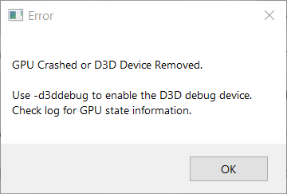
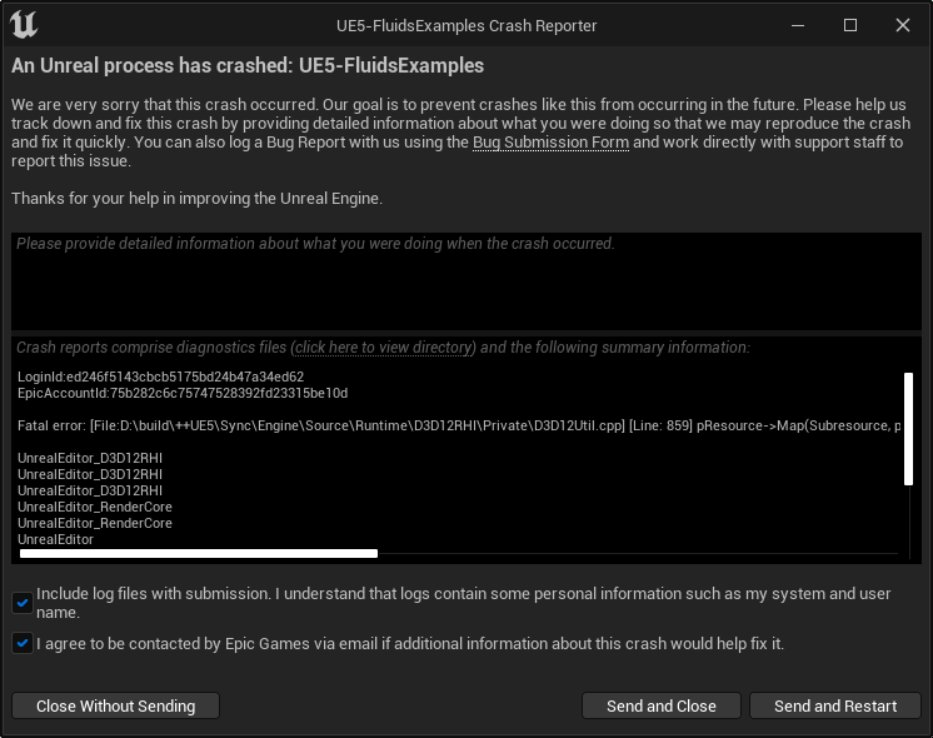
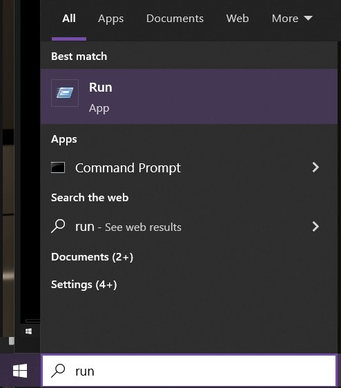
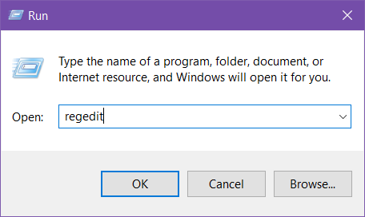
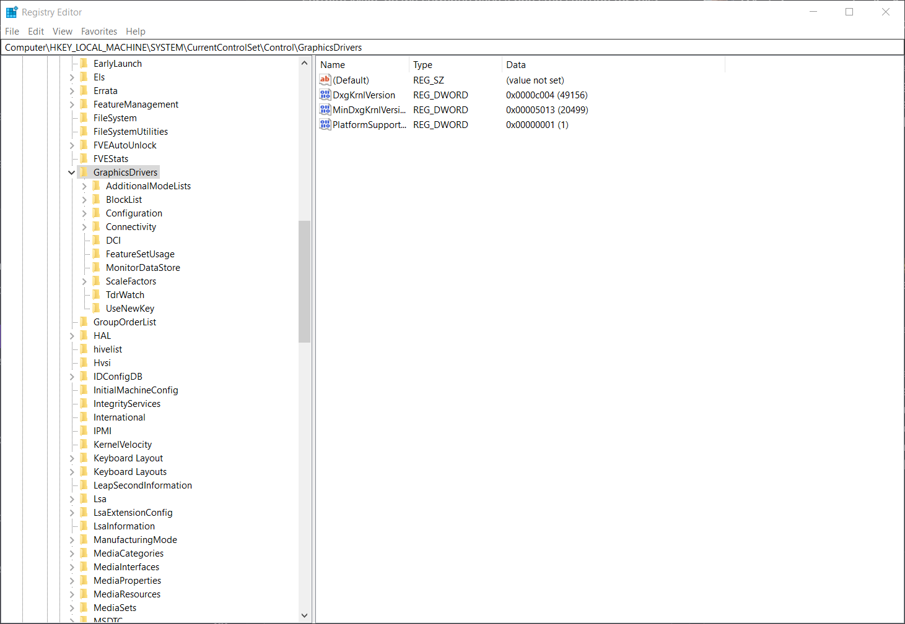
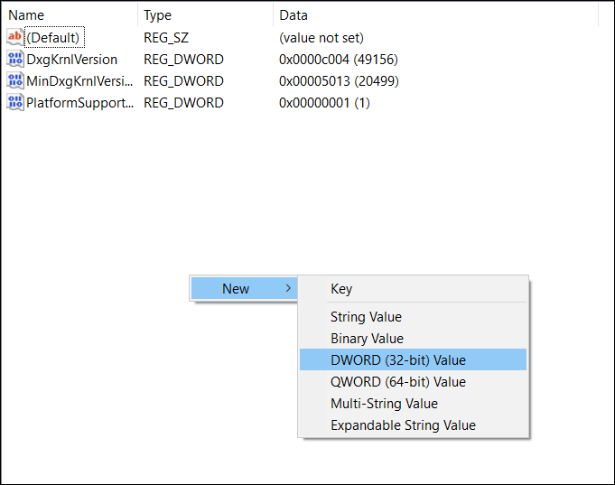
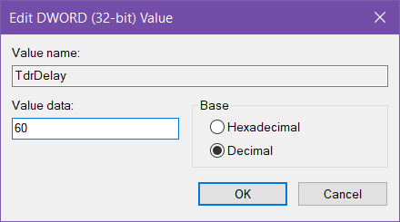
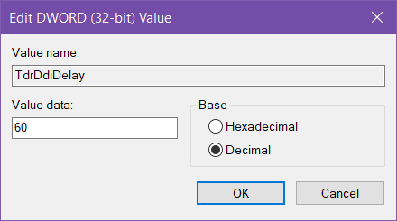

# 如何修复GPU驱动程序崩溃

> 路径：虚幻引擎5.7文档 / 设计视觉、渲染和图形效果 / 优化和调试实时渲染项目 / 如何修复GPU驱动程序崩溃

> 原始页面：https://dev.epicgames.com/documentation/unreal-engine/dealing-with-a-gpu-crash-when-using-unreal-engine

## GPU崩溃情况概述

在处理含有大量图形的项目时，你有可能会遇到GPU崩溃。发生这种情况时，你将看到如下所示的窗口。

接着通常会出现虚幻引擎崩溃报告器窗口。

点击查看大图。

## 发生GPU崩溃的原因

为防止应用程序因使用过多内存而锁死，Windows实施了保护措施。如果一个应用程序的渲染时间超过几秒，Windows就会杀死GPU驱动程序，导致应用程序崩溃。在虚幻引擎这样的应用程序中，无法知道渲染进程的耗时，因此无法在应用程序层面避免崩溃。

## 如何解决此崩溃

在开发项目期间，遇到GPU崩溃的情况并不罕见。但是，有一种方法可在开发过程中避免这种类型的崩溃，就是编辑Windows注册表项，让系统有更多时间运行渲染进程。在本指南中，你将创建两个新的注册表项：`TdrDelay` 和 `TdrDdiDelay` 。

- `TdrDelay` 用于设置超时阈值。即负责处理和存储（VRAM）的GPU调度程序发出抢占请求时，GPU将此请求延迟的秒数。
- `TdrDdiDelay` 用于设置操作系统（OS）允许线程离开驱动程序的时长。该时长耗尽之后，将发生超时延迟故障。

> [!NOTE]
> 要进一步了解注册表项，请查阅Microsoft关于[Tdr注册表项](https://docs.microsoft.com/en-us/windows-hardware/drivers/display/tdr-registry-keys)的官方文档。

> [!WARNING]
> 在Windows操作系统上更改注册表项，可能会产生意外的结果，并需要彻底重新安装Windows。尽管在本教程中添加或编辑注册表项应该不会导致这些结果，但我们推荐你在备份系统之后再继续操作。若因修改系统注册表给系统造成损害，Epic Games概不负责。

你需要将两个注册表项添加到显卡驱动。执行以下步骤来添加注册表项。

1. 在Windows操作系统搜索栏中输入"**run**" 。打开 **运行（Run）** 应用程序。

   

   点击查看大图。
2. 在搜索字段中，输入"**regedit**" 。点击 **确定（OK）** 打开注册表编辑工具。

   

   点击查看大图。
3. 在注册表编辑工具左侧导航栏中找到 **GraphicsDrivers** 分段。此项的位置是 `Computer\HKEY_LOCAL_MACHINE\SYSTEM\CurrentControlSet\Control\GraphicsDrivers`。

   

   点击查看大图。

   > [!NOTE]
   > 注册表项需要添加到 **GraphicsDrivers** 文件夹，而不是其子文件夹。请务必选择正确的文件夹。
4. 你需要的注册表项称为 `TdrDelay` 。如果该注册表项已存在，请双击进行编辑。如果尚未存在，请右键点击右侧的窗格，并选择 **新建（New） > DWORD (32 位)值（DWORD (32-bit) Value）** 。

   
5. 将 **基数（Base）** 设置为 **十进制（Decimal）** 。将TdrDelay的 **值（Value）** 设置为 **60** 。点击 **确定（OK）** 完成。

   
6. 你需要称为 `TdrDdiDelay` 的第二个注册表项。如果该注册表已存在，请双击进行编辑。如果尚未存在，请右键点击右侧的窗格，并选择 **新建（New） > DWORD (32 位)值（DWORD (32-bit) Value）** 进行创建。
7. 将 **基数（Base）** 设置为 **十进制（Decimal）** 。将 `TdrDdiDelay` 的 **值（Value）** 设置为 **60** 。点击 **确定（OK）** 完成。

   
8. 你的注册表现在应该包括 `TdrDelay` 和 `TdrDdiDelay`。

   > 图片已省略：undefined

   点击查看大图。
9. 关闭注册表编辑器。
10. 重启计算机，使这些更改生效。

## 结果

添加这些注册表项之后，Windows现在将等待60秒，再确定应用程序的渲染进程是否耗时太久。如果你仍遇到类似的GPU崩溃，请将注册表项 `TdrDelay` 和 `TdrDdiDelay` 中的 **值（Value）** 从 **60** 更改为 **120** 秒。

虽然这种方法能够很好地遏制基于渲染的GPU崩溃，但并不能解决所有崩溃。如果你尝试同时处理太多数据，无论你将超时延迟设置得多长，GPU都可能会超时。该解决方案只是给你的显卡稍微多提供了一点时间。
