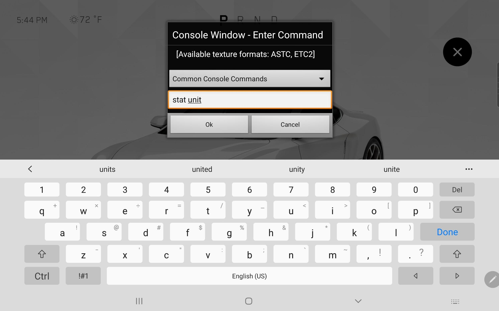
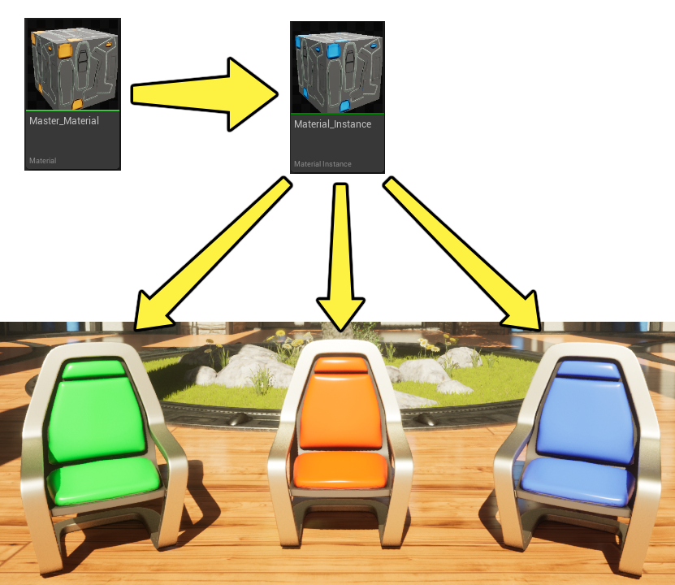
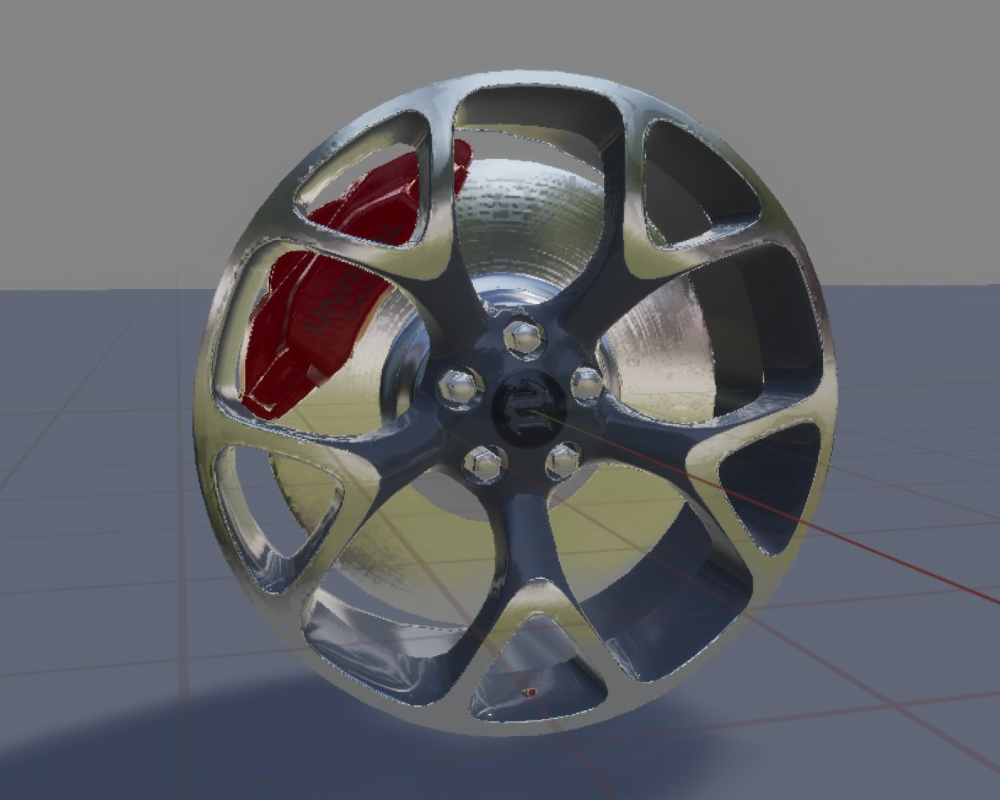
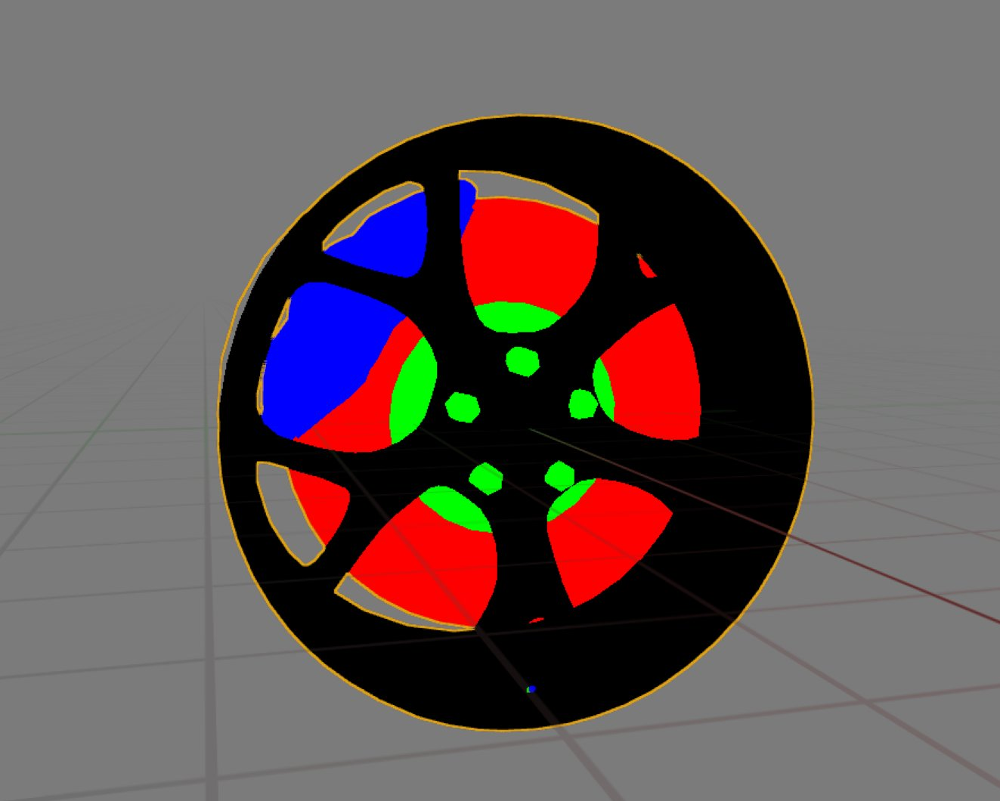
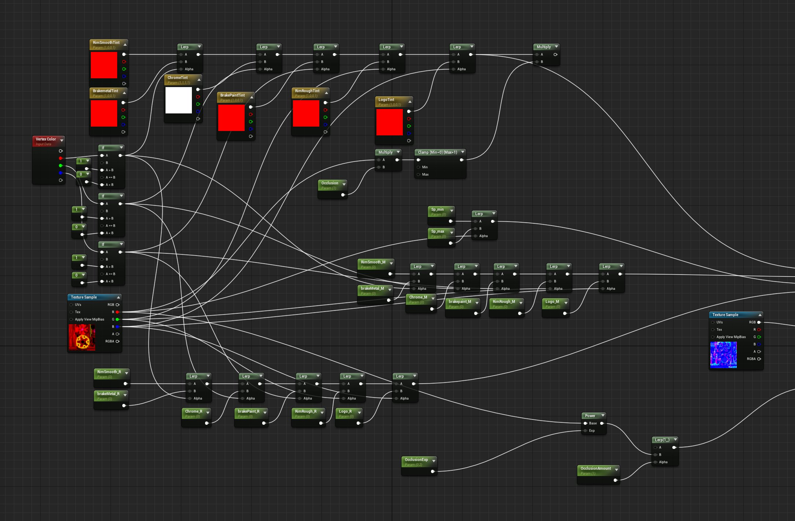
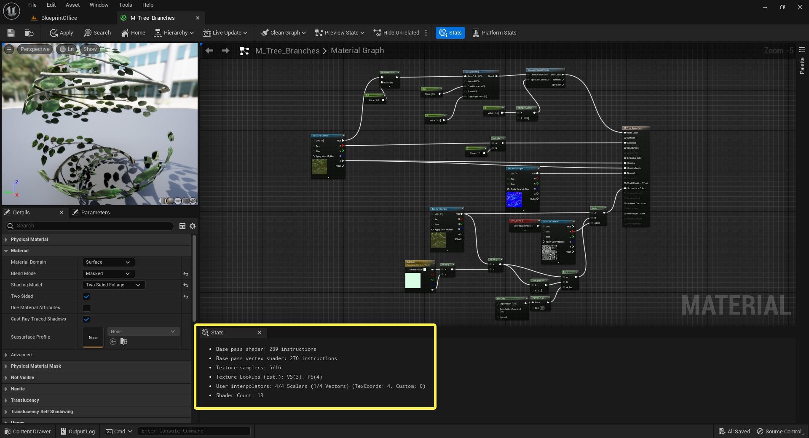
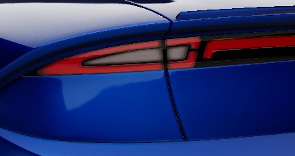
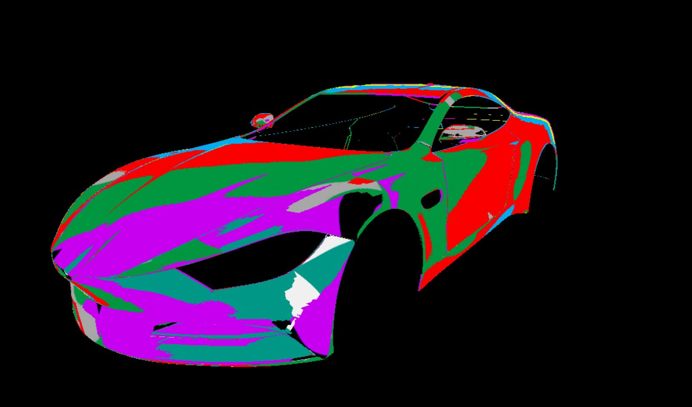

# 实时渲染优化指南

> 路径：虚幻引擎5.7文档 / 设计视觉、渲染和图形效果 / 优化和调试实时渲染项目 / 实时渲染优化指南

> 原始页面：https://dev.epicgames.com/documentation/unreal-engine/guidelines-for-optimizing-rendering-for-real-time-in-unreal-engine

本文提供了关于如何识别并优化移动设备性能的指南和最佳实践，同时介绍了如何在这种情况下获得最逼真的实时渲染功能。

在本文中，你将了解：

- 哪些因素会影响性能预算
- 关于项目打包的最佳实践
- 哪些工具可用于检测性能瓶颈

## 了解你的性能预算

开发项目时，应用程序的目标设备只有有限的可用资源，包括用来保存和处理对象的内存资源。在构建你的项目时，你必须决定将这些资源用于哪些地方。所以，你应该自行了解设备在速度、线程、CPU和GPU带宽方面的能力，以及设备的内存、图形内存和可用磁盘空间，这些都是很重要的考量因素。

此外，你还应该针对目标设备，对你的项目 *进行基准测试（benchmark）*，以此了解其运行方式，以及哪里可能遇到性能瓶颈。你可以在设备上运行要求苛刻的应用程序或技术演示，对设备进行基准测试，然后观察性能统计数据。以这种方式定期对项目进行基准测试十分重要。

### 用于显示性能统计信息的控制台命令

你可以在运行项目时，使用一系列控制台命令来查看性能统计数据。在启动项目后，或在项目打包成开发者版本后，你可以在控制台窗口中输入控制台命令。



移动端应用中的控制台界面。

> [!NOTE]
> 控制台和四指点击命令仅在开发版本中提供。发行或测试版不可用。

你可以在控制台中输入命令以便在界面显示调试信息。以下表格包括提供性能信息的命令列表：

| 命令 | 说明 |
| --- | --- |
| `Stat GPU` | 显示GPU用于不同进程的时间（以毫秒为单位）。 |
| `Stat Unit` | 显示CPU用于不同进程的时间（以毫秒为单位）。还显示游戏线程、渲染线程和GPU时间。 |
| `Stat UnitGraph` | 显示一张图表，图中呈现一段时间内CPU和GPU利用率。这有助于识别峰值。 |
| `Stat TextureGroup` | 显示不同纹理池使用的内存量。 |

> [!TIP]
> 对于你可以用于分析应用程序设备性能的更多控制台命令，请参阅[Stat Command](../../../testing-and-optimizing-content/stat-commands/index.md)。

## 常见性能因素

了解完如何查看性能数据后，接下来你要了解一些最常见的性能影响因素。一旦知道哪些方面会影响你的项目，你就可以使用虚幻引擎的诊断工具快速识别问题。

### 高分辨率法线贴图最佳实践

将高分辨率顶点烘焙到低多边形模型的法线贴图的过程可能比较复杂，并且许多因素会使引擎内部的法线贴图纹理质量降低。用于烘焙法线贴图的工具集有很多，但是我们推荐使用 **XNormal**。Xnormal中的使用过程大致如下：

1. 在Xnormal中将法线贴图烘焙为带有4xAA的8k TIFF。
2. 将TIFF导入到photoshop中，然后将其缩减为1k纹理。
3. 应用值为0.35px的高斯模糊。
4. 将图像从16位转换为8位。
5. 将图像导出到24位TGA。
6. 将最终法线贴图导入虚幻。

为确保烘焙过程中使用的表面法线与引擎中呈现的法线相同，你应从虚幻内部导出已优化法线。将烘焙模型导入虚幻，选择创建自己的法线，然后从虚幻导出烘焙模型，在Xnormal中烘焙。这是创建高质量法线贴图时的重要步骤，因为Xnormal需要了解网格体的表面法线，以便应用高分辨率模型的偏移。

最后，有两个选项可以减少渲染 **静态网格物体** 时的伪像：

- 使全精度UV
- 使用高精度切线基础

这两种设置可以在静态网格体编辑器的 **细节（Details）** 面板的 **LOD** 分段中找到。

### 绘制调用

绘制调用是指查找资产，发生在每一帧。你的应用程序使用的绘制调用次数，取决于场景中独特网格体的数量，以及每个网格体使用的独特材质ID数量。当前，大量的绘制调用是导致图形性能降低的最大原因，因此应尽可能减少。

例如，高度优化的汽车模型可能仅有五六个单独的网格体，并且其中每个组件可能仅具有一种材质。

优化场景中绘制调用的理想目标大致为Galaxy Tab S6上700次，低端硬件上少于500次。HMI项目倾向于使用非常独特或复杂的材质，Galaxy Tab S6上的理想目标是100次，最好是少于50次。

你可以通过控制台命令 `Stat RHI` 输出绘制调用次数。

> [!NOTE]
> 请记住绘制调用次数将取决于你处于PIE模式还是在设备上。|

#### 减少网格体数量

要减少绘制调用，最简单的方式是减少场景中独特网格体的数量。方法有几种：使用引擎内置工具来合并网格体，以及使用可视化剔除工具。

- 合并单独的网格体
- 网格体可以使用外部DCC应用手动合并，比如建模软件。
- 或者，使用编辑器中的世界场景构建工具，比如

  HLOD

  ，将关卡中的网格体和纹理自动合并，生成新的网格体，以此减少绘制调用。
- 可视性剔除
- 引擎使用了多种

  基于可视性和遮挡的剔除

  ，来减少渲染的网格数量。剔除距离体积（Cull Distance Volumes）是一种可放置的体积，它能根据网格体的尺寸和距离摄像机的位置来决定网格体是否被剔除。

#### 减少材质ID数量

要减少网格体中独特材质的数量，则有多种选择。

最简单的方法是使用 **物质绘制器（Substance Painter）** 等程序，将多种材质集成到同一纹理中。这样你就能够利用多种材质，而且都是非常简单的虚幻材质，然后将其用作具有简单纹理输入的 **材质实例** 的基础。此操作还能减少材质指令数，进一步提升性能。



第二种方法将 **遮罩** 用于更程序化的方案。材质可以表示表面的某些特征，例如颜色、粗糙度或金属质量。不用对网格体的不同部分使用单独的材质，你可以将遮罩用于网格体UV的单独部分，并对每个分段应用不同的设置。你可以使用黑白纹理创建基本遮罩，但是使用 **顶点颜色** 更加高效。





Final Render

Vertex Color

在以下示例中，顶点颜色用于定义不同的材质类型，材质定义单独影响这些组成部分外观的参数。顶点颜色遮罩更加高效，分离更清晰，因为它不依赖纹理分辨率。



使用顶点颜色来区分不同材质类型的材质。

### 材质

材质复杂度会提升渲染画面的像素级开销。每个像素的材质指令越多，渲染计算最终值所需花的时间就越多。不透明材质的价格最实惠，但是基于着色模型或基础着色器代码，情况可能截然不同。

你可以在 **材质编辑器** 内的 **统计（Stats）** 窗口中找到有关材料指令数的读数。



正在显示指令数的统计数据窗口。

指令数也会根据材质中数学函数的数量而增加。节点越多，材质的渲染成本就越高。某些特定操作的成本也会较高。尽量限制在构建更复杂材质时的指令数。

**半透明** 材质属于成本最高的材质类型。单独的半透明层的每像素成本较高，当多个半透明层堆叠和渲染时，成本要高得多。这称为 **过度绘制**。

车辆的前灯和尾灯是透明度问题区域的典型示例。在很多情况下，我们使用手绘纹理贴图降低材质复杂性。即使纹理平坦，也可以很好地表明复杂的形状和深度。



### 优化纹理分辨率

项目纹理有几种优化方法。你可以使用内置的[虚拟纹理](../virtual-texturing/index.md)；它允许你几乎使用任意尺寸的纹理，并只绘制屏幕需要的纹理部分。或者，你也可以用传统的纹理绘制方法。

对于虚拟纹理以外的传统纹理方法来说，通常需要占用大量空间，包括内存和磁盘空间。高分辨率纹理尤其如此。虽然高分辨率纹理可以提高保真度，但考虑到设备的屏幕分辨率和纹理的视角，纹理大小带来的收益会减少。使用尽可能小的纹理获取所需的保真度至关重要。

要确定纹理需求，首先要确定 **摄像机位置** 和查看模型的 **视场**（FOV）。这将有助于确定所有网格体和材质的界面空间。

确定摄像机位置后，你可以使用特殊的调试纹理来检查 **Mipmap**，以便确定用于各种材质的纹理分辨率。调试用的Mipmap纹理有助于确定不同组件需要的分辨率，为每张mipmap应用不同颜色。这样你可以很轻松地识别出材质正在使用的mip，以及应该使用哪种纹理分辨率。

创建测试材质时，将mipmap调试纹理连到 **无光照** 材质的 **自发光** 通道，然后将该材质应用于你的网格体。从合适摄像机距离查看网格体时，颜色码将指示引擎用于渲染的mip级别。观察到的最高级别应该是 **法线** 和 **环境光遮蔽** 贴图的原生纹理大小。



添加了调试用Mipmap材质的网格体示例。

## 打包尺寸和启动时间

在打包应用程序及其资产时，需要在磁盘上的包大小与运行时启动性能之间权衡。

启用 **Zlib压缩** 时，应用程序的包会更小。然而，这需要更多的CPU时间加载应用程序，可能会减慢启动速度。为优化启动时间，你可以禁用压缩。

> 图片已省略：undefined

你可以在 "项目设置（Project Settings）" > "打包（Packaging）" 中找到 Zlib 压缩设置。

### 推荐的流送设置

`DefaultEngine.ini` 中推荐了以下流送设置。这样在应用程序启动时为异步加载资产提供了更多时间，可以改善启动时间。

```
	[/Script/Engine.StreamingSettings]	s.PriorityAsyncLoadingExtraTime=275.0	s.LevelStreamingActorsUpdateTimeLimit=250.0	s.PriorityLevelStreamingActorsUpdateExtraTime=250.0 
```

### 推荐的打包设置

`DefaultEngine.ini` 中推荐了以下打包设置。这些设置减少了打包资产时使用的压缩量，因为启动时未压缩.pak文件的加载速度明显快于ZLib压缩文件。

```
	[/Script/UnrealEd.ProjectPackagingSettings]	bCompressed=False	BuildConfiguration=PPBC_Development	bShareMaterialShaderCode=True	bSharedMaterialNativeLibraries=True	bSkipEditorContent=True 
```

## 分析磁盘上的包大小

虚幻引擎有多种实用工具，可以提供资产数据占用空间的深度信息。

### 尺寸图

**尺寸图** 可读取和对比编辑器中的相对资产内存消耗。必须启用 **AssetManagerEditor** 插件才能使用。之后，右键点击内容浏览器（Content Browser）中的文件夹，从上下文菜单中选择 **尺寸图（Size Map）**即可访问。

> 图片已省略：图像替换文本

尺寸图将显示带有图标的窗口，图标代表文件夹和文件占用的内存量。图标越大，文件消耗的空间越大。

> 图片已省略：图像替换文本

有关使用尺寸图的更多信息，请参阅[烘焙和分块](../../../sharing-and-releasing-projects/index.md)。

> [!NOTE]
> 尺寸图可读取编辑器中使用的资产空间大小。打包项目后，内存消耗会有所不同。这是因为在烘焙过程中会出现不同类型的压缩。一般来说，尺寸图代表资产可能占用的最大尺寸。

### 统计数据

**统计数据** 工具提供关于 **关卡** 中资产使用的更多详细信息。可以在 **窗口（Window）** 下拉菜单中找到。

> 图片已省略：图像替换文本

此统计数据窗口将细分关卡文件中的资产数量，可以显示所有关卡，也可以仅显示特定关卡。**Primitive统计数据** 列出关于三角形数量、内存消耗和计数的信息。

> 图片已省略：undefined

正在显示图元数据的统计窗口。

此列表中显示的其他数据包括纹理使用和静态网格体光照信息。统计数据窗口的列表模式可以快速展示哪些资产消耗的内存最多。**烘焙器统计数据** 也很有帮助，因为其中列出了最后一个打包过程烘焙的所有资产。

### 内存报告

统计数据和尺寸图工具向你展示虚幻引擎中文件的数据占用空间，控制台命令 `Memreport -full` 可以用于安装在目标设备上启动的应用程序。这可以提供文件尺寸的详细且准确的信息，因为它们存在于设备压缩设置中。

应用程序在开发配置中构建并加载到设备后，你可以打开控制台窗口并输入命令。此内存快照保存在设备的项目目录中。目录通常为 `UE5Game/[YourApp]/[YourApp]/Saved/Profiling/Memreports/`，但可能会有变化。

`.memreport` 文件是可以在大多数文本编辑器中读取的文本文件。文本开头包含一些关于已分配内存和池尺寸的信息，而文本的大部分内容显示已加载关卡、RHI统计数据、渲染目标、场景信息等记录。所有此类信息都很有价值，因为它们代表完成烘焙和打包过程的实际数据。

如果你搜索 **列出所有纹理（Listing all textures）**这个短语，你将在应用程序中找到每种纹理的列表，以及关于纹理类型、分组、尺寸和内存空间的详细信息。列表按内存大小排序，首先显示较大的纹理。这个方法可以快速简便地找出什么纹理消耗内存最多。

## 分析启动时间

影响启动时间的因素包括以下内容：

- 加载和解压初始资产所需的时间
- 应用程序的总尺寸
- 需要在用户的安装中激活的任何插件
- 需要解析的字符串数量
- 用户设备上的任何内存分配或分片

有数种不同的工具可用于分析应用程序的启动时间，但最推荐使用的是 **Unreal Insights**，因为它可以远程分析目标设备的性能数据。有关此工具集的完整信息，请参阅[Unreal Insights分段](../../../testing-and-optimizing-content/unreal-insights/index.md)。
