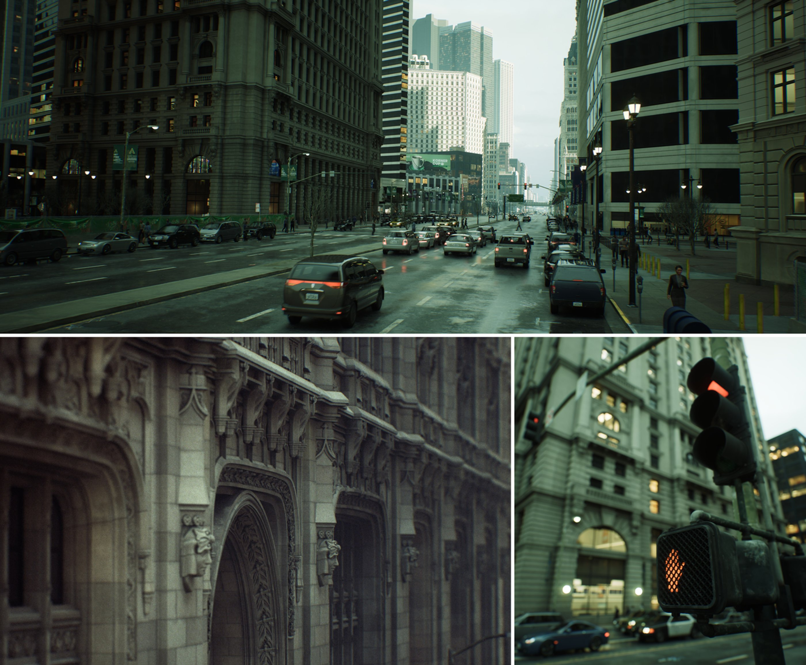

# Nanite虚拟几何体

> 路径：虚幻引擎5.7文档 / 设计视觉、渲染和图形效果 / 优化和调试实时渲染项目 / Nanite虚拟几何体

> 原始页面：https://dev.epicgames.com/documentation/unreal-engine/nanite-in-unreal-engine

Nanite是虚幻引擎的虚拟化几何体系统，它采用内部网格体格式和渲染技术来渲染像素级别的细节以及海量对象。 它可以智能地仅处理你能够感受到的细节。 另外，Nanite的数据格式也经过高度压缩，并且支持细粒度

《城市示例》范例项目中Nanite用于几何体细节。

### 入门指南

- [Nanite虚拟几何体概述](nanite-virtualized-geometry/index.md) - 了解Nanite的虚拟几何体系统，以及它实现像素级的细节和海量对象的原理。

- [Nanite Technical Details](nanite-technical-details/index.md) - Dive into the technical details of using Nanite's virtualized geometry system.

### 其他主题

- [Working with Nanite-Enabled Content](working-with-naniteenabled-content/index.md) - Some examples and use cases of how to work with Nanite content in your projects.

- [Hybrid Non-Nanite and Nanite Content Workflows](hybrid-nonnanite-and-nanite-content-workflows/index.md) - Workflows for projects using both Nanite and Non-Nanite content.

- [Nanite植被](nanite-foliage/index.md) - Nanite植被及其渲染管线概述。

- [Nanite程序集](nanite-assemblies/index.md) - 关于Nanite程序集及其创建方法以便用于Nanite植被的概述。

- [在地形中使用Nanite](../../../building-virtual-worlds/landscape-outdoor-terrain/using-nanite-with-landscapes/index.md) - 介绍如何将Nanite虚拟化几何体用于地形系统。
