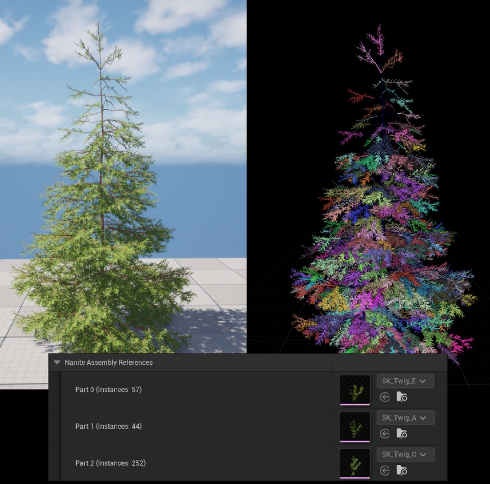

# Nanite程序集

> 路径：虚幻引擎5.7文档 / 设计视觉、渲染和图形效果 / 优化和调试实时渲染项目 / Nanite虚拟几何体 / Nanite程序集

> 原始页面：https://dev.epicgames.com/documentation/unreal-engine/nanite-assemblies

**Nanite程序集**是[Nanite植被](../nanite-foliage/index.md)系统的核心组件，专为高效渲染复杂且可重复的几何体（如树木枝干和叶片）而设计。 作为静态和骨骼网格体的补充功能，它支持对小型高精度部件进行“微实例化”。

Nanite程序集是Nanite植被渲染管线中至关重要的一环。 若没有它们，我们将因磁盘空间或流送内存不足，而无法渲染如[Unreal Fest《巫师4》技术演示](https://youtu.be/Nthv4xF_zHU?si=wdKXM3loFJVr2rLG)中那样的大型森林场景。

在演示的上述场景中，最大树木的磁盘占用从**3.5 GB**骤降至约**29 MB**。 经测量，仅单一视图下的一棵树，其流送内存占用就从约**36 MB**降至**2.7 MB**左右。 正是这种程度的资源节省，使得在场景中渲染50万个包含数十种变体、且每棵树都拥有100万至1000万多边形的高精度树木实例成为可能。

## Nanite程序集的工作原理

Nanite程序集是用于构建Nanite植被的**部件**网格体的集合。 它们是在单个植被上实例化的、高度详细的网格体。 这些实例在程序集的本地空间内进行位置、旋转和缩放变换。 你可以将这些部件与非实例化的基础网格体（如树干）结合，从而构建出完整的植被。

|  |  |
| --- | --- |
|  |  |
| **Nanite程序集部件** | **在基础骨骼网格体上实例化的Nanite程序集。** |

对于骨骼网格体，这些部件可附着至一个或多个骨骼上，并拥有独立的权重以处理变形。 这使得创建能够正确响应骨骼动画（例如对动态风做出反应）的精细动画植被成为可能。

随风动态演示的Nanite植被骨骼网格体。

运行时，Nanite会动态处理程序集的细节级别（LOD）。 这意味着在靠近相机处，程序集的各个部件将作为Nanite实例进行渲染，从而保留所有几何细节。 随着物体在屏幕上变小，Nanite渲染系统会智能地简化这些部件以降低复杂度，直至整个程序集仅由一个简化集群表示。 这样可以确保最佳性能。

## Nanite程序集与标准实例化对比

采用标准实例化时，必须考虑两点：内存开销以及渲染距离。

对于构建广阔森林所需的庞大实例数量，标准实例化会在GPU场景缓冲区中产生显著的内存开销。 此外，无论远近，渲染这些实例时，每个可见实例至少需要绘制一个根集群。 若在数千棵树上实例化数千根树枝，意味着即便在最简单的场景下，也要光栅化数百万个集群才能维持高细节级别。

针对这两种情况，Nanite程序集在性能和视觉保真度方面都表现得更为出色。 程序集每个实例的开销要小得多，因为它们本质上只是一个大型矩阵数组。 性能上的权衡意味着，对于Nanite程序集部件，你无法像在材质图表中那样使用每实例数据来实现某些效果。 但这意味着在构建阶段，程序集部件的根集群会被合并以创建最低分辨率级别，从而在远距离将程序集简化为单个集群，这相当于拥有了内置的层级细节级别（HLOD）。

在更远的距离，这些简化的独立部件实例会被合并，其几何体将被视为基础网格体的一部分——此时部件不再具备实例的特性。 正因如此，程序集部件的材质图表中并未公开每实例数据。

## Nanite程序集骨骼网格体示例

下图展示了**骨骼程序集**树的基础网格体（即树干和粗枝）三角形存储在资产本身中，同时引用了附着在枝干上的程序集**部件**网格体（即细枝）。 这些细枝仅仅是Content文件夹中的其他小型骨骼网格体资产。

对于骨骼网格体程序集，每个部件实例都绑定到基础网格体骨骼上的一个或多个骨骼，从而使其轴心能随基础网格体产生动画效果。

> [!NOTE]
> 目前，骨骼程序集部件的顶点**未蒙皮**，因此它们仅能以绑定姿势进行刚性运动。

树木及其程序集部件实例的渲染示例。

## 创建Nanite程序集

虚幻引擎提供了一些实验性插件，可帮助你通过导入或在编辑器中直接创建Nanite程序集。 以下为插件名：

| 插件名称 |  | 说明 |
| --- | --- | --- |
| **Nanite Assembly Editor Utilities** |  | 用于从蓝图创建Nanite程序集。 它向编辑器蓝图公开了创建静态和骨骼程序集的功能。 |
| **Procedural Content Generation Framework (PCG) Nanite Assemblies Interop** |  | 用于从PCG图表生成静态网格体Nanite程序集。 |
| **程序化植被编辑器** |  | 这是一个基于图表的编辑器，用于直接在编辑器中创建高质量且适配Nanite的植被。 它应用现实世界的植物学原理，模拟自然生长模式，并支持对不同植被物种进行定制和变体制作。 |
| **USD导入器** |  | 你可以直接从USD文件导入Nanite程序集。 USD核心插件中包含了用于制作程序集的模式。 |

### 使用USD导入Nanite程序集

利用**USD导入器**插件，你可以将USD文件中的Nanite程序集导入到虚幻引擎中。 制作程序集所需的相关模式包含在**USD核心**插件中。 具体包括`NaniteAssemblyRootAPI`、`NaniteAssemblyExternalRefAPI`和`NaniteAssemblySkelBindingAPI`。

有关使用这些模式的更多信息，请参阅源代码中提供的相关文档。

### 使用Nanite Assembly Editor Utilities在编辑器中创建

你可以使用**Nanite Assembly Editor Utilities**插件在编辑器中创建程序集。 该插件将`UNaniteAssemblyStaticMeshBuilder`和`UNaniteAssemblySkeletalMeshBuilder`公开给蓝图，为你从现有资产创建程序集提供了强大手段。

此外，该插件还包含以下关卡编辑器脚本化操作：

- 从关卡编辑器中选中的静态网格体创建静态网格体程序集。
- 从骨骼网格体Actor及其附带的任何骨骼网格体组件创建骨骼网格体程序集。

### 使用程序化植被编辑器在编辑器中创建

**程序化植被编辑器**（PVE）是一款功能强大的图表化工具，已集成至虚幻引擎及[程序化内容生成（PCG）](../../../../building-virtual-worlds/procedural-content-generation/index.md)框架中。 它允许用户直接在编辑器中创建高质量且适配Nanite的植被资产。 PVE利用现实世界的植物学原理，通过激素分布和适应性响应来模拟植物的生成过程。

程序化植被编辑器（PVE）及其灌木示例。

关于此工具及其用法的更多详情，请参阅[程序化植被编辑器](../../../../building-virtual-worlds/procedural-content-generation/procedural-vegetation-editor-pve/index.md)。

## 已知限制

请注意以下当前的限制：

- 无法基于其他程序集创建嵌套程序集。 系统目前仅支持单层实例化。
- 引用相同部件网格体的程序集之间不会复制几何体。 每个程序集都会存储一份独立的部件数据。
- 对于骨骼网格体，无法对单个部件进行姿势调整——它们仅能以绑定姿势进行渲染。

  - 未来的更新将加入对单个部件实例化动画的支持。
