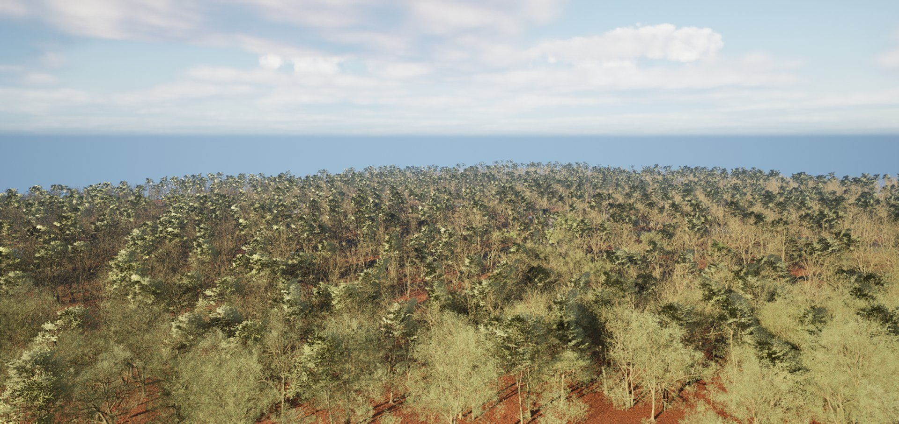
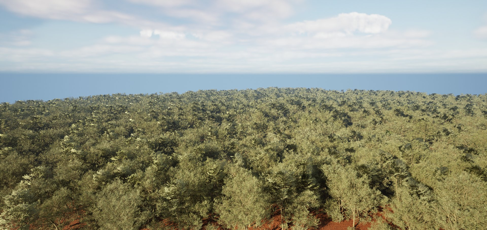
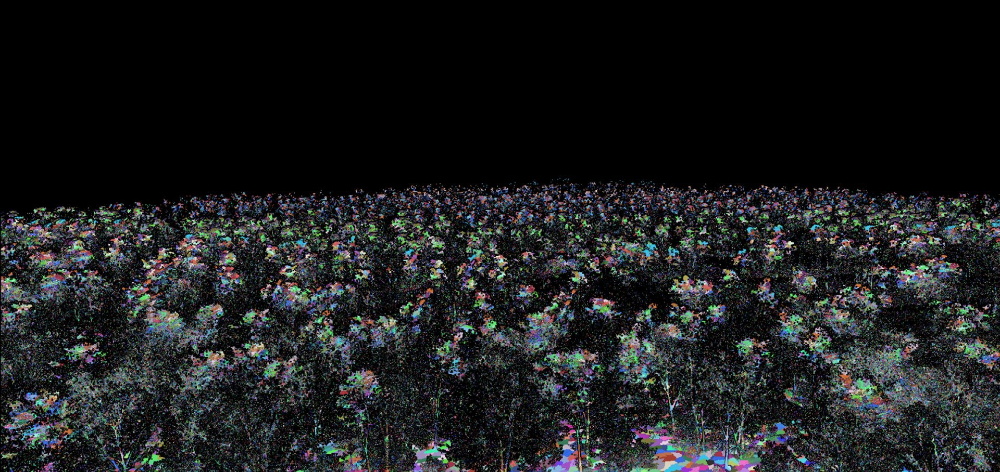
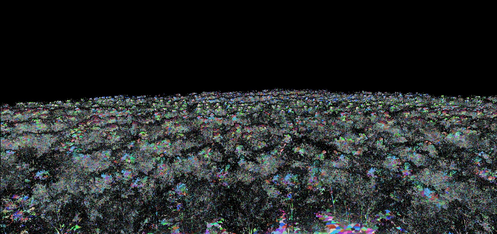

# Working with Nanite-Enabled Content

> 路径：虚幻引擎5.7文档 / 设计视觉、渲染和图形效果 / 优化和调试实时渲染项目 / Nanite虚拟几何体 / Working with Nanite-Enabled Content

> 原始页面：https://dev.epicgames.com/documentation/unreal-engine/working-with-naniteenabled-content

该页面没有可用的官方中文版本；以下内容保留原文，并按本项目人工译文规则逐步回译。

在大多数情况下，Nanite 会随屏幕分辨率很好地扩展。它依赖两项技术：fine-grained level of detail 和 occlusion culling。通常这意味着，无论场景源数据的几何复杂度如何，Nanite 尝试实际绘制到屏幕的三角形数量都会保持一致，并与像素数量成比例。

Nanite 遵循一个设计原则：绘制远多于像素数量的三角形没有意义。

不过，有些内容会破坏 Nanite 用于扩展的技术；这并不表示这类内容完全不应使用 Nanite，也不表示它不会比传统渲染管线更快。它只表示，对于这类内容，“随像素数量扩展而非随场景复杂度扩展”的规律不再适用。请使用

Profiling（性能分析）

Unreal Engine 提供的 profiling 功能，在这类情况出现时进行监控。

## Aggregate Geometry（聚合几何体）

Aggregate geometry 指由许多彼此分离的部分组成、在远处会形成体积感的几何体，例如头发、树叶和草。这类几何体会破坏 Nanite 的 level of detail 与 occlusion culling 技术。Nanite 本质上是 hierarchical level of detail 结构，它依赖于把小三角形简化成较大三角形，并在判断差异小到不可感知时选择更粗略版本。对连续表面来说这很有效，但对远看更像半透明云团而非实体表面的 aggregate geometry 效果不好。因此，Nanite 更可能判断无法像处理典型实体表面那样大幅降低 aggregate geometry，结果是在覆盖相同像素数量时绘制更多三角形。

Aggregate geometry 还会破坏 Occlusion Culling。虽然 Nanite 的遮挡剔除粒度很细，但不是 per-pixel 粒度。布满孔洞的几何体，尤其是一层又一层布满孔洞的几何体，会造成 excessive overdraw，因为屏幕上这一区域需要累积许多 depth layer，才会遮挡其后的内容。可以想象屏幕上的 8x8 像素区域：在每个像素都被填满之前需要绘制多少个 depth layer。excessive overdraw 意味着在覆盖同样像素数量时，Nanite 会尝试绘制更多三角形，从而使渲染变慢。

Foliage 是最明显会导致 occlusion culling 问题的案例，但即便如此，也不表示 foliage-type mesh 完全不应使用 Nanite。请参阅下方 [Foliage Using Nanite（使用 Nanite 的植被）](https://dev.epicgames.com/documentation/en-us/unreal-engine/nanite-virtualized-geometry-in-unreal-engine?application_version=5.5) 一节了解更多信息。建议针对不同用例进行实验，确认哪些方式适合项目。请使用 profiling tool 确认 Nanite 在这类 mesh 上能获得良好性能。

## Closely Stacked Surfaces（紧密堆叠表面）

传统 mesh 的 occlusion culling 由于实际限制，使大规模 kitbashing workflow 几乎不可行。Nanite 的细粒度 occlusion culling 让开发期间使用这类 workflow 变得更可行。如上方 Aggregate Geometry 一节所述，overdraw 可能来自隐藏表面与其下方可见表面非常接近的情况。如果某些几何体深埋在可见表面下方，Nanite 可以以较低成本检测并剔除它，几乎可视为免费。但当堆叠几何体在最上层表面附近彼此非常接近时，Nanite 无法判断哪个在上哪个在下，导致二者同时绘制。

这种剔除问题属于 worst-case scenario：Nanite 不知道哪个表面在上，于是绘制所有 layer。这类不精确会随屏幕尺寸和距离变化而放大；虽然近距离下 10 厘米的层间距看起来没问题，但距离更远时，距离差可能小于一个像素，从而产生 overdraw。

|  |  |
| --- | --- |
|  |  |
| Game View（游戏视图） | Nanite Visualization 显示许多紧密堆叠 mesh 的 instance。 |

在下方示例中，如果把 camera 移到俯视角色站立区域的位置，Nanite Overdraw visualization 会显示这些堆叠表面如何被渲染。更亮的区域表示该区域的 overdraw 比其他区域更多。

Overdraw visualization 是发现 overdraw 问题最有效的方式。虽然应预期存在一定 overdraw，但过量 overdraw 会导致更高的 Nanite culling 与 rasterization 成本，并使 Nanite 独立于场景复杂度扩展的能力变弱。

## Faceted and Hard-edge Normals（分面与硬边法线）

导入带有 faceted normal 的高细节 mesh 时要小心，这表示两个不同 polygon 之间的 normal 没有平滑。这个问题很常见且容易忽略，需要谨慎避免，因为 mesh 中 vertex sharing 很少会显著增加渲染性能和数据大小成本。理想情况下，mesh 的 vertex 数量应少于 triangle 数量。如果比例达到 2:1 或更高，很可能有问题，尤其是在 triangle count 很高时。3:1 的比例意味着 mesh 完全分面化，每个 triangle 都有自己独立的三个 vertex，且不与其他 triangle 共享。多数情况下，这是 normal 未被平滑导致彼此不同造成的。

基于这一点，更多 vertex 意味着需要存储更多数据，也意味着更多 vertex transform 工作；高于 2:1 的比例会落入一些较慢的渲染路径。有意在 hard surface modeling 中使用硬边通常没有问题，也没有理由不用。但意外产生的 100% faceted 高密度 mesh 会比预期昂贵得多。另一个需要注意的问题是：在其他 DCC package 中生成的 dense organic-type surface，若导入 normal 时带有适合低多边形 mesh 的 hard normal threshold，在 Nanite 中可能会带来不必要开销。

例如，在下方两个 mesh 中，左侧 mesh 使用 faceted normal，右侧 mesh 使用 smoothed normal。使用 Nanite Triangles visualization 比较二者时，可以明显看到 Nanite 绘制它们时使用的 triangle 数量不同。左侧分面 mesh 绘制的 triangle 明显多于右侧平滑 mesh。

|  |  |
| --- | --- |
|  |  |
| 启用 Nanite 的 mesh：faceted normal（左）与 smoothed normal（右） | 启用 Nanite 的 mesh 的 Nanite Triangle Visualization：faceted normal（左）与 smoothed normal（右） |

## Nanite Skeletal Mesh（Nanite 骨架网格体）

> 动图已省略：27b187322e64c587a7a23af2d55586cf03b79992318952ec172a86b4ca49ae09

Nanite Skeletal Mesh 支持：

- 新的 Skeletal Mesh API 简化其渲染。
- 整个 mesh 使用一个 draw call。
- 来自 virtual shadow map 的 shadowing。
- 没有 geometry LOD；Nanite skeletal mesh 使用 animation LOD。
- 使用 animation bank 进行 instancing。

## Foliage Using Nanite（使用 Nanite 的植被）

> [!NOTE]
> 使用 Nanite 的 foliage 目前视为 Beta，仍在积极研究和开发。本节提供一些在 foliage geometry 中使用 Nanite 的指导，但它不是 Nanite Foliage 功能集说明。

对于使用默认 Nanite 设置的树木等资产，可能会发现树冠随距离变远而变稀。这类情况是一种特殊形式的 [Aggregate Geometry（聚合几何体）](https://dev.epicgames.com/documentation/en-us/unreal-engine/nanite-virtualized-geometry-in-unreal-engine?application_version=5.5) 其中每个分离部分（如叶片或草叶）在边界处有 open edge。启用 Preserve Area 有助于防止启用 Nanite 后出现这种变稀现象。当 Nanite 通过减少 triangle 数量来简化远处几何体时，最终需要完全移除某些分离元素。如果 Nanite 没有更多信息，结果看起来会变稀，因为表面积大量丢失。Preserve Area 会通过向外 dilate open boundary edge，把丢失的面积重新分配给剩余 triangle。对于叶片这类对称形状，dilation 的效果类似放大；对草叶 ribbon 等非对称形状，则有加厚效果。

> [!NOTE]
> 建议对所有 foliage mesh 使用 Preserve Area，但不要对不打算作为场景 foliage 使用的 mesh 启用它。





未启用 Preserve Area。

启用 Preserve Area。

Nanite Cluster visualization 可以更清楚地显示 Preserve Area 设置如何重新分配丢失面积。





未启用 Preserve Area 的 Nanite Cluster Visualization。

启用 Preserve Area 的 Nanite Cluster Visualization。

下面是面向 Nanite 使用和制作 foliage asset 时的一些建议。我们仍在实验并学习最佳方法。目前我们看到，使用 Nanite 的 foliage 应采用不同于以往的制作方式；如果能发挥 Nanite 的优势，可以获得更快、更高质量的结果。

- 使用 Preserve Area（在 Static Mesh editor 中启用）。
- 使用 geometry，而不是 masked card。

  - 与 Opaque material 相比，Masked material 成本相当高。完全不使用 masked material 往往可以获得最快结果。
  - 传统 card 做法（许多元素由单个 card 表示）搭配 Nanite 时可能比 non-Nanite 更慢。不要预期在 card-based foliage 上启用 Nanite 一定会提升性能。
  - 被 mask 掉的像素成本几乎与实际绘制像素相同。
  - 实践显示，geometry foliage 搭配 Nanite 比 card 做法更快，无论是 Nanite card 还是 non-Nanite card，并且视觉效果也更好。

    - Fab 上的 Megascans: Grass pack 提供了适合测试的示例。该包同时提供 masked high-poly geometry（每个元素独立）以及 masked low-poly card（许多元素由单个 card 表示）。
- 使用 World Position Offset（WPO）时，vertex 越多成本越高。必须限制并监控 WPO logic。
- 本页 [Aggregate Geometry（聚合几何体）](https://dev.epicgames.com/documentation/en-us/unreal-engine/nanite-virtualized-geometry-in-unreal-engine?application_version=5.5) 一节解释的问题仍然适用。dense forest（如上方示例）会比把所有 mesh 替换为相同 triangle count 的实体形状后的同一场景渲染慢得多。

## 将 Max World Position Offset/Displacement 与 Nanite 一起使用

在 material 和 material instance 中，可以使用 **Max World Position Offset/Displacement（最大 WPO 位移）** 设置，为 WPO 可产生的 offset 量设置上限。对 Nanite mesh 来说这尤其有用，因为它们会拆分成较小 cluster，每个 cluster 都有自己的 bounds，并在 GPU 上独立剔除。clamp WPO 是管理此问题的好方法。

可以在 material 的 **Details > World Position Offset（详情 > 世界位置偏移）** 类别下找到 Max World Position Offset/Displacement（最大 WPO 位移） 设置；也可以在 material instance 的 Material Property Overrides 下找到。

详情请参阅 [Material Properties（材质属性）](../../../unreal-engine-materials/unreal-engine-material-properties/index.md).

## Nanite Static/Displacement Mapping（Nanite 静态位移贴图）

> [!WARNING]
> Nanite 的此功能为 experimental。

Static Mesh editor 提供一个选项，可通过 offline adaptive tessellator 为启用 Nanite 的 mesh 添加细节。tessellator 会使用烘焙进去的 displacement map 生成优化后的 Nanite mesh。这种 texture-driven 方法是非破坏性的，并允许通过 scalar parameter 控制 tessellation 和 displacement 的量。

在 Details 面板的 Nanite Settings 下执行以下操作：

1. 将 Trim Relative Error 设置为非 0 值，以控制 tessellation 的量。

   - 较好的默认值是 0.04，但应保持在 0.02 以上。该值表示 tessellate mesh 时的目标误差级别。设置得过小只会使用大量 triangle 并增加 build time。
2. 添加 Displacement Maps。
3. 展开 Index element，并添加用于 displacement 的 Texture。

   - 如果 mesh 有多个 material slot，每个 Displacement Maps index 都会映射到对应 material slot。例如 Material Slot 0 映射到 Displacement Maps Index 0，Material Slot 1 映射到 Index 1，依此类推。
4. 设置 Magnitude 以控制 displacement 量。
5. 点击 Apply Changes。

## Nanite Tessellation（Nanite 细分）

> [!WARNING]
> Nanite 的此功能为 experimental。

Nanite tessellation 是动态可编程 displacement，提供一种在运行时使用 displacement map 或 procedural material 修改 Nanite mesh 的方式。不同于只能作用于原始 mesh vertex 的 World Position Offset，Nanite displacement 会在运行时把 mesh tessellate 成额外 triangle，以贴合 displacement map 的细节。它只会生成当前 pixel density 所需的 triangle detail。

Nanite tessellation 的好处包括：

- 在制作管线中使用细节更少的 source mesh。
- material-driven 和 animated displacement。
- 创建细节丰富的 Nanite landscape。

|  |  |
| --- | --- |
|  |  |
| 启用 Nanite Tessellation | 未启用 Nanite Tessellation |

要启用 Nanite tessellation，需要在以下文件中设置这些 console variable： **ConsoleVariables.ini** 或项目的 .ini configuration file：

Config

```
// This is read-only and must be set in the config file for the project.r.Nanite.AllowTessellation=1 // This can be dynamically toggled at runtime.r.Nanite.Tessellation=1
```

设置这些变量后，可以在 Material editor 中按以下步骤设置 tessellation：

1. 选择主 material node。
2. 在 Details 面板的 Nanite settings 下，勾选 Enable Tessellation。
3. 将 Texture Sample 连接到主 material node 的 Displacement input。

> [!NOTE]
> Displacement input 的值范围是 0-1。

在 material 中使用 tessellation 时，需要配置两个设置：

- Magnitude：这是 Displacement pin 的 0-1 范围映射到的 displacement 高度，从 min 到 max 计量。它还决定用于 culling 的 bounds，因此只设置到必要大小即可。

  - > [!WARNING]
    > 该值对性能有显著影响，并可能产生其他非预期效果。更多信息请参阅下方“Things to know”一节。

- Center：指定哪个 displacement 值对应 base mesh 不发生变化。例如，如果 middle gray 是中心，并希望 mesh 内外 displacement 相等，请使用 0.5。如果只想向外推，请设为 0。

此外，在 material 中，可以通过 Details 面板启用 Displacement Fade 来优化 Nanite Tessellation。它有两个设置：

- Start Fade Size (Pixels)：开始淡出 displacement 时，max displacement 在屏幕像素中的大小。该值必须大于 End Fade Size。
- End Fade Size (Pixels)：淡出完成且 displacement 禁用时，max displacement 在屏幕像素中的大小。该值必须小于 Start Fade Size。

需要了解的事项：

- 仅适用于 Nanite mesh。在 non-Nanite mesh 或 Nanite 不受支持的情况下，tessellation 和 displacement 会被忽略。
- Displacement 不会改变 shading（不同于 offline renderer）。需要提供对应 normal map，或从 displacement derivative 派生 normal。为了质量和压缩，建议额外提供 normal map。
- 仅支持 scalar displacement。当前不支持 vector displacement。
- Displacement 沿未归一化的 interpolated vertex normal 方向进行。目前没有选项可在 shader 中控制 displacement direction，因为它始终沿 normal。
- Displacement 位于 local space，并发生在任何 object scale 之前。这意味着 material 中指定的 displacement Magnitude 使用 mesh 缩放之前的 object space unit。多数情况下这是期望行为，但也不一定。例如，当你把一个 cube 缩放成墙并希望在其上使用 tiling brick 时就可能不合适。未来可能会添加 world space 选项来处理这类情况。
- 只要已为 Landscape 生成 Nanite，tessellation 和 displacement 也适用于 Landscape。遗憾的是，Landscape 生成的 mesh 会自动应用很大的 scale，因此 Landscape material 必须使用小得多的 Magnitude，建议小 64 倍。未来可能会用上一点提到的选项解决此问题。
- Magnitude 设置值应尽可能小，只保留必要大小。相反，应尽量使用 Displacement output 的完整 0-1 范围。不要把 Magnitude 设为 100，再缩小接入 Displacement output 的值来补偿。原因是 Magnitude 值用于为 culling 约束 patch。如果 Magnitude 很大，可能严重影响性能，尤其是在使用 virtual shadow map 时。
- 当前没有 crack-free displacement 方案。这意味着 UV seam、hard edge normal，或任何会影响 displacement 且不平滑的 vertex attribute 都会产生 crack。
- Tessellation 可以与 World Position Offset 结合使用。此时 WPO 会在 tessellation 前应用到 base mesh vertex。Displacement 则和往常一样，应用到 tessellation 之后切分出的 triangle vertex。
- Tessellation 与 Pixel Depth Offset 不兼容。启用 tessellation 时会忽略 PDO。
- Tessellation 可以与 Opacity Mask 结合，但出于性能原因，masking 以 diced triangle rate 执行，而不是 per pixel。对大多数用例这没问题，但与 dithering 配合不好，因为 dithering 需要 per pixel。
- displacement map 上可能出现明显 texture compression artifact，看起来像阶梯状 stepping。使用 BC4 的 texture compression setting Alpha 在许多情况下效果尚可。把高度存储在 RGBA 的 alpha 中并使用 Default/DXT5/BC3，通常也会得到类似结果。有时可能需要 uncompressed，但 floating point 可能过度。Channel packing，尤其是把 height 与 normal 打包到任何压缩格式中，都很可能出现 artifact。这可能与以往将 heightmap 用于其他目的时的经验相反。
- Displacement 相对于 base mesh 的平面 triangle。这意味着它不是从 PN triangle 或 Catmull-Clark subdivision surface 这类曲面开始。Tessellation 本身不会平滑表面。

## Nanite Splines（Nanite 样条）

Spline mesh 用于沿 spline 形状变形 mesh，例如 landscape terrain 上的道路和路径。启用 Nanite 的 mesh 默认支持 spline，并且可以创建为 [Landscape Splines（地形样条）](https://dev.epicgames.com/documentation/en-us/unreal-engine/landscape-splines-in-unreal-engine) and [Blueprint Splines（蓝图样条）](https://dev.epicgames.com/documentation/en-us/unreal-engine/blueprint-splines-in-unreal-engine).

示例场景：前景中有 Nanite mesh 和 Nanite Spline。该场景显示 Lit 与 Nanite Triangles visualization。

Nanite spline mesh 可能存在视觉问题。其中一种情况是：使用启用 Nanite 的 static mesh 创建 spline mesh 时，camera 远离后 spline mesh 可能降到较低分辨率。这是因为 Nanite 在生成较低 level of detail（LOD）时，不会考虑 spline mesh 的 deformation。结果是，未变形时在某个距离不可察觉的简化，在沿 spline curve 拉伸后可能变得明显。

可以使用 Static Mesh editor 中 Details 面板 Nanite Settings 下的 Max Edge Length Factor 设置缓解此 deformation 问题。该参数会强制 Nanite 保留足够细节，使屏幕上 mesh vertex 之间保持期望距离，从而防止 mesh 以低于某个 vertex density threshold 的方式渲染。

默认 Max Edge Length Factor 为 0。这表示该 mesh 不会考虑 edge length。大于 0 的值表示 screen space 中任意两个相连 vertex 的期望距离。更具体地说，该距离表示为最小期望 Nanite triangle edge 的倍数（由 `r.Nanite.MaxPixelsPerEdge` 配置）。

### 从旧引擎版本升级到 Nanite Splines

对于使用 Unreal Engine 5.3 及更早版本制作的项目，使用启用 Nanite 的 static mesh 的 spline mesh component 以前会把从 Nanite mesh 生成的 fallback mesh 当作普通 static mesh 渲染。由于 Unreal Engine 5.4 及更高版本默认启用使用 Nanite 渲染 spline，这些 mesh 现在会作为 Nanite 渲染，因此可能产生视觉差异。

若要保留以 fallback mesh 渲染 spline mesh 的旧行为，可以将 `r.SplineMesh.RenderNanite` 设置为 0。
