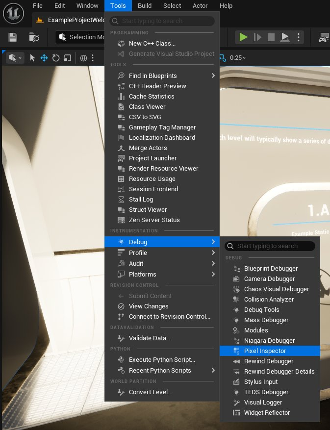
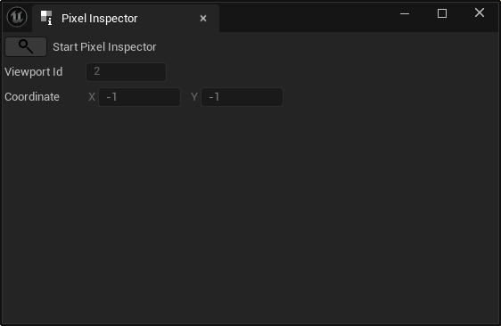
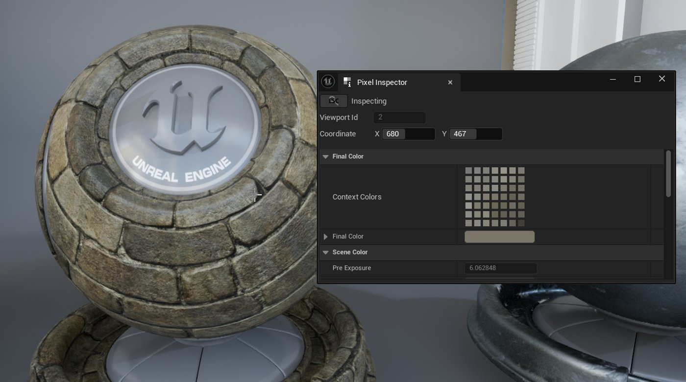

# 像素检视器

> 路径：虚幻引擎5.7文档 / 设计视觉、渲染和图形效果 / 优化和调试实时渲染项目 / 像素检视器

> 原始页面：https://dev.epicgames.com/documentation/unreal-engine/pixel-inspector-in-unreal-engine

**像素检视器（Pixel Inspector）**工具是一款开发者工具， 可用于诊断构成场景颜色的 像素。 如果你需要查明某个像素产生异常颜色的原因 （或者是什么材质输入造就了像素的颜色），可以使用 像素检视器的**检查模式**输出造就该像素视觉效果的信息。

## 使用像素检视器

要启用和使用像素检视器，请执行如下操作：

1. 打开主编辑器窗口，转到**工具（Tools）**菜单选项下的**调试（Debug）**，然后选择**像素检视器（Pixel Inspector）**。

   

   像素检视器窗口将打开。

   
2. 点击**搜索**（放大镜）按钮即可开始检查像素。
3. 将鼠标移到任意视口（关卡、材质、蓝图或其他）上，即可实时填充像素检视器的数据字段。

   
4. 按Esc键停止检查，并使用最后检查的像素填充像素检视器的数据字段。

## 像素检视器数据参考

下表所列的数据字段将在检查期间被填充像素信息：

| 选项 | 说明 |
| --- | --- |
| 视口ID（Viewport ID） | 显示像素检视器当前绘制数据所依据的视口的ID。 |
| 坐标 | 显示来自当前检视项的X/Y坐标（可手动设置）。 |
| 最终颜色（Final Color） |  |
| 情境颜色（Context Colors） | 显示与当前检视项相关的情境颜色。 |
| 最终颜色（Final Color） | 色调映射之后得出的最终RGBA 8位颜色（默认值为黑色）。 |
| 场景颜色（Scene Color） |  |
| 场景颜色（Scene Color） | 当前检视项所应用的RGB场景颜色。 |
| 预曝光 | 生成的柱状图的亮度范围的上限值。 它会按照摄像机的曝光重新映射场景颜色的范围，从而限制支持HDR光照值所需的渲染目标。要让此值可用，你必须先前往项目设置，转到**渲染（Rendering）**，并在写入场景颜色前启用**应用预曝光（Apply Pre-Exposure）**。 |
| HDR |  |
| 亮度（Luminance） | 当前检视项的HDR亮度值。 |
| HDR颜色（HDR Color） | 当前应用的HDR RGB颜色值。 |
| GBuffer A |  |
| 法线（Normal） | 从GBufferA通道应用的法线。 |
| 逐对象GBuffer数据（Per Object GBuffer Data） | 来自GBufferA通道的逐对象数据量。 |
| GBuffer B |  |
| 金属感（Metallic） | 从GBufferB的R通道应用的金属感（Metallic）值。 |
| 高光度（Specular） | 从GBufferB的G通道应用的高光度（Specular）值。 |
| 粗糙度（Roughness） | 从GBufferB的B通道应用的粗糙度（Roughness）值。 |
| 材质着色模型（Material Shading Model） | 来自GBufferB的A通道的着色模型，使用"选择性输出遮罩（Selective Output Mask）"进行编码。 |
| 选择性输出遮罩（Selective Output Mask） | 选择性输出遮罩的值，来自于GBufferB的A通道，使用着色模型编码。 |
| GBuffer C |  |
| 基础颜色 | 从GBufferC的RGB通道应用的基础颜色值。 |
| 间接辐射（Indirect Irradiance） | 来自GBufferC A通道、以环境光遮蔽（AO）方式编码的间接辐射值。 |
| 环境光遮蔽 | 来自GBufferC A通道、以间接辐射方式编码的环境光遮蔽的值。如需详细了解GBuffer，请参阅[使用GBuffer属性](../../post-process-effects/post-process-materials/index.md)和[缓冲区可视化](../../../building-virtual-worlds/level-editor/editor-viewports/viewport-modes/index.md#buffer-visualization)。生成的柱状图的亮度范围的上限值。 它会按照摄像机的曝光重新映射场景颜色的范围，从而限制支持HDR光照值所需的渲染目标。要让此值可用，你必须先前往项目设置，转到**渲染（Rendering）**，并在写入场景颜色前启用**应用预曝光（Apply Pre-Exposure）**。 |
