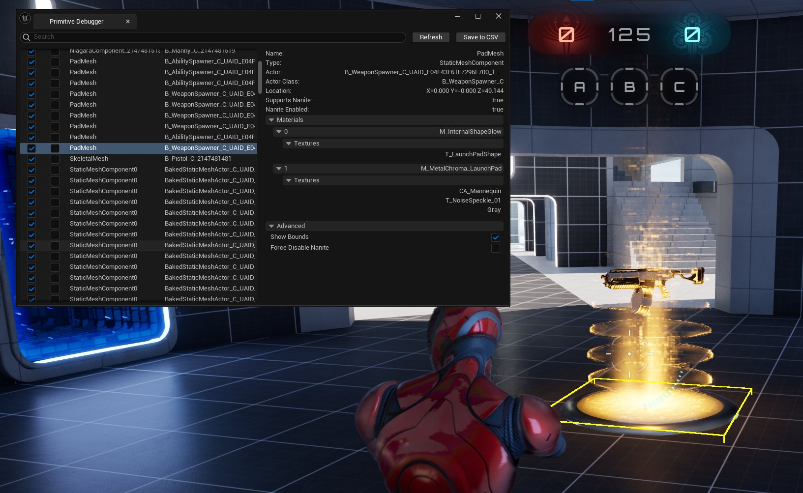

# 图元调试器

> 路径：虚幻引擎5.7文档 / 设计视觉、渲染和图形效果 / 优化和调试实时渲染项目 / 图元调试器

> 原始页面：https://dev.epicgames.com/documentation/unreal-engine/primitive-debugger-in-unreal-engine

**图元调试器（Primitive Debugger）** 是一项仅适用于运行时的工具，可以查看游戏客户端中渲染的图元相关的信息，如绘制调用和LOD信息。

## 使用图元调试器

启动图元调试器的方法如下：

1. 运行一个

   开发（Development）

   或

   测试（Test）

   客户端。
2. 使用反引号键打开控制台，并输入命令

   PrimitiveDebugger.Open

   。
3. 图元调试器

   窗口出现，并已填充了该窗口打开时正在渲染的图元列表进行填充。
4. 要刷新所显示的图元列表，请按 **刷新（Refresh）** 按钮。

   > [!NOTE]
   > 列表会自动移除游戏过程中被销毁的图元。

## 图元调试器特点

### 列表与细节视图

在图元调试器中，你可以使用顶部的搜索栏筛选显示的图元列表。搜索栏支持按名称筛选以下属性：

- 图元名称
- Actor名称
- 组件名称
- Actor类
- 组件类
- 材质名称
- 纹理名称

你可以开关列表中每一项图元的可见性，或将它们固定在列表顶部以便快速访问。拉动列表可以显示每一项图元的Actor名称。选中列表中的某一行可以打开"细节（Detail）"面板，显示所选图元的额外属性。

额外属性包括：

- 三角形数量（非Nanite网格体）
- 世界空间中的位置
- 当前LOD（非Nanite网格体）
- 所有可用LOD（非Nanite网格体）
- Nanite支持及使用情况
- 材质
- 使用的纹理
- 绘制调用
- 组件和Actor类型
- 组件和Actor名称
- 骨架网格体骨骼数量

Details Panel

### 调试控制及可视化功能

根据当前构建的设置，细节面板可提供一些基础调试工具。所有非Nanite网格体都可以使用滑块来强制该图元使用指定的细节级别（LOD），并更新中显示的模型。

Nanite网格体则提供为其强制禁用Nanite渲染的选项，使游戏渲染普通静态网格体来替代它。该选项在检查Nanite和非Nanite材质变体之间的差异，或是查看其他视觉不一致情况及性能影响时非常有用。

在开发（Development）构建中，骨架网格体能够实时显示其骨架结构中骨骼的调试可视化效果，类似于在编辑器中所能看到的那样。这有助于发现动画或绑定方面的错误。开发构建还支持在关卡中的任何图元周围显示调试边界框，该边界框也会实时更新。这些边界与碰撞器不同，将代表该图元在三维空间中的最大范围。

| 列 1 | 列 2 |
| --- | --- |
| [undefined](https://d1iv7db44yhgxn.cloudfront.net/documentation/images/bdff7d50-3b88-4a12-99ab-93c347d6ef76/rpd-2.png) | [undefined](https://d1iv7db44yhgxn.cloudfront.net/documentation/images/fc39ffbb-4592-46f2-971d-5cc96ec0f0d2/rpd-3.png) |
| 骨架调试可视化。 | 调试边界可视化。 |

点击查看大图

在使用完调试可视化和工具后关闭窗口，就可以自动撤销之前所做的所有修改。

### 保存快照

图表列表的内容，包括每个图元的细节，都可以使用窗口右上角的 **保存为CSV（Save to CSV）** 选项保存到硬盘以便稍后参考。这会将当前快照中的所有图元记录导出到CSV文件中，包括那些被搜索筛选掉的隐藏项目。该文件位于项目的 **Saved/Profiling/Primitives/** 文件夹中，文件名为带有时间戳的"PrimitivesDetailed.csv"。或者，你也可以通过命令行执行此操作。方法是在游戏内命令行中使用**DumpDetailedPrimitives**命令。

## 限制与未来更新

图元调试器目前存在以下已知限制：

- 调试可视化只在开发（Development）配置下可用。
- 编辑器不支持此工具，只能在编译好的客户端二进制文件中使用。
- 目前对非网格体类型的图元，如Niagara发射器的支持非常有限。
- 显示的绘制调用信息可能无法全面反映实例化网格体的情况。目前，绘制调用是按照网格自身独立存在且未进行批处理的方式计算得出的。
