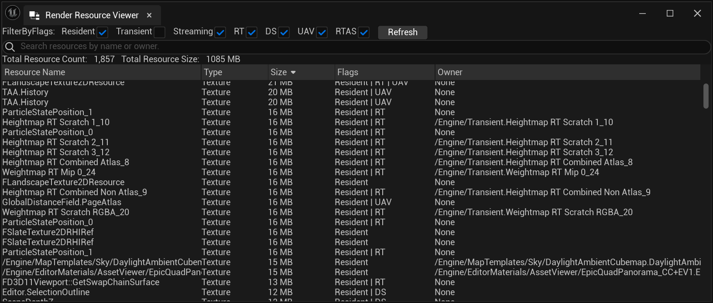
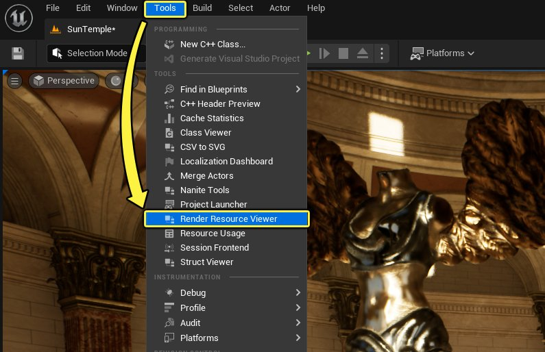
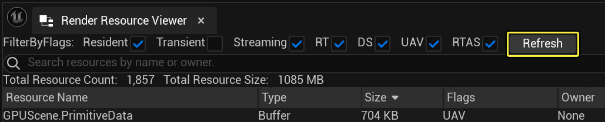
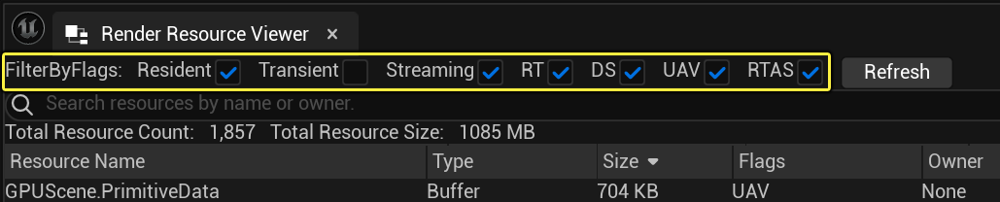
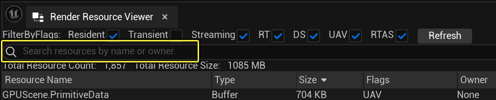
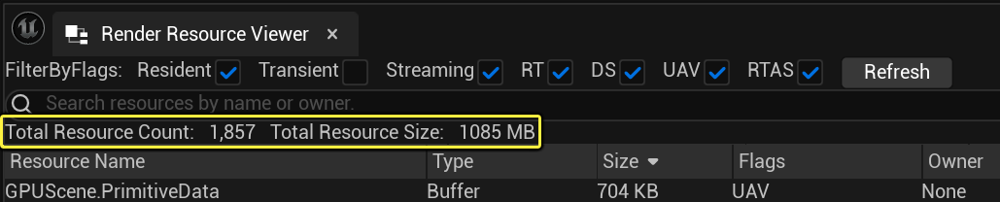
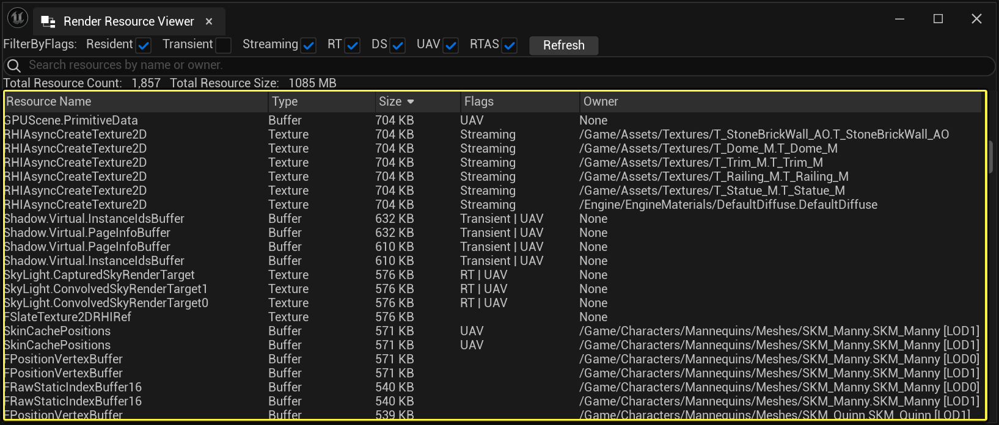
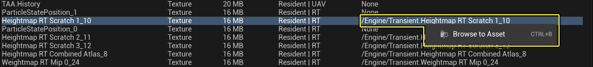

# 渲染资源查看器

> 路径：虚幻引擎5.7文档 / 设计视觉、渲染和图形效果 / 优化和调试实时渲染项目 / 渲染资源查看器

> 原始页面：https://dev.epicgames.com/documentation/unreal-engine/render-resource-viewer-in-unreal-engine

**渲染资源查看器** 是一种提供实时的 — 在窗口打开时捕获 — 所有的GPU内存分配去向和渲染资源的情况的快照的工具。这些包括顶点和索引缓冲区，以及它们来自的资产类型。这个工具对于美术师和开发者在辨别并理解那些资产正在进行分配时很有帮助。它也能提供优化GPU内存并使其项目保持在渲染预算之内所需的信息。

这个工具包括一个交互式界面：

- 显示每个渲染资源分配及其名称、大小、类型、标记和所有者。
- 有一个可排序和可筛选的分配表。
- 提供可用于识别和了解哪些资产在进行分配的信息。

## 打开渲染资源查看器

你可以从 **工具** 菜单中打开 **渲染资源查看器** 。

## 了解渲染资源查看器界面。

渲染资源查看器界面由以下部分组成：

- 刷新按钮

  - 查看器会在打开时生成实时的快照，且不会随时自动更新。使用这个按钮来刷新列表并生成新的GPU内存分配快照。

    
- 资源过滤器

  - 每个资源都有一些渲染标记。使用这些资源复选框来显示与你的搜索相关的经过滤条目。从以下条件中选择：
  - 驻留（Resident）：

    可由GPU访问，并且未被逐出（未使用）。
  - 临时：

    只在它处于活动状态的渲染过程中被分配，它将与框架中的其他资源共享底层内存。（过滤器默认不勾选）
  - 流送：

    是一种可流动的纹理。
  - 渲染目标（RT）：

    可以被GPU作为渲染目标缓冲区写入。
  - 深度模板（DS）：

    可以被GPU作为深度模板缓冲区写入。
  - 未排序存取视图（UAV）：

    支持未排序存取视图，允许从多个GPU线程暂时无序读/写存取而不产生内存冲突。
  - **光线追踪加速结构（RTAS）：** 是一种光线追踪加速结构。

    
- **搜索框** 同时从 **源命名** 和 **所有者** 两个种类中搜索文本。例如，要找到属于一个骨骼网格体的所有资源是很困难的，但通过搜索其所有者的路径，你可以看到正在使用的总内存。

  
- 资源总额

  - 显示列表中的条目总数和它们的综合大小。改变筛选标志和搜索只列出筛选后的结果和它们的总数。

    
- 资源表

  - 该窗口会列出关于某个资源占用内存的信息。在这个窗口中，你可以看到资源的名称、它的类型、大小和标记，以及该资源的所有者。所有者一列提供了资源所属的UObject的路径名称，包括其LOD索引。

    

## 附加说明

### 不存在所有者

当一个资源的所有者（owner）为 "无 "时，意味着该资源所有者目前没有被追踪。目前追踪的资源包括静态网格体、骨骼网格体、纹理和毛发/Groom资产。追踪的资源列表将会继续增加。

### 所有者路径和LOD索引

如果资源属于一个网格体，所有者路径也会在其末端显示该网格所属的LOD索引。例如，虚幻引擎中的一些默认模板所包含的Quinn人体模型有多个层次的细节设置。当查看这个骨骼网格的资源条目时，路径会看起来像 `/Game/Characters/Mannequins/Meshes/SKM_Quinn.SKM_Quinn[LOD1]` 。

### 在内容浏览器中浏览资产

使用热键 **CTRL + B** 或右键点击资产条目并选择 **浏览资产（Browse to Asset）** ，即可找到所列的资产。此操作可打开内容浏览器，显示资产的位置。如果没有与 **所有者（Owner）** **列** 关联的资产路径，则不采取任何操作。

