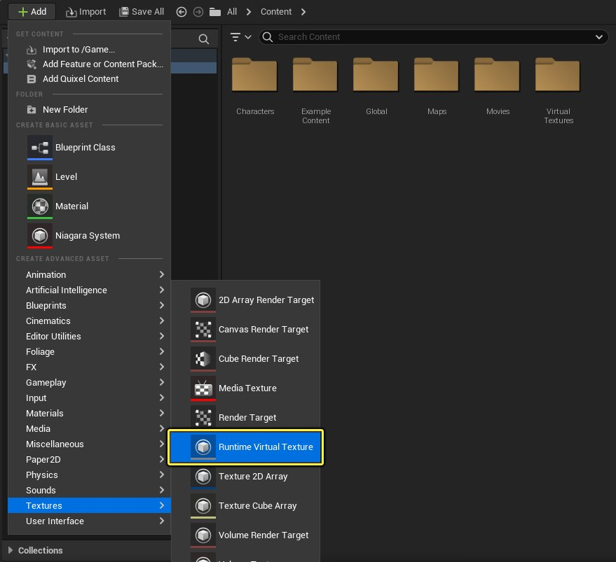
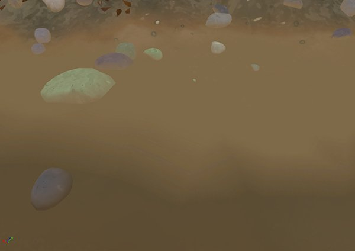
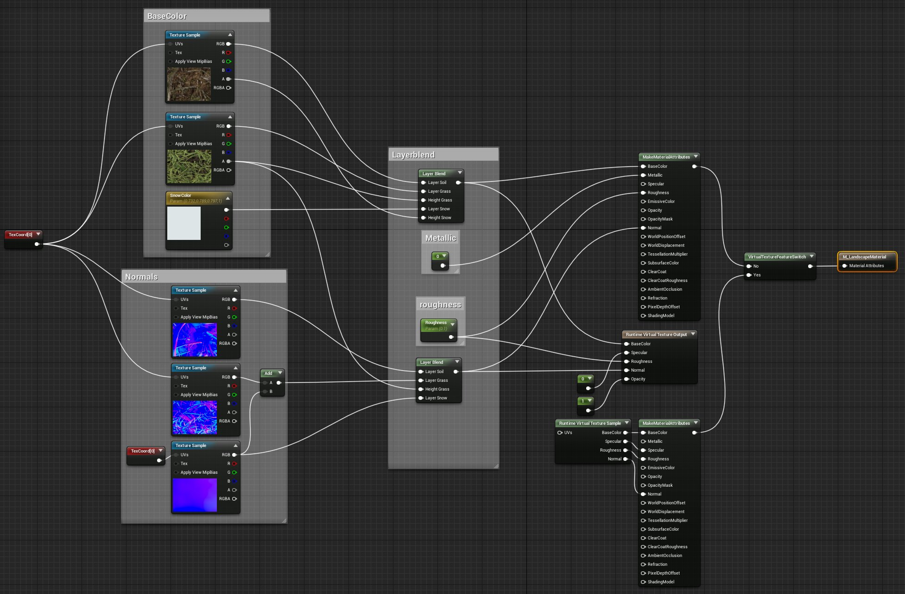
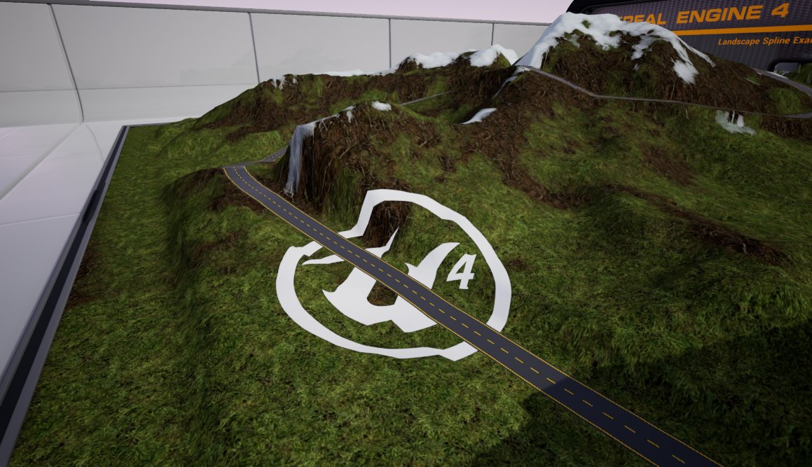
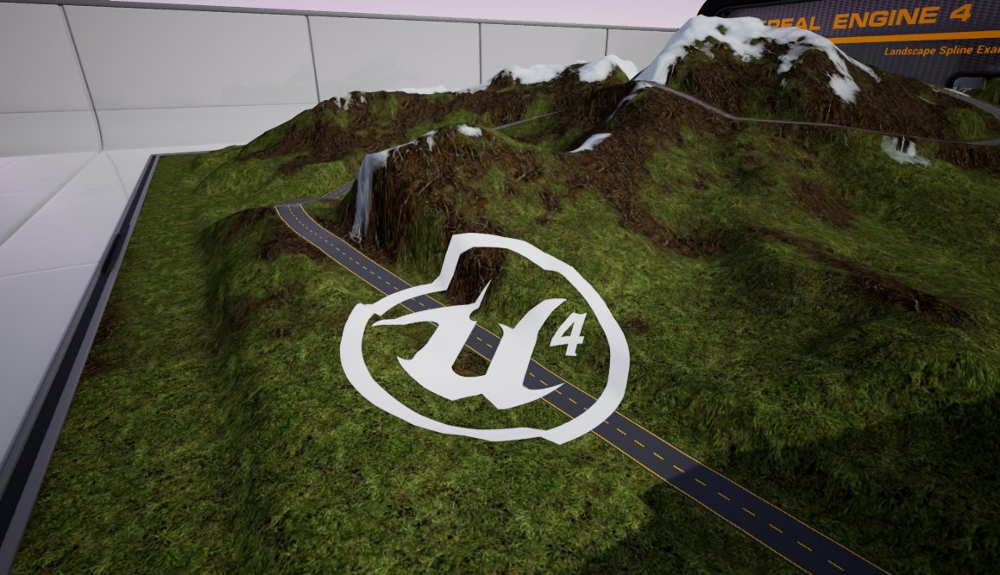
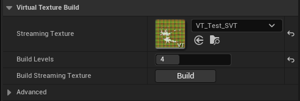
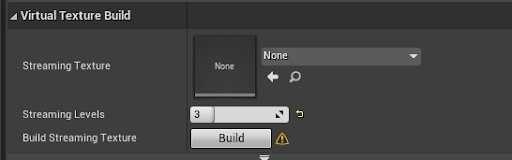

# 运行时虚拟纹理

> 路径：虚幻引擎5.7文档 / 设计视觉、渲染和图形效果 / 优化和调试实时渲染项目 / 虚拟纹理 / 运行时虚拟纹理

> 原始页面：https://dev.epicgames.com/documentation/unreal-engine/runtime-virtual-texturing-in-unreal-engine

**运行时虚拟纹理** (RVT)在运行时使用GPU按需创建其纹素数据，工作方式与传统纹理映射类似。较大区域上的RVT缓存着色数据非常适用于使用贴花类材质的地形和适配地形的样条。

## 工作流程

使用以下高级步骤在项目中设置和使用运行时虚拟纹理：

1. 在内容浏览器中创建

   运行时虚拟纹理

   资产。用于将所有组件（包括RVT体积Actor和RVT材质）链接在一起，渲染运行时虚拟纹理。
2. 在

   模式（Modes）

   面板中将

   运行时虚拟纹理体积（Runtime Virtual Texture Volume）

   添加到场景。此操作用于将RVT资产放置到场景中。
3. 配置材质以

   写入

   到RVT资产。
4. 配置材质以从RVT资产

   采样

   。
5. 设置一个或多个图元组件或地形Actor，以渲染至RVT资产。

> [!NOTE]
> 欲了解设置RVT的详细步骤指南，参见[运行时虚拟纹理快速入门](../../../optimizing-and-debugging-ea5cf1b9/virtual-texturing/runtime-virtual-texturing/runtimevirtual-texturing-quick-start/index.md)。本指南将设置地形材质和其他场景组件，以使用运行时虚拟纹理。

## 运行时虚拟纹理组件

在虚幻引擎项目中，使用以下组件设置和处理运行时虚拟纹理：

### 运行时虚拟纹理资产

**运行时虚拟纹理** 资产包含在场景中创建RVT时将使用的配置详情。将此视为RVT系统中的关键部分，用于连接场景中渲染至RVT的材质和组件。

以下组件引用RVT资产：

1. 场景中放置的各

   运行时虚拟纹理体积

   均指定了单个RVT资产。
2. 单独场景组件指定了任意数量的RVT资产，当处于指定RVT资产之一的体积边界内时，其会被渲染至运行时虚拟纹理。
3. 在组件通过RVT体积被渲染至RVT之前，其材质必须使用

   虚拟纹理

   材质域或使用正确设置的RVT材质表达式。

在内容浏览器中使用右键点击快捷菜单或 **新增（Add New）** 按钮新建RVT资产。在 **材质和纹理（Materials & Textures）** 类别下，选择 **运行时虚拟纹理（Runtime Virtual Texture）**。

点击查看大图。

双击资产，在其编辑器窗口中打开并配置相关设置：

使用此窗口定义运行时虚拟纹理支持的材质属性大小、图块大小和类型。

> [!NOTE]
> 有关此类设置的详情和用途，参见[虚拟纹理设置](../../../optimizing-and-debugging-projects-for-realtim-ea5cf1b9/virtual-texturing/virtual-texturing-settings-and-properties/index.md#%E8%BF%90%E8%A1%8C%E6%97%B6%E8%99%9A%E6%8B%9F%E7%BA%B9%E7%90%86%E8%B5%84%E4%BA%A7)页面。

#### 资产操作

右键点击快捷菜单中包含一组操作，可协助管理材质中的RVT资产：

- 使用此项查找材质（Find Materials Using This）

  将在内容浏览器中查找并高亮显示引用此RVT资产的所有材质。
- 固定材质使用（Fix Material Usage）

  提供更改RVT资产材质类型后自动固定所有材质的方法。其将查找所包含Runtime Virtual Texture Sample节点的有材质和材质函数，该节点引用此RVT资产。若节点中的

  虚拟纹理材质类型

  与RVT资产中的材质类型不匹配，则节点中的材质类型固定与RVT资产匹配。

### 运行时虚拟纹理材质类型

设置RVT材质时，有一些选项可选择：

| 材质类型 | 注释 | 压缩格式 |  |
| --- | --- | --- | --- |
| **底色（Base Color）** | 仅保存底色。 | BC1 |  |
| **底色、法线、粗糙度、高光度（Base Color, Normal, Roughness, Specular）** |  | 保存底色、法线、粗糙度和高光度。启用压缩后，使用两个BC3纹理保存数据。一个纹理包含底色和法线X。另一个纹理包含粗糙度、高光度、法线Z方向和法线Y。 | BC3 + BC3 |
| **YCoCg底色、法线、高光度（YCoCg Base Color, Normal, Specular）** | 保存底色、法线、粗糙度和高光度。启用压缩后，使用三个纹理；BC3纹理保存以YCoCg格式编码的底色，BC5纹理保存法线X、Y，而BC1纹理保存粗糙度、高光度和法线Z方向。 | BC3 + BC5 + BC1 |  |
| **YCoCg底色、法线、高光度、遮罩（YCoCg Base Color, Normal, Specular, Mask）** | 和"YCoCg底色、法线、高光度"一样，但是多了一个8位的遮罩通道，用于一般用途。启用压缩后，遮罩通道会以BC3格式打包到alpha通道中。 | BC3 + BC5 + BC3 |  |
| **场景高度（World Height）** | 保存高度值。该值在保存时会被标准化（范围是RVT体积Z轴上的最小值和最大值）。 | R16_UNORM |  |
| **位移（Displacement）** | 存储一个0-1之间的位移值。在启用压缩时，此值将被存储在BC4纹理中。 | BC4 |  |
| **Mask4** | 存储一个4通道遮罩，每个通道持有一个0-1之间的值在启用压缩时，此值将被存储在BC3纹理中。 | BC3 |  |

> [!NOTE]
> **底色、法线（Base Color, Normal）** 材质类型已在虚幻引擎4.23版本中被移除。在4.24版本中，使用此类型资产将自动转换为使用 **底色、法线、粗糙度、高光度（Base Color, Normal, Roughness, Specular）** 材质类型。

#### 运行时虚拟纹理底色存储

利用 **YCoCg底色、法线、粗糙度、高光度（YCoCg Base Color, Normal, Roughness, Specular）** 材质类型，可对RVT中的底色进行不同编码。

底色默认保存为RGB并压缩为BC1。此类编码可导致存储数据中出现色移和色带，在平滑渐变的底色数据中最为明显。YCoCg材质类型有助于减少此类瑕疵。但使用此类材质将增加25%内存开销，同时还需进行虚拟纹理数据的额外性能采样和解码。

默认的底色编码

YCoCg底色编码

#### 运行时虚拟纹理法线存储

法线及X、Y值保存在BC5纹理中或者两个BC3纹理的透明通道中，基于与BC5的相同精确度。法线的Z方向还用于保存场景空间法线。

材质从Runtime Virtual Texture Output节点中写入时不会将隐藏变换应用到输出。向此节点输入的任何内容将被写入RVT（纹理中同时保存部分编码）。

推荐在RVT中保存法线时采用世界空间坐标系。采用这种通用的坐标系时，当你有多个图元在从RVT读写时，能够实现更好的混合行为。

### 运行时虚拟纹理体积

**运行时虚拟纹理体积（Runtime Virtual Texture Volume）** 用于将RVT资产放置于场景中。此体积应包围Actor，将在设置材质后渲染到此Actor。通常为地形或表面地形类图元。

对于任何图元采样或写入，运行时虚拟纹理都应处于体积边界内。放置RVT体积时，使用关卡 **详情（Details）** 面板中的 **从边界变换（Transform from Bounds）** 参数快速定位和缩放体积至选定Actor。此通常与场景中的地形类似。

1. 在

   放置Actor（Place Actors）

   面板中，将

   运行时虚拟纹理体积

   拖入场景。
2. 选中体积后，在关卡的

   细节（Details）

   面板中找到

   从边界变换（Transform from Bounds）

   类别，并使用

   源Actor（Source Actor）

   资产选项（或滴管工具）在场景中选中Actor。
3. 使用

   设置边界（Set Bounds）

   按钮快速定位、缩放和旋转体积。
4. 之后，当其他组件写入该RVT时，

   设置边界（Set Bounds）

   也会缩放该体积，以便体积能将所有组件包含在内。

> [!NOTE]
> 使用RVT体积负Z方向上的正射投影，对渲染至RVT的对象进行渲染。

### 运行时虚拟纹理材质表达式

所有被指定了RVT资产的场景组件都必须使用以下材质表达式，以便将组件整合进场景中生成的RVT。

#### 写入到和采样运行时虚拟纹理

要写入到和采样运行时虚拟纹理，首先须设置部分RVT表达式以处理材质：

- **运行时虚拟纹理（Runtime Virtual Texture Output）** 表达式用于定义同时写入到和采样运行时虚拟纹理的单个材质。应将现有材质逻辑插入此节点。
- **运行时虚拟纹理取样（Runtime Virtual Texture Sample）** 表达式利用指定RVT资产采样并输出该材质的采样。
- **Runtime Virtual Texture Sample Parameter** 表达式的工作原理与Runtime Virtual Texture Sample节点类似，但会将采样的RVT资产公开为材质实例的参数进行覆盖。

  > [!TIP]
  > 和其他参数类似，可直接创建此节点或右键点击Runtime Virtual Texture Sample节点，在快捷菜单中选择 **转换为参数（Convert to Parameter）** 进行创建。

  > [!WARNING]
  > 使用材质实例覆盖RVT资产时，指派的RVT资产必须与运行时虚拟纹理采样参数表达式的细节面板中设置的材质匹配。

此为写入到绑定RVT资产并对其进行采样的地形材质范例。平台不支持虚拟纹理时，其还可使用逻辑退回到传统地形渲染：

点击查看大图。

#### 其他材质表达式

在以下两种情境下使用RVT时将编译材质：

- 渲染至RVT
- 渲染至其他通道

若要将部分材质逻辑渲染至RVT，**运行时虚拟纹理替换（Runtime Virtual Texture Replace）** 表达式是理想选择。

**查看属性（View Property）** 表达式还有几个RVT特定选项：

- **Virtual Texture Output Level** 节点会输出当前正在渲染的RVT mip等级。
- **Virtual Texture Output Derivative** 节点输出场景空间的X和Y大小，该场景空间被当前虚拟纹理输出的单个纹素覆盖。
- **虚拟纹理最大级别（Virtual Texture Max Level）** 节点会输出当前RVT采用的MIP等级。

此类表达式的一个用例是在RVT中模拟缤纷基于距离着色的使用。由于RVT独立于摄像机，因此无法直接表达此类着色。但通过使着色mip依赖等级，即可获得类似效果。可使用 **Runtime Virtual Texture Replace** 节点仅实现 **Runtime Virtual Texture Output** 节点的mip等级依赖着色路径。

- 若要设置材质逻辑以在不支持虚拟纹理时退却到替代路径，

  虚拟纹理特征切换（Virtual Texture Feature Switch）

  十分有用。

## 场景组件输出属性

场景中放置的组件都可渲染至RVT。以下为理想候选组件类型：

| 理想候选组件 | 非理想候选组件 |
| --- | --- |
| 地形和地形样条 静态网格体和实例化静态网格体 植物实例（用于贴花散射）* | 骨架网格体 可移动静态网格体 动画网格体 |

> [!WARNING]
> 由于RVT内容实际上是着色缓存，因此不会逐帧完整更新，意味渲染到RVT的对象应具有 **静态** 移动性。蒙皮和动画图元并非渲染至RVT的理想选择。

使用组件 **细节（Details）** 面板中的 **渲染至虚拟纹理（Render to Virtual Textures）** 阵列，指定其可在场景中渲染至的RVT资产。可将组件指定到多个RVT。只有将RVT资产指定到场景中放置的RVT体积，并正确设置组件的材质后，才会开始渲染至RVT。

> [!NOTE]
> 参见[运行时虚拟纹理快速入门](../../../optimizing-and-debugging-ea5cf1b9/virtual-texturing/runtime-virtual-texturing/runtimevirtual-texturing-quick-start/index.md)查看范例。另参见[虚拟纹理设置参考](../../../optimizing-and-debugging-projects-for-realtim-ea5cf1b9/virtual-texturing/virtual-texturing-settings-and-properties/index.md)。

在场景中渲染至RVT时，遵循以下章节进一步了解组件行为。

### 虚拟纹理通道类型

**在主通道中绘制（Draw in Main Pass）** 允许你控制被渲染至RVT对象的主通道渲染。

> [!NOTE]
> 利用以下选项可控制渲染至RVT的对象：

| 选择 | 说明 |
| --- | --- |
| **从不（Never）** | 不在主通道中渲染此组件，若场景中无RVT，则不渲染此Actor。不支持虚拟纹理时，此选项应用于不必要的项目（例如贴花类材质）。例如，使用静态网格体平面并将材质输出到RVT，会将贴花等材质写入RVT地形材质。如果主机或特征等级不支持虚拟纹理，静态网格体平面将不会渲染至主通道。 |
| **来自虚拟纹理（From Virtual Texture）** | 根据虚拟纹理支持和设置，将组件渲染到RVT或主通道（Main Pass）。假如下列情况都成立，则组件不会渲染到主通道中。 启用了对虚拟纹理的支持。 组件引用的某个RVT资产被放置在场景中（通过RVT体积放置）。 其中某个相关的RVT体积被设置为"隐藏图元（Hide Primitives）"。 例如，渲染道路网格和材质的地形样条应该写入RVT，以便沿着spline应用其材质。然而，如果场景中没有有效的RVT，或者没有对虚拟纹理的特征级支持，那么花键式道路网格仍然可以在地形上看到。 |
| **始终（Always）** | 无论是否支持虚拟纹理，都将组件渲染至RVT和主通道。对于需要同时写入和采样RVT的对象（例如地形），这是理想的选择。例如，设为同时写入数据到RVT和渲染最终RVT的地形材质应始终可见。 |

> [!TIP]
> 对于渲染至RVT的图元，建议禁用阴影投射和碰撞。阴影投射和碰撞不会自动禁用。

### 设置LOD和Mip

通过设置细节等级（LOD）和剔除行为，使用虚拟纹理高级卷栏属性控制组件渲染至RVT的方式。在组件的关卡 **细节（Details）** 面板中访问这些参数：

对于场景中的图元，调整以下属性：

| 属性 | 说明 |
| --- | --- |
| **虚拟纹理LOD偏差（Virtual Texture LOD Bias）** | 设置LOD以渲染至RVT中。基于渲染的图元覆盖虚拟纹理页面的程度，自动选择此选项。使用此选项可应用进一步偏差。较高值将强制使用较少细节LOD。 |
| **虚拟纹理跳过Mip（Virtual Texture Skip Mips）** | RVT中跳过渲染此图元所需最低mip数。若已知无需在设定绘制距离外渲染图元，则此选项将消除渲染至RVT的开销。 |
| **虚拟纹理最小覆盖（Virtual Texture Min Coverage）** | 若设定此值，将忽略 **虚拟纹理跳过Mip（Virtual Texture Skip Mips）** 参数，而将基于图元在mip中的预估投影大小在RVT mip中剔除（或移除）图元。此值以像素为单位，而非日志空间。例如，设值为3时将剔除（或移除）投影尺寸小于8像素的图元。 |

对于场景中的地形，调整以下属性：

| 属性 | 说明 |
| --- | --- |
| **虚拟纹理LOD数量（Virtual Texture Num LODs）** | 用于将地形组件渲染至RVT的LOD数量。设值为0表示各地形组件都将作为单个四边形渲染至RVT中。0为GPU性能最优值。若地形材质需要高频顶点插值数据，则需要更高值。 |
| **虚拟纹理LOD偏差（Virtual Texture LOD Bias）** | 应用于要渲染至RVT的选定LOD的偏差。 |

### 对象排序优先级

将多个图元渲染至场景中的RVT时，可能会出现对象图层排序问题。由于未使用Z缓冲，且组件的材质可进行透明度混合，因此可能需要定义排序顺序。

对于场景中的选定组件，使用关卡 **细节（Details）** 面板设置其 **半透明排序优先级（Translucency Sort Priority）**。

所有组件的默认值为 **0**。值越小，越先渲染（或在底部图层上），值越大，越晚渲染（或在顶部）。

Translucency Sort Priority | 样条：1 | 贴花：0

Translucency Sort Priority | 样条：1 | 贴花：2

> [!NOTE]
> 值相同的组件渲染顺序为 *undefined*。如果场景中的RVT缺失组件，先检查 **半透明排序优先级（Translucency Sort Priority）**。

## 流送虚拟纹理编译

当RVT涵盖具有众多组件的大型场景时，渲染到RVT低分辨率mip将十分缓慢。此外，在此情况下，场景Actor需要永久常驻，以便渲染至表现场景远处部分的低mip。请注意，这一过程极耗内存。

因此，烘焙和流送RVT的低分辨率mip则更为高效。仍会在运行时渲染较高分辨率mip。由此，单个虚拟纹理可充分利用[流送虚拟纹理](../streaming-virtual-texturing/index.md)和运行时虚拟纹理这两种方法。

### 使用RVT启用SVT

1. 要向RVT添加流送虚拟纹理支持，设置要流送的低mip数。
2. 在RVT体积中，设置你要使用的 **流送级别（Streaming Levels）** 数值。

   

   点击查看大图。

   > [!NOTE]
   > 低mip值越高，生成的流送虚拟纹理越大，将在摄像机较近距离处使用此纹理。
3. 接下来，你需要创建流送虚拟纹理资产。在RVT体积组件中的 **流送级别（Streaming Levels）** 下方点击 **构建（Build）**。首次操作时，会新建一个 **虚拟纹理构建器（Virtual Texture Builder）** 资产，用于保存流送虚拟纹理。

   

   点击查看大图。
4. 编辑后，你需要更新流送虚拟纹理。有两种办法实现：

   - 使用编辑器工具栏中的 **构建（Build）** 菜单，然后选择 **构建虚拟纹理（Build Virtual Textures）**。该选项会构建当前打开关卡的所有虚拟纹理。

     > 图片已省略：undefined

     点击查看大图。
   - 使用RVT体积组件并点击 **Use Streaming Low Mips in Editor** 属性旁的 **构建（Build）** 按钮。这个选项只建立分配给选定的RVT Volume的流式虚拟纹理。这个选项只建立分配给选定的RVT Volume的流式虚拟纹理。

> [!NOTE]
> 编辑器默认固定使用运行时生成的RVT数据进行渲染，而非使用流送虚拟纹理数据。此操作无需在相关编译后更新流送虚拟纹理。
>
> 要在RVT低mip中渲染流送虚拟纹理，在RVT体积 **细节（Details）** 面板中选择 **在编辑器中使用流送低mip（Use Streaming Low Mips in Editor）** 属性。

> [!NOTE]
> 当部分RVT资产设置变更后，所有关联的SVT资产都将不再匹配并失效。这会导致游戏出现性能问题。出现这种情况后，RVT体积的UI界面中的"构建（Build）"按钮旁边会出现一个警告图标。这种情况也会在地图检查时被标记出来。

## 优化、统计数据和调试

在以下章节中了解项目中运行时虚拟纹理的优化和调试方式。

### 统计数据

用反引号（`）键打开控制台，并输入以下命令以启用其统计数据：

使用 `stat virtualtexturing` 查看虚拟纹理场景开销详情（以毫秒计）和页面表计数器。

使用 `stat virtualtexturememory` 显示当前场景使用虚拟纹理相关的内存计数器。

### 流送虚拟纹理低mip调试

为了显示流送虚拟纹理的距离情况，请使用RVT体积 **细节（Details）** 面板中的 **编译调试（Build Debug）** 复选框。它位于 **在编辑器中使用流送低mip（Use Streaming Low Mips in Editor）** 属性旁。

勾选此选项后，虚拟纹理会以某种颜色重新构建，以便查看流送虚拟纹理mip的使用情况。

### 内存池

在 `BaseEngine.ini` 配置文件中设置虚拟纹理的内存池大小。逐纹理设置此类池的压缩格式和图块大小。通过指定项目的最大内存预算来配置池大小。此类设置位于 [/Script/Engine.VirtualTexturePoolConfig]` 下。

我们添加了一个"ScalabilityGroup"选项，用于指定将何种 r.VT.PoolSizeScale 设置用于内存池。

### 调试

使用以下控制台变量调试项目中的虚拟纹理：

| 控制台变量 | 说明 |
| --- | --- |
| `r.VT.Flush` | 使用此命令清空虚拟纹理系统中的所有物理缓存。若怀疑问题可能是因不良缓存失效而引起，此命令非常有用。 |
| `r.VT.MaxUploadsPerFrame` | 使用此命令设置最大页面逐帧上传数量（默认情况下，编辑器为64，游戏为8）。若要限制帧中正在更新的运行时虚拟纹理图块量，以防达到性能峰值，此命令非常有用。 |

### 控制台变量和可扩展性

可基于各项目和各平台或可扩展性级别微调以下控制台变量。

| 控制台变量 | 描述 |
| --- | --- |
| `r.VT.MaxUploadsPerFrame` | 逐帧上传的虚拟纹理页面最大数。降低此值可提高性能，但视觉效果更新将变慢。 |
| `r.VT.MaxUploadsPerFrameInEditor` | 在编辑器模式下，逐帧上传的页面最大数。此值独立于命令 `r.VT.MaxUploadsPerFrame`，建议在编辑器中舍弃部分运行时性能，换取更清晰的工作效果。 |
| `r.VT.MaxContinuousUpdatesPerFrame` | 单帧内连续上传的页的最大数量。每次上传都会刷新一个已经映射过的随机页。只有当RVT资产被设置成连续上传，并且当我们还没有使用MaxUploadsPerFrame预算以及其他页更新时，才会发生这种情况。 |
| `r.VT.MaxContinuousUpdatesPerFrameInEditor` | 编辑器模式中，每帧上传的连续页的最大数量。 |
| `r.VT.RVT.TileCountBias` | 此为应用到RVT资产 **大小（以图块计）（Size in Tiles）** 属性的偏差。值为-1表示RVT分辨率减半。值为1表示RVT分辨率加倍。 |
| `r.VT.RVT.TileCountBias.Group<x>` | 该选项会将图块计数偏移仅应用于被设置为 Scalability Group 的RVT体积。请注意，未指定Group的控制台变量变体会映射到 Scalability Group 0。 |
| `r.VT.PoolSizeScale` | 应用到虚拟纹理物理池大小的比例因子。值小于1将减小纹理池大小。对于内存较为有限的平台，此值可能为必需项。 |
| `r.VT.PoolSizeScale.Group<x>` | 该选项仅将缩放系数应用于被设置为 Scalability Group 的虚拟纹理物理内存池。注意，未指定Group的控制台变量变体会映射到 Scalability Group 0。 |
| `r.VT.MaxAnisotropy` | 此为虚拟纹理采样的特定MaxAnisotropy设置。 |

## 其他说明和限制

- 可在顶点着色器暂存中采样虚拟纹理。由于顶点着色器不会生成虚拟纹理GPU反馈，因此建议谨慎使用。
- 在使用填充运行时虚拟纹理的材质中，不支持使用虚拟纹理。这是因为需要确保任何源虚拟纹理在填充任何运行时虚拟纹理页之前都已完全流送至正确的关卡。这会增加运行时虚拟纹理渲染的复杂性和性能开销。

  - 在使用常规流送纹理填充运行时虚拟纹理时也需小心，因为在这些纹理被完全流送进来前将其写入运行时虚拟纹理页可能导致问题。但是，常规流送可以依赖摄像机位置记录数据，这更可预测，而虚拟纹理流送完全依赖于GPU反馈。
