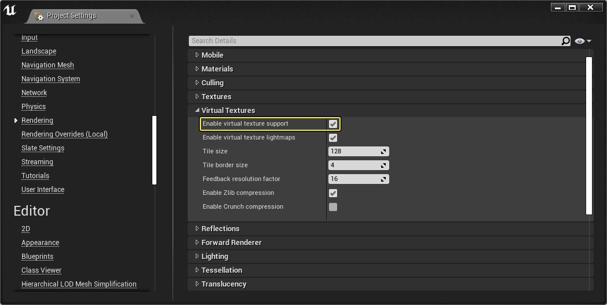

# 流送虚拟纹理

> 路径：虚幻引擎5.7文档 / 设计视觉、渲染和图形效果 / 优化和调试实时渲染项目 / 虚拟纹理 / 流送虚拟纹理

> 原始页面：https://dev.epicgames.com/documentation/unreal-engine/streaming-virtual-texturing-in-unreal-engine

**流送虚拟纹理** (SVT)是一种在项目中从硬盘流送纹理的替代方法，与虚幻引擎4（UE4）中现有基于mip的[纹理流送](index.md)相比，其既有优点也有缺点。

传统基于mip的纹理流送对材质UV使用执行离线分析，然后在运行时根据对象可见性和距离决定要加载的纹理mip级别。由于流送数据考虑的是全纹理mip级别，所以此过程有局限性。

使用高分辨率纹理时，加载更高等级的mip纹理可能会极大地影响性能和内存开销。此外，通过CPU使用基于CPU对象可见性和剔除做出基于mip纹理流送的决定。

可见性更为保守，意味更有可能进行加载来避免对象突然出现在视图中。因此即使对象的一小部分可见，则视整个对象均为可见。加载对象包括可能需要流送传入的相关纹理。

相反，虚拟纹理系统仅会根据UE的要求，流送需要显示的纹理部分。将所有mip级别拆分为固定尺寸的小图块即可实现这一点。GPU决定屏幕上所有可见像素所访问的可见图块。这意味着，当UE要求显示某个对象时，它会与GPU通信，GPU会将所需图块加载到GPU内存缓存。无论纹理大小，SVT的固定图块大小仅考虑可见图块。GPU会使用标准深度缓冲计算可视性，促使SVT仅对可见部分（影响像素的部分）发出请求。

### 启用虚拟纹理

在 **项目设置（Project Settings）** 中的 **引擎（Engine）** > **渲染（Rendering）** > **虚拟纹理（Virtual Textures）** 下，选中 **启用虚拟纹理支持（Enable virtual texture support）**。



点击查看大图。

> [!TIP]
> 在项目设置（Project Settings）中的 **编辑器（Editor）** > **纹理导入（Texture Import）** > **虚拟纹理（Virtual Textures）** 类别下，可指定最小纹理尺寸来考虑SVT的新导入纹理。若纹理满足最小尺寸，将自动启用此纹理资源的 **虚拟纹理流送**。

> [!NOTE]
> 欲了解此类设置的信息，参见[虚拟纹理参考](../../../optimizing-and-debugging-projects-for-realtim-ea5cf1b9/virtual-texturing/virtual-texturing-settings-and-properties/index.md)页面。

## 转换纹理和材质

启用项目的虚拟纹理即表示需进行设置才能正确运行纹理和材质；纹理须启用 **虚拟纹理流送** 支持，材质的 **纹理取样** 须使用 **虚拟** 采样器类型，而不是非虚拟类型。

选择以下选项，正确设置纹理和材质以使用SVT。

### 转换菜单选项

1. 在内容浏览器中，选择要转换的纹理资源，以使用SVT。
2. 右键点击打开快捷菜单，选择 **转换为虚拟纹理（Convert to Virtual Texture）**。

   > [!NOTE]
   > 使用此菜单选项，还可将虚拟纹理转换为常规纹理。
3. **转换为（Convert To）** 窗口列出了选中的所有纹理及引用此类纹理的所有材质。
4. 点击 **Ok** ，启动转换过程。

在转换过程中，纹理资源将在纹理编辑器设置中启用 **虚拟纹理流送（Virtual Texture Streaming）**。引用选中纹理的材质转换纹理采样节点以使用 **虚拟** 采样器类型，而不是非虚拟采样器类型。

### 手动转换

1. 在内容浏览器中，双击给定纹理资源，打开

   纹理编辑器（Texture Editor）

   。
2. 在 **细节（Details）** 面板中的 **纹理（Texture）** 下，启用 **虚拟纹理流送（Virtual Texture Streaming）**。

若未使用上述[转换菜单选项](#%E8%BD%AC%E6%8D%A2%E8%8F%9C%E5%8D%95%E9%80%89%E9%A1%B9)而启用此项，将立即导致引用转换纹理的所有现有材质失效。应打开引用违规纹理的所有材质，并将纹理取样节点设为使用正确 **虚拟（Virtual）** 采样器类型。例如，虚拟纹理应使用 **虚拟颜色（Virtual Color）** 而非 **颜色（Color）** 采样器类别。

纹理取样节点未使用正确采样器类型时，UE会在 **统计数据（Stats）** 面板和此节点底部显示一条错误消息：

1. 错误消息显示指定的VT Texture Sample表达式的错误

   采样器类型

   。
2. 将纹理取样样本的

   采样器类型（Sampler Type）

   更改为

   虚拟（Virtual）

   类型之一。
3. VT纹理取样正确渲染，由表达式右下角"VT"指示。

> [!NOTE]
> 向材质图表添加虚拟纹理时，将自动指定虚拟采样器类型。然而，若将表达式设为可在材质实例中使用的纹理采样参数，那么基本材质会将虚拟采样器类型应用于所有子实例。注意，假如在基类材质中，纹理参数插槽尚不是虚拟纹理类型，则你无法将虚拟纹理指定给纹理参数插槽。

## UDIM支持

"U尺寸"（"UDIM"）是一类纹理命名规范，利用其能将多个纹理图像映射到静态网格体或骨架网格体模型上的单独UV区域。使用UDIM命名规范时，UE会将图像文件组导入为单个虚拟纹理资源。

支持UDIM的虚拟纹理有以下好处：

- 适用于多数单独的较小纹理，而非极大纹理。
- 各UDIM图像可启用不同分辨率的非统一像素密度虚拟纹理。

例如，若导入由4个图像文件构成的UDIM虚拟纹理（两个2048x2048纹理和两个128x128纹理），并以2x2模式排列，则逻辑上虚拟纹理将采样此类图像，如同单个4098x4098纹理。UE会拉伸128x128小图像以填充2048x2048大图像所填充的相同区域，而不挺像硬盘或运行时内存的使用。在本例中，将128x128小纹理填充到2048x2048纹理分辨率不会消耗内存。

> [!NOTE]
> 欲了解UDIM流程的更多信息，参见[Foundry的UDIM工作流程](https://learn.foundry.com/modo/901/content/help/pages/uving/udim_workflow.html)教程。

利用此命名约定，开始在项目中使用UDIM纹理与虚拟纹理：

```
	BaseName.####.[支持图像格式]
```

例如：

```
	MyTexture.1001.png
```

导入匹配此命名规则的图像后，将扫描源文件夹并查找是否有其他匹配相同 **BaseName** 且后跟不同坐标号的图像。对于找到的各图像，该四位数字定义图像应被映射到的位置。将传统纹理图导入到0-1范围内的网格体UV，但UDIM图像将基于其定义的UV坐标映射到UV 0-1空间。

在导出时，UDIM纹理会沿垂直方向翻转，因为在虚幻引擎中对UV采样时，左上角的坐标为(0,0)。使用UDIM纹理的网格体的UV也会在导入时调整，以便正确配合导入的UDMI纹理的朝向。因此，一旦被导入引擎，用于UV采样的UV，如材质上方的纹理将会变成下图的样子：

## 性能和开销

使用以下部分可测量项目中虚拟纹理的性能和开销：

### 统计数据虚拟纹理

使用反引号（`）键打开控制台，并输入以下命令启用其统计数据：

使用 `stat virtualtexturing` 查看虚拟纹理场景的开销详情（以毫秒计）和页面表计数器。

使用 `stat virtualtexturememory` 显示与当前场景中虚拟纹理的使用有关的内存计数器。

### 流送虚拟纹理可视化

使用控制台命令 `r.VT.Borders 1` ，可在使用流送虚拟纹理的材质上绘制mip可视化网格。

不需要时，可使用 `r.VT.Borders 0` 隐藏网格。

### 材质查找和堆栈

在材质的虚拟纹理中采样比传统纹理采样开销更大。你可以将虚拟纹理的开销分为两类：

- 查找

  针对材质图表中采样的所有虚拟纹理。
- 当你的项目使用相同UV和采样器源时，

  堆栈

  可合并虚拟纹理。

虚拟纹理固定比传统纹理采样开销更大。固定至少有两个纹理获取和部分数学指令。但通过合并使用相同UV和采样器源的VT纹理采样的堆栈（最多8个），可分摊部分开销。

在该简单材质范例中，有两个VT纹理采样表达式使用正在采样的默认UV。添加 **虚拟纹理查找** 以查找各纹理采样，由于两者均使用单个UV，因此被合并为单个 **虚拟纹理堆栈**：

如果你的项目使用不同的UV，则使用两个 **虚拟纹理堆栈** 获取将增加开销：

第一个实例共使用三个纹理获取：两个查找和一个堆栈。由于VT采样使用相同的UV，UE合并其堆栈可省略一个纹理获取（texture fetch）。第二个示例共有四个纹理获取：两个查找和两个堆栈。VT纹理采样使用的底色UV和法线纹理采样的不同，意味无法将这两者合并为一个堆栈。

### 其他材质说明

- 无论大小，各纹理的流送虚拟纹理都将被UE分为固定大小的图块。最低分辨率的mip受图块大小的限制。多数情况下此并非问题，但由于缺乏低分辨率mip，具有大量噪点或高细节的纹理可能会出现失真或摩尔纹效果。记住：此操作也会导致潜在的GPU性能开销，但很难在实践中测量。

## 限制

虚拟纹理和普通纹理通常可互换，但同时存在部分限制，并将增加开销：

- 纹理大小必须是2的幂次方，但本质上不要求为正方形。然而，在当前实现中其能更有效地利用内存。
- 在随机区域，支持mip间的三线性过滤。使用临时抗锯齿(TAA)时，其与常规三线性过滤几乎无差别，但有时会导致些许可见噪点。
- 对各向异性过滤的支持受

  图块边界（Tile Border）

  设置大小的限制。默认值4表示可使用比纹理典型各向异性过滤更小的过滤，但增大此值会增加内存占用率。
- VT流送是自然反应的，意味渲染帧要求加载之前，CPU不知道需加载给定VT图块。因此，摄像机在场景中移动时可能会突然出现一些可见物体，特别是加载更高分辨率VT图块时。
