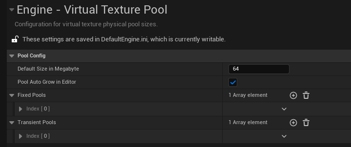
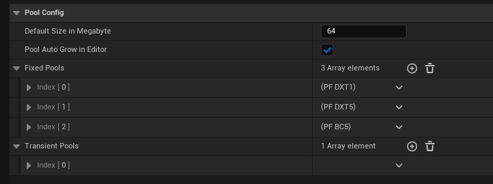
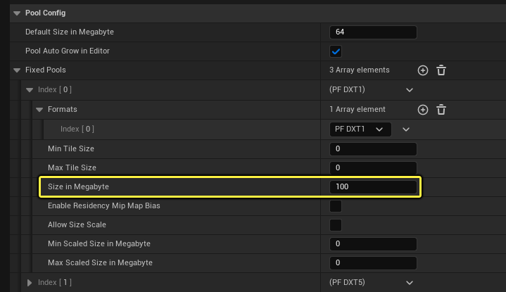
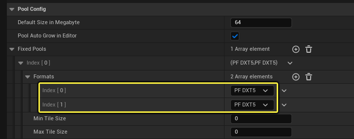
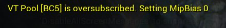
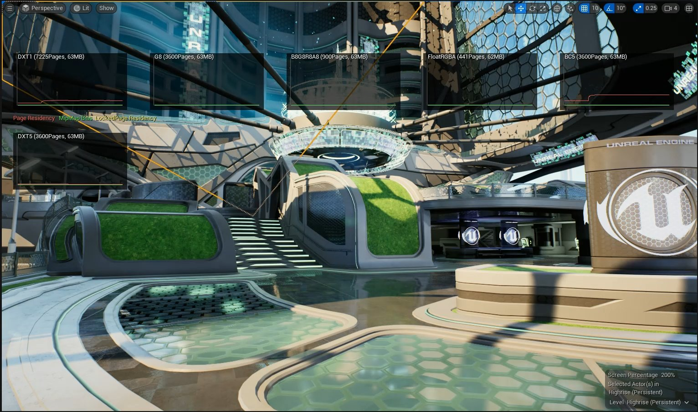
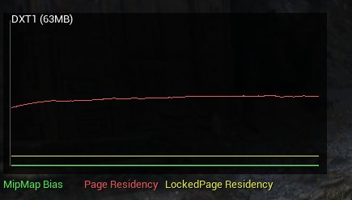
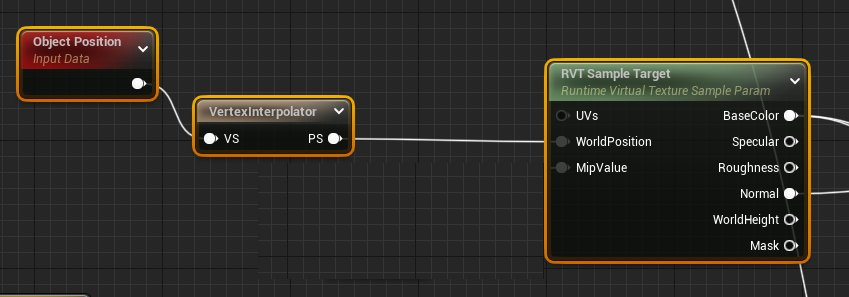

# 虚拟纹理内存池

> 路径：虚幻引擎5.7文档 / 设计视觉、渲染和图形效果 / 优化和调试实时渲染项目 / 虚拟纹理 / 虚拟纹理内存池

> 原始页面：https://dev.epicgames.com/documentation/unreal-engine/virtual-texture-memory-pools-in-unreal-engine

虚拟纹理系统主要有两种GPU内存分配方式：页表内存（Page Table Memory）和物理内存池（Physical Memory Pool）。

- 页表内存（Page Table Memory）

  提供了从纹理坐标间接访问纹理数据的方法，可以按需分配。它会随着时间推移不断增大；除非释放其中的全部内容，否则无法从内存中释放。用户无法控制该存储类型。
- 物理内存池（Physical Memory Pool）

  包含了当前驻留的纹理数据，并且由多个独立的池构成。虚拟纹理系统所查看的每一种纹理格式都有对应的内存池。对应格式的虚拟纹理进行第一次实例化时会分配内存池。每个内存池都具有固定的大小，不会逐渐增大。用户可以控制每个池的大小。

本文档将介绍如何定义和调试虚拟纹理物理内存池。

## 理解物理内存池的行为

物理内存池都是由页组成的。每一页都包含了一个虚拟纹理区块的数据。内存池的行为类似于以使用时间远近为基础的缓存。当虚拟纹理系统请求区块时，它就会被流送或渲染到内存池里的一个可用页中。如果没有可用页，那么包含使用时间最久远的区块的页就会被去除，为新区块腾出空间。

如果视图中包含的可见虚拟纹理过多，无法存储到虚拟纹理内存池中，系统就无法正确渲染视图。在这些情况下，你必须调整虚拟纹理内存池的大小，从而满足数据使用量要求。

## 配置物理内存池

虚拟纹理的内存池大小可以在 **引擎（Engine）> 虚拟纹理池（Virtual Texture Pool）** 下面的 **项目设置（Project Settings）** 中设置。



- 固定池（Fixed Pools）

  是序列化的设置，按从最后一个到第一个的顺序进行迭代，并使用它找到的第一个匹配的配置。这些设置将在编辑器会话之间持久存在。
- 临时池（Transient Pools）

  是在运行时检测到的配置，并由池自动增长系统使用。虚拟纹理物理池会搜索这些配置以查找匹配项，然后在"池"中搜索配置设置。临时池仅对当前编辑器会话持久存在，但可以被复制到序列化池，用以大致估计烘焙项目需要的固定池大小。

池的说明存储在 **固定池（Fixed Pools）** 数组设置中，每个说明包含 **纹理格式（Texture Format）** 和 **图块大小（Tile Size）** 。下面的示例对列出的每个纹理格式都有特定池说明：DXT1、DXT5和BC5。



你可以进一步将包含DXT1纹理的虚拟纹理内存池设置为100兆字节（MB）的大小，方法是在 **固定池（Fixed Pools）** 下展开索引，并设置 **以兆字节为单位的大小（Size in Megabyte）** ，如以下示例所示。内存池的大小是近似值，系统会分配小于100 MB、容纳页数为整数的最大平方数。



在配置中没有对应条目的格式会使用 **以兆字节为单位的默认大小（Default Size in Megabyte）** 中的池大小。

> [!NOTE]
> 或者，默认池大小可以通过在 **固定池（Fixed Pools）** 中定义未分配纹理格式的条目来表示。

一些池包含多层，每层有自己的格式。大部分运行时虚拟纹理设置都是如此。在此情况下，池说明应该正确指定 **格式（Format）** 数组。例如，在材质中使用 **基础颜色、法线、粗糙度、高光度（Base Color, Normal, Roughness, Specular）** 类型的运行时虚拟纹理会使用两个DXT5纹理来存储数据。它会按如下所示设置：



固定池配置条目还有以下设置：

| 内存池配置设置 | 说明 |
| --- | --- |
| **允许伸缩大小（Allow Size Scale）** | 通过伸缩性控制台变量 `r.VT.PoolSizeScale` ，对内存池大小应用额外的伸缩系数。 |
| **启用驻留Mip贴图偏差（Enable Residency Mip Map Bias）** | 允许在该池超额时，对虚拟纹理应用MipMap偏差。 |
| **以兆字节为单位的最小伸缩大小（Min Scaled Size in Megabyte）** | 设置在应用 `r.VT.PoolSizeScale` 的控制台变量值之后，要为池分配的大小下限。 |
| **以兆字节为单位的最大伸缩大小（Min Scaled Size in Megabyte）** | 设置在应用 `r.VT.PoolSizeScale` 的控制台变量值之后，要为池分配的大小上限。 |

启用设置 **池在编辑器中自动增长（Pool Auto Grow in Editor）** 时，池大小会增加以适应最高的池驻留。检测到池为100%驻留时，其大小会增加，并且编辑器中有弹窗通知你这一更改。设置中检测到的自动增加池大小变化会存储在 **临时池（Transient Pool）** 数组配置中。

> [!WARNING]
> 这些设置不会在编辑器会话之间持久存在于项目设置中，而会丢失。这意味着，如果你的项目有超额的池，并且启用了 **池在编辑器中自动增长（Pool Auto Grow in Editor）** ，你可能会在每次启动编辑器时看到池增长。要规避此情况，你可以在 **临时池（Transient Pool）** 设置与 **固定池（Fixed Pools）** 设置之间复制粘贴条目，使其在编辑器会话之间持久存在。

> [!NOTE]
> **池在编辑器中自动增长（Pool Auto Grow in Editor）** 设置在烘焙构建中不起作用，但你可以设置 `r.VT.PoolAutoGrow` 以在烘焙构建中调整池大小。

## 物理内存池驻留

虚拟纹理内存池的当前使用情况被称为 **驻留（Residency）**。当内存池的所有页都分配了当前可见的区块，驻留即为100%。

驻留为100%时，内存池即为超额（oversubscribe），并会开始删除可视区块的数据。由于纹理数据会在内存中重复加载与删除，这将导致意外的输入输出和屏幕闪烁。

你可以启用界面通知，在内存池超额时显示通知。该通知可使用控制台命令 `r.VT.Residency.Notify 1` 启用。



> [!NOTE]
> 该警告表明，你需要在配置文件中扩大内存池大小，或者更改虚拟纹理或材质。请查看下文部分，了解如何解决该类问题通知。

### 驻留MipMap偏差

如果启用 `bEnableResidencyMipMapBias` 配置内存池，就会在超额时设置MipMap偏差来降低驻留。这能避免出现意外的输入输出和屏幕闪烁，但渲染的虚拟纹理分辨率会降低。

> [!TIP]
> 该设置适合在驻留鲜少超额、不愿为这种罕见情况分配内存的时候使用。超额的屏幕信息会包含应用的MipMap偏差。

> [!NOTE]
> 驻留产生的MipMap偏差是全局性的。所有物理内存池的最大当前偏差会应用于 *所有* 虚拟纹理采样。

## 物理内存池HUD显示

设置合理的内存池大小是监控驻留、减少超额情况的关键。你可以使用屏幕抬头显示（HUD），展示每个虚拟纹理物理内存池当前的驻留。

该功能更可通过 `r.VT.Residency.Show 1` 启用。



虚拟纹理物理内存池HUD会显示每个纹理格式的当前驻留及其分配的内存。



屏幕上的每个图表都代表一个虚拟纹理物理内存池。总共有三种线状图表：

- 红色

  表示当前池驻留为0-100%。
- 黄色

  表示固定池占用为0-100%。
- 这表示的是标记为锁定的页占用。通常每个虚拟纹理都会锁定一页。加载大量虚拟纹理资产时，即使虚拟纹理不可见，也会降低可用的池空间。
- 绿色

  表示应用MipMap偏差将驻留控制在100%以下。

## 调试物理内存池驻留

当虚拟纹理内存池超额时，可以从以下领域开始调试并检查内容。

### 内存池大小

对于虚拟纹理内存池的大小，你需要检查以下方面：

- 检查内存池大小是否足够大，能够容纳预期的全部虚拟纹理数据。
- 页规模越大，内存池就应当越大。例如，一个纹理格式为

  PF_A32B32G32R32F

  的内存池的内存要求就比纹理格式为

  PF_DXT1

  的内存池更大。同样地，包含更多层数的内存池也需要更大的内存。
- 渲染的输出分辨率越高，内存池就应当越大。
- 高分辨率输出通常需要更高分辨率的mip区块。
- 区块大小越大，内存池就应当越大。
- 流送虚拟纹理

  的默认区块大小为128纹素。然而，该值可以被覆盖。
- 运行时虚拟纹理

  的区块大小最大为1024纹素。较大的区块大小可能会浪费内存池的空间。

### 超额

超额（Oversubscription）的一项主要原因是在对虚拟纹理进行采样时应用了负mip偏差。系统性地对更高分辨率的mip进行采样会需要更多池内存。负mip偏差通常是由于在材质图表的纹理采样节点中专门设置了mip等级或偏差而产生的。

超额也可能因为意外原因产生，例如对零渐变的纹理进行采样时，三角形或网格体的UV不变而产生超额。以下材质图表片段就是一个例子。对运行时虚拟纹理采样节点的"忽略输入世界位置"设置应用Mip值就能解决这个问题。



使用控制台命令 `r.VT.DumpPoolUsage`，就能协助定位由于mip偏差或其他问题而占用过多池空间的纹理。该命令会转储每个内存池中虚拟纹理资产当前分配的页数。转储文件会根据页数排序，因此需要检查第一条输入，确定其是否合理。

需要注意的是，在以下转储文件中，第一条输出明显高出其他输入。因此必须找到引用了 `T_Ground_Sand_F_basecolor_CANYON` 的材质，检查是否存在mip偏差问题。

```
	PhysicaPool: [0] DXT1 (136x136):		T_Ground_Sand_F_basecolor_CANYON 1912		T_Rock_Quarry_Y_RAOD 418		ubulehofw_8K_Albedo 324		pcciQ_4K_Albedo 248		T_Rock_Cliff_D_RAOD 187		noise_directional_3 115		T_column_260_B_W 97		T_column_260_B_goldA_RMAOO 97		T_column_260_B_goldA_C 96 
```
