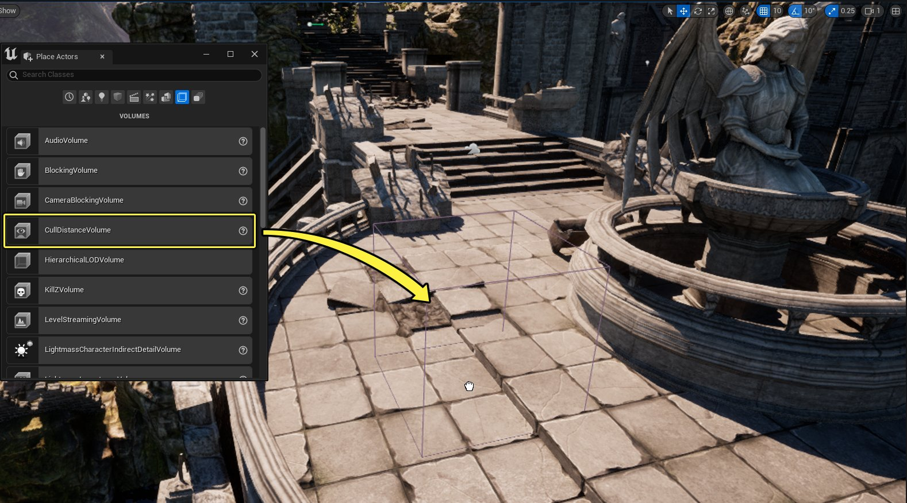
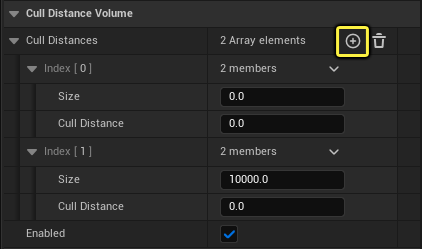
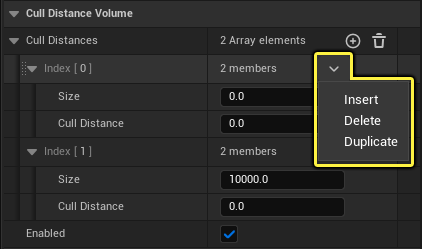
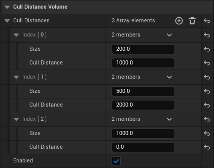
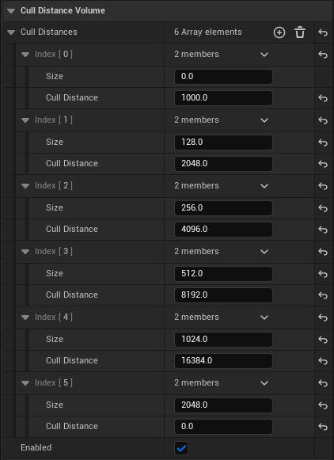

# 剔除距离体积

> 路径：虚幻引擎5.7文档 / 设计视觉、渲染和图形效果 / 优化和调试实时渲染项目 / 可视性和遮挡剔除 / 剔除距离体积

> 原始页面：https://dev.epicgames.com/documentation/unreal-engine/cull-distance-volumes-in-unreal-engine

**剔除距离体积（Cull Distance Volume）** 是非常有用的优化工具，它定义绘制（显现）该体积中的Actor的距离。这些体积可存储任意数量的"大小"和"距离"组合（称为 **剔除距离对**）。这些剔除距离对会被映射到Actor（沿其最长有效维度）的边界，然后指定给关卡中的该Actor实例。剔除距离体积（Cull Distance Volume）对于优化包含精细内部空间的大型室外关卡非常有用。当室内空间小到可被视为不重要时，可以剔除它们。

## 设置和用法

可通过编辑器中的 **放置Actor（Place Actors）** 面板向关卡中添加剔除距离体积（Cull Distance Volume），并且你可以缩放它，以适应关卡需求。

选中体积之后，使用 **细节（Details）** 面板访问 **剔除距离（Cull Distance）** 对数组。每个"剔除距离（Cull Distance）"对都包含 **大小（Size）** 和 **剔除距离（Cull Distance）** 数值。单击 **加号**（**+** 号）可向数组元素列表底部添加新剔除距离（Cull Distance）对。

默认情况下会为体积添加两个 **剔除距离（Cull Distance）** 对；你可以将第一个剔除距离对作为要编辑的第一个条目，它的大小和距离都尚未设置，第二个剔除距离对使大于10000单位的对象免于被剔除，因为那些对象的距离为0。通过设置较大的剔除距离对，你可以使远处的大型建筑或高山等对象免于被剔除。

### 插入、删除和复制剔除距离对

使用每个数组元素旁的下拉菜单可插入、删除或复制剔除距离对元素。

- 插入（Insert）

  会在选中的元素上方添加新剔除距离对。
- 删除（Delete）

  会从列表中删除现有剔除距离对元素。
- 复制（Duplicate）

  会将选中的剔除距离对复制到下面的新数组元素。

> [!NOTE]
> 你可以根据需要拥有任意数量的剔除距离数组元素，其先后顺序不会影响它们的有效性。

## 示例场景和设置

本示例使用Infinity Blades Grasslands项目，我们设置了几个剔除距离对，它们可从摄像机的位置剔除不同大小的对象。

> [!NOTE]
> 此处使用的数值是极端示例，便于你快速理解剔除距离对对关卡中的Actor发挥的作用。添加更多对数值并且进行更多测试将有助于改善本示例中出现的"突然出现"问题。

我们将下列数值用于定义"剔除距离（Cull Distance）"和"大小（Size）"的演示。

- 该体积中大小最接近

  200

  单位的对象会在它们距摄像机

  1000

  单位或更远时被从视野中剔除。
- 该体积中大小最接近

  500

  单位的对象会在它们距摄像机

  2000

  单位或更远时被从视野中剔除。
- 该体积中大小最接近

  1000

  单位的对象将永不会被剔除。这可以确保尺寸极大的对象被视为无穷大，这意味着它们距摄像机的距离永不可能远到应将它们剔除的程度。

设置剔除距离对时，请牢记以下规则：

- 剔除距离对数组非线性插值。

  - 这意味着你无需使用虚拟对，在存在重叠的剔除距离对时，引擎将挑选最激进的设置（或大于0的最低设置）并将它指定给Actor。
- 你可以根据需要拥有任意数量的剔除距离对。

  - 为了便于组织，最好使这些对具有一定的顺序（例如从高到低），但并非必需。
  - 添加新对时，请记住，你始终可在稍后使用

    插入（Insert）

    下拉菜单添加对。
- 剔除距离对将指定给边界直径与其大小最接近的Actor。你可以使用Actor的

  当前最大绘制距离（Current Max Draw Distance）

  了解它基于剔除距离对数值被指定到的缓存绘制距离组。

为了帮助你入门，我们在下图中列出了一些推荐的对数值：

## 最佳实践

下列建议可帮助你实现有效的结果：

- 使用单个剔除距离体积（Cull Distance Volume）覆盖整个关卡。

  - 包含可代表关卡中大部分Actor的多种剔除距离对。
  - 对于体积中的区域，你可以使用额外的剔除距离体积（Cull Distance Volume）实现对剔除的额外的更加激进的控制。
- 设置剔除距离对时，可先从较大尺寸和距离开始，以了解你希望使用的上限和下限。

  - 请在关卡视口的"游戏（Game）"视图下在关卡中四处移动，以查看对象是否存在任何可见的"突然出现"。
  - 进行更改（可能需要在现有的剔除距离对间添加一些新剔除距离对）。选择存在问题的Actor并使用其

    缓存剔除距离（Cached Cull Distance）

    了解部分Actor所属的剔除距离对分组情况。
- 请记住，剔除距离对组仅在低于个体Actor的 **最大绘制距离** 时才会被使用。
- 如果某些Actor应永不被剔除距离体积（Cull Distance Volume）剔除，请使用该Actor的"细节（Details）"面板并禁用

  允许剔除距离体积（Allow Cull Distance Volume）

  。

  - 请记住，如果需要为大量Actor禁用此选项，可以考虑使用最后一个剔除距离对作为"过大不应剔除距离"数值（

    大小（Size）

    的数值很大，

    剔除距离（Cull Distance）

    为

    0

    ）。这可以防止高山或建筑物等非常大的对象被剔除。
