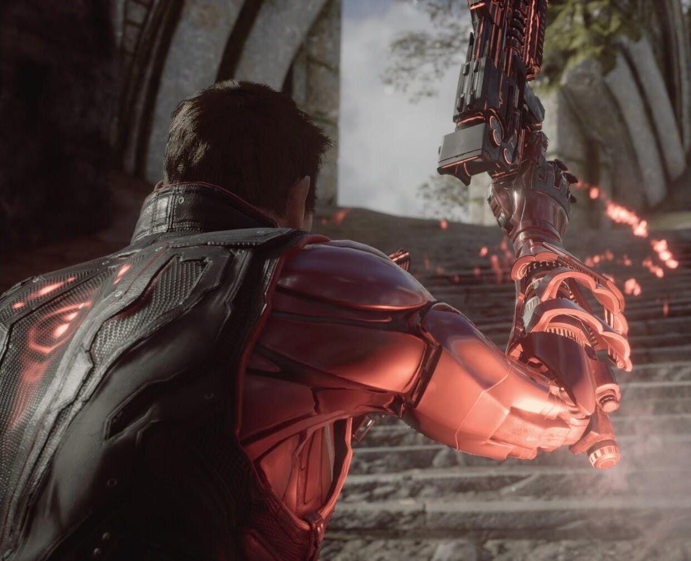
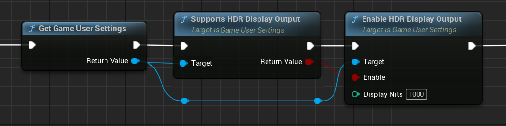
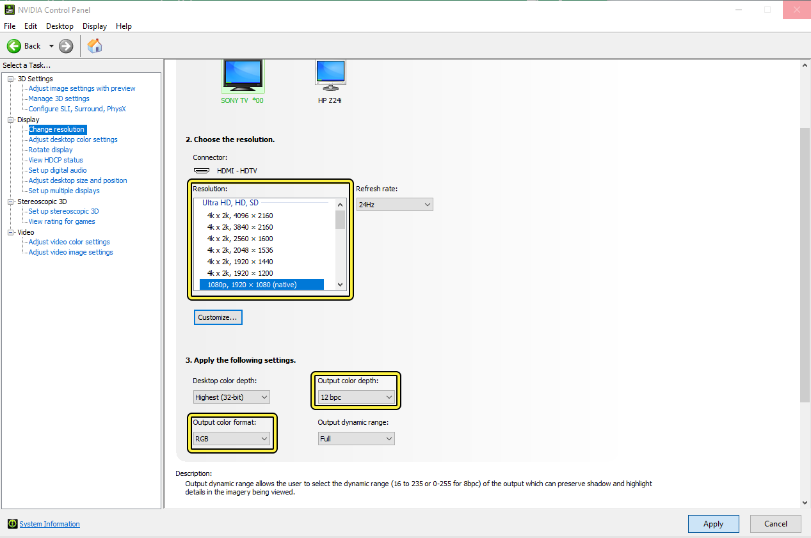

# 高动态范围显示输出

> 路径：虚幻引擎5.7文档 / 设计视觉、渲染和图形效果 / 后期处理效果 / 颜色分级和胶片色调映射器 / 高动态范围显示输出

> 原始页面：https://dev.epicgames.com/documentation/unreal-engine/high-dynamic-range-display-output-in-unreal-engine

你可以输出到高动态范围（HDR）显示器，以充分利用更高的对比度和更宽的色域等功能！其目标是使显示的图像具有的特性更类似于"现实世界"中所经历的自然光条件。这是转向 **学院色彩编码系统**（ACES）标准行动的一部分，该标准是一个确保在多种格式和显示器上保持色彩一致性的管线，也是一种确保所用源材质 *不会过时* 且无需针对其他介质进行调整的方法。

低动态范围 (LDR)

高动态范围 (HDR)

此范例为模拟，仅限展示之用。在 LDR 屏幕上无法表达出 HDR 的差异。

在当前实现下，渲染场景的完整处理通过 **ACES Viewing Transform** 进行处理。此流程的工作原理是使用"参考场景的"和"参考显示的"图像。

- 参考场景的

  图像保有源材质的原始

  线性光照

  数值，不限制曝光范围。
- 参考显示的

  图像是最终的图像，将变为所用显示的色彩空间。

使用此流程后，初始源文件用于不同显示时便无需每次进行较色编辑。相反，输出的显示将映射到正确的色彩空间。

ACES Viewing Transform在查看流程中将按以下顺序进行：

- Look Modification Transform (LMT)

  - 这部分抓取应用了创意"外观"（颜色分级和矫正）的ACES颜色编码图像，输出由ACES和Reference Rendering Transform（RRT）及Output Device Transform（ODT）渲染的图像。
- Reference Rendering Transform (RRT)

  - 之后，这部分抓取参考场景的颜色值，将它们转换为参考显示。在此流程中，它使渲染图像不再依赖于特定显示器，反而能保证它输出到特定显示器时拥有正确而宽泛的色域和动态范围（尚未创建的图像同样如此）。
- Output Device Transform (ODT)

  - 最后，这部分抓取RRT的HDR数据输出，将其与它们能够显示的不同设备和色彩空间进行比对。因此，每个目标需要将其自身的ODT与Rec709、Rec2020、DCI-P3等进行比对。

> [!NOTE]
> 如需了解ACES Viewing Transform的更多内容，请从 [ACES GitHub](https://github.com/ampas/aces-dev/tree/master/documents) 页面下载PDF文档，或查阅本页中"参考资料"部分中的链接。

## 启用HDR输出

开启控制台变量或使用蓝图中的 **GameUserSettings** 节点即可启用运行时的HDR输出。

Game User Settings 控制将自动锁定当前可用的最接近输出设备，并相应设置全部标记。另外，还可使用以下控制台变量启用并对HDR设备和色域输出所需的可用选项进行修改。

| 控制台变量 | 描述 |
| --- | --- |
| **r.AllowHDR** | 创建一个能够兼容HDR的交换链（swap-chain），然后允许HDR显示器输出到能支持它的平台上。接受参数0（禁用）和1（启用）。 |
| **r.HDR.EnableHDROutput** | 设为1时，它将重建交换链并启用HDR输出。 |
| **r.HDR.Display.OutputDevice** | 这是输出显示的设备格式： **0**：sRGB (LDR) （默认） **1**：Rec709（LDR） **2**：显式伽马映射 (LDR) **3**：ACES 1000尼特ST-2084（Dolby PQ）（HDR） **4**：ACES 2000尼特ST-2084（Dolby PQ）（HDR） **5**：ACES 1000尼特ScRGB（HDR） **6**：ACES 2000尼特ScRGB（HDR） |
| **r.HDR.Display.ColorGamut** | 这是输出显示的色域： **0**：Rec709 / sRGB, D65 （默认） **1**：DCI-P3, D65 **2**：Rec2020 / BT2020, D65 **3**：ACES, D60 **4**：ACEScg, D60 |

设置 GameUserSettings 的蓝图或 C++ 调用后，即可运行烘焙项目，使用命令行参数 `-game mode` 、使用 Standalone 游戏模式、或使用专属全屏在新窗口中使用 Play-in-Editor（PIE）模式（按下 **Alt** + **Enter** 或使用控制台窗口中的 `fullscreen` 命令）。

> [!NOTE]
> 当前HDR输出无法使用无边框窗口或窗口模式。

### HDR 中的低动态范围（LDR）UI支持

> [!WARNING]
> 此功能尚在实验阶段，可能会在未来的版本中被修改。

启用HDR输出后，用户界面（UI）可能出现显示问题。因此虚幻引擎新增了实验性的LDR UI合成支持。它将尝试尽量匹配LDR的外观。推荐对UI稍微进行增强，以免和鲜艳主场景相比之下显得黯淡。

可使用以下控制台变量执行此操作：

| 控制台变量 | 描述 |
| --- | --- |
| **r.HDR.UI.CompositeMode** | 设为1时，此变量将启用HDR UI合成，尝试保留LDR视觉效果和混合。 |
| **r.HDR.UI.Level** | 此变量将调整合成UI的明亮度。推荐将值设为1.5或2。 |

## HDR硬件和设置注意事项

可用的显示器和电视种类繁多，另外还需考虑主机和PC，因此可能需要使用特定的硬件块或修改设置， 使HDR输出正常进行。在设置过程中需要考虑以下方面：

- 用高速HDMI 2.0 连接线将系统和HDR显示器连接，保证传输速度。（HDMI 1.4也许可用，但显示内容时可能出现问题。） 并非所有HDMI接口均支持HDMI 2.0和HDR。如不确定，请参考显示器说明书。
- 确保电视端启用了HDR。有时这可能列在电视或显示器设置中，如"HDMI色深技术"或"增强格式"。如不确定，请参考显示器说明书。
- 在某些主机上，以PS4为例，可能需要在系统设置中禁用

  Enable HDCP

  ，HDR输出方能正常进行。
- 可能需要在某些显示器上进行显示设置才能获得正确的输出。

  - 在NVIDIA GPU上，使用NVIDIA控制面板并调整显示分辨率Output Color Format使用 **RGB** 、Output Color Depth使用 **10-bit** 或 **12-bit** 。硬件不同，可用选项也有所不同。如不确定，请参考显示器说明书。

    

    点击查看大图。

## 注意事项以及局限性

- 由于和LDR控制之间的兼容性较差，HDR输出中影片映射曲线将默认禁用。
- 当前只能实现1000尼特和2000尼特显示输出的路径。
- D3D11限制将使HDR输出仅限于专属全屏支持。如拥有Windows 10的D3D12支持，可能可以延展为启用HDR输出的单独视口。Mac上的实现已支持此功能。

## 参考资料

- "ACES." Oscars.org | Academy of Motion Picture Arts and Sciences.2017年2月6日出版。2017年6月5日上传。
- "Aces Documentation."Oscars.org | Academy of Motion Picture Arts and Sciences.2016年9月26日出版。2017年6月5日上传。
