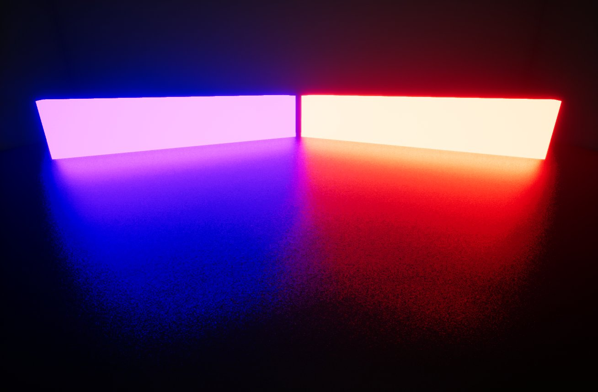
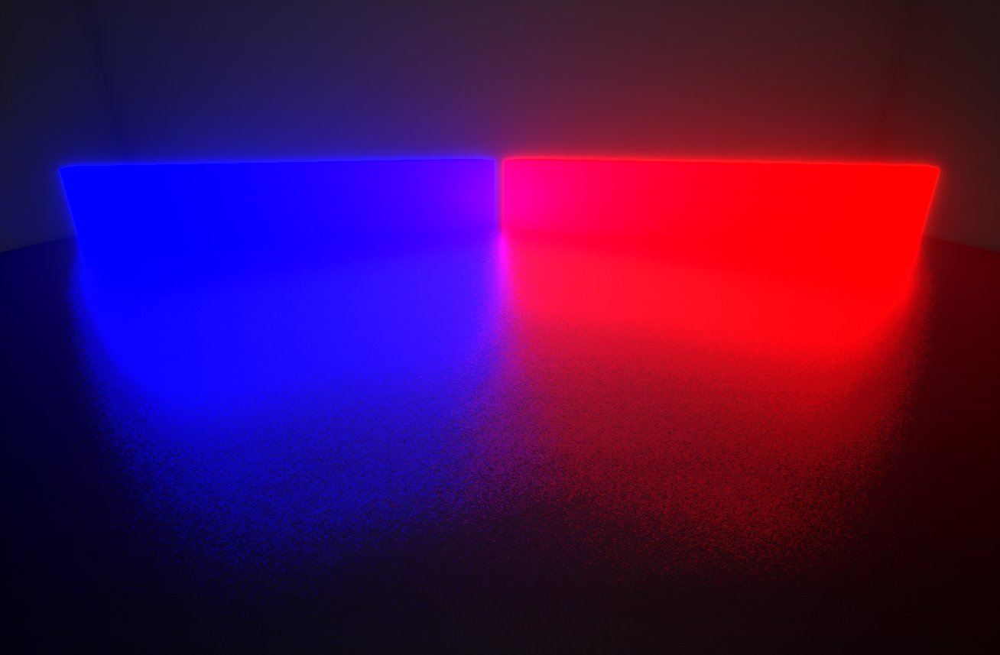
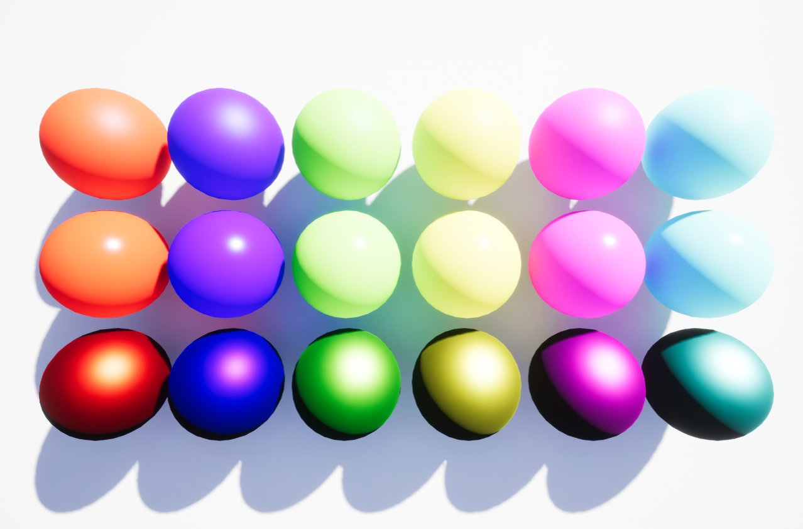
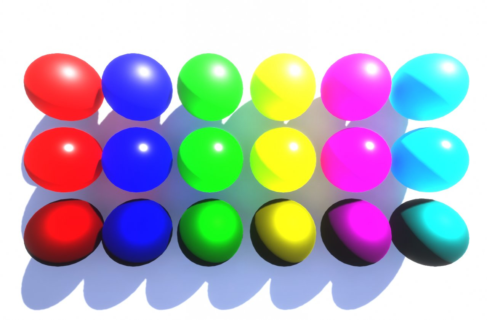
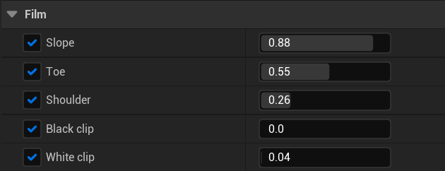
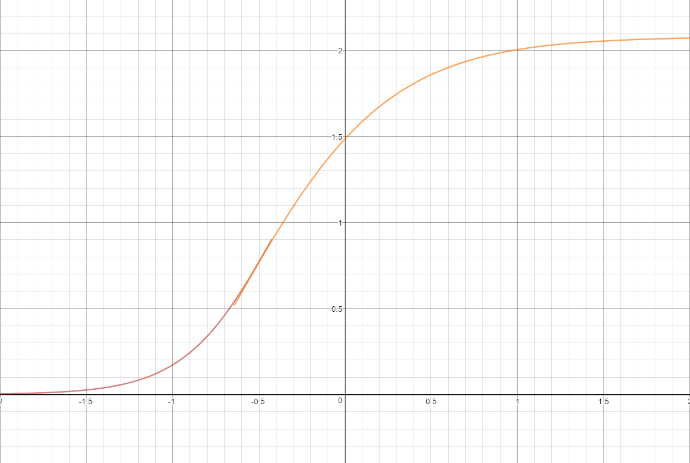
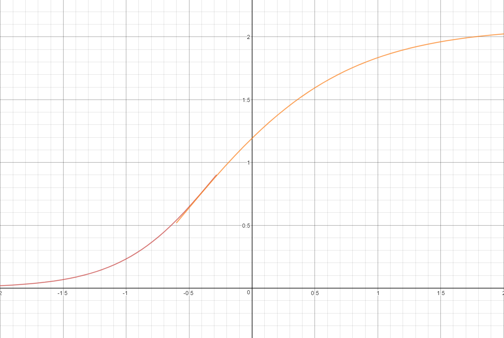
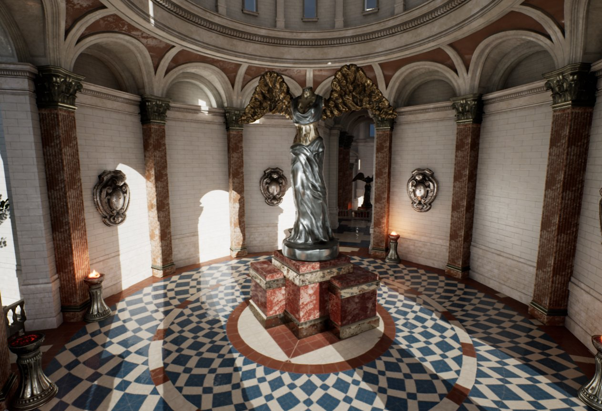

# 颜色分级和胶片色调映射器

> 路径：虚幻引擎5.7文档 / 设计视觉、渲染和图形效果 / 后期处理效果 / 颜色分级和胶片色调映射器

> 原始页面：https://dev.epicgames.com/documentation/unreal-engine/color-grading-and-the-filmic-tonemapper-in-unreal-engine

在虚幻引擎中，**颜色分级** 一词涵盖了[高动态范围（HDR）显示输出](high-dynamic-range-display-output/index.md)使用的色调映射功能（HDR到LDR转换），并改进了图像的颜色校正（用于筛选颜色变换的LDR颜色）处理。

## 色调映射

**色调映射** 功能的目的是将广泛的高动态范围（HDR）颜色映射到显示器能够输出的低动态范围（LDR）。这是后期处理的最后一个阶段，经过法线渲染后，这个过程在后期处理期间执行。你可以将色调映射的过程想象成一种模拟胶片对光线的反应的方法。

### 学院色彩编码系统（ACES）胶片色调映射器

虚幻引擎中使用的胶片色调映射器符合[学院色彩编码系统（ACES）](http://www.oscars.org/science-technology/sci-tech-projects/aces)针对电视和电影设定的行业标准。这样可确保在多种不同的格式和显示器之间保持颜色一致，同时确保源资料在未来的可用性，因为不必针对未来出现的每种介质进行调整。该胶片色调映射器还使用虚幻引擎之前使用的相同全局色调映射器，唯一不同的是现在有一种胶片反应，意味着S形曲线现在能更好地模拟生胶片来打造更优质的总体外观。

有明显不同的两个地方分别是泛光和曝光度。

#### 物理更正自发光和泛光

现在，自发光值在物理上是正确的，因此随着自发光率的增大，颜色会变浅，类似于彩色光在真实世界中的工作原理。颜色经过色调映射后，如果最终颜色足够量，能够开始让胶片/传感器变得饱和，颜色就会变白。

胶片色调映射器 | 自发光

旧版色调映射器 | 自发光

该示例对比的是旧版色调映射器和新的胶片色调映射器。自发光率足够大时，颜色开始变白，这与旧色调映射器不同，旧版的值会变得过度饱和，导致材质区域失去细节。在胶片色调映射器中，你甚至可以看到，该场景中的泛光保持其物理上的正确度，同时也不会过度饱和，从而保留反射原色值。

#### 曝光度

曝光度在物理上是正确的，因此颜色仍保持其原有的形状，而不是失去细节。

在该示例中，有多种颜色和材质类型以及不同的粗糙度和金属感。曝光偏差也设置为0。

胶片色调映射器 | 曝光偏差：3

旧版色调映射器 | 曝光偏差：3

在这个比较中，曝光偏差已经增加到值3，因此真实地展现了胶片色调映射器与旧版色调映射器实现相比较的反应。此外，值3也意味着，经过处理的图像亮度是默认值0的八倍，如以上示例所示。

随着曝光度的增加，胶片和旧版色调映射器之间的差异会变得越来越明显。胶片示例中的球体会继续保持其颜色和阴影的形状，即使它们看起来似乎更明亮一些。使用旧版色调映射器的球体的颜色将开始与阴影混合起来。纯色球体确实会变得明亮，但你很难辨别出它们有较高的曝光值，而胶片色调映射器考虑了这一点。如果增大曝光值，胶片反应看起来就像一个自然的镜头效果。

### 胶片设置

在后期处理体积的 **胶片（Film）** 部分中，你可以使用与ACES标准化生胶片相符的属性，设置场景的色调映射。你可以调节这些色调映射器控制，为项目模拟出其他类型的生胶片效果。

> [!NOTE]
> 建议在项目范围内对这些属性进行更改来打造特定的效果，而不是动态更改或逐个镜头的更改。相反，你应使用[颜色分级](#%E9%A2%9C%E8%89%B2%E6%A0%A1%E6%AD%A3%E5%B1%9E%E6%80%A7)属性进行任何艺术效果调整。

- **Slope：** 可以调整用于色调映射的S曲线的斜率，较大值将使斜率更大（更深），较低值将使斜率更小（更浅）。值的范围是[0.0, 1.0]. [0.0, 1.0].*

  

  

  Slope: 0.88（默认值）

  Slope: 0.6

  

  > 图片已省略：Slope: 0.6

  Slope:0.88（默认值）

  Slope: 0.6
- **Toe：** 调整色调映射中的深色。值的范围是[0.0, 1.0]. [0.0, 1.0]。

  > 图片已省略：Toe:0.55（默认值）

  > 图片已省略：Toe:0.8

  Toe:0.55（默认值）

  Toe:0.8

  > 图片已省略：Toe:0.55（默认值）

  > 图片已省略：Toe:0.8

  Toe:0.55（默认值）

  Toe:0.8
- **Shoulder：** 调整色调映射中的亮色。值的范围是[0.0, 1.0] 。

  > 图片已省略：Shoulder:0.26（默认值）

  > 图片已省略：Shoulder:1

  Shoulder:0.26（默认值）

  Shoulder:1

  > 图片已省略：Shoulder:0.26（默认值）

  > 图片已省略：Shoulder:1

  Shoulder:0.26（默认值）

  Shoulder:1
- **Black Clip：** 设置交叉位置，也就是黑色开始切断数值的位置。一般来说，这个值 **不应该** 调整。值的范围是[0.0, 1.0] 。

  > 图片已省略：Black Clip:0（默认值）

  > 图片已省略：Black Clip:0.1

  Black Clip:0（默认值）

  Black Clip:0.1

  > 图片已省略：Black Clip:0（默认值）

  > 图片已省略：Black Clip:0.1

  Black Clip:0（默认值）

  Black Clip:0.1
- **White Clip：** 设置交叉位置，也就是白色开始切断数值的位置。大多数情况下，变化都比较微妙。值的范围是[0.0, 1.0] 。

  > 图片已省略：White Clip:0.04（默认值）

  > 图片已省略：White Clip:0.2

  White Clip:0.04（默认值）

  White Clip:0.2

  > 图片已省略：White Clip:0.04（默认值）

  > 图片已省略：White Clip:0.2

  White Clip:0.04（默认值）

  White Clip:0.2

> [!NOTE]
> 如果你想像上图一样在实时图表中测试不同的色调映射器值，可以设置默认[UE4色调映射器示例](https://www.desmos.com/calculator/h8rbdpawxj)。

## 颜色校正

颜色校正或颜色分级用于变更或增强场景的总体照明颜色。随着HDR显示器的出现，在处理前保持颜色原有的色彩变得非常重要。这样可确保正确显示颜色。

在过去，颜色校正是通过[查找表（LUT）](using-lookup-tables-for-color-grading/index.md)实现的，而LUT使用的是LDR，显示器上输出的最终颜色使用的是sRGB颜色空间。这在使用HDR显示器时会存在问题，因为LUT只是当前支持的、调节参数时所针对的显示器的一个快照，不能在HDR显示器上呈现相同的效果。为解决这类问题，[颜色校正控制](#colorcorrectionproperties)在场景引用的线性空间中完成其工作，这意味着所有颜色都是先捕捉，再进行色调映射。这样就可以根据任何颜色校正仅调节一个HDR显示器上的颜色，然后在输出图像的所有显示器都能正确显示，而无论是HDR还是LDR均无影响。

> [!NOTE]
> 如需进一步了解HDR管道以及如何有效利用以为你创造更优质内容的信息，请参阅[高动态范围显示输出](high-dynamic-range-display-output/index.md)页面。

### 颜色校正属性

在后期处理体积的 **颜色分级** 部分中，你会找到能够对场景进行更多艺术效果控制的属性。

#### 设置

| 列 1 | 列 2 |
| --- | --- |
| RGB色轮 | HSV色轮 |
| RGB | HSV |

在每个部分下面，你可以使用色轮来选择和拖动颜色值。你还可以在以下模式中选择：

- RGB——该选项调节红色、绿色、蓝色值。
- HSV——该选项调节色调和饱和度值。

> [!TIP]
> 要更精准地控制滑块值，可以按住 **Shift** 键，同时拖动滑块。

> 图片已省略：Color Grading properties

| 属性 | 说明 |  |
| --- | --- | --- |
| 温度 | 该部分中的属性用于调节场景中的颜色，以便白色呈现出真正的白色。这样在指定光照条件下，能够正确照亮场景中的其他颜色。 |  |
| **温度类型（Temperature Type）** | 选择要用的温度计算类型。 **白平衡**:：使用色温值控制虚拟摄像机的白平衡，为默认设置。 **色温**：使用色温值调整场景色温，它与白平衡选项是相反的。 |  |
| **色温（Temp）** | 该属性调节与场景中的光线温度有关的白平衡。光线温度与该属性匹配时，光线呈现为白色。使用的值高于场景中的光线时，会产生"暖色"或黄色，相反，如果值低于场景光线，则产生"冷色"或蓝色。 |  |
| **色调（Tint）** | 该属性通过调节青色和洋红色范围来调整场景的白平衡温度色调。理想状态下，调节白平衡 **色温（Temp）** 属性后应使用该设置来获得正确的颜色。在某些光线温度下，颜色可能会看起来更黄或更蓝。该属性可以用于平衡所产生的颜色，让颜色看起来更自然一些。 |  |
| 全局 | 该部分中的属性是你可以用于场景的一组全局颜色校正。 |  |
| **饱和度（Saturation）** | 该属性调整所表现的颜色（色调）的强度（纯度）。饱和度越高，颜色看起来越接近原色（红色、绿色、蓝色），饱和度降低时，颜色的灰色或褪色效果变得明显。 |  |
| **对比度（Contrast）** | 该属性将调节场景中光线和深色值的色调范围。降低强度会去除高亮，让图像显得更亮，营造出一种褪色效果，而强度提升会加强高亮，让整体图像变暗。 |  |
| **伽马（Gamma）** | 该属性将调节图像中间色调的亮度以准确重现颜色。降低或增大该值会让图像呈现出褪色或过暗的效果。 |  |
| **增益（Gain）** | 该属性调节图像白色（高亮）的亮度以准确重现颜色。增大或降低该值会让图像呈现出褪色或过暗的效果。 |  |
| **偏移（Offset）** | 该属性将调节图像黑色（阴影）的亮度以准确重现颜色。增大或降低该值会让图像阴影呈现出褪色或过暗的效果。 |  |
| 阴影 | 该部分中的属性用于调整场景中阴影的颜色校正值。 |  |
| **Saturation** | 该属性调整所表现的颜色（色调）的强度（纯度）。饱和度越高，颜色看起来越接近原色（红色、绿色、蓝色），饱和度降低时，颜色的灰色或褪色效果变得明显。 |  |
| **对比度（Contrast）** | 该属性将调节场景中光线和深色值的色调范围。降低强度会去除高亮，让图像显得更亮，营造出一种褪色效果，而强度提升会加强高亮，让整体图像变暗。 |  |
| **伽马（Gamma）** | 该属性将调节图像的亮度以准确重现颜色。增大或降低该值会让图像中间色调呈现出褪色或过暗的效果。 |  |
| **增益（Gain）** | 该属性调节图像白色（高亮）的亮度以准确重现颜色。增大或降低该值会让图像呈现出褪色或过暗的效果。 |  |
| **偏移（Offset）** | 该属性将调节图像黑色（阴影）的亮度以准确重现颜色。增大或降低该值会让图像阴影呈现出褪色或过暗的效果。 |  |
| **最大阴影（Shadows Max）** | 这是影响 **阴影** 部分中已经调整的颜色校正属性的属性乘数。 |  |
| 中间色调 | 该部分中的属性用于调整场景的中间色调的颜色校正值。 |  |
| **饱和度（Saturation）** | 该属性调整所表现的颜色（色调）的强度（纯度）。饱和度越高，颜色看起来越接近原色（红色、绿色、蓝色），饱和度降低时，颜色的灰色或褪色效果变得明显。 |  |
| **对比度（Contrast）** | 该属性将调节场景中光线和深色值的色调范围。降低强度会去除高亮，让图像显得更亮，营造出一种褪色效果，而强度提升会加强高亮，让整体图像变暗。 |  |
| **伽马（Gamma）** | 该属性将调节图像的亮度以准确重现颜色。增大或降低该值会让图像中间色调呈现出褪色或过暗的效果。 |  |
| **增益（Gain）** | 该属性调节图像白色（高亮）的亮度以准确重现颜色。增大或降低该值会让图像呈现出褪色或过暗的效果。 |  |
| **偏移（Offset）** | 该属性将调节图像黑色（阴影）的亮度以准确重现颜色。增大或降低该值会让图像阴影呈现出褪色或过暗的效果。 |  |
| 高亮 | 该部分中的属性用于调整场景的高亮部分的颜色校正值。 |  |
| **饱和度（Saturation）** | 该属性调整所表现的颜色（色调）的强度（纯度）。饱和度越高，颜色看起来越接近原色（红色、绿色、蓝色），饱和度降低时，颜色的灰色或褪色效果变得明显。 |  |
| **对比度（Contrast）** | 该属性将调节场景中光线和深色值的色调范围。降低强度会去除高亮，让图像显得更亮，营造出一种褪色效果，而强度提升会加强高亮，让整体图像变暗。 |  |
| **伽马（Gamma）** | 该属性将调节图像的亮度以准确重现颜色。增大或降低该值会让图像中间色调呈现出褪色或过暗的效果。 |  |
| **增益（Gain）** | 该属性调节图像白色（高亮）的亮度以准确重现颜色。增大或降低该值会让图像呈现出褪色或过暗的效果。 |  |
| **偏移（Offset）** | 该属性将调节图像黑色（阴影）的亮度以准确重现颜色。增大或降低该值会让图像阴影呈现出褪色或过暗的效果。 |  |
| **最小高亮（HighLights Min）** | 这是影响 **阴影** 部分中已经调整的颜色校正属性的属性乘数。 |  |
| 其他 |  |  |
| **蓝色修正（Blue Correction）** | 修正因ACES色彩空间而产生的蓝色伪影。明亮蓝色区域会降低饱和度，而不是变成紫色。 |  |
| **扩充色域（Expand Gamut）** | 在sRGB色域外，扩充明亮饱和的色彩，模拟宽色域渲染。 |  |
| **色调曲线数量（Tone Curve Amount）** | 允许降低色调曲线的效果。将 "色调曲线数量" 和 "扩充色域" 设置为0可以完全禁用色调曲线。 |  |
| **场景颜色色调（Scene Color Tint）** | 一种用于HDR场景色彩的滤色贴图的乘数。 |  |
| **颜色分级LUT强度（Color Grading LUT Intensity）** | 控制色彩修正效果的换算系数。 |  |
| **颜色分级LUT（Color Grading LUT）** | 用于色彩修正查找表的LUT纹理。 [undefined](https://d1iv7db44yhgxn.cloudfront.net/documentation/images/d5c0a580-a37d-436e-8cce-d25c1451d5d6/lut_none.png) 点击查看大图。 [undefined](https://d1iv7db44yhgxn.cloudfront.net/documentation/images/5ce251d0-fc41-4577-9f02-7af435dbbbce/lut_green.png) 点击查看大图。 [undefined](https://d1iv7db44yhgxn.cloudfront.net/documentation/images/0b0d0b31-b7d8-4589-9065-2858a8222d04/lut_red.png) 点击查看大图。 中性查询表 Greenish LUT 偏红查询表 |  |
| [undefined](https://d1iv7db44yhgxn.cloudfront.net/documentation/images/d5c0a580-a37d-436e-8cce-d25c1451d5d6/lut_none.png) 点击查看大图。 | [undefined](https://d1iv7db44yhgxn.cloudfront.net/documentation/images/5ce251d0-fc41-4577-9f02-7af435dbbbce/lut_green.png) 点击查看大图。 | [undefined](https://d1iv7db44yhgxn.cloudfront.net/documentation/images/0b0d0b31-b7d8-4589-9065-2858a8222d04/lut_red.png) 点击查看大图。 |
| 中性查询表 | Greenish LUT | 偏红查询表 |

##### 颜色分级查询表

| 列 1 | 列 2 | 列 3 |
| --- | --- | --- |
| [undefined](https://d1iv7db44yhgxn.cloudfront.net/documentation/images/d5c0a580-a37d-436e-8cce-d25c1451d5d6/lut_none.png) 点击查看大图。 | [undefined](https://d1iv7db44yhgxn.cloudfront.net/documentation/images/5ce251d0-fc41-4577-9f02-7af435dbbbce/lut_green.png) 点击查看大图。 | [undefined](https://d1iv7db44yhgxn.cloudfront.net/documentation/images/0b0d0b31-b7d8-4589-9065-2858a8222d04/lut_red.png) 点击查看大图。 |
| 中性查询表 | Greenish LUT | 偏红查询表 |

### 优秀颜色校正的工作流

在使用后期处理体积中的颜色分级工具时，应培养一些好的使用习惯。

- **胶片（Film）** 控制应针对项目范围外观进行设置。理想状态下，这些属性不应调整，更不应动态调整或逐个镜头的调整。如有需要，可以使用[颜色分级](#colorcorrectionproperties)属性。
- 首先使用 **全局** 颜色校正属性对场景进行初始总体润色，然后再调整任何其他属性。大部分颜色分级更改应该使用这些属性来完成。
- 不应尝试使用 **增益（Gain）** 属性来调节场景曝光度。该属性应该用于针对不同颜色进行微调。请改为使用 **曝光偏差（Exposure Bias）**，这个选项位于 **镜头（Lens）** > **自动曝光（Auto-Exposure）** 部分中。
- 使用较小的 **偏移（Offset）** 让阴影或暗色区域显得更明亮一些。如果希望事物看起来有些模糊或泛光效果，可以设置更大的值，反之，如果场景过于模糊或泛光过多，可以降低该值，从场景中剔除一些颜色。
- 改为使用[查找表（LUT）](using-lookup-tables-for-color-grading/index.md)来为场景着色，该操作发生在色调映射之后，因此应使用颜色分级属性实现你想要的效果，以保持在所有输出显示器（LDR和HDR）上呈现一致的效果。但是，使用LUT设置色调，然后调整颜色校正来获得相似效果，也是快速实现效果的好方法。

## 培训视频
