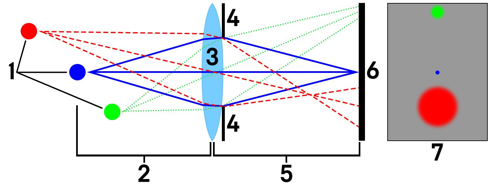
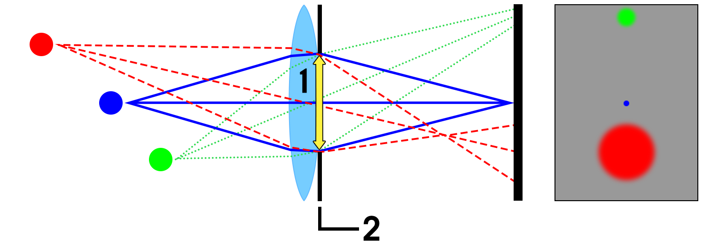
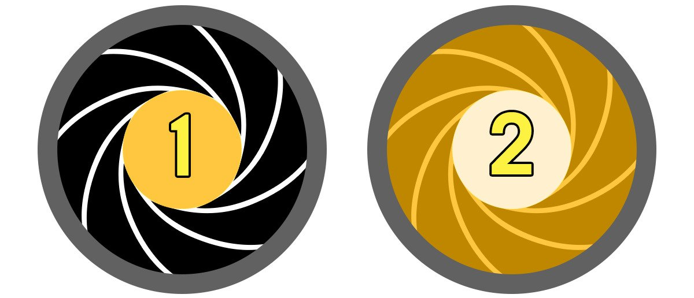
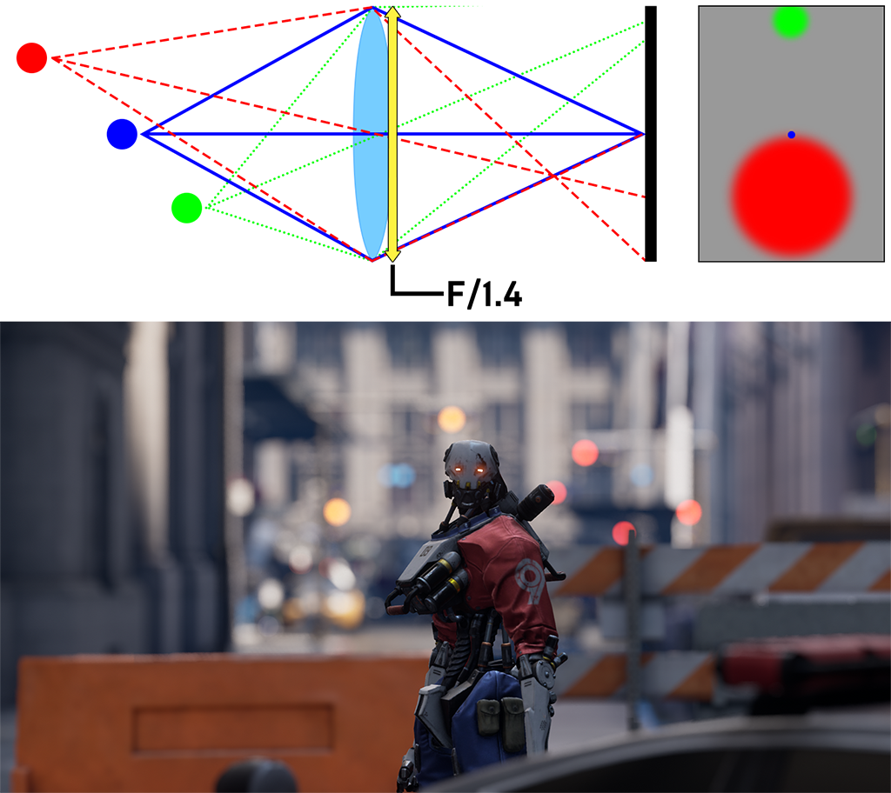
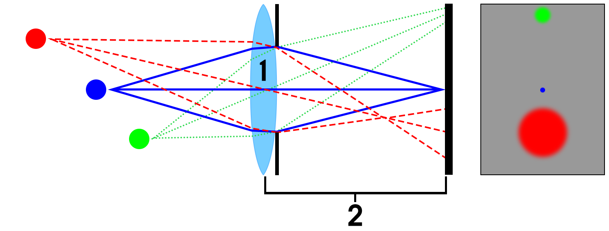
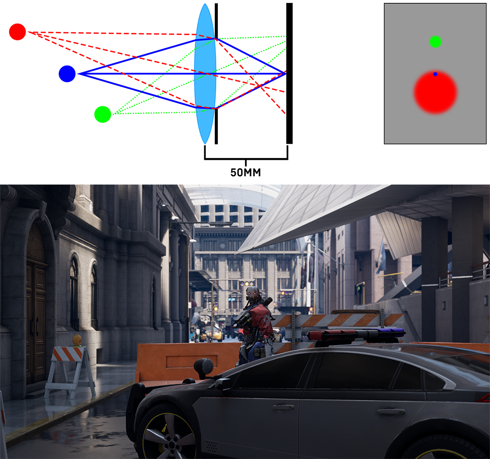

# 过场动画景深

> 路径：虚幻引擎5.7文档 / 设计视觉、渲染和图形效果 / 后期处理效果 / 景深 / 过场动画景深

> 原始页面：https://dev.epicgames.com/documentation/unreal-engine/cinematic-depth-of-field-in-unreal-engine

以下景深方法具有影视级视觉效果，十分接近使用延迟着色渲染器和群集前向渲染器的桌面及主机平台上照片和电影的效果。

## 过场动画

类似于圆圈景深和散景景深，"影视级"景深的效果跟真实摄像机不相上下，你可以在锐化[高动态范围](../../color-grading-and-the-filmic-tonemapper/high-dynamic-range-display-output/index.md) (HDR)内容中看到圆形散景（离焦区域）。此方法使用程序化散景模拟技术，具有动态分辨率稳定性和阿尔法通道支持，在台式机和主机上开发的项目还具有更快速、可扩展和性能优化等特性。

Depth of Field Disabled

Cinematic Depth of Field

### 对焦拍摄对象

实现美学意义上宜人景深效果的关键在于对焦拍摄对象。对于特定拍摄情形，影响景深设置的核心因素有三个：

- 确定镜头要使用的 **焦距（Focal Length）**。
- 选择合适的 **孔径（Aperture）**（F值）。
- 选择拍摄对象与摄像机之间的 **对象距离（Distance to your Subject）**。

为了理解调整这些设置时会产生怎样的效果，我们来分析一下构成摄像机和拍摄场景的各个要素：

1. 场景中的各个点 1.红点：未对焦

   1.蓝点：正好对焦

   1.绿点：未完全对焦
2. 到拍摄对象的对焦距离（1. ii）
3. 摄像机镜头
4. 镜头光圈（F值）
5. 镜头焦距
6. 胶片背板/图像传感器
7. 最终图像结果

> [!NOTE]
> 注意：右侧的渲染图像已通过摄像机镜头反转。红色是后景的一部分，离焦程度较大，绿色是前景的一部分，略微离焦。

上面的几个点（1）分别代表摄像机在既定 **对焦距离（Focus Distance）** （2）下采集的对象，即本例中的蓝色对象。**孔径（Aperture）** （4）定义如何呈现前景和后景中离焦的模糊对象，最后，镜头的 **焦距（Focal Length）** （5）用于控制视野或图像大小。

#### 孔径

**孔径（Aperture）** 根据 **光圈（Diaphragm）** 直径（由F值控制）确定前景和后景的锐化和虚化程度。

1. 摄像机镜头
2. 镜头的孔径光圈（以F值计）

上图演示了阻挡光线通过 **镜头（Lens）** （1）的 **光圈（Diaphragm）** （2）。孔径（或F值）大小确定可通过镜头的光线数量，进而根据拍摄焦距控制前景和后景虚化程度。

孔径由两个因素确定：**F值（F-stop）** 和 **光圈（Diaphragm）**。

1. **孔径（Aperture）** 是光线可通过的开口直径。焦距除以 **F值（F-stop）** 就是孔径。
2. **光圈（Diaphragm）是由用于阻挡光线的多个叶片构成的机械结构。它根据提供的F值开关叶片。

镜头的孔径由光圈直径确定，随着F值增加，孔径减小，从而控制景深效果的深浅。请参阅[对焦距离](#%E5%AF%B9%E7%84%A6%E8%B7%9D%E7%A6%BB)中对该效果的图解。

为了演示孔径的工作原理，请拖动滑块来改变F值，分别为1.4、2.8和5.6。F值越小，景深越浅，后景和前景就越模糊。F值越大，景深越深，后景和前景锐化程度就越高。

> [!NOTE]
> 注意，此处只改变了F值，对焦距离和焦距保持不变，分别为7米和75毫米。

拖动滑块来改变孔径F值。

> [!NOTE]
> 通常，当你调整真实摄像机的孔径设置时，必须同时调整曝光设置才能让胶片背板/图像传感器收到相同的光强度。但是，虚幻引擎中的摄像机并不是真实摄像机，所以调整F值和光圈并不会控制光强度。

#### 焦距

**焦距（Focal Length）** 是指从镜头中心到 **胶片背板（Filmback）**（或图像传感器）的距离（以毫米计）。

1. 摄像机镜头
2. 焦距

为了演示焦距的工作原理，请拖动滑块来改变镜头焦距，分别为50毫米、75毫米和100毫米。请注意它如何有效地改变拍摄视野(FOV)；随着焦距增大，视野会变小。可以把焦距想象成类似于用摄像机放大，只是这样做的时候，后景和前景的离焦区域变得更加明显。下例中，当焦距在50mm到100mm之间变化时可以看到这种情况；这个镜头在整个前景中大部分都是对焦的，但当使用100mm焦距时，更容易发现后景离焦更多，前景也有最小的模糊量。

> [!NOTE]
> 注意，此处的图解和示例只更改了镜头焦距；对焦距离和F值保持不变，分别为7米和f/2.8。

#### 对焦距离

**对焦距离（Focus Distance）** 是指从摄像机镜头中心到对焦的拍摄对象的距离，二者形成一个聚焦平面。摄像机离拍摄对象越近，位于焦点外的后景区域就越大。

> 图片已省略：Focus Distance Diagram

1. 场景中的各个焦点

   1. 红点：未对焦
   2. 蓝点：正好对焦
   3. 绿点：未完全对焦
2. 到对象(1b)的对焦距离
3. 摄像机镜头

上图展示了组成场景的各个不同对象（1）：后景、拍摄对象和前景。从镜头（3）到聚焦对象（2）的距离（即本例中的蓝点）就是对焦距离。后景和前景中区域的虚化程度取决于摄像机的F值和焦距设置。

使用 **视口（Viewport）** 中的 **显示（Show）** 下拉菜单，选择 **高级（Advanced）** \> **景深图层（Depth of Field Layers）**，可以可视化景深图层。在本例中，绿色代表前景对象，黑色代表聚焦对象的区域，蓝色代表后景对象。

> 图片已省略：Rendered Scene

> 图片已省略：Depth of Field Layers Visualization

Rendered Scene

Depth of Field Layers Visualization

为了演示对焦距离的工作原理，请拖动滑块来改变对焦距离，分别为 米、7米和10米。调整对焦距离也会改变场景的聚焦平面（紫色虚线），它用于指示拍摄的聚焦区域位置。图中的蓝色参考点使用角色作为这里的聚焦对象，这样，当摄像机将拍摄焦点（上面的黑色/灰色区域）移动到场景的不同部分时，前景和后景中的对象也会移动。最初，对焦距离为 米时，前景中的警车正好处于对焦区域，而后景中的角色处于离焦区域。图中的蓝色参考点在胶片背板前交叉形成焦点，说明了这一点。当对焦距离为7米时，角色正好处于对焦区域，而后景和前景对象处于离焦区域。当对焦距离为10米时，路障正好处于对焦区域，而前景中的角色和警车处于离焦区域。图中的蓝色参考点说明了这一点，因为交叉点超出胶片背板。通过这样改变对焦距离，景深效果会增强或减弱，具体取决于对象位于前景还是后景中。

> [!NOTE]
> 注意，此处只改变了对焦距离，F值和焦距保持不变，分别为f/1.4和75毫米。

> 图片已省略：undefined

### 程序化光圈模拟

景深的作用是突出场景中对焦对象的重要性。但离焦区域同样很重要。通过调整光圈叶片的数量和曲度，你可以从美学意义上控制散景（离焦区域）形状，从而让虚幻引擎的景深模拟镜头光圈。

> 图片已省略：Depth of Field Shot

出于性能考虑，当引擎可扩展性（Engine Scalability）设置为Epic和影视级（Cinematic）时才支持光圈模拟。低质量设置会导致回退到同等面积的圆形散景形状，以确保实现自动曝光功能之类的行为，反之会禁用光圈叶片模拟。

#### 光圈叶片数量

**光圈**（虹膜）是由叶片组成的一种机制，通过调整叶片可以从美学上体现散景形状的效果。使用的叶片数量偏少会产生多边形光圈，反之，使用的叶片数量较多则可以改善光圈曲度，让离焦散景显得更加圆滑，呈现更自然的效果。

> 图片已省略：undefined

当[最大孔径](http://www.linktomaxaperturesectionofpage.com/)增大时（最小F值减小），光圈叶片的数量会直接影响散景的形状。

> 图片已省略：undefined

#### 孔径和最大孔径

**孔径（Aperture）** 是镜头的开口大小，由 **光圈（Diaphragm）** 直径（以 F值计）控制。允许通过镜头的光线数量由孔径大小进行控制。调整孔径大小可以设置对焦平面，从而调整聚焦区域外区域的对焦或不对焦。

下图展示了孔径大小（F值）、最大孔径（最小F值）与景深效果之间的关系。

> 图片已省略：Aperture Range

大孔径（小F值）的对焦区域较浅，导致前景和后景的离焦效果更强烈。小孔径（大F值）的对焦区域更宽，因此可将更多对象囊括在前景和后景中。

> 图片已省略：孔径F值：1.4、2.0、2.8、4.0、5.6、8.0

孔径F值：1.4、2.0、2.8、4.0、5.6、8.0

孔径的最小尺寸并无限制，但最大只能达到镜头的最大尺寸大小。**最大孔径（Maximum Aperture）**（以F值计）可确定镜头的大小。同时，它利用限制孔径可打开的大小，确定了组成光圈的叶片的曲度；限制孔径的大小会缩小有效对焦区域，从而限制离焦区域的范围。

> 图片已省略：最大孔径值不同的5个光圈叶片

最大孔径值不同的5个光圈叶片

在本例中，**光圈叶片数量（Number of Diaphragm Blades）**设置为5。孔径值越小，散景形状中的光圈叶片显得越明显。孔径值越大（F值=最小F值），散景形状就会变得越圆滑。

在本例中，Cine Camera Actor的各值设置如下：

- **最小F值（Min F-Stop）**：1.4
- **最大F值（Max F-Stop）**：4.0
- **光圈叶片数（Diaphragm Blade Count）**：5
- **当前孔径（Current Aperture）**：1.4 - 4.0

在设置为这些值的情况下，F值只能接受 **1.4** 和 **4.0** 之间的值。由于F值越大（孔径越小），景深效果越宽，所以散景形状中的光圈叶片越明显。

> [!NOTE]
> 注意，孔径并不能控制光强度。该选择已确定，所以你不必像使用物理摄像机一样频繁地调整曝光值。

### 影视级景深设置

#### 影视级摄像机

以下设置仅适用于[影视级摄像机Actor](../../../../animating-characters-and-objects/cinematics-and-movie-making/movie-and-cinematic-cameras/cinematic-cameras/index.md)。请注意，你还可以访问摄像机（Camera）和景深（Depth of Field）设置。

| 属性 | 说明 |
| --- | --- |
| **胶片背板（Filmback）** |  |
| **传感器宽度（Sensor Width）** | 设置胶片背板或数字传感器的水平尺寸（以毫米计）。 |
| **传感器高度（Sensor Height）** | 设置胶片背板或数字传感器的垂直尺寸（以毫米计）。 |
| **传感器纵横比（Sensor Aspect Ratio）** | 只读数值，根据传感器尺寸计算得来。 |
| 镜头设置 |  |
| **最小焦距（Min Focal Length）** | 设置镜头的最小焦距（以毫米计）。 |
| **最大焦距（Max Focal Length）** | 设置镜头的最大焦距（以毫米计）。 |
| **最小F值（Min FStop）** | 镜头的最大孔径。例如，f/2.8镜头的最大孔径为2.8。此设置还可以确定光圈叶片的曲度。 |
| **最大F值（Max FStop）** | 镜头的最小孔径。例如，f/8.0镜头的最大孔径为8.0。 |
| **光圈叶片数（Diaphragm Blade Count）** | 组成光圈机制的叶片数量。 |
| 对焦设置 |  |
| **对焦方式（Focus Method）** | 选择要使用的摄像机焦距： **无（None）：** 完全禁用景深。 **手动（Manual）：**允许指定或动画化精确的对焦距离。 **追踪（Tracking）：**将焦点锁定为镜头中的特定对象。 |
| **手动对焦距离（Manual Focus Distance）** | 设置手动控制的对焦距离。只有当 **对焦方式（Focus Method）** 设置为 **手动（Manual）** 时才能使用此选项。 |
| **绘制调试聚焦平面（Draw Debug Focus Plane）** | 启用后可在当前聚焦深度绘制一个半透明平面。这样就能以可视化方式来跟踪拍摄的焦点。 |
| **调试对焦平面颜色（Debug Focus Plane Color）** | 启用后可设置 **绘制调试对焦平面（Draw Debug Focus Plane）** 的颜色。** |
| **平滑对焦变化（Smooth Focus Changes）** | 启用后可使用插值来消除对焦距离的变化。如果禁用，对焦变化将在瞬间完成。 |
| **对焦平滑插值速度（Focus Smoothing Interp Speed）** | 控制平滑处理对焦距离时的插值速度。若未启用 **平滑对焦变化（Smooth Focus Changes）**，则忽略此选项。 |
| **对焦偏差（Focus Offset）** | 此设置可以增加对焦深度偏差，可用于在选定的对焦方式需要调整时进行手动调整。 |
| **当前焦距（Current Focal Length）** | 控制摄像机的当前焦距，以便控制视野（FOV）和缩放。 |
| **当前孔径（Current Aperture）** | 基于F值设置当前孔径大小。注意，此设置仅接受 **最小F值（Min FStop）** 到 **最大F值（Max FStop）** 范围内的值。 |
| **当前对焦距离（Current Focal Distance）** | 显示 **对焦设置（Focus Settings）** 使用的一个只读值。 |
| **当前水平视野（Current Horizontal FOV）** | 显示 **当前焦距（Current Focal Length）** 和 **胶片背板设置（Filmback Settings）** 使用的一个只读值。 |

#### 后期处理体积和摄像机Actor

以下设置在[过场动画摄像机](../../../../animating-characters-and-objects/cinematics-and-movie-making/movie-and-cinematic-cameras/cinematic-cameras/index.md)、[摄像机](../../../../animating-characters-and-objects/cinematics-and-movie-making/movie-and-cinematic-cameras/index.md)和[后期处理体积](../../index.md)中可用。

| 属性 | 说明 |
| --- | --- |
| 摄像机设置 |  |
| **快门速度（Shutter Speed）（1/s）** | 摄像机快门速度，以秒计。 |
| **ISO** | 摄像机传感器灵敏度。 |
| **孔径（F值）（Aperture (F-stop)）** | 定义摄像机镜头的开口大小。一般镜头的孔径为1/f-stop到f/1.2（开口更大）。孔径越大，景深效果越差。 |
| **最大孔径（最小F值）（Maximum Aperture (minimum f-stop)）** | 定义摄像机镜头的最大开口大小，用以控制光圈曲度。将该值设置为0可得到直叶片。 |
| **光圈叶片数（Number of Diaphragm Blades）** | 定义镜头中光圈叶片的数量。可使用4到16之间的值。 |
| 景深设置 |  |
| **对焦距离（Focal Distance）** | 景深效果锐化的距离。该值以虚幻单位（厘米）衡量。 |
| **50%景深虚化半径（Depth Blur km for 50%）** | 定义以景深虚化半径的一半对像素进行虚化处理的距离。该设置在低成本模拟大气散射时特别有效。 |
| **景深虚化半径（Depth Blur Radius）** | 半径像素为1080p，可根据与摄像机的距离进行应用，从而模拟大气散射。 |

### 对优化有用的控制台变量

景深的问题在于当内容不同以及它的使用在艺术上的重要程度不同，它的值就会不同。为此，景深实现提供了许多可根据平台进行自定义的控制台变量，以便开发人员更好地控制分配的绩效预算。

下面是可用于绑定影视级景深性能的部分控制台变量。

- **r.DOF.Kernel.MaxBackgroundRadius：**水平屏幕空间中后景虚化半径的最大大小。
- **r.DOF.Kernel.MaxForegroundRadius：**水平屏幕空间中前景虚化半径的最大大小。
- **r.DOF.Scatter.MaxSpriteRatio：**作为sprite的散射像素块的最大比例。可用于控制景深的散射上边界。

> [!NOTE]
> 注意，这些是比较容易上手的变量，其他控制台变量可以在 **r.DOF.*** 下找到。

## 散景景深方式（旧版）

> [!WARNING]
> 对于延迟渲染器和桌面前向渲染器，虚幻引擎4.21已弃用该景深方法。在虚幻引擎4.23版中，散景景深已被从引擎和源代码中移除。如果使用4.22或4.21版，散景景深已被延迟桌面渲染器和前向渲染路径弃用。

**散景** 景深是指当对象未对焦时，照片或电影中可看到的形状的名称。此方法使用用户制定的纹理为每个像素渲染一个纹理块，从而定义用于重现摄像机镜头效果的形状。

该实现仅使用一半分辨率来执行这一密集效果。它凭借使用自适应景深（Adaptive Depth of Field），在不太关注效果的区域尽量节省渲染性能。散景景深比虚幻引擎4中的其他景深方式成本更高，这使其成为电影制片和作品展示的首选方式，因为在这些情形下，赏心悦目的视觉效果往往比性能更加重要。

> 图片已省略：Depth of Field Disabled

> 图片已省略：Bokeh Depth of Field Enabled

Depth of Field Disabled

Bokeh Depth of Field Enabled

### 散景景深的自适应景深

当使用散景景深时，出于性能考虑，它默认以四分之一的分辨率（每个方向均采用一半分辨率）进行渲染。这种向下采样实际上很难被发现，大多数情况下都是完全可以接受的；但是，在某些情况下也可能产生瑕疵或意外的结果。自适应景深（Adaptive Depth of Field）可以解决可能产生的这些瑕疵。

> 图片已省略：Adaptive DOF without Downsampling

> 图片已省略：Adaptive DOF with Downsampling

Adaptive DOF without Downsampling

Adaptive DOF with Downsampling

如果只使用向下采样景深技术，后景中虚化的角色会出现锯齿。同时，前景中角色的犄角周围也会出现瑕疵。自适应景深可消除这些瑕疵，让后景角色的外观显示更加平滑。

通过在关卡视口（Level Viewport）中的 **显示（Show）** \> **可视化（Visualize）** 下使用 **自适应景深（Adaptive Depth of Field）** 来显示标记，可让自适应景深可视化。一旦启用，将显示一个覆层以提示使用了向下采样效果（绿色）的区域以及使用全分辨率效果的区域（红色）。常规场景颜色显示在未应用虚化效果的位置。

> 图片已省略：Depth Of Field Adaptive Vesualize

通常，你会希望自适应景深全部显示为绿色。可视化中显示的红色区域越大，场景中每一帧的渲染成本就越高。

> 图片已省略：Adaptive DOF mostly optimized

> 图片已省略：Adaptive DOF unoptimized

Adaptive DOF mostly optimized

Adaptive DOF unoptimized

### 散景景深设置

以下是过场动画摄像机（Cine Camera）、摄像机（Camera）和后期处理体积（Post Process Volumes）的可用设置，可在"景深（Depth of Field）"部分的"镜头（Lens）"选项卡中找到。

| **属性** | **描述** |
| --- | --- |
| **属性** | **说明** |
| **对焦距离（Focal Distance）** | 景深效果锐化的距离。该值以虚幻单位（厘米）衡量。 |
| **近过渡区（Near Transition Region）** | 从对焦区域较近一边到摄像机之间的距离（以虚幻单位计）。当使用散景或高斯景深时，场景将从对焦状态过渡到虚化状态。 |
| **远过渡区（Far Transition Region）** | 从对焦区域较远一边到摄像机之间的距离（以虚幻单位计）。当使用散景或高斯景深时，场景将从对焦状态过渡到虚化状态。 |
| **比例（Scale）** | 基于散景的虚化的整体比例因数。 |
| **最大散景尺寸（Max Bokeh Size）** | 基于散景景深的最大模糊尺寸（以视图宽度的百分比计）。 注意，性能随该大小而变化。 |
| **形状纹理（Shape Texture）** | 当对象失焦时，定义散景形状的纹理。 注意，这些体积不能与其他后处理体积混合。 |
| **遮挡（Occlusion）** | 控制模糊几何体常规轮廓和不透明度的延伸量。将数值设置为0.18即可获得十分自然的遮挡效果。将数值设为0.4可解决图层颜色泄露问题。数值太小（小于0.18）通常会弱化虚化效果，当物体十分靠近摄像机时很有效。 |
| **颜色阈值（Color Threshold）** | 控制该阈值，使自适应景深基于颜色切换使用全分辨率。值越小，使用全分辨率处理的场景部分越多。 |
| **尺寸阈值（Size Threshold）** | 控制该阈值，使自适应景深基于尺寸切换使用全分辨率。值越大，使用全分辨率处理的场景部分越多。 |

## 外部资源

- [SIGGRAPH 2018 - "A Life of a Bokeh" by Guillaume Abadie](https://epicgames.box.com/s/s86j70iamxvsuu6j35pilypficznec04) (PowerPoint presentation ~150 Mb)
- [光圈（光学）](https://en.wikipedia.org/wiki/Diaphragm_(optics))
- [孔径](https://en.wikipedia.org/wiki/Aperture)
- [F值](https://en.wikipedia.org/wiki/F-number)
- [了解影响景深的因素](https://photography.tutsplus.com/articles/understanding-the-factors-that-affect-depth-of-field--photo-6844)
