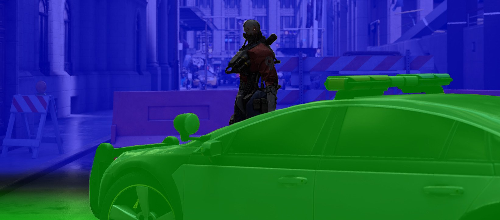
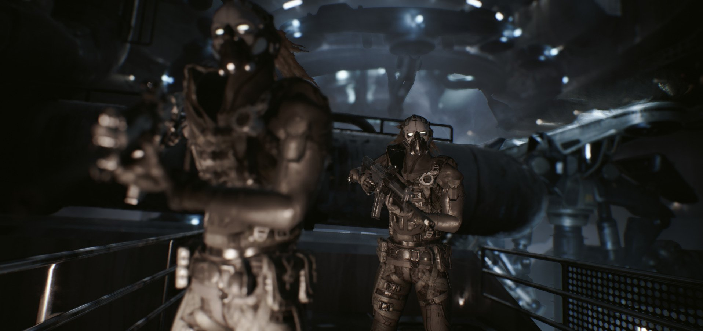
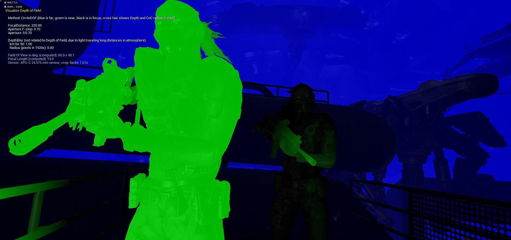
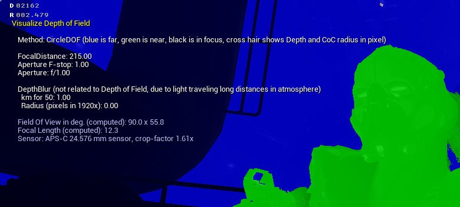
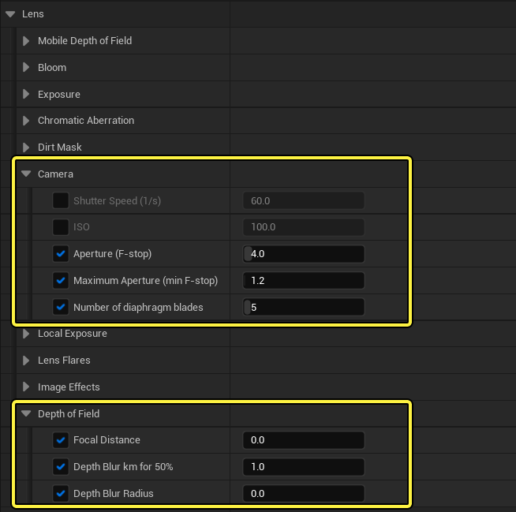
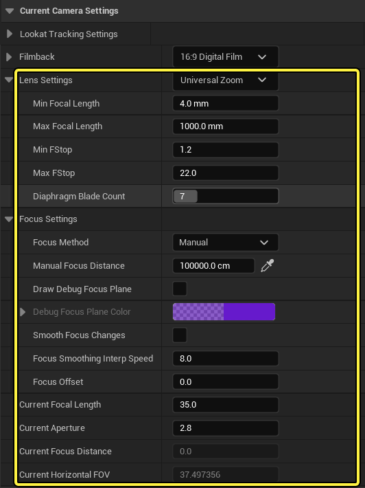
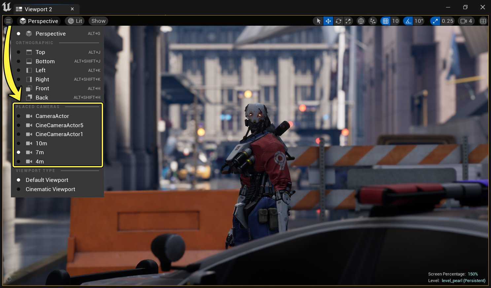
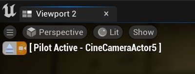

# 景深

> 路径：虚幻引擎5.7文档 / 设计视觉、渲染和图形效果 / 后期处理效果 / 景深

> 原始页面：https://dev.epicgames.com/documentation/unreal-engine/depth-of-field-in-unreal-engine

与真实世界的摄像机类似，**景深**（DOF）基于距离对焦点前后的场景应用模糊处理。这种效果可以用来基于景深将观者的注意力吸引到特定的拍摄物体上，同时增加美学观感，使渲染看起来更像照片或影片。

## 景深类型

在虚幻引擎中，您可以使用几种方法来执行景深效果。这些方法被分为两大类：

- **影片：** 此方法向景深效果提供了一种影视的观感。对此方法进行调整可以与摄影和影片摄影中常见的摄像机选项更加一致。该选项对于个人电脑和主机平台来说非常适合。
- **移动：** 该方法提供了移动平台可以接受的最优化、低开销的DOF选项。

从以下方法中选择，了解它们的更多功能：

- [过场动画景深](cinematic-depth-of-field/index.md)

- [移动平台景深方法](mobile-depth-of-field/index.md) - 介绍如何在移动平台上使用景深方法。

## 景深实现

景深分为三层（或三个区域）：近景、远景、对焦区域。每一层都单独处理，然后组合在一起来获得最终的图像效果。近景层和远景层的物体总是完全模糊的。它们与非模糊的场景相融合，以获得最终的效果。

- 对 **焦区域** 内的物体（黑色）使用非模糊场景层。这一层可以很窄，就像这里，它只聚焦于角色，也可以很宽，涵盖场景中的更多前景和后景。
- 在对焦区域与近景区域或远景区域之间的过渡区域之外，**近景**（绿色）或 **远景**（蓝色）物体被完全混合到模糊层中，这意味着它们处于失焦状态。
- 过渡区域内的物体，例如汽车左侧区域，根据其在对焦区域的过渡区域内的位置，在非模糊场景层（近景、远景）与模糊层之间线性混合。

### 可视化景深

这些层，包括过渡区域，可以使用关卡视口中 **显示（Show）** \> **可视化（Visualize）** 下的 **景深层（Depth of Field Layers）** 显示标签来可视化。

Scene

Layer Visualization

可视化 **景深层（Depth of Field Layers）** 还包括与正在使用的DOF方法相关的有用信息，例如当前设置的值，或者当在场景中来回移动鼠标时，鼠标光标旁边显示从摄像机到Actor的距离。

### 在虚幻编辑器中使用景深

在虚幻编辑器中，有几种不同的方法来使用景深：放置[后期处理体积](../index.md)，使用[摄像机Actor](../../../animating-characters-and-objects/cinematics-and-movie-making/movie-and-cinematic-cameras/cinematic-cameras/index.md)或[影片摄像机Actor](cinematic-depth-of-field/index.md#postprocessvolumeandcameraactor)。每种方法都可以经由[后期处理体积和摄像机](cinematic-depth-of-field/index.md#%E5%90%8E%E6%9C%9F%E5%A4%84%E7%90%86%E4%BD%93%E7%A7%AF%E5%92%8C%E6%91%84%E5%83%8F%E6%9C%BAactor)访问DOF属性。对于[影视级摄像机](cinematic-depth-of-field/index.md#cinematiccamera)，摄像机和镜头还有一些额外的行业标准设置。

可以在 **镜头（Lens）** 选项卡下的 **摄像机（Camera）** 和 **景深（Depth of Field）** 部分访问使用的大多数设置。

单击图像以查看完整尺寸。

使用[影片摄像机Actor](../../../animating-characters-and-objects/cinematics-and-movie-making/movie-and-cinematic-cameras/cinematic-cameras/index.md)时，可以在 **当前摄像机设置（Current Camera Settings）** 下的 **镜头设置（Lens Settings）** 部分中找到影响景深的替换属性。

单击图像以查看完整尺寸。

如果您正在使用摄像机或影片摄像机Actor，您可以在关卡视口中使用Actor控制来控制它们，方法是选择 **视角（Perspective）**，并从场景中 **已放置摄像机（Placed Cameras）** 中选择。

单击图像以查看完整尺寸。

关卡视口将定位于摄像机的视图，同时表明您正在控制和查看摄像机所看到的内容。

摄像机或后期处理体积（如果摄像机位于其中）中发生更改的任何属性将立即在视口中生效。

要获得与上面镜头类似的效果，关键是使用小 **孔径（F制光圈）（Aperture (f-stop)）** 来获得大散景形状，将摄像机或视口移向距离物体更近的位置，并降低 **视野（Field of View）** (FOV)。然后，调整 **对焦距离（Focus Distance）**，使对焦平面前后的部分场景内容失焦。

### 使用过程动画摄像机的调试对焦平面

当使用[影片摄像机](../../../animating-characters-and-objects/cinematics-and-movie-making/movie-and-cinematic-cameras/cinematic-cameras/index.md)时，启用 **绘制调试对焦平面（Draw Debug Focus Plane）** 以查看焦点在关卡中所放置的位置。

> 图片已省略：undefined

单击图像以查看完整尺寸。

当启用时，将在摄像机中当前设置的 **手动对焦距离（Manual Focus Distance）** 处绘制对焦平面。在这种情况下，角色是焦点，一切清晰、聚焦。在对焦平面前后的任何物体都将失焦。

> 图片已省略：Draw Debug Focus Plane: Disabled

> 图片已省略：Draw Debug Focus Plane: Enabled

Draw Debug Focus Plane: Disabled

Draw Debug Focus Plane: Enabled

> [!NOTE]
> 使用 **调试对焦平面颜色** 自定义正在绘制的对焦平面RGBA颜色值。在可能难以看到正在绘制的对焦平面的场景中，此功能非常有用。
