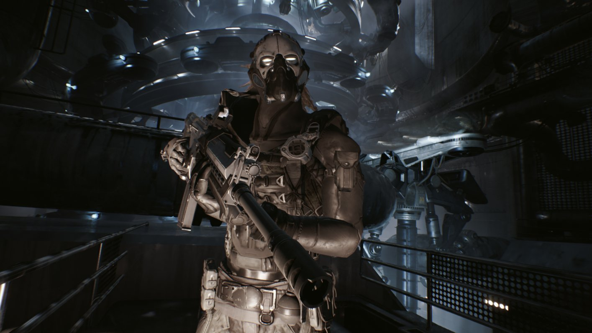
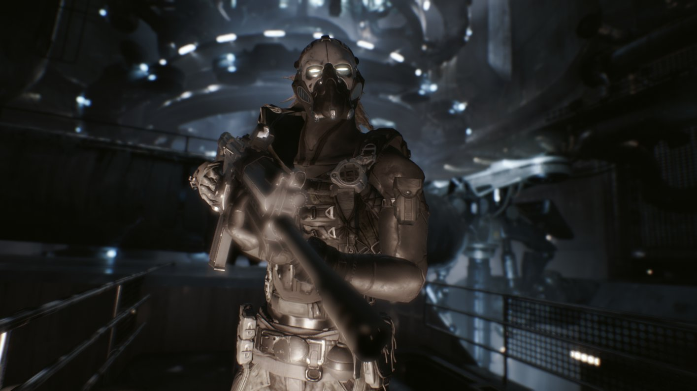
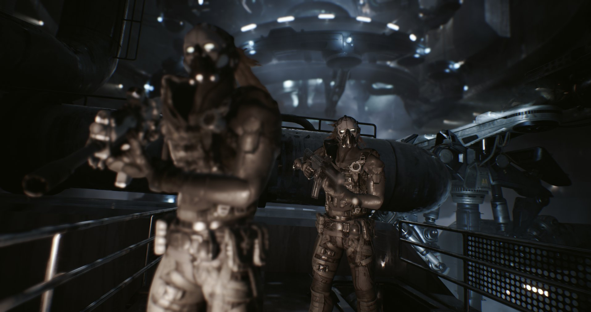
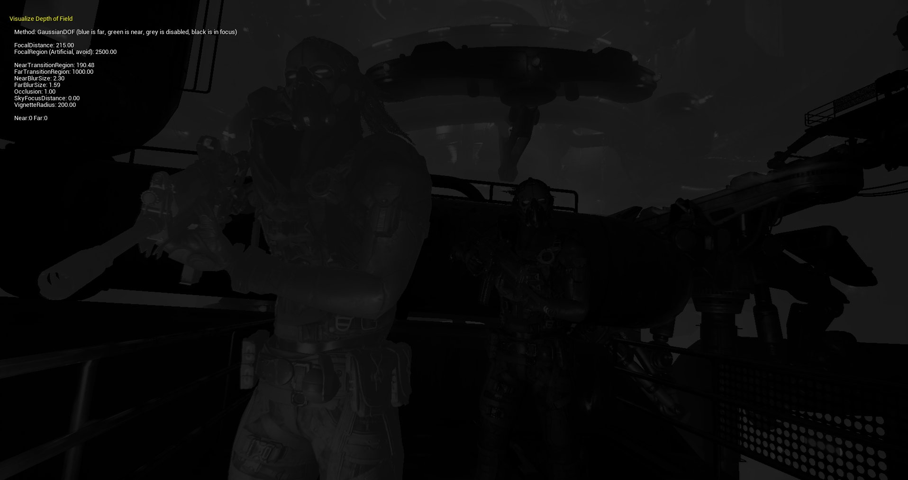
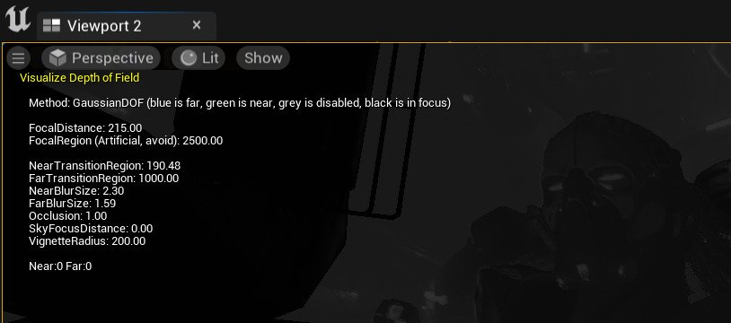

# 移动平台景深方法

> 路径：虚幻引擎5.7文档 / 设计视觉、渲染和图形效果 / 后期处理效果 / 景深 / 移动平台景深方法

> 原始页面：https://dev.epicgames.com/documentation/unreal-engine/mobile-depth-of-field-in-unreal-engine

以下景深方法为使用前向渲染路径的移动平台提供优化的低成本景深效果。

## 高斯

> [!WARNING]
> 已移除高斯景深与 **延迟渲染器（Deferred Renderer）** 和 **桌面前向渲染器（Desktop Forward Renderer）** 的配合使用，该景深仅支持移动平台。如需在桌面计算机上在编辑器内工作时使用此高斯景深，请使用[移动预览器](https://dev.epicgames.com/documentation/404)启用其中一个移动平台预览器。

**高斯** 景深方法使用标准的[高斯模糊](https://en.wikipedia.org/wiki/Gaussian_blur)（也叫高斯平滑）函数对场景进行模糊处理。高斯DOF使用固定大小的高斯模糊核对前景和背景进行模糊处理，在移动设备等低端硬件上它的速度非常快。在非常注重性能的场合，它可以在降低开销的情况下保持高性能。

无景深

高斯景深

## 查看景深

可以使用关卡视口中的 **景深图层（Depth of Field layers）** 显示标志来使包括过渡区在内的图层可视化，该显示标志位于 **显示（Show） > 可视化（Visualize）** 下。

最终场景

景深查看

通过包含属性和其当前设定值，使 **景深图层（Depth of Field layers）** 时可视化也可以可视化与所选择的景深方法相关的有用信息。

## 对焦距离（Focal Distance）

**对焦距离（Focal Distance）** 表示对焦区域和捕捉的视角。焦距越长，景深越浅，对焦区域外的对象越模糊；焦距越短，景深越大，聚焦越准确而且失焦的对象越少。光圈数值可以保持不变，更改透镜尺寸将调整景深效果的深浅。

> 图片已省略：undefined

点击查看全图

设置好 **对焦距离（Focal Distance）** 和 **对焦区域（Focal Region）** 之后，就可以使用 **近过渡（Near Transition）** 和 **远过渡（Far Transition）** 来调整对焦区域和完全模糊的场景之间的距离。另外，你甚至还可以调整 **近景模糊尺寸（Near Blur Size）** 和 **远景模糊尺寸（Far Blur Size）** 来进一步对高斯景深的外观进行微调。

为得到良好的景深效果，对近/远过渡和模糊尺寸的数值进行了调整之后的高斯景深。

在本示例中，为了实现近景和远景区域的柔和景深效果，我们设置了以下数值。

- 对焦距离（Focal Distance）： **215**
- 影调范围（Scale）： **2500**
- 近过渡（Near Transition）： **500**
- 远过渡（Far Transition）： **400**
- 近景模糊尺寸（Near Blur Size）： **2.0**
- 远景模糊尺寸（Far Blur Size）： **2.5**

## 可用设置

高斯景深的设置和属性可以在后期处理体积的 **细节** 面板中找到，位于 **移动景深（Mobile Depth of Field）** 的 **镜头（Lens）** 分类中。

| 属性 | 说明 |
| --- | --- |
| **在移动设备上启用高质量高斯景深（High Quality Gaussian DOF on Mobile）** | 在高端移动平台上启用HQ高斯景深。 |
| **对焦区域（Focal Region）** | DepthOfFieldFocalDistance之后的所有内容都开始对焦的人工区域。该数值以虚幻单位（厘米）计量。 |
| **近过渡区（Near Transition Region）** | 从对焦区域较近一边到摄像机之间的距离（以虚幻单位计）。当使用散景或高斯景深时，场景将从对焦状态过渡到虚化状态。 |
| **远过渡区（Far Transition Region）** | 从对焦区域较远一边到摄像机之间的距离（以虚幻单位计）。当使用散景或高斯景深时，场景将从对焦状态过渡到虚化状态。 |
| **影调范围（Scale）** | 混合场景中的景深。将该值设为0可将其关闭。 |
| **近景模糊尺寸（Near Blur Size）** | 高斯景深的近景模糊的最大尺寸（以视图宽度的百分比计）。 请注意，性能消耗按尺寸计算。 |
| **远景模糊尺寸（Far Blur Size）** | 高斯景深的远景模糊的最大尺寸（以视图宽度的百分比计）。 请注意，性能消耗按尺寸计算。 |
| **遮挡（Occlusion）** | 遮挡调整系数为1。使用0.18的值可获得自然遮挡，而使用0.4可解决图层色彩泄漏的问题。 |
| **天空距离（Sky Distance）** | 使天空盒能够对焦的虚拟距离（例如，200000单位），如果数值小于0，该功能将被禁用。 请注意，该功能可能会带来性能成本。 |
| **晕映尺寸（Vignette Size）** | 用于对超出半径的内容进行（近景）模糊处理的虚拟圆形遮罩（以视图宽度的百分比为直径计）。 将会带来性能成本。 |
