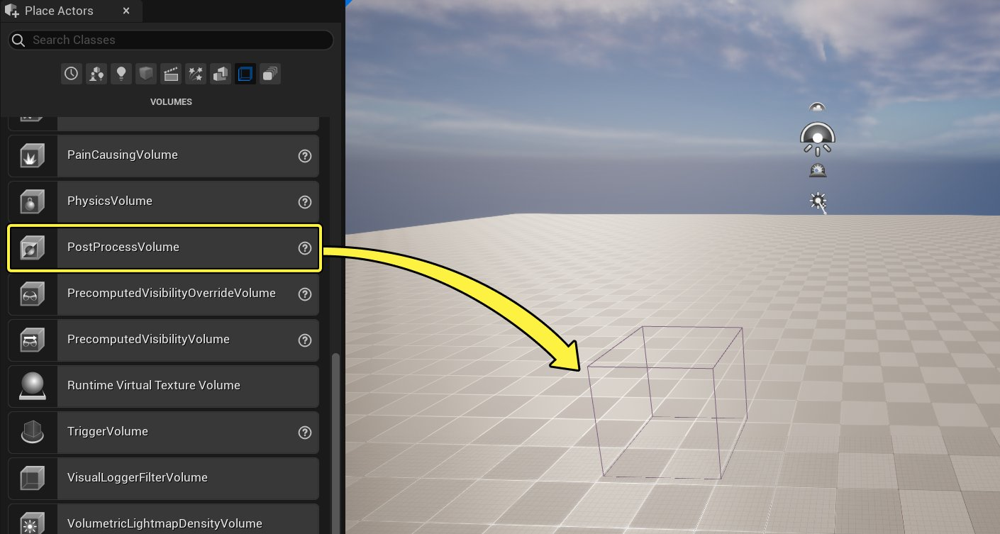
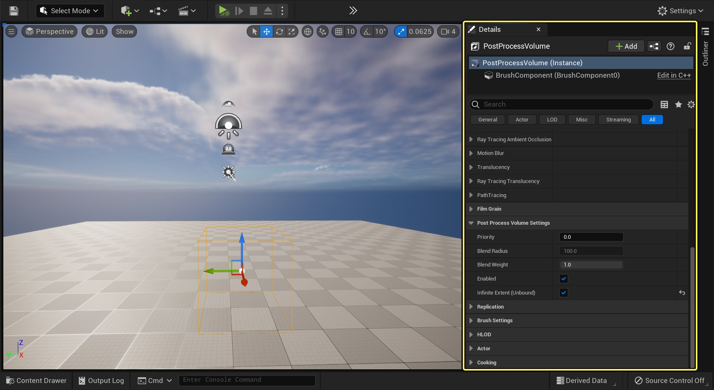
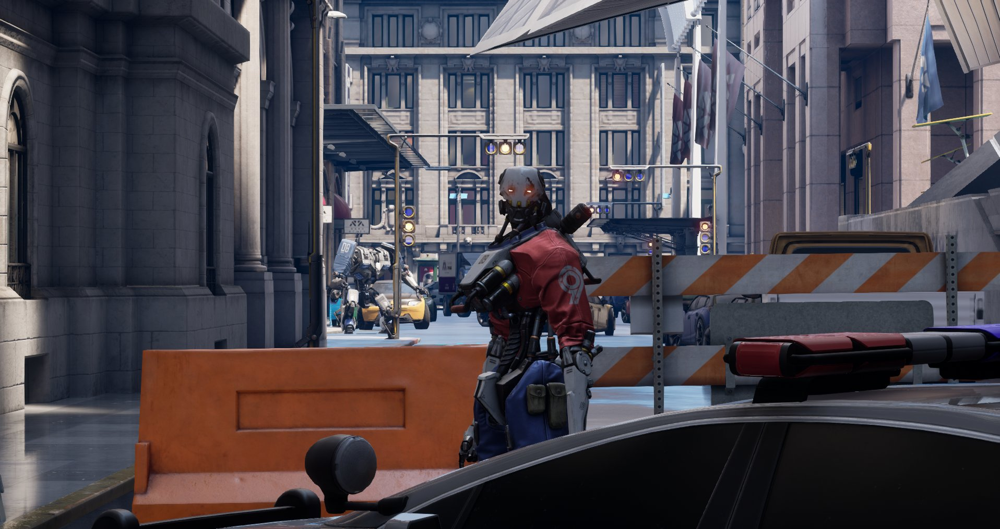
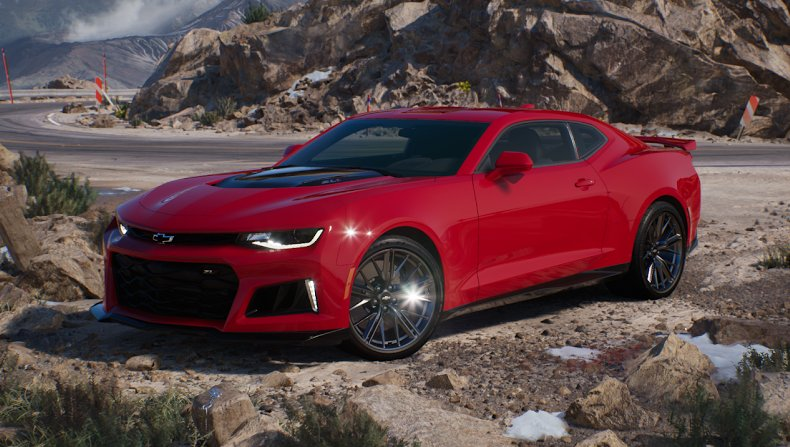
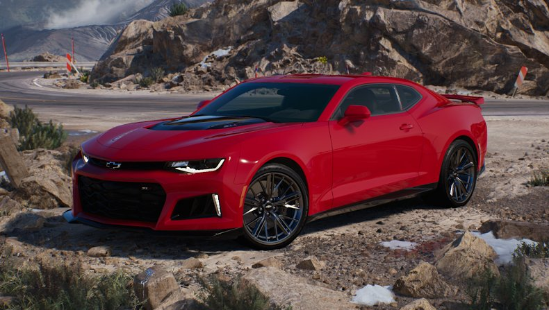
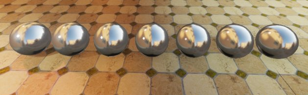
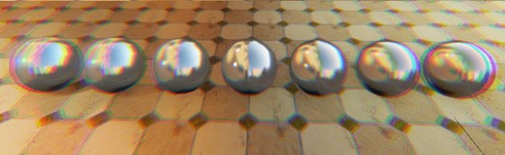

# 后期处理效果

> 路径：虚幻引擎5.7文档 / 设计视觉、渲染和图形效果 / 后期处理效果

> 原始页面：https://dev.epicgames.com/documentation/unreal-engine/post-process-effects-in-unreal-engine

后期处理效果（Post-processing effect）使美术师和设计师能够对影响颜色、色调映射、光照的属性和功能进行组合选择，从而定义场景的整体外观。要访问这些功能，可以将一种称为 **后期处理体积（Post Process Volume）** 的特殊类型的体积添加到关卡。可以放置多个体积来定义特定区域的外观，也可以将其设置为影响整个场景。

## 使用后期处理体积

可以使用 **放置Actor（Place Actors）** 面板将一个 **后期处理体积** 添加到关卡。

点击查看大图。

放置到关卡中后，可以使用 **细节（Details）** 面板访问所有可用的属性和功能。你会发现后期处理体积根据它们的功能类型和它们的影响分为多个类目。

点击查看大图。

**后期处理体积设置（Post Process Volume Settings）** 是这个已放置的体积的特定设置，以及该体积如何与场景以及可能与之重叠的任何其他后期处理体积进行交互。例如，可以选中 **无限范围（Infinite Extent）** 属性以使此后期处理体积影响场景中的所有位置，或者不选中该属性以仅影响特定区域。当多个体积发生重叠时，你可以控制这些体积如何相互交互以从一个体积混合到另一个体积，这在它们之间具有完全不同的外观时会很有用。

| 属性 | 描述 |
| --- | --- |
| **优先级（Priority）** | 指定此体积的优先级。在体积重叠的情况下，具有最高优先级的体积会覆盖较低优先级的体积。如果两个或多个重叠的体积具有相同的优先级，则顺序是不明确的。 |
| **混合半径（Blend Radius）** | 设置用于混合的体积周围半径（采用世界单位）。例如，当步入一个体积时，体积内的外观可能与体积外的不同。混合半径会在体积周围创建一个过渡区域。 |
| **混合权重（Blend Weight）** | 体积属性的影响程度。值为1具有全部效果，而值为0则没有效果。 |
| **已启用（Enabled）** | 此体积是否影响后期处理。如果启用，体积的设置将用于混合。 |
| **无限范围（无边界）（Infinite Extent (Unbound)）** | 是否考虑体积的边界。如果启用，体积会影响整个场景，而不考虑其体积的边界。未启用时，体积仅在其边界范围内有效。 |

## 后期处理功能和属性

通过选择放置在关卡中的一个后期处理体积来访问该体积的属性和设置。**细节（Details）** 面板将列出可用类目及其可用属性。

> [!TIP]
> 即使关卡中没有放置后期处理体积，虚幻引擎也会使用一些默认的后期处理设置。可以在 **项目设置（Project Settings）** 的 **渲染（Rendering）> 默认设置（Default Settings）** 分段中找到和配置这些默认的后期处理设置。
>
> 在开始定义场景外观之前，配置这些选项有助于进行关卡编辑以稳定自动曝光或泛光。

## 镜头

**镜头（Lens）** 类目包含的属性和设置用于模拟摄像机镜头产生的常见真实世界效果。

### 景深

与真实的摄像机类似，**景深（Depth of Field）** 根据焦点前后的距离为场景应用模糊效果。该效果用于根据深度将观看者的注意力吸引到镜头中的特定主体上。它还可以增加一种美感，使渲染的图像看起来更像照片或胶片。

已禁用景深

过场动画景深

有两个可用的景深选项：

- 过场动画景深（Cinematic Depth of Field）

  用于桌面平台和游戏主机平台。它可以提供一种胶片视觉效果，其属性与真实摄像机上的属性一致。后期处理体积提供了一些设置，但主要应该使用

  过场动画摄像机Actor

  上的摄像机属性来控制景深。
- 移动平台景深（Mobile Depth of Field）

  是经过优化的低成本选项，适用于移动平台。它使用高斯模糊来设置具有远近过渡区的焦点区域。

有关更多信息，请参阅[景深](depth-of-field/index.md)。

### 泛光

**泛光（Bloom）** 是真实摄像机的光照瑕疵，它还通过再现光源和反射性表面周围的辉光来增加所渲染图像的真实感。泛光是一种与其他效果（例如镜头光晕和脏污遮罩，但这些效果未涵盖在一般的泛光属性中）一起使用的效果。

已启用

已禁用

有关更多信息，请参阅[泛光](bloom/index.md)。

### 曝光和局部曝光

虚幻引擎自动控制曝光，但有时将其称为"眼部适应"，它会根据当前场景亮度来调整场景当前视图的明暗程度。此效果模拟人眼适应不同光照条件的体验，例如从光线昏暗的室内走到明亮的室外，或相反的情况。

**曝光（Exposure）** 类目包含的属性用于选择要使用的曝光方法类型，以及指定场景在给定时间内应该变得多亮或多暗。

有一个额外的曝光功能选项称为 **局部曝光（Local Exposure）**，它有自己的类目或属性。这些属性使用边缘感知数据结构对曝光进行局部调整（在美术师控制的参数内），同时保留亮度细节。这使得它在具有挑战性的高对比度场景（例如在室内场景中通过门窗可以看到非常明亮的户外）中特别有用。

有关更多信息，请参阅[曝光](auto-exposure/index.md)。

### 色差

**色差（Chromatic Aberration）** 是一种模拟真实摄像机镜头颜色变化的效果。这是光在不同点进入镜头导致RGB颜色分离的一种现象。

无色差

有色差

| 属性 | 描述 |
| --- | --- |
| **强度（Intensity）** | 色差/摄像机边缘或摄像机缺陷的数量，用于模拟真实摄像机镜头中出现的瑕疵。 |
| **起始偏移（Start Offset）** | 与产生效果的帧缓冲区中心的规格化距离。 |

### 脏污遮罩

**脏污遮罩（Dirt Mask）** 是一种纹理驱动的效果，可在屏幕定义的区域中照亮[泛光](#%E6%B3%9B%E5%85%89)。它可用于创建摄像机镜头及其缺陷的特定外观，或者是镜头上的脏污和灰尘之类的东西。

> 图片已省略：已启用

> 图片已省略：已禁用

已启用

已禁用

| 属性 | 描述 |
| --- | --- |
| **脏污遮罩纹理（Dirt Mask Texture）** | 此纹理定义摄像机镜头上的脏污；非常明亮的物体发出的光会在该脏污处产生散射。 |
| **脏污遮罩强度（Dirt Mask Intensity）** | 脏污遮罩的强度。 |
| **脏污遮罩色调（Dirt Mask Tint）** | 将一个RGB颜色值应用于脏污遮罩纹理。 |

### 摄像机

一组用于控制摄像机快门和过场动画景深的属性。

> [!NOTE]
> 摄像机的完整属性和基于物理的属性应在[过场动画摄像机Actor](../../animating-characters-and-objects/cinematics-and-movie-making/movie-and-cinematic-cameras/cinematic-cameras/index.md)上进行设置。

| 属性 | 描述 |
| --- | --- |
| **快门速度（1/s）（Shutter Speed (1/s)）** | 摄像机快门速度（以秒为单位）。 |
| **ISO** | 摄像机传感器对光的敏感度。 |
| **孔径（F值）（Aperture (F-stop)）** | 定义摄像机镜头的开口大小。孔径为1/F值。典型的镜头会下降到f/1.2（大开口）。小数字意味着更大的光圈开口，会模糊更多的前景和背景。更大的值意味着更小的光圈，会模糊更少的前景和背景。 |
| **最大孔径（最小F值）（Maximum Aperture (min F-stop)）** | 定义摄像机镜头的最大开口以控制光圈叶片的曲率。此值设置为0可获得直叶片。 |
| **光圈叶片数（Number of diaphragm blades）** | 定义镜头中的光圈叶片数量（介于4和16之间）。这可以定义散景的形状。 |

### 镜头光晕

**镜头光晕（Lens Flare）** 效果是一种基于图像的技术，可模拟在查看明亮物体时由于摄像机镜头缺陷导致的光散射。

> 图片已省略：lens flare

| 属性 | 描述 |
| --- | --- |
| **强度（Intensity）** | 基于图像的镜头光晕的亮度等级。 |
| **色调（Tint）** | 基于图像的镜头光晕的色调颜色。 |
| **散景尺寸（BokehSize）** | 使用散景纹理实现的镜头模糊尺寸（以视图宽度的百分比表示）。 性能成本为半径x半径。 |
| **阈值（Threshold）** | 镜头光晕开始产生影响的最小亮度。 此值应尽可能高，以避免因太暗而无法看到的模糊内容造成的性能成本。 |
| **散景形状（BokehShape）** | 定义基于图像的镜头光晕模糊时的散景形状。它不能混合。 |
| **色调（Tints）** | RGB定义镜头光晕颜色。Alpha（A）是它的位置。 |

### 图像效果:暗角效果

**暗角效果（Vignette）** 是一种基于图像的效果，它创建一个无边框窗口，使图像朝边缘淡出。

> 图片已省略：已禁用

> 图片已省略：已启用

已禁用

已启用

**暗角效果强度（Vignette Intensity）** 控制屏幕角落的变暗程度，以便创建从渲染图像到窗口边缘的无边框窗口。较大的值会增加暗角效果强度。0表示没有暗角效果。

## 颜色分级和色调映射器

**颜色分级（Color Grading）** 和 **胶片（Film）** 这两个类目共同定义了项目的大部分外观。"颜色分级（Color Grading）"类目包含用于对渲染的场景进行颜色校正的属性。

### 颜色分级

**颜色分级（Color Grading）** 类目包括用于控制对比度、颜色、饱和度等的属性，以全面控制场景外观的艺术风格。

此类目提供以下相关分段：

- 色温控制
- 用于全局、阴影、中间调和高光的色彩平衡属性
- 其他杂项属性，例如扩展色域和查找表（Lut）

有关更多信息，请参阅[颜色分级和胶片色调映射器](color-grading-and-the-filmic-tonemapper/index.md)。

#### 其他颜色分级主题

- [Color Grading Panel](color-grading-and-the-filmic-tonemapper/color-grading-panel/index.md)

- [高动态范围显示输出](color-grading-and-the-filmic-tonemapper/high-dynamic-range-display-output/index.md) - 介绍HDR显示输出相关的选项。

%designing-visuals-rendering-and-graphics/post-process-effects/color-grading/look-up-tables:Topic%

### 胶片

**胶片（Film）** 类目的一些属性可确保符合[学院色彩编码系统](http://www.oscars.org/science-technology/sci-tech-projects/aces)（ACES）针对电视和电影设定的行业标准。这些属性将确保在多种格式和显示中保持颜色一致，同时还可以确保源材质的适应性，即不必针对未来出现的每种新媒体调整源材质。

此类目中的属性可用于设置相应的值来模拟不同类型的电影胶片。

| 属性 | 描述 |
| --- | --- |
| **斜率（Slope）** | 设置用于色调映射器的S曲线的陡度。值越大，斜率越陡，图像越暗，而值越小，斜率越小，图像越亮。 |
| **末端（Toe）** | 设置色调映射器的深色。 |
| **肩部（Shoulder）** | 设置色调映射器的亮色。 |
| **黑色调（Black Clip）** | 设置黑色开始切断其数值的交叉位置。 理想情况下，应该不需要对此进行调整。 |
| **白色调（White Clip）** | 设置白色开始切断其数值的交叉位置。在大多数情况下，对该值的更改不易察觉。 |

有关更多信息，请参阅[颜色分级和胶片色调映射器](color-grading-and-the-filmic-tonemapper/index.md)。

## 全局光照

**全局光照** 的后期处理体积设置使你可以选择要使用的动态全局光照类型，高级属性使你可以调整某些全局光照方法（例如预计算光照）的强度和颜色。

你可以从 **方法（Method）** 下拉菜单中选择动态全局光照方法：

- Lumen全局光照和反射（Lumen Global Illumination and Reflections）
- 屏幕空间全局光照（Screen Space Global Illumination）
- 光线追踪全局光照（Ray Tracing Global Illumination）

在 **高级（Advanced）** 分段下，对于 **间接光照颜色（Indirect Lighting Color）** 和 **间接光照强度（Indirect Lighting Intensity）**，可以使用取色器调整间接光照颜色和强度，从而增加或减少应用的间接光照量。

有关更多信息，请参阅[全局光照](../../building-virtual-worlds/lighting-the-environment/global-illumination/index.md)。

### Lumen全局光照

[Lumen全局光照](../../building-virtual-worlds/lighting-the-environment/global-illumination/lumen-global-illumination-and-reflections/index.md)是一个完全动态的全局光照系统，适用于所有光源、自发光材质投射光和天空光照遮挡。它可以在从毫米到公里规格的大型高细节环境中渲染具有无限反弹和间接镜面反射的交互漫反射。

> 图片已省略：已启用Lumen全局光照

> 图片已省略：已禁用Lumen全局光照

已启用Lumen全局光照

已禁用Lumen全局光照

唯一可用的属性是 **最终采集质量（Final Gather Quality）** 属性，它可以增减Lumen可见的噪点瑕疵数量。较大的值会减少噪点，但会大幅增加GPU成本。

### 屏幕空间全局光照

[屏幕空间全局光照](../../building-virtual-worlds/lighting-the-environment/global-illumination/screen-space-global-illumination/index.md)是一种低成本的动态全局光照方法，但仅限于屏幕上可见的信息。它最适合用作一项Additive功能以处理[CPU Lightmass](../../building-virtual-worlds/lighting-the-environment/global-illumination/cpu-lightmass-global-illumination/index.md)或[GPU Lightmass](../../building-virtual-worlds/lighting-the-environment/global-illumination/gpu-lightmass-global-illumination/index.md)的预计算光照数据。

> 图片已省略：烘焙全局光照|已启用屏幕空间全局光照

> 图片已省略：烘焙全局光照|已禁用屏幕空间全局光照

烘焙全局光照|已启用屏幕空间全局光照

烘焙全局光照|已禁用屏幕空间全局光照

> [!TIP]
> 后期处理体积设置中没有任何用于调整的属性，但你可以使用 `r.SSGI.*` 下的控制台命令来提高质量。

### 光线追踪全局光照

> [!WARNING]
> 光线追踪全局光照（Ray Traced Global Illumination）已废弃，可能会在未来的版本中移除。

> [!NOTE]
> 要求为项目启用 **支持硬件光线追踪（Support Hardware Ray Tracing）** 和 **DirectX 12**。

[光线追踪全局光照（Ray Tracing Global Illumination）](../../building-virtual-worlds/lighting-the-environment/ray-tracing-and-path-tracing-features/hardware-ray-tracing/index.md)

| 属性 | 描述 |
| --- | --- |
| **类型（Type）** | 设置光线追踪全局光照类型： **蛮力（Brute Force）**：这是一种较慢但精度更高的光线追踪全局光照方法。它需要多次反弹和增加样本数才能产生具有更少瑕疵的美观结果，但会增加GPU成本。 **最终采集（Final Gather）**：这是一种较快但精度更低的光线追踪全局光照方法。它仅使用单次间接光照反弹以及较大的每像素样本数。它将成本分摊到多个帧上，以质量换取运行时性能。 |
| **最大反弹次数（Max Bounces）** | 需要光线追踪的间接漫反射光照的最大数量。 |
| **每像素样本数（Samples Per Pixel）** | 设置用于间接光照的每像素样本数。更高的样本数会产生更好的质量和精度，但会增加GPU成本。为保证实时性能，应使用较低的值。 |

## 反射

通过后期处理体积设置，你可以选择所需的动态反射类型以便与 **方法（Method）** 下拉菜单选项搭配使用。

选项包括：

- Lumen全局光照和反射
- 屏幕空间反射（Screen Space Reflections）
- 独立光线追踪反射（Standalone Ray Traced Reflections）

有关更多信息，请参阅[反射环境](../../building-virtual-worlds/lighting-the-environment/reflections-environment/index.md)。

### Lumen反射

Lumen反射是动态光照系统[Lumen全局光照和反射](../../building-virtual-worlds/lighting-the-environment/global-illumination/lumen-global-illumination-and-reflections/index.md)的一部分。它使用绝大多数功能来支持所有光源、自发光材质投射光和天空光照。

Lumen只有一个 **质量（Quality）** 属性，用于控制反射噪点质量的高低。较大的值会减少反射中的噪点量，但会大幅增加GPU成本。

### 屏幕空间反射

[屏幕空间反射](../../building-virtual-worlds/lighting-the-environment/reflections-environment/screen-space-reflections/index.md)是一种依赖于视图的低成本反射系统，但仅限于当前屏幕视图中存在的信息。

> 图片已省略：屏幕空间反射

> 图片已省略：Lumen反射

屏幕空间反射

Lumen反射

| 属性 | 描述 |
| --- | --- |
| **强度（Intensity）** | 场景应该在多大程度上受到屏幕空间反射的影响。较低的值会淡出屏幕空间反射，回退到无反射或放置的[反射捕获](../../building-virtual-worlds/lighting-the-environment/reflections-environment/reflections-captures/index.md)。 |
| **质量（Quality）** | 控制反射的质量。0表示没有软过渡，50（默认值，可获得更好的性能）表示中间过渡，100表示最高质量并具有更好的反射表示。 |
| **最大粗糙度（Max Roughness）** | 控制在什么粗糙度下会淡出屏幕空间反射。0.8效果很好，较小的值可提供更好的性能。 |

### 光线追踪反射

> [!WARNING]
> 光线追踪反射（Ray Tracing Reflections）已废弃，可能会在未来的版本中移除。

> [!NOTE]
> 要求为项目启用 **支持硬件光线追踪（Support Hardware Ray Tracing）** 和 **DirectX 12**。

[光线追踪反射](../../building-virtual-worlds/lighting-the-environment/ray-tracing-and-path-tracing-features/hardware-ray-tracing/index.md#%E5%85%89%E7%BA%BF%E8%BF%BD%E8%B8%AA%E5%8F%8D%E5%B0%84)将模拟物理光属性，在表面上多次反射光。

> 图片已省略：光线追踪反射

> 图片已省略：屏幕空间反射

光线追踪反射

屏幕空间反射

| 属性 | 描述 |
| --- | --- |
| **最大粗糙度（Max Roughness）** | 设置最大粗糙度，直到可以看到光线追踪反射。（较小的值意味着速度更快）反射贡献将在接近粗糙度阈值时平滑衰减。 |
| **最大反弹次数（Max Bounces）** | 设置从命中表面反弹的最大光线追踪反射数。较大数量的反弹允许反射中的反射，但会增加GPU成本。 |
| **每像素样本数（Samples Per Pixel）** | 设置用于反射的每像素样本数。更高的样本数会产生更好的质量和精度，但会增加GPU成本。为保证实时性能，应使用较低的值。 |
| **阴影（Shadows）** | 设置应出现在反射中的光线追踪阴影类型：无（none）、硬阴影（hard shadows）或软区域阴影（soft area shadows）。区域阴影的质量取决于所使用的每像素样本数，并且渲染成本高于硬阴影。 |
| **包括半透明对象（Include Translucent Objects）** | 在光线追踪反射中启用"光线追踪半透明（Ray Tracing Translucency）"。 |

## 渲染功能

以下是由后期处理体积设置并控制的通用渲染功能。

### 后期处理材质

**后期处理材质（Post Process Materials）** 允许将材质的"域（Domain）"设置为 **后期处理（Post Process）** 以创建屏幕视觉效果。通过使用此功能，你可以在材质中执行任何允许的操作，并影响游戏或场景的视觉外观。例如，它可用于应用损坏效果、在屏幕上创建风格化效果或视频效果。

> 图片已省略：post process materail examples

有关更多信息，请参阅[后期处理材质](post-process-materials/index.md)。

### 环境立方体贴图

**环境立方体贴图（Ambient Cubemap）** 使用提供的立方体贴图纹理来照亮场景。图像会被映射到远处的球体（实现为立方体贴图纹理，并用Mipmap存储图像的预模糊版本）。由于立方体贴图的预模糊版本的计算方式，这些版本可用于具有不同光泽度的镜面高光（清晰与模糊反射），还可用于漫反射光照。此效果与开始照亮材质的位置无关。观看者位置、材质粗糙度（用于镜面反射效果）和材质表面法线都是要考虑的因素。

> [!NOTE]
> 环境立方体贴图具有有限的局部阴影（仅限屏幕空间环境光遮蔽）。在表示天空光照时，请改用[天空光照](../../building-virtual-worlds/lighting-the-environment/light-types-and-their-mobility/sky-lights/index.md)。环境立方体贴图仅适用于微妙的定向环境光（在具有完全动态光照的游戏中有用），或用于模型查看器应用。由于光来自多个方向，因此不能仅仅使用阴影贴图来表现这种光照类型。应用"屏幕空间环境光遮蔽（Screen Space Ambient Occlusion）"可以从附近的几何体获取接触阴影。

| 属性 | 描述 |
| --- | --- |
| **色调（Tint）** | 使用RGB颜色值在指定的立方体贴图纹理之上应用颜色。 |
| **强度（Intensity）** | 缩放指定的环境立方体贴图纹理的亮度。0表示关闭。 |
| **立方体贴图纹理（Cubemap Texture）** | 为此后期处理体积指定一个立方体贴图，它将与场景中的对象进行叠加混合。 |

### 环境光遮蔽

**环境光遮蔽（Ambient Occlusion）** 属性用于控制称为"屏幕空间环境光遮蔽（Screen Space Ambient Occlusion，SSAO）"的屏幕空间效果，此效果可模拟由于自遮蔽而导致的光衰减。这个屏幕空间效果仅限于当前视图中可用的信息。环境光遮蔽通常用作一种辅助全局光照的微妙效果，它会使角落、裂缝和其他特征变暗，从而为场景带来更自然、更逼真的外观。

> 图片已省略：屏幕空间环境光遮蔽：已启用

> 图片已省略：屏幕空间环境光遮蔽：已禁用

屏幕空间环境光遮蔽：已启用

屏幕空间环境光遮蔽：已禁用

| 属性 | 描述 |
| --- | --- |
| **强度（Intensity）** | 定义在基础通道之后环境光遮蔽对非直接光照的影响程度。 |
| **半径（Radius）** | 表面受影响的对象在多远距离内受影响。较大的值会影响更远的对象。 |
| 高级属性 |  |
| **静态部分（Static Fraction）** | 环境光遮蔽对静态光照的影响程度。1表示影响静态光照，0表示无影响，这意味着不使用额外的渲染通道。 |
| **以世界空间表示的半径（Radius in WorldSpace）** | 启用后，环境光遮蔽半径以世界空间单位度量，而不是以400单位锁定到视图空间。 |
| **淡出距离（Fade Out Distance）** | 环境光遮蔽消失的远处距离。这可以避免在大型对象上发生瑕疵和环境光遮蔽效果。 |
| **淡出半径（Fade Out Radius）** | 环境光遮蔽在"淡出距离（Fade out Distance）"属性之前开始淡出的半径。 |
| **强度（Power）** | 控制计算的变暗效果的强度。 |
| **偏差（Bias）** | 调整环境光遮蔽细节的数量。需要一些偏差以避免远处的精度瑕疵。值3适用于平面，但会减少细节。 |
| **质量（Quality）** | 调整屏幕空间环境光遮蔽的质量和感知精度。 |
| **Mip混合（Mip Blend）** | 影响多个Mip（即较低分辨率版本）的混合。0表示使用全分辨率。1表示仅使用低分辨率。中间值可找到一个平衡点。 |
| **Mip缩放（Mip Scale）** | 影响多个Mip之间的环境光遮蔽半径缩放。 |
| **Mip阈值（Mip Threshold）** | 使用多个Mip时调整双边上采样。 |
| **时间混合权重（Temporal Blend Weight）** | 将真实环境光遮蔽（Ground Truth Ambient Occlusion）与时间累积结合使用时，将当前帧与先前帧进行混合的比重。 |

### 光线追踪环境光遮蔽

> [!NOTE]
> 要求为项目启用 **支持硬件光线追踪（Support Hardware Ray Tracing）** 和 **DirectX 12**。

**光线追踪环境光遮蔽**（RTAO）可准确地将区域阴影投射到环境中的地面物体上。与烘焙光照类似，环境阴影与屏幕空间无关。RTAO将为场景增加深度，在间接光照区域（例如物体下方或者角落和缝隙中）产生看起来自然的阴影。

> 图片已省略：屏幕空间环境光遮蔽

> 图片已省略：光线追踪环境光遮蔽

屏幕空间环境光遮蔽

光线追踪环境光遮蔽

| 属性 | 描述 |
| --- | --- |
| **已启用（Enabled）** | 是否应为此后期处理体积启用光线追踪环境光遮蔽。 |
| **每像素样本数（Samples Per Pixel）** | 设置每个像素用于光线追踪环境光遮蔽的样本数。 |
| **强度（Intensity）** | 为此后期处理体积缩放场景中的光线追踪环境光遮蔽。 |
| **半径（Radius）** | 定义（采用世界空间单位）此后期处理体积的遮蔽光线的搜索半径。 |

有关更多信息，请参阅[硬件光线追踪](../../building-virtual-worlds/lighting-the-environment/ray-tracing-and-path-tracing-features/hardware-ray-tracing/index.md)。

### 动态模糊

**动态模糊（Motion Blur）** 基于对象运动情况使对象模糊。在摄影与电影中（如一系列帧），动态模糊源于捕获图像之前的对象移动，从而产生可见的模糊效果。根据对象移动的速度可以确定对象的动态模糊程度。

> 图片已省略：motion blur

虚幻引擎中的动态模糊系统使用全屏速度图，并根据对象对此图的贡献来模糊对象。以下属性可以控制场景中的对象对速度图的贡献。

| 属性 | 描述 |
| --- | --- |
| **数量（Amount）** | 动态模糊的强度。0表示关闭。 |
| **最大（Max）** | 由动态模糊引起的最大失真（以屏幕宽度的百分比表示）。0表示关闭。 |
| **目标FPS（Target FPS）** | 定义动态模糊的目标每秒帧数（fps）。它使动态模糊与实际帧率无关，而是相对于指定的目标FPS以产生更短的帧，这意味着更短的快门时间和更少的动态模糊。较低的FPS意味着更多的动态模糊。值0使动态模糊取决于实际测得的帧率。 |
| **按对象大小（Per Object Size）** | 考虑到动态模糊，需要在速度通道中绘制的图元的最小投影屏幕半径。此半径是屏幕宽度的百分比。较小的半径会导致更多的绘制调用。默认值为4%。 |

在编辑器中使用"关卡视口（Level Viewport）"的 **显示（Show）> 可视化（Visualize）> 动态模糊（Motion Blur）** 可以使动态模糊可视化。

### 光线追踪半透明

> [!WARNING]
> 该光线追踪功能已废弃，可能会在未来的版本中移除。

> [!NOTE]
> 要求为项目启用 **支持硬件光线追踪（Support Hardware Ray Tracing）** 和 **DirectX 12**。

借助于后期处理体积设置，你可以决定如何进行半透明渲染，是使用传统的光栅半透明还是光线追踪半透明。**光线追踪半透明（Ray Tracing Translucency）** 使用光线来追踪光在基于真实世界物理属性的半透明材质中通过的路径。

> 图片已省略：光线追踪半透明（Ray Tracing Translucency）：已启用

> 图片已省略：光线追踪半透明（Ray Tracing Translucency）：已禁用

光线追踪半透明（Ray Tracing Translucency）：已启用

光线追踪半透明（Ray Tracing Translucency）：已禁用

有关更多信息，请参阅[硬件光线追踪](../../building-virtual-worlds/lighting-the-environment/ray-tracing-and-path-tracing-features/hardware-ray-tracing/index.md)。

### 路径追踪

**路径追踪器（Path Tracer）** 是一种渐进式硬件加速渲染模式，可产生物理上正确的全局光照、反射、折射等。它与[硬件光线追踪](../../building-virtual-worlds/lighting-the-environment/ray-tracing-and-path-tracing-features/hardware-ray-tracing/index.md)采用相同的光线追踪架构，可产生与离线渲染差不多的结果。

为"关卡视口（Level Viewport）"启用路径追踪（视图模式（View Modes）> 路径追踪（Path Tracing））后，该类目中的属性可用于配置路径追踪器如何累积样本和渲染帧。

有关更多信息，请参阅[路径追踪器](../../building-virtual-worlds/lighting-the-environment/ray-tracing-and-path-tracing-features/path-tracer/index.md)

## 胶片颗粒

**胶片颗粒（Film Grain）** 是一种光学效果，用于模拟经过处理的摄影胶片的外观。它可以显示为微小的随机粒子，并为渲染的帧添加胶片视觉效果。

| 属性 | 描述 |
| --- | --- |
| **胶片颗粒强度（Film Grain Intensity）** | 应用于场景的颗粒量。0表示没有胶片颗粒，1表示全部胶片颗粒。 |
| **胶片颗粒强度阴影（Film Grain Intensity Shadows）** | 应用于场景阴影区域的胶片颗粒量。 |
| **胶片颗粒强度中间调（Film Grain Intensity Midtones）** | 应用于场景中间调区域的胶片颗粒量。 |
| **胶片颗粒强度高光（Film Grain Intensity Highlights）** | 应用于场景高光区域的胶片颗粒量。 |
| **胶片颗粒阴影最大范围（Film Grain Shadows Max）** | 设置应用于场景阴影区域的胶片颗粒的最大范围。 |
| **胶片颗粒高光最大范围（Film Grain Highlights Max）** | 设置应用于场景高光区域的胶片颗粒的最大范围。 |
| **胶片颗粒纹素大小（Film Grain Texel Size）** | 屏幕上胶片颗粒的纹素大小。 |
| **胶片颗粒纹理（Film Grain Texture）** | 定义要用于正在应用的胶片颗粒的纹理。它可用于为胶片颗粒的噪点创建特定的外观。 |
