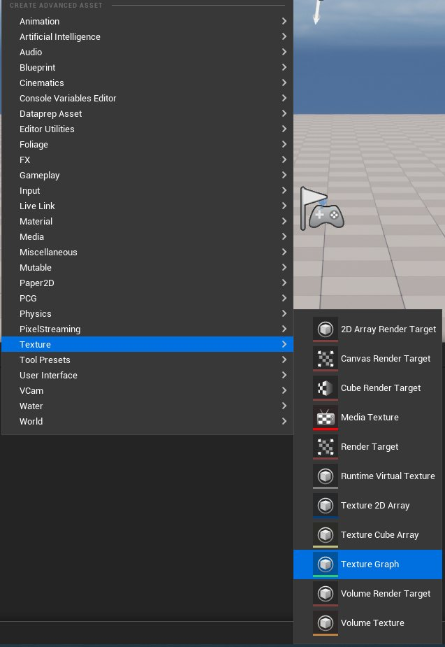
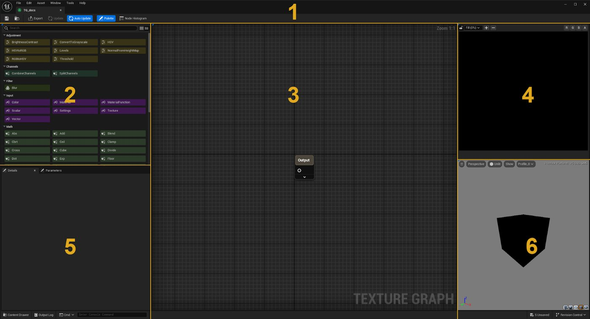
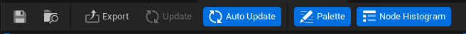
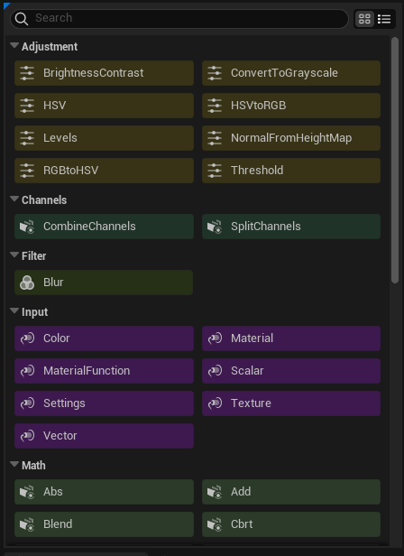
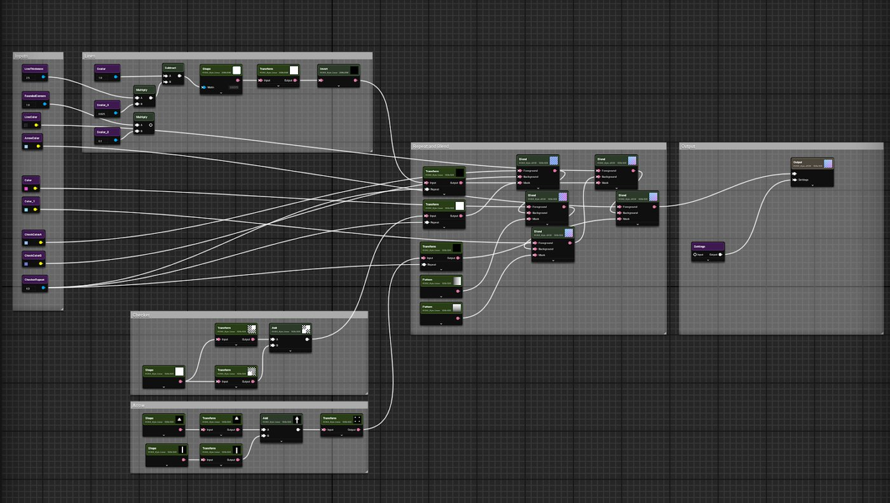
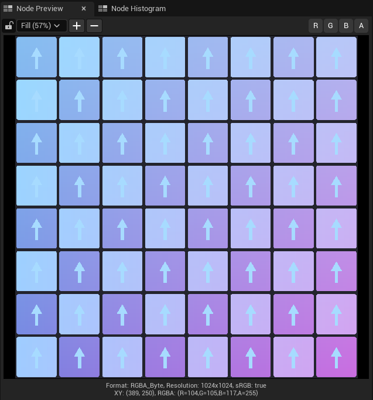
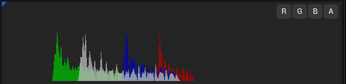
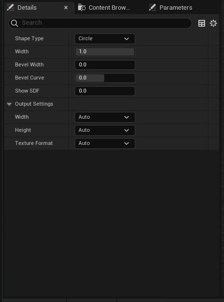

# Getting started with Texture Graph

> 路径：虚幻引擎5.7文档 / 设计视觉、渲染和图形效果 / 纹理 / Getting started with Texture Graph

> 原始页面：https://dev.epicgames.com/documentation/unreal-engine/getting-started-with-texture-graph-in-unreal-engine

该 **Texture Graph Editor** 为美术提供基于节点的界面，可在 Unreal Engine 中程序化创建和编辑纹理。

## 使用 Texture Graph

[纹理](../index.md) 是 Unreal Engine 中创建体验的核心流程之一。纹理主要用于材质和用户界面（UI）。可以将纹理直接用作输入，例如基础颜色；也可用作遮罩，或将 RGBA 值用于其他计算。纹理可以专属于某个资产，也可以平铺使用。

[材质](../../unreal-engine-materials/index.md) 可能会采样并应用多张纹理，以满足不同用途。例如，一个简单材质可能包含 Base Color、Specular 和 Normal Map 纹理。此外，Emissive 和 Roughness 贴图也可能存储在这些纹理中一个或多个纹理的 alpha 通道里。将多个值打包到单张纹理中，可以更方便地使用它们，同时节省 draw call 以提升性能，并减少磁盘空间占用。

使用类似 [Material Editor](../../unreal-engine-materials/unreal-engine-material-editor-user-guide/index.md)的节点图，可以在编辑器中排列节点来创建 Texture Graph，然后用它输出纹理。节点网络会保存为 Texture Graph 资产。

可以将 Texture Graph 与蓝图、材质和材质函数结合，形成只有 Unreal Engine 内才能实现的独特工作流。该编辑器会与 [Texture Asset Editor](../texture-asset-editor/index.md)协同工作，后者提供用于管理纹理资产的额外控制项。

## 加载插件

Texture Graph Editor 是实验性插件，启动引擎时默认不会加载。

要启用插件，请执行以下步骤：

1. 在 **菜单栏**中，选择 **Edit > Plugins**.
2. 在搜索栏中输入“texture graph”。
3. 启用 **TextureGraph** 插件，并在弹出对话框中选择 **Yes** 。
4. 重启引擎。

## 创建新图

要创建新的 Texture Graph，请打开 **Content Drawer** 并执行以下任一操作：

- 点击 **Add > Texture > Texture Graph**.
- 在 Content Browser 空白处右键点击并选择 **Texture > Texture Graph**。该选项会在当前文件夹中创建 Texture Graph 资产。

## Texture Graph UI

Texture Graph UI

### 主菜单 - 1

主菜单栏包含保存、打开等重要图管理项的快速入口。工具栏还包含若干图专用工具。

Texture Graph 主菜单栏

| **操作** | **说明** |
| --- | --- |
| **Save** | 保存当前图。 |
| **Open** | 从内容文件夹打开图。 |
| **Export** | 打开导出窗口，用于控制图的最终纹理导出。该窗口可控制图中的哪些输出会被导出。可以选择只导出单个输出，也可以在存在多个纹理时导出多个纹理。 |
| **Update** | 未启用 Auto Update 时，该工具会更新图缩略图和输出预览。对于自动更新较慢的复杂图，这会很有用。 |
| **Auto Update** | 开启或关闭图自动更新。根据图复杂度，可以选择关闭此选项。 |
| **Palette** | 显示节点面板。 |
| **Node Histogram** | 显示节点直方图；直方图会提供有关纹理数值分布的有价值信息。 |

### 节点面板 - 2

该 **Node Palette** 包含 Texture Graph 内可用的所有节点。可以滚动浏览节点库，也可以使用搜索栏查找特定节点。

要向图窗口添加节点，请执行以下任一操作：

- 将节点从库中拖到主图窗口。
- 在图窗口中右键点击。
- 从现有节点引脚拖出连接。该工作流的优点是放置节点后会立即创建节点连接。节点连接会从初始引脚连接到新节点的第一个开放输入引脚。

Node Palette

### 主图 - 3

主图窗口是组装图的主要视图。可以将节点放在图中的任意位置。通常输入和创建节点放在左侧，图的数据流向右推进，并以控制写出哪些纹理的输出节点结束。

一个图可以拥有单个或多个输出。

主图视图

### 节点预览 - 4

该 **Node Preview** 显示所选节点的纹理。预览提供查看特定通道和调整纹理缩放级别的选项。

可以锁定预览来查看特定节点，同时调整其他节点。例如，将视图锁定到最终输出，同时调整图中较早位置的混合参数。

2D Preview

Image Histogram

### Details 面板 - 5

该 **Details** 面板包含当前所选节点的属性。

Details 面板

### 3D 视口 - 6

该 **3D Preview** 视口会在标准或用户定义的 3D 网格体上显示所选输出贴图。可以将资产直接拖入视图来定义网格体，也可以选择网格体并使用自定义网格体图标（茶壶）应用它。

可以从视口 Details 面板选择可见贴图。

> 图片已省略：3D Viewport in Texture Graph Editor

3D 视口

## 节点

Texture Graph 的节点设计会以紧凑布局提供相关信息。借助此布局，美术可以快速浏览图，并轻松评估数据流。节点标题会显示节点名称或类型。节点会根据操作类型着色。名称下方显示节点图像格式和当前分辨率信息。节点标题还包含缩略图预览。

> 图片已省略：Basic Node

基础节点

展开后，会显示节点的所有属性。这可能包括节点专属属性，或仅包括节点的输出设置。通常这些值会根据图求值自动设置。在某些情况下，可能需要定义自定义设置来替代这些值。

> 图片已省略：Advanced Node

高级节点

## 材质

> 图片已省略：Material Node

Material Node

Unreal Engine 拥有强大的材质系统。Texture Graph 可以通过求值材质来创建可在图中使用的纹理，从而利用材质系统。可以将标准混凝土材质等材质加载到 Material Node 中，然后定义要渲染的属性。

> 图片已省略：Material Node Details

Material Node 详情

## Material Functions

Texture Graph Editor 可以直接使用某些材质函数。 **MaterialFunction** 节点会暴露材质函数可用的输入引脚和属性。这非常有用，因为可以在开发图时无需重新创建可能已经存在的复杂函数。借助此功能，Texture Graph 可利用强大的材质函数库和工具集。

例如，与 transform 中可用的简单重复相比，texture bombing 材质函数可以快速集成，让纹理重复更随机。

> 图片已省略：Material Function Node

Material Function Node

> 图片已省略：Material Function Details

Material Function 详情

## Texture Graph 子图

可以通过 **TextureGraph** 节点将 Texture Graph 复用为子图。这对自定义重复操作很有用，例如向遮罩添加噪声。

子图可以包含一系列节点，用于创建复杂噪声图案，并通过标量值控制某些特定变量。

> 图片已省略：Texture Graph Subgraph

Texture Graph 子图

使用 **TextureGraph** 节点时，指定输入会与子图中定义的所有输出一起暴露。这提供了开发和复用常见操作的方式。

> 图片已省略：Texture Graph Node

Texture Graph Node

## Texture Graph 与蓝图

可以将 Texture Graph 与蓝图结合，用于大量管线相关函数，从而简化常见任务。

加载 Texture Graph 插件后，Blueprint Editor 的 Palette 中会出现额外函数。要进一步了解蓝图，请参阅 [蓝图可视化脚本](https://dev.epicgames.com/documentation/en-us/unreal-engine/blueprints-visual-scripting-in-unreal-engine)和 [Blueprint Editor Palette](https://dev.epicgames.com/documentation/en-us/unreal-engine/palette-in-the-bleprints-visual-scripting-editor-for-unreal-engine).

使用这些函数可以轻松控制现有图。例如，可以创建一个基础 Texture Graph，用来生成常见 UV 棋盘格图案。

> 图片已省略：Blueprint

Texture Graph 蓝图函数

完整函数和说明列表请参阅 [Blueprint API](https://dev.epicgames.com/documentation/en-us/unreal-engine/BlueprintAPI/TextureGraph).

## 后续步骤

掌握 Texture Graph 基础后，可以使用以下资源进一步了解节点并开始创建纹理。

- [制作第一个 Texture Graph](making-your-first-texture-graph/index.md)

- [Texture Graph 节点参考](texture-graph-node-reference/index.md) - 用于程序化创建和编辑纹理的 Texture Graph 节点参考。
