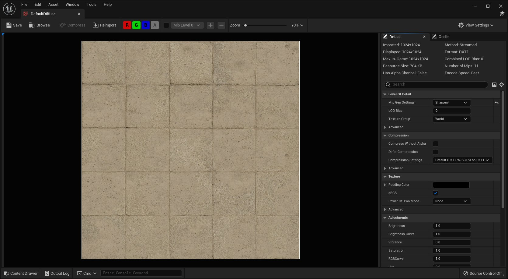

# 纹理

> 路径：虚幻引擎5.7文档 / 设计视觉、渲染和图形效果 / 纹理

> 原始页面：https://dev.epicgames.com/documentation/unreal-engine/textures-in-unreal-engine

纹理是一种主要用于材质的图像资产，但也能用于其他地方，比如用作HUD的纹理。

纹理映射在材质表面上。纹理可以作为材质的输入参数，直接参与材质的各种计算，例如作为基础颜色的输入参数、用作遮罩，或使用其自带的RGBA值。

材质可能会用到多种纹理，实现多种目的。例如，一个普通材质可能用到基础颜色纹理、高光纹理，以及法线纹理。此外，还可能有一张纹理用于自发光颜色和粗糙度（数值保存在纹理的alpha通道中）。通过将多类数值打包在同一张纹理中，有助于降低绘制调用次数，减少磁盘空间。

## 导入纹理

纹理可以通过 **导入** 按钮或直接拖入的方式（将图片从系统浏览器中直接拖入）导入到 **内容浏览器（Content Browser）** 中。

虚幻引擎支持多种图像格式（文件类型）：

- .bmp
- .float
- .jpeg
- .jpg
- .pcx
- .png
- .psd
- .tga
- .dds (Cubemap or 2D)
- .exr (HDR)
- .tif (TIFF)
- .tiff (TIFF)

在导入纹理时，请注意纹理尺寸存在以下要求：

- 纹理尺寸尽可能是2的平方（2的幂），例如 32、64、128、2048 等。

  - 纹理尺寸是2的幂时，纹理可以生成Mipmap，可以被流送。否则无法流送且无法生成Mipmap。
- 某些 GPU 能够支持的纹理尺寸存在上限。例如，一些GPU可能无法支持超过 8192 （8K）像素的纹理。

## 纹理图表编辑器

**纹理图表编辑器** 提供基于节点的界面，供美术师用程序化的方法在虚幻引擎中创建和编辑纹理。

你可以将纹理图表和蓝图、材质及材质函数结合使用，形成只有在虚幻引擎中才能实现的独特工作流程。该编辑器可以与纹理材质编辑器一起使用，后者为纹理资产的管理提供了额外的控制功能。

更多详情，请参阅[纹理图表入门](getting-started-with-texture-graph/index.md)。

## 纹理资产编辑器

**纹理资产编辑器** 是一个独立窗口，可以查看和编辑纹理资产。

在编辑器窗口中，你可以查看纹理和它的颜色通道。细节面板会显示纹理的额外信息，以及一组可配置的属性，例如设置压缩格式，调整亮度和饱和度，设置其细节水平等。

更多详情请参见[纹理资产编辑器](texture-asset-editor/index.md)。

## 纹理流程和优化

下述话题详细介绍了项目中涉及纹理的一些常见流程和优化措施。

- [Getting started with Texture Graph](getting-started-with-texture-graph/index.md)

- [支持的纹理格式和设置](texture-format-support-and-settings/index.md) - 介绍支持的纹理格式、纹理类型及其配置。

- [纹理流送](../optimizing-and-debugging-projects-for-realtime-rendering/texture-streaming/index.md) - 用于在运行时在内存中加载和卸载纹理的系统。

- [虚拟纹理](../optimizing-and-debugging-projects-for-realtime-rendering/virtual-texturing/index.md) - 介绍虚幻引擎中虚拟纹理的使用方法。

%designing-visuals-rendering-and-graphics/textures/texture-editor-interface:Topic%
