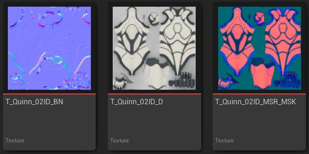
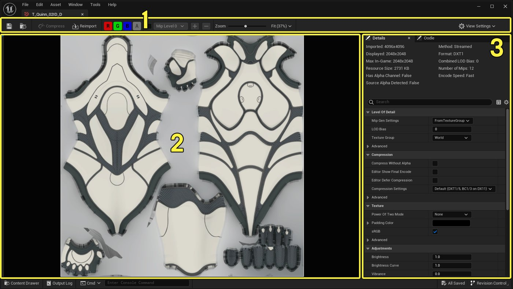
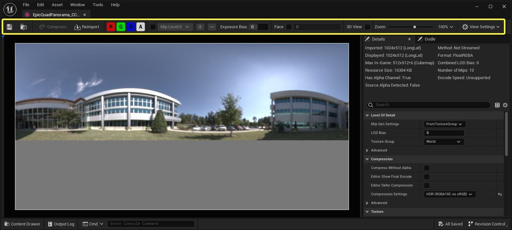
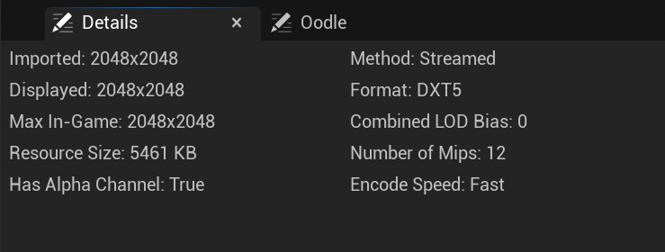
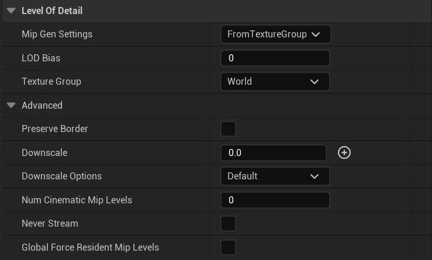
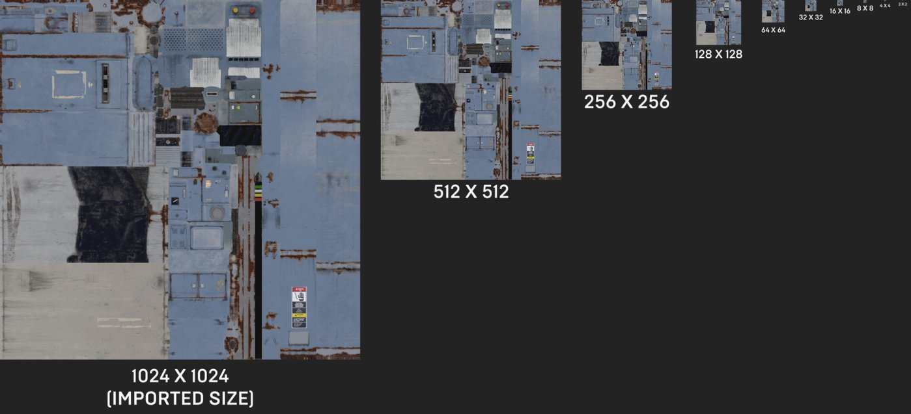
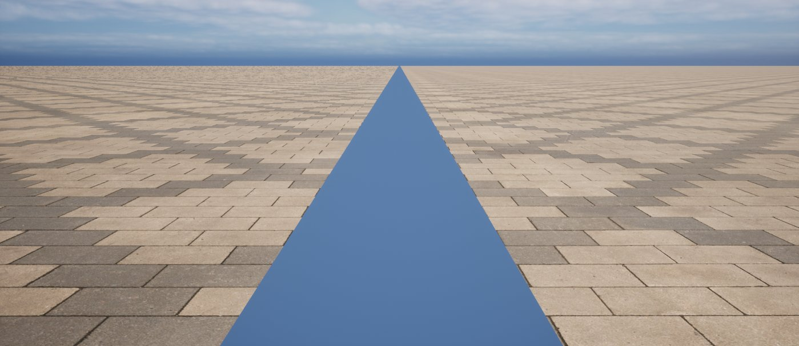
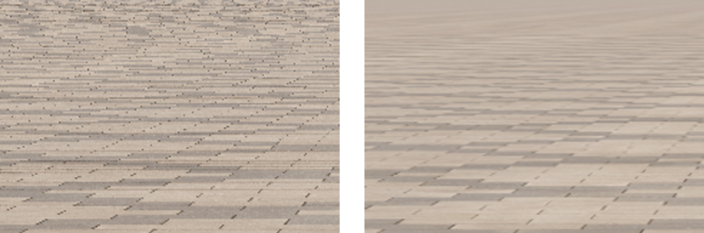

# 纹理资产编辑器

> 路径：虚幻引擎5.7文档 / 设计视觉、渲染和图形效果 / 纹理 / 纹理资产编辑器

> 原始页面：https://dev.epicgames.com/documentation/unreal-engine/texture-asset-editor-in-unreal-engine

**纹理属性编辑器**让你可以预览**纹理资产**并编辑其属性，例如预览特定的颜色通道、直接在编辑器中调整颜色、修改压缩属性等等。 纹理资产通常需要搭配材质编辑器使用，但也可以直接搭配虚幻引擎中的某些组件使用，例如为天空光源应用立方体贴图。

## 纹理资产的类型

虚幻引擎支持导入或创建多种类型的纹理文件。 这包括标准图像类型（.png和.jpg）、立方体贴图（.exr）、IES配置文件（.ies）、体积纹理和渲染目标等。

你可以在内容浏览器中将这些类型的文件分别导入并保存为**纹理资产**。 打开纹理资产后，纹理资产编辑器会根据纹理的类型给出针对性的工具栏选项。

## 打开纹理资产编辑器

在内容浏览器或其他资产（比如静态网格体）的分配槽中，双击任意纹理资产，即可在**纹理资产编辑器**中将其打开。 另外，在内容浏览器中右键点击某个纹理，然后在上下文菜单中选择**编辑（Edit）**，也可以达成同样的目的。

*第三人称模版角色Quinn所用的三个示例纹理资产。*

## 纹理资产编辑器界面

打开纹理资产后，**纹理资产编辑器**的外观将如下所示。 你可以通过该编辑器预览纹理并调整该资产。

该界面包含的内容如下：

1. [工具栏](index.md#toolbar)
2. [视口](index.md#viewport)
3. 设置面板：

   - [细节面板](index.md)
   - [Oodle面板](index.md)
   - [平台面板](index.md#additional-notes)

### 工具栏

**工具栏**提供了用于检查和预览此纹理的非破坏性工具和切换开关。 根据纹理资产的类型（立方体贴图、体积、纹理），工具栏将显示针对不同纹理的选项。

*使用纹理资产编辑器打开立方体贴图纹理，同时显示许多工具栏工具。*

| 工具栏选项 | 说明 |
| --- | --- |
| **压缩（Compress）** | 压缩此纹理。 |
| **重新导入（Reimport）** | 从其源文件中重新导入纹理。 |
| **颜色通道（RGBA）** | 点击颜色通道以切换当前显示的颜色通道。 如果灰显，则预览窗口中将不显示该颜色通道。 |
| **Mip级别选择器（Mip Level Selector）** | 勾选该复选框以启用Mip选择。 使用下拉菜单选择特定的Mip，或使用+/-按钮浏览Mip级别。 |
| **曝光偏差（Exposure Bias）** | 针对立方体贴图/IES纹理。使用此设置将源图片调亮或调暗。 |
| **切片（Slice）** | 启用后，Texture2DArray或TextureCubeArray会显示具有指定索引的数组元素，而不是同时显示所有数组元素部分的标准视图。 |
| **面选择器（Face Selector）** | 针对立方体贴图纹理，勾选此复选框即可预览构成立方体贴图纹理的各个面。 |
| **3D视图（3D View）** | 针对立方体贴图纹理，启用此复选框即可以3D场景的形式预览立方体贴图。 用鼠标左键点击并拖动预览即可旋转视图。 |
| **缩放（Zoom）** | 使用滑块缩放纹理预览的尺寸。 使用下拉菜单选择预定义的尺寸，并设置缩放选项，使其适应视图或填充视图。 |
| **视图设置（View Settings）** | 此下拉菜单包含以下视口选项：**去饱和度（Desaturation）**：切换颜色去饱和度。**背景（Background）**：设置预览窗口中的背景区域（方格或纯色）。**绘制边框（Draw Border）**：启用后，在预览窗口中的纹理周围绘制边框。**高级设置（Advanced Settings）**：打开编辑器偏好设置（Editor Preferences），在纹理编辑器（Texture Editor）设置项中设置背景颜色、方格图块大小、纹理周围的边框颜色等。 |

### 面选择器

立方体贴图、纹理数组或体积纹理等纹理资产都提供了**面（Face）**选项，用于查看组成该纹理的各个面。 例如，当你查看某个立方体贴图且勾选了"面（Face）"复选框时，你就可以在文本字段中输入一个ID编号，进而查看构成经纬度解包的六个面中的任一面。

> [!NOTE]
> 显示的立方体贴图的面与DDS方向和顺序一致，即正X、负X、正Y、负Y、正Z和负Z。

### 3D视图

立方体贴图、纹理数组或体积纹理等纹理资产都提供了**3D视图（3D View）**选项，用于预览该资产在预期的3D表示中的效果。 在预览窗口中点击鼠标左键并拖动视图，即可旋转该3D表示。

### 切片

纹理2D数组和纹理立方体数组资产会将一组指定的纹理资产存储在单个纹理数组中。 使用**细节（Details）**面板即可指定纹理2D数组和纹理立方体数组中的**源纹理（Source Textures）**。 为所有被添加的插槽分配纹理资产后，预览窗口将在视口中显示切片的预览。

使用**切片（Slice）**复选框即可预览组成数组的单个纹理资产。

### 视口

**视口**会显示纹理资产的预览。 虽然对所有纹理资产而言，大多数工具栏选项都很相似，比如RGBA切换、曝光偏差和缩放量，但有些纹理还提供了额外的选项，比如面选择和3D视图。

### 细节面板

**细节（Details）**面板会显示可编辑纹理的属性和设置项。

#### 纹理信息

最上面的分段显示了纹理相关的数据，比如纹理的各种大小、占用的磁盘空间、格式。 你可以在该分段下方调整对应的纹理。 你所调整的某些设置会在纹理信息中有所反映，如编码速度（Encode Speed）和LOD偏差（LOD Bias）的各种属性。

| 属性 | 说明 |
| --- | --- |
| **导入项（Imported）** | 被导入的源纹理的尺寸。 |
| **显示项（Displayed）** | 当前预览窗口中显示的纹理的尺寸。 |
| **游戏中最大值（Max In-Game）** | 此纹理在游戏中的尺寸上限。 该尺寸不会大于源纹理的导入尺寸，但可以小于该尺寸，具体取决于配置和纹理设置。 |
| **资源大小（Resource Size）** | 原始纹理数据使用的未对齐内存占用量。 |
| **有Alpha通道（Has Alpha Channel）** | 表示纹理当前是否使用了Alpha通道。 你可以用细节面板内的设置禁用纹理的Alpha通道，而源纹理仍会支持Alpha通道。 |
| **检测到源Alpha（Source Alpha Detected）** | 表示源纹理是否拥有Alpha通道。 |
| **方法（Method）** | 表示当前纹理是否使用了流送。 |
| **格式（Format）** | 该纹理使用的压缩设置的格式。 |
| **合并LOD偏差（Combined LOD Bias）** | 显示由**LOD偏差（LOD Bias）**所设定的、指向所用最大Mip级别的偏差。 |
| **Mip数量（Number of Mips）** | 该纹理使用的Mip级别的数量。 高分辨率纹理所用的Mip级别数量会高于低分辨率纹理。 |
| **编码速度（Encode Speed）** | 显示此纹理所用的编码速度，比如快速（Fast）、最终（Final）或（使用Oodle面板时的）自定义（Custom）。 |

#### 细节级别设置

**细节级别（Level of Detail）**分段提供了Mip和LOD的设置项。 导入纹理时会创建一个以Mip 0为起点的Mip贴图链。 Mip贴图链由多级别的样本图片组成，每一级别的分辨率都是前一级别的一半。

| 属性 | 说明 |
| --- | --- |
| **Mip生成设置（Mip Gen Settings）** | 针对各资产的设置，可定义Mip贴图生成属性，比如锐化和核心大小。从纹理组（FromTextureGroup）简单平均（SimpleAverage）锐化无Mipmap（NoMipMaps）保留现存Mip（LeaveExistingMips）模糊（Blur）未过滤（Unfiltered）角度（Angular） |
| **LOD偏差（LOD Bias）** | 要使用的最高Mip级别索引的偏差。 |
| **纹理组（Texture Group）** | 此纹理所属的纹理分组。 |
| 高级属性 |  |
| **保留边框（Preserve Border）** | 勾选此选项后，纹理的边框将在Mip贴图生成过程中被保留。 |
| **缩减（Downscale）** | 对无Mip的纹理缩减源纹理的程度。**0**表示使用纹理组中的缩放值。**1.0**表示不缩放纹理。**> 1.0**表示缩放纹理。 |
| **缩减选项（Downscale Options）** | 对无Mip纹理使用缩减时，可用的缩减选项。 从以下选项中选择：默认（Default）未过滤（Unfiltered）简单平均（Simple Average）锐化 |
| **电影级级别数（Num Cinematic Levels）** | 可伸缩性设置被设为电影级（Cinematic）时所使用的Mip级别数量。 |
| **从不流送（Never Stream）** | 启用后，该纹理将永远不会被流送。 |
| **全局强制常驻Mip级别（Global Force Resident Mip Levels）** | 强制常驻Mip级别（ForceMipLevelsToBeResident）的全局和序列化版本。 |

##### Mip映射

**Mip映射**指利用Mip级别将较高分辨率的纹理降级为较低分辨率纹理的过程。 每个Mip级别都是前一级分辨率的一半，从而为更远处的纹理赋予不同的细节级别，通常距离较远时减少细节也能保持视觉效果。 这一过程会使用较低分辨率的纹理来节省渲染时间，并减少瑕疵的出现。

Mip映射会根据源纹理的大小生成所需的Mip数量。 例如，如果纹理大小为1024 x 1024，则会有10个Mip级别。 如果纹理大小为4096 x 4096，则会有12个Mip级别。

*点击查看大图。*

下方场景中设置了两个材质，分别使用各自的漫反射和法线贴图纹理。 左边的材质使用无Mip贴图的纹理。 右边的材质则使用了Mip映射。 请注意，与右边使用Mip贴图的材质相比，左边的材质在远处会产生不理想的锯齿效果。 通过Mip级别降低分辨率也有助于优化远距离纹理的整体外观。

*左侧为无Mip纹理的材质；右侧为有Mip纹理的材质。*

放大这两个材质后，可以看到Mip映射在减少锯齿方面的作用。

*左侧为无Mip纹理的材质；右侧为有Mip纹理的材质。*

勾选**Mip级别（Mip Level）**选择器旁边的复选框，即可查看各个Mip级别。 勾选后，你就可以从下拉菜单中选择一个Mip级别。

选择Mip级别后，视口中的Mip就会自动切换为该级别。而在**细节（Details）**面板的纹理信息分段中，当前**显示**的尺寸也会改变，以反映所选Mip级别的尺寸。

#### 压缩设置

**压缩（Compression）**类别提供了可配置的质量设置，这些设置会影响纹理的压缩程度，进而最终影响纹理在磁盘上的大小。

> 图片已省略：纹理资产编辑器细节面板中的压缩设置项。

| 属性 | 说明 |
| --- | --- |
| **无Alpha压缩（Compress without Alpha）** | 启用后，在所有压缩纹理输出中强制纹理的Alpha通道为不透明。 如果输出格式是未压缩的RGBA，则不适用。 |
| **编辑器显示最终编码（Editor Show Final Encode）** | 启用后，在此编辑器会话期间以最终质量压缩纹理，使其使用最终（Final）级别（RDO）的编码，而不是默认的快速（Fast）级别（非RDO）的编码。 这让你可以直观地查看将在游戏中使用的RDO编码。 |
| **编辑器延迟压缩（Editor Defer Compression）** | 启用后，将纹理压缩推迟到保存后进行，或在纹理编辑器中手动压缩时进行。 |
| **压缩设置（Compression Settings）** | 构建纹理时要使用的压缩设置。 从下拉菜单中选择一个压缩方法。 |
| 高级属性 |  |
| **最大纹理尺寸（Maximum Texture Size）** | 所生成纹理的最大分辨率。 值为0意味着各平台上与该格式对应的最大尺寸。 |
| **有损压缩数量（Lossy Compression Amount）** | 逐纹理控制Oodle纹理RDO Lambda（即压缩系数）。 项目会使用一套全局的RDO质量级别，但在某些情况下，你需要进行逐纹理调整。 你可以用该功能来关闭RDO，或使用压缩率来提高/降低对质量的权衡。 |
| **Oodle纹理SDK版本（Oodle Texture SDK Version）** | 使用此选项选择纹理编码所用的Oodle纹理库版本。 创建新纹理时，此选项将采用当前版本，并保持该版本不变，以免将来更新时要打补丁。 在某些情况下，你可能需要更改纹理才能使用最新版本来修复编码问题。 在数字字段中输入"latest"即可进行更新。 如果将该字段留空，则会使用项目的旧版退却版本。 若重新导入纹理，那么该纹理会自动更新并使用最新的SDK版本。 |
| **ASTC压缩质量（ASTC Compression Quality）** | 生成的ATSC纹理（比如移动平台的纹理）的压缩质量。 使用下拉菜单即可设置质量。 |
| **压缩缓存ID（Compression Cache ID）** | 改变这个可选的ID即可通过改变纹理的缓存键来强制重新压缩纹理。 |
| **烘焙平台平铺设置（Cook Platform Tiling Settings）** | 如果平台支持此功能，则在烘焙时平铺纹理，或者在实际提交给GPU时保持线性并平铺纹理。 |

#### 纹理设置

**纹理（Texture）**类别提供了处理纹理资产的可配置设置项，这些设置会影响纹理资产的外观、在材质中的使用或优化方法（比如[纹理流送](../../optimizing-and-debugging-projects-for-realtime-rendering/texture-streaming/index.md)）。

> 图片已省略：纹理资产编辑器细节面板中的纹理设置项。

| 属性 | 说明 |
| --- | --- |
| **2的幂模式（Power of Two Mode）** | 如何将纹理填充为2的幂大小（如有必要）。**填充为2的幂（Pad to Power of 2）**：将纹理填充到最接近的2的幂大小。**填充为2的幂平方（Pad to Square Power of 2）**：将纹理填充到最接近的2的幂平方大小。 |
| **填充颜色（Padding Color）** | 用于填充纹理的颜色（如果该纹理由于**2的幂模式**而被调整了大小）。 |
| **sRGB** | 表示纹理及其源是否处于sRGB伽马颜色空间内。 只适用于8位且压缩的格式。 若将Alpha通道单独用作遮罩，应撤销勾选此项。 |
| 高级属性 |  |
| **X轴平铺方法（X-axis Tiling Method）** | 用于X轴的寻址模式。 可选项为封装（Wrap）、限制（Clamp）以及镜像（Mirror）。 |
| **Y轴平铺方法（Y-axis Tiling Method）** | 用于Y轴的寻址模式。 可选项为封装（Wrap）、限制（Clamp）以及镜像（Mirror）。 |
| **为Alpha覆盖执行Mip缩放（Do Scale Mips for Alpha Coverage）** | 表明是否应缩放Mip的RGBA，以保留数值大于或等于**Alpha覆盖阈值**的像素数量。 如果未勾选此项，则忽略Alpha覆盖阈值。 |
| **Alpha覆盖阈值（Alpha Coverage Threshold）** | 保存Alpha覆盖时要比较的各通道的Alpha值。 0表示禁用该通道。 一般而言，适合的值在0.5到0.9之间，而不是1.0。 |
| **使用新Mip过滤器（Use New Mip Filter）** | 启用后会使用更快的Mip生成过滤器，但结果一般相同。 在极少数情况下，新的过滤器会导致色度偏移，而旧过滤器不会。 如果发生这种情况，请禁用此功能。 |
| **翻转绿色通道（Flip Green Channel）** | 启用后，将反转纹理的绿色通道。 对部分法线贴图而言非常有用。 |
| **筛选器（Filter）** | 对此纹理采样时使用的纹理过滤模式。 从以下选项中选择：最近（Nearest）双线性（Bi-linear）三线性（Tri-linear）纹理组（Texture Group，默认项） |
| **Mip加载选项（Mip Load Options）** | 选择纹理Mip的加载方式：**默认（Default）**：回退为LODGroup设置。**所有Mip（All Mips）**：加载纹理中的所有Mip。**仅第一个Mip（Only First Mip）**：仅加载纹理中的第一个Mip。 |
| **创建Mip后规格化（Normalize after making Mips）** | 此设置仅影响法线贴图。 可在Mip生成后对法线贴图中的颜色进行规格化处理，以获得更好、更清晰的质量。 为法线贴图制作Mip贴图时，法线会被混合在一起，这往往会使它们变短（未规格化）。 将它们放入会删除分量的编码（比如BC5）中时，你应该在删除分量前将它们规格化。 否则会导致Mip贴图中的法线细节消失，从而使它们在远距离Mip级别中变得更扁平或更柔和。因距离而产生的柔化不同于使用复合法线转粗糙度变换而进行的刻意柔化。此设置只会影响较低的Mip级别，不影响最高Mip级别。 打开此选项后，远处的法线贴图看起来会更清晰（更正确）。 |
| **sRGB使用旧版伽马（sRGB Use Legacy Gamma）** | 启用后，如果使用sRGB，那么系统会使用简化的旧版伽玛空间（比如pow(color,1/2.2)）将FColor转换为FLinearColor。 |
| **源颜色设置（Source Color Settings）** | 针对源编码和颜色空间的纹理颜色管理设置。**编码重载（Encoding Override）**：纹理的源编码，提供比sRGB更多的选项。**颜色空间（Color Space）**：此纹理的源颜色空间。**RGBA色度坐标（RGBA Chromaticity Coordinate）**：源颜色空间的各颜色通道的色度坐标。 可分别指定红色、绿色、蓝色和白色的通道。**色度适应方法（Chromatic Adaptation Method）**：当源白点与生效的颜色空间白点不同时所应用的方法。 |
| **虚拟纹理流送（Virtual Texture Streaming）** | 如果你正在使用虚拟纹理流送此纹理，则启用。 |
| **资产用户数据（Asset User Data）** | 随资产保存的用户数据的数组。 |

#### 纹理调整设置

**调整（Adjustment）**类别提供了可配置的属性，无需离开纹理编辑器即可通过非破坏性的方式编辑纹理，例如调整亮度、自然饱和度、饱和度等等。

> 图片已省略：纹理资产编辑器细节面板中的调整设置项。

| 属性 | 说明 |
| --- | --- |
| **亮度（Brightness）** | 通过调整HSV值来调整纹理亮度。 这是一种非破坏性的调整，要求源美术资源可用。 |
| **亮度曲线（Brightness Curve）** | 通过将HSV值提高到指定的幂来调整纹理曲线。 这是一种非破坏性的调整，要求源美术资源可用。 |
| **自然饱和度（Vibrance）** | 使用HSV饱和度算法调整暗淡颜色的强度，而饱和度颜色则不受影响。 这是一种非破坏性的调整，要求源美术资源可用。 |
| **饱和度（Saturation）** | 通过调整HSV饱和度来调整饱和度。 这是一种非破坏性的调整，要求源美术资源可用。 |
| **RGB曲线（RGBCurve）** | 通过将线性空间RGB颜色提高到指定的幂来调整纹理的RGB曲线。 这是一种非破坏性的调整，要求源美术资源可用。 |
| **色调（Hue）** | 通过以度数为单位偏移HSV的色调值来调整纹理的色调（0到360之间）。 这是一种非破坏性的调整，要求源美术资源可用。 |
| **最小Alpha（Min Alpha）** | 将Alpha重映射到指定的最小/最大范围，并定义新的0值。 这是一种非破坏性的调整，要求源美术资源可用。 |
| **最大Alpha（Max Alpha）** | 将Alpha重映射到指定的最小/最大范围，并定义新的1值。 这是一种非破坏性的调整，要求源美术资源可用。 |
| **色度镶迭纹理（Chroma Key Texture）** | 是否对图像进行色度镶迭，并使用透明的黑色替换所有匹配**色度镶迭颜色**的像素。 |
| **色度镶迭阈值（Chroma Key Threshold）** | 在进行色度镶迭时，要使纹素被认定为与**色度镶迭颜色**相等，其各组件所必须匹配的阈值。 若要求完全匹配，则该值必须小于或等于0。 |
| **色度镶迭颜色（Chroma Key Color）** | 在启用色度镶迭后，会被透明黑色替换的颜色。 |

#### 合成设置

**合成（Compositing）**类别提供了处理对应纹理的合成及其应用方式的设置项。

> 图片已省略：纹理资产编辑器细节面板中的合成设置项。

| 属性 | 说明 |
| --- | --- |
| **复合纹理（Composite Texture）** | 可以被定义为根据法线贴图的变化（主要来自Mip贴图）来修改粗糙度。 如果没有源Alpha，那么最大Alpha（Max Alpha）能帮你定义基础粗糙度。 法线贴图的Mip数量应至少等于此纹理的Mip数量。 |
| 高级属性 |  |
| **复合纹理模式（Composite Texture Mode）** | 定义**复合纹理**的应用方式。 例如，CTM_RoughnessFromNormalAlpha。 |
| **复合幂（Composite Power）** | 控制复合效果的强度。 默认值为1，更高的整数值（1、2、4、8）会产生更强的效果。 本属性不是滑块，因为纹理更新的速度会不够快。 |

#### Oodle面板

**Oodle**面板提供了影响对应纹理的当前设置的信息，同时让你可以查看速率失真优化（Rate Distortion Optimization，简称RDO）编码选项对磁盘内压缩文件大小的影响。

#### Oodle纹理编码信息

Oodle面板最上方会显示关于纹理编码方式的信息。 在诊断到潜在瑕疵时，最好在此处检查RDO是否开启。

> 图片已省略：纹理资产编辑器Oodle面板的设置项。

| 属性 | 说明 |
| --- | --- |
| **编码器（Encoder）** | 纹理所用编码器的名称。 |
| **编码速度（Encode Speed）** | 表示纹理编码使用的是快速（Fast）还是最终（Final）编码设置。 |
| **RDO Lambda** | 此纹理使用的RDO Lambda值。 RDO Lambda决定了Oodle应在多大程度上以降低图像质量为代价来减少分发大小。 这并**不是**内存占用量。 |
| **RDO Lambda源（RDO Lambda Source）** | RDO Lambda值的来源。 Lambda值可以来自于项目设置、纹理细节级别（LOD）组的"有损压缩数量"或纹理的"有损压缩数量"。 |
| **投入量（Effort）** | 使用的编码工作量，指Oodle为获取更高质量的结果而花费的CPU时间。 |
| **通用平铺（Universal Tiling）** | 启用后，Oodle会调整其RDO计算，从而将纹理在主机平台上的平铺纳入考量。 不影响非RDO编码。 例如，RDO Lambda不得为**0**。 如果不在游戏主机上分发，则此属性不生效。 |

#### 尝试编码

**尝试编码（Try Encodings）**分段让你能尝试各种纹理编码设置，从而让你能观察它们对此特定纹理的影响。

> [!NOTE]
> 这些更改在编辑器中播放时可见，但在关闭纹理资产编辑器后不会被保存或使用。 要使这些更改永久有效，你需要更新**项目设置（Project Settings）**中的设置。 部分设置无法进行逐纹理配置，比如投入量（Effort）和通用平铺（Universal Tiling）。

> 图片已省略：纹理资产编辑器Oodle面板中的尝试编码设置项。

| 属性 | 说明 |
| --- | --- |
| **启用（Enabled）** | 勾选后，可尝试Oodle速率失真优化（RDO）的压缩设置，以将结果可视化。 |
| **RDO Lambda** | 用于尝试编码的速率失真优化（RDO）Lambda。 0表示完全禁用RDO。 1表示最大文件大小，100表示最小文件大小。 |
| **投入量（Effort）** | 尝试使用的编码投入量。 投入量决定了为得出更好的结果而花费的CPU时间。 如需了解详情，请参阅[Oodle纹理文档](../../../testing-and-optimizing-content/using-oodle/index.md)。 |
| **通用平铺（Universal Tiling）** | 尝试使用的通用平铺方法。 如需了解详情，请参阅[Oodle纹理文档](../../../testing-and-optimizing-content/using-oodle/index.md)。 |

#### 磁盘上大小

**磁盘上大小（On-disk Sizes）**会拉取项目的压缩设置，并使用该设置以**类似于**项目实际打包过程中的方式压缩纹理位，从而体现RDO编码对纹理的好处。

> [!NOTE]
> 这种做法并不精确！ 不过，结合**尝试编码（Try Encodings）**分段的设置，你还是可以大致了解不同的RDO Lambda值能带来的好处。

> 图片已省略：纹理资产编辑器Oodle面板中的磁盘上大小设置项。

| 属性 | 说明 |
| --- | --- |
| **启用（Enabled）** | 勾选后，将以项目打包的方式压缩纹理数据，以估算纹理的速率失真优化（RDO）编码的益处。 |
| **打包配置（Packaging Configuration）** | 指定从项目设置的**项目（Project） > 打包（Packaging） > 高级（Advanced） > 压缩器投入量级别（Compressor Effort Level）**中使用哪套打包设置。 一般情况下，应将其保留为"分发（Distribution）"。 请选择**调试开发（Debug Development）**、**测试发布（Test Shipping）**或**分发（Distribution）**。 |
| **Oodle压缩器（Oodle Compressor）** | 此纹理所用的Oodle**数据**压缩器。 |
| **Oodle压缩等级（Oodle Compression Level）** | Oodle压缩器的压缩级别。 同时也是"项目设置（Project Settings）"中"压缩器投入量级别（Compressor Effort Level）"所指定数值的对应名称。 表示Oodle为获得体积更小的结果而花费的时间。 |
| **压缩文件块大小（Compression Block Size）** | 打包时传递给"Oodle数据"的文件块大小。 要控制此属性，请在项目设置中找到**打包（Packaging） > 高级（Advanced） > 文件包压缩命令行选项（Package Compression Commandline Options）**，并使用`-compressionblocksize=`。 如果无设置，则使用默认的64kb文件块大小。 |
| **未压缩大小（Uncompressed Size）** | 纹理未压缩打包时的大小。 如果禁用打包压缩就会得到此处的大小。 |
| **估算压缩大小（Compressed Size (Estimate)）** | 压缩后纹理的预期大小。 RDO Lambda越大，此属性的值应该越小。 |

#### 平台面板

**平台（Platforms）** 面板提供了按平台"解析"的各种纹理的属性信息。 这些属性可能会受到多种因素影响，因此如果不进行完整的烘焙并在实际运行的游戏中使用`listtextures`等命令检查输出结果，就很难预测结果。

> 图片已省略：显示项目支持的各平台的解析后设置。

显示项目支持的各平台的解析后设置。

##### 属性

纹理格式（Texture Format）即 被采用的底层纹理编码器和要求的像素格式。

**像素格式（Pixel Format）**是纹理格式所选的实际最终像素格式。 在某些情况下，这需要知道纹理源是否拥有Alpha信息。 这时，你可以转到 细节（Details） 面板并点击 "检测到源Alpha（Source Alpha Detected）" 旁边的 "检测（Detect）" 按钮。

**LOD偏差（LODBias）** 是纹理将最终使用的已解析细节级别偏差。

**尺寸（Size）** 是应用LOD偏差后纹理顶部Mip的最终尺寸。

**Mips** 显示了纹理中Mip的数量，以及其中流送、可选或内联的Mip的数量。 此外，如果平台将Mip尾部打包在一起，则显示该尾部的Mip数量。

**可选（Optional）/流送（Streaming）/内联（Inline）**是 被编码纹理的字节总数。 将鼠标悬停在其中任一字段上方，即可显示整个Mip链的明细，显示哪些Mip由于LOD偏差而被删除、哪些Mip存在于单独的可选iostore容器中、哪些Mip将从磁盘中流送出去，以及哪些Mip将作为初始纹理加载（内联）的一部分而被加载。

对此平台而言，顶部的Mip将被删除（X），其后的5个Mip将被流送（S），其余的Mip将被内联（I）。 可选Mip将用"O"表示。

> [!NOTE]
> 由于平台对齐要求和/或底层像素格式的文件块尺寸，具体的尺寸可能与你期望的有差异。 这对内联Mip和被打包的Mip尾部而言尤为明显，因为整个Mip尾部都必须内联。

## 其他说明

以下是对在项目中使用纹理而言非常有用的补充说明。 其中包括了能帮你改进项目中纹理的最佳实践和优化措施。

#### BC6和BC7压缩

在使用BC6和BC7压缩纹理时，请考虑以下几点：

- 建议使用HDR压缩（BC6）和BC7，因为它们为不支持原生BC6和BC7压缩的移动端目标提供了良好的最佳匹配映射。 例如，BC6会被映射到RGBA16F，而BC7会被映射到ASTC 4x4，而后者不受原生支持。
- HDR压缩/BC6H的质量很高，应取代未压缩的HDR（RGBA16F），除非你对质量有要求。 HDR压缩占用的GPU内存是HDR（RGBA16F）的八分之一。
- BC7的质量比BC1（AutoDXT）高，但对于RGB（非Alpha）图像，其占用的字节数是BC1的2倍。 对于BC1编码效果不佳的图像，比如不同颜色通道中被打包了互不相关的遮罩图像，BC7是一个不错的选择。
- 带Alpha的BC7（RGBA）所需的字节数与BC3（带Alpha的AutoDXT，也称作DXT5）相同。 在GPU内存容量相同的情况下，它的质量可能更高。

  > [!NOTE]
  > 我们目前不建议将现有的BC3使用习惯改为BC7，但对于某些特定的纹理而言，BC7可能会带来好处，所以它是可选方案。

#### 非2的幂的Mip贴图

非2的幂纹理支持Mip贴图。 不过，要进行纹理流送，你仍需要2的幂纹理。 要使用纹理压缩，最高Mip贴图级别必须是4的倍数。 在导入时，非2的幂纹理的**Mip生成设置（Mip Gen Settings）**会被自动设为**NoMipMap**。 要为非2的幂纹理启用Mip贴图，请从下拉列表中将**Mip生成设置（Mip Gen Settings）**更改为其他值。

#### Float32导入和GPU纹理格式

你可以使用UASSET格式导入并存储32位浮点图像数据。 之前，这种图像会在导入时被自动转换为16位浮点图像。 你也可以选择将32位浮点图像作为GPU纹理格式。 不过，并非所有GPU都支持32位浮点格式，且移动端只支持点采样的32位浮点图像。 如果不为这些目标将纹理设置为**最近（Nearest）**过滤器，那么纹理将被转换为16位浮点图像。

#### 导入和导出像素格式的支持

请考虑以下纹理导入和导出选项：

- 导入和导出均支持多种像素格式，且通常会将导入的像素使用UASSET格式无损存储（无需转换）。 导入HDR可将图像导入为2D纹理或LatLong立方体贴图。 导出功能可提供无需转换即可存储纹理数据的输出格式。 如果你不确定，那么请使用DDS输出格式，因为它可以原生地存储所有虚幻引擎UASSET格式。
- 你可以导入JPEG文件，将其作为JPEG文件存储在TextureSource中，然后无损导出原JPEG文件。 在场景中无损导出是指，导出相同的JPEG，但不产生额外的损失。 但JPEG格式在导入前就存在的原始损失依然存在。
- 你可以将最大尺寸为32768 x 32768（不含UDIM）的纹理作为[虚拟纹理](../../optimizing-and-debugging-projects-for-realtime-rendering/virtual-texturing/index.md)导入。

#### 纹理数组

你可以用不同格式和大小的源图像制作纹理数组（不必全部匹配）。 大小不受限制，图像大小将被拉伸以匹配数组中最大的图像。

#### 快速编码和最终编码

> [!NOTE]
> 主要影响Oodle纹理的RDO，后者使纹理在打包时更具可压缩性。

Oodle纹理编码包括两套选项和速度级别，即**快速（Fast）**和**最终（Final）**。 对许多项目而言，最终级别的编码都被设为RDO编码，用于烘焙。 快速编码则是非RDO编码。 在编辑器中，如果有最终RDO纹理可用，比如来自共享DDC或烘焙，则加载这些纹理，但新导入的纹理会使用快速非RDO选项编码，以提高速度。 如果你使用现有纹理，而该纹理采用了最终编码，而且你对其进行了修改，那么它就会变为快速编码。 这可能会导致视觉上的改变，因为你看到的不再是RDO编码。

项目的"快速（Fast）"和"最终（Final）"设置见**项目设置（Project Settings）**的**引擎（Engine） > 纹理编码（Texture Encoding）**。
