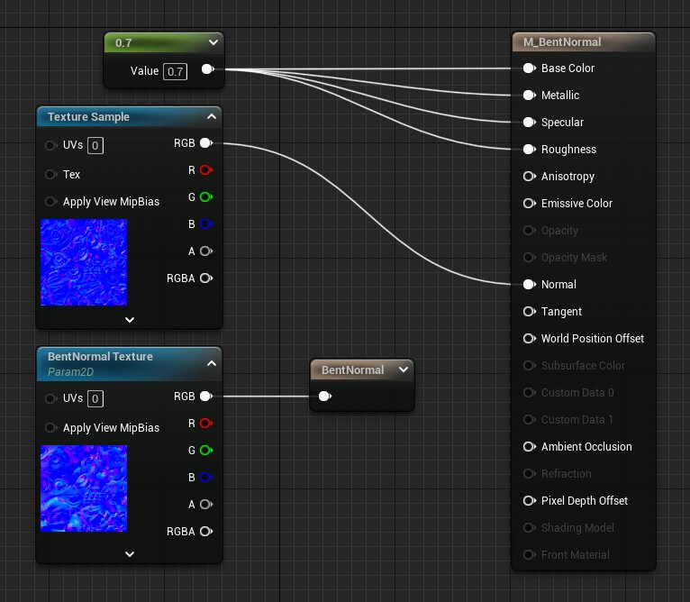

# 环境法线贴图

> 路径：虚幻引擎5.7文档 / 设计视觉、渲染和图形效果 / 材质 / 环境法线贴图

> 原始页面：https://dev.epicgames.com/documentation/unreal-engine/bent-normal-maps-in-unreal-engine

非环境法线

环境法线

在材质中使用环境法线有助于改善它们对照明和着色的反应。在本文档中，您将了解到开始在虚幻引擎项目中使用环境法线所需的所有信息。

## 使用环境法线的好处

以下是使用环境法线的好处：

- 环境法线的最大影响之一是有助于减少照明构建之后发生的漏光。
- 环境法线也可与环境光遮蔽（AO）结合使用，以改善漫射间接照明。原理是使漫射间接照明更接近于全局光照（GI），具体方法是将环境法线代替法线用于间接照明。

使用AO漫射间接照明

使用环境法线漫射间接照明

## 环境法线创建

为了获得最高质量的环境法线贴图，并且符合虚幻引擎与环境法线贴图计算方式有关的假设，请确保在创建环境法线贴图时遵循以下说明：

- 创建环境法线贴图时使用 **余弦分布**。
- 与生成标准法线贴图或AO贴图的方式相似，可以使用[Substance Designer 6](https://www.allegorithmic.com/blog/substance-designer-6-unleashed-now-scan-processing-and-new-nodes)来生成环境法线贴图。
- 生成环境法线时，请确保将角色置于T姿势。
- 环境法线和AO应使用相同的 **距离** 设置。
- 环境法线应与法线贴图位于相同的空间中。请参阅以下图表获取更多信息：

  | 场景空间类型 | 法线贴图类型 | 环境法线类型 |
  | --- | --- | --- |
  | 场景 | 场景 | 场景 |
  | 切线 | 切线 | 切线 |

## 在虚幻引擎中使用环境法线

在材质中使用环境法线贴图的流程与设置和使用法线贴图的过程非常相似。只需向材质图中添加 **环境法线（Bent Normal）** 自定义输出节点然后将环境法线贴图连接到输入，如下图所示。此外，请确保有AO贴图输入到 **环境光遮蔽（Ambient Occlusion）** 输入中。

单击查看大图。

## 反射遮蔽

也可通过不那么传统的强大方式将环境法线贴图用于反射遮蔽/高光度遮蔽。环境光遮蔽（AO）贴图遮挡漫射间接照明，反射遮蔽的概念与它相似，但是应用于高光度间接照明。反射遮蔽的工作原理是让高光叶片和可见锥体相交，可见锥体就是作为圆锥轴的环境法线和作为圆锥角的AO量所形成的半球体未被遮挡部分的圆锥体。这样可以显著减少高光度漏光，尤其是屏幕空间反射（SSR）数据不可用的时候。

也支持用于计算遮蔽的多次反射近似值。这意味着我们可以使用多次反射产生的近似值来取代仅为第一次反射投射阴影的AO或反射遮蔽。借助多次反射近似值，较亮的材质不会变得过暗，有色材质的饱和度将会更高。

AO

环境法线
