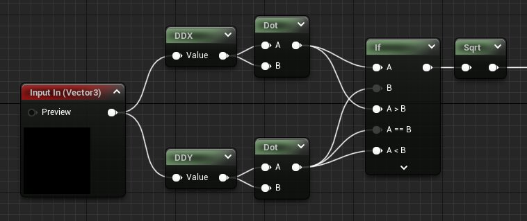
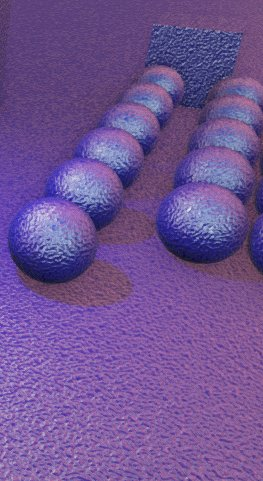
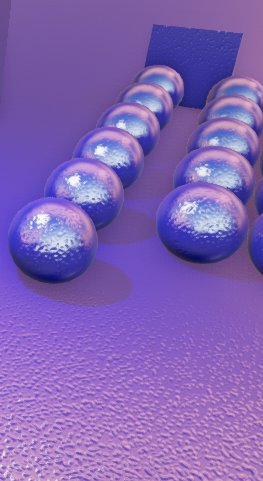
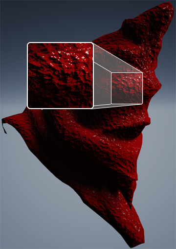
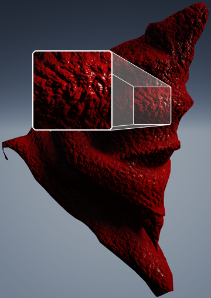
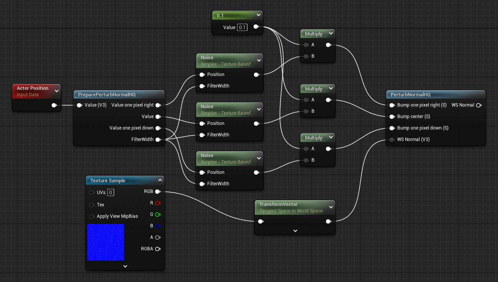

# 不基于切线空间的凹凸贴图

> 路径：虚幻引擎5.7文档 / 设计视觉、渲染和图形效果 / 材质 / 不基于切线空间的凹凸贴图

> 原始页面：https://dev.epicgames.com/documentation/unreal-engine/bump-mapping-without-tangent-space-in-unreal-engine

**凹凸贴图（Bump mapping）** 最早由一名图形程序员发明（1978 James Blinn）， 它通过调整后的着色计算来创建凹凸表面的假象， 无需增加几何体。一个新法线取代了表面法线进行着色。 可通过1D函数对新法线进行调整（如 Perlin noise、灰度纹理）。此方法比使用小毛病较多的真实置换贴图 （如轮廓、遮挡、阴影）更加迅速。

|  |  |  |
| --- | --- | --- |
| 不带凹凸贴图 | 带凹凸贴图 | 带凹凸和法线贴图 |

在实时渲染中，我们通常使用称为 **法线贴图** 的凹凸贴图变种（偏蓝色纹理）。 法线贴图在纹理的每个像素中保存一个颜色，而像素实际上是长度为1的3D向量。

有两种方法生成法线贴图：

- 从灰度图创建法线贴图 - 预计算每个像素与其垂直和水平相邻像素之间的差别 。将两个结果数字（导数）转换为单位法线并存储为色彩。
- 从一个高多边形3D精模烘焙法线 - 把纹理的每个像素和高多边形物体上的3D表面位置结合起来， 并将其编码的法线存储为颜色。

为使生成的纹理在任何旋转下均可反复使用， 存储的法线向量必须在 **切线空间** 中。 切线空间通常包含3种向量：法线、切线和副法线 。它定义表面的朝向。将所有法线转换进切线空间中后即可对其进行重复利用， 因为它们和表面之间被定义为相对关系。切线空间贴图取决于物体的UV贴图，因为纹理中的X和Y方向定义了世界空间中切线空间的两个向量（切线与副法线）。 在生成优质的UV贴图的同时避免切线空间穿帮较为困难，且耗时较长。

如果使用类似Perlin noise的3D灰度函数会怎样？ 函数不要求任何UV贴图，可增强凹凸表面临近的细节渲染。 无需切线空间应用凹凸贴图使其成为现实。

## ddx 和 ddy

为不需要切线空间应用凹凸贴图，我们在材质编辑器中添加了两个新材质表现：**ddx** 和 **ddy**。 每个表现将返回其输入导数的近似值。 图像硬件计算此近似导数的方式为对两个像素进行着色并减去结果 （`ddx = 右 - 左`, `ddy = 下 - 上`）。

这些函数只能在像素着色器中使用， 通常只用于在材质函数中应用较大的效果。

| 项目 | 描述 |
| --- | --- |
| 输入 |  |
| Value | 计算输入导数的值。 |
| 输出 |  |
| Out | 输入的近似导数。类型与输入匹配。例如标量输出中的标量结果，2D输出中的2D，诸如此类。 |

> [!WARNING]
> ddx 和 ddy 以 2x2 的块进行计算，因此和高频率输入共用时将出现一些块状穿帮。

## 凹凸贴图材质函数

可通过数个[**材质函数**](../material-functions/index.md) 在材质中应用凹凸贴图，而无需依赖于切线空间法线贴图。

### ComputeFilterWidth

此函数利用 [**ddx 和 ddy**](#ddx%E5%92%8Cddy) 计算数值在屏幕上的变化速度。 它可在开始出现 noise 的距离中使程序化着色器淡出。 淡出结果闪烁较少，在动态下更为明显，对凹凸贴图而言极其重要， 因为凹凸表面的高光可形成严重的锯齿穿帮。

以下示例图表现的是在远处淡出的程序化凹凸贴图函数。

未使用FilterWidth

使用FilterWidth

| 项目 | 描述 |
| --- | --- |
| 输入 |  |
| **In** | 计算过滤幅度的值。 |
| 输出 |  |
| **Result** | 输入从像素到像素的变化速度。 |

### PerturbNormalLQ

**PerturbNormalLQ** 函数将灰度凹凸贴图函数输入转换为世界空间法线。 然而，因其使用的是 [**ddx 和 ddy**](#ddx%E5%92%8Cddy)（之前提及存在 2x2 块状穿帮的材质表现）， 输出世界空间法线的精度较低。

Low Quality

High Quality

| 项目 | 描述 |
| --- | --- |
| 输入 |  |
| **Bump** | 计算世界空间法线的标量凹凸值（灰度）。 |
| 输出 |  |
| **WS Normal** | 计算出的世界空间法线。 |

> [!NOTE]
> 如需使用此函数输出的世界空间法线， 必须将材质节点上的 **tangent-space normal** 设为 *false*。

> [!WARNING]
> 此函数只作为一个引用存在，不对材质函数库公开。 使用 [**PerturbNormalHQ**](#perturbnormalhq) 函数代替。

### PerturbNormalHQ

**PerturbNormalHQ** 函数计算的导数比 ddx 和 ddy 更精确，可达到更高的精度。 它的原理是利用三个样本位置多次计算标量函数。

| 项目 | 描述 |
| --- | --- |
| 输入 |  |
| **Bump one pixel right** | 当前位置右方一个像素的标量凹凸值（灰度）。 |
| **Bump center** | 当前位置的标量凹凸值（灰度）。 |
| **Bump one pixel down** | 当前位置下方一个像素的标量凹凸值（灰度）。 |
| **WS Normal** | 可选。与凹凸贴图组合的世界空间法线。可通过 [向量变换](../unreal-engine-material-expressions-reference/vector-operation-material-expressions/index.md#transform) 表现转换为世界空间法线的切线空间法线。 |
| 输出 |  |
| **WS Normal** | 组合的世界空间法线。 |

> [!NOTE]
> 如需使用此函数输出的世界空间法线，材质节点上的 **tangent-space normal** 须为 *false*。

### PreparePerturbNormalHQ

**PreparePerturbNormalHQ** 函数计算出 **PerturbNormalHQ** 计算世界空间法线 所需的三个样本位置。

| 项目 | 描述 |
| --- | --- |
| 输入 |  |
| **Value** | 当前位置的标量凹凸值（灰度）。 |
| 输出 |  |
| **Value one pixel right** | 当前位置右方一个像素的标量凹凸值（灰度）。 |
| **Value** | 当前位置的标量凹凸值（灰度）。 |
| **Value one pixel down** | 当前位置下方一个像素的标量凹凸值（灰度）。 |
| **FilterWidth** | 计算用于淡出远处细节的过滤幅度。 |

## 单个函数替代三个函数

可创建包裹凹凸映射函数的材质函数，并在其他函数中对其进行 3 次求值。 此操作可在一定程度上隐藏复杂性。

## 使用纹理

纹理与凹凸映射材质函数共用可提高性能 ；然而由于显卡处理过滤纹理的方式，可能出现穿帮。 普通过滤的颜色以线性内插法进行插值， 其导数为一个常量。这意味着使用灰度纹理可获得表面插值不平滑的法线。

## 注解

描述的方法出自Morten S. Mikkelsen的著作（见参考）。

### 性能

程序化着色器对性能的消耗较大，且难以消除锯齿（与纹理贴图相比）。 我们当前提供Perlin noise，可通过此材质表现进行优化，工作量较大 。为 *n* 个等级使用等级功能需要完成 *n* 次大部分计算。 为凹凸贴图进行3次函数求值产生的计算量更大。需注意消耗和像素数量成正比。 可使用所有功能，但建议只用于原型制作或在受控情况下使用。

### 问题

- 尚无法正常处理翻动/镜像UV。

### 工作展望

此法用于替代显式存储的切线空间。向此方向发展我们尚需更多经验。 当前添加的内容不仅为图形设计师提供了凹凸贴图，还提供了进行研究的方法。

### 参考

- [Bump Mapping Unparametrized Surfaces on the GPU (Morten S. Mikkelsen)](https://d1iv7db44yhgxn.cloudfront.net/documentation/attachments/b38b582d-618f-4924-bf72-0352f86af997/mm_sfgrad_bump.pdf)
- [Derivative Maps (Mikkelsen and 3D Graphics blog)](http://mmikkelsen3d.blogspot.com/2011/07/derivative-maps.html)
