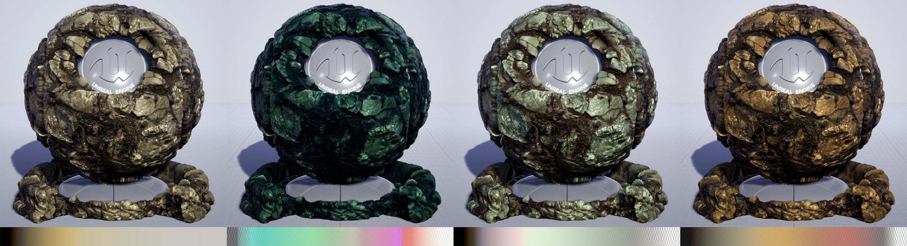
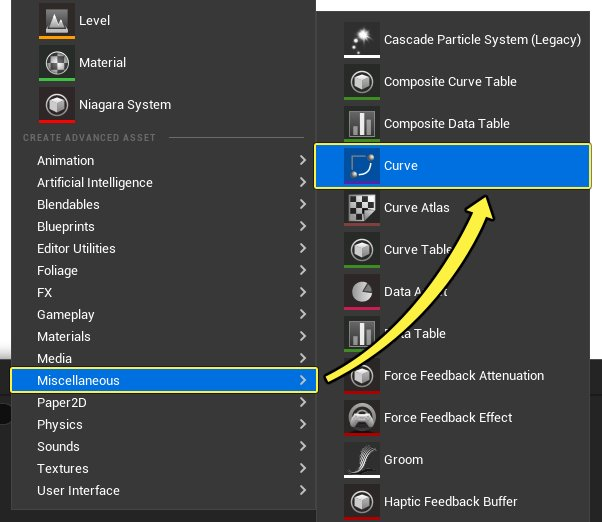
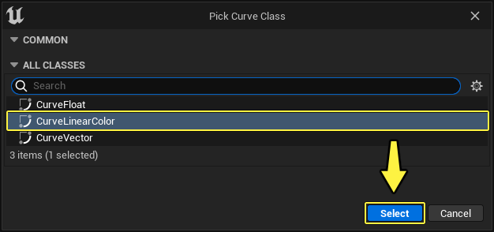
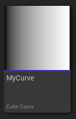
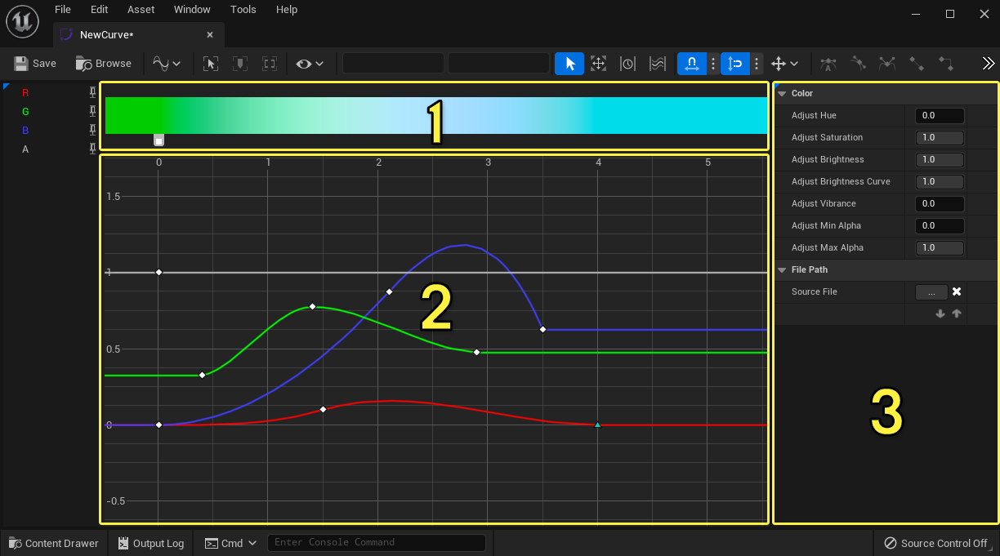
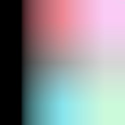
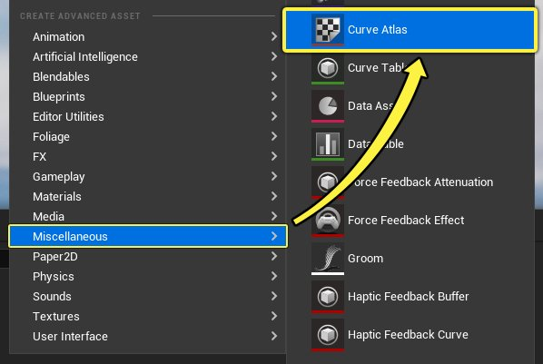
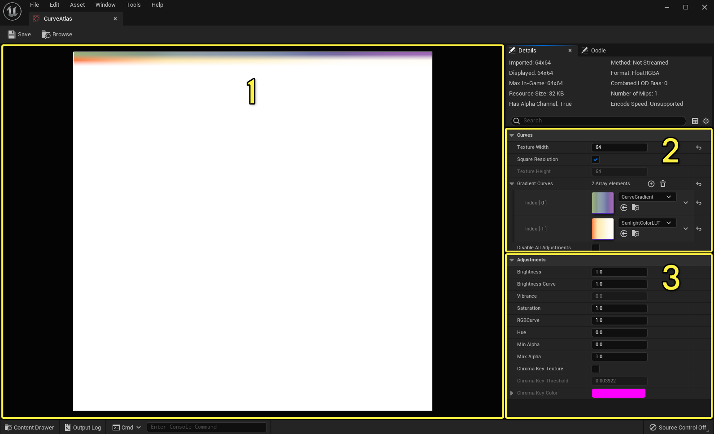

# 材质曲线图集

> 路径：虚幻引擎5.7文档 / 设计视觉、渲染和图形效果 / 材质 / 材质曲线图集

> 原始页面：https://dev.epicgames.com/documentation/unreal-engine/curve-atlases-in-unreal-engine-materials

曲线图集保存了[曲线](../../../animating-characters-and-objects/cinematics-and-movie-making/unreal-engine-sequencer-movie-tool-overview/animation-curve-editor/index.md)资源组合，让你可以通过材质访问曲线线性颜色数据。曲线图集保存可以与[材质](../index.md)搭配使用的纹理中任意数量的曲线。在通过蓝图创建[材质实例](../instanced-materials/index.md)和更改[动态材质实例](../instanced-materials/index.md#%E5%8A%A8%E6%80%81%E6%9D%90%E8%B4%A8%E5%AE%9E%E4%BE%8B)（MID）时，你能够将曲线设置为覆盖，这样就可以快速迭代和更改RGBA曲线值，而不更改基本材质。

## 曲线线性颜色资源

**曲线线性颜色（Curve Linear Color）** 用于存储插值RGBA点，在给定范围内将评估这些点以产生能够与材质搭配使用的颜色渐变。

用曲线线性颜色资源创建的曲线梯度示例

使用 **内容浏览器**，选择 **新增（Add New）>其他（Miscellaneous）>曲线（Curve）** 来创建曲线资源。

然后从 **选取曲线类（Pick Curve Class）** 窗口中选择 **CurveLinearColor**。

内容浏览器中添加了一个新的曲线线性颜色资源，显示其当前颜色梯度预览。当你打开曲线资源编辑器时，可以在图形中添加、调整和删除各个RGBA曲线的键。

当你在资源编辑器中打开曲线时，你将能够设置各个RGBA曲线，调整曲线的颜色值和预览曲线梯度结果。

点击查看大图。

曲线图形（Curve Graph） 用于调整、添加和删除各个RGBA曲线的任意键。 颜色（Color） 面板用于调整影响所有键的颜色值。 曲线梯度结果（Curve Gradient Result） 向你显示所产生的梯度。 你可以按住SHIFT键并单击单个曲线来添加一个键，以向曲线添加键。如果单击空图形，会在你单击的位置处向所有曲线添加一个新键。

## 曲线图集资源

**曲线图集** 资源用于存储和访问多个曲线资源，使你能够管理梯度查找表（LUT）。曲线图集资源编辑器类似于纹理编辑器，你可以用来调整亮度、饱和度、色调等设置。

曲线图集LUT示例

作为 **梯度曲线** 分配给曲线图集的曲线即构成图集。材质图形使用所创建的纹理对应用于Actor的材质执行查找。

使用 **内容浏览器**，选择 **新增（Add New）>其他（Miscellaneous）>曲线图集（Curve Atlas）** 来创建曲线图集资源。

当你在资源编辑器中打开曲线图集时，你可以设置它能够存储的曲线数量，分配曲线和调整所有分配曲线的颜色值——类似于纹理编辑器的功能。

点击查看大图。

1. 主视口显示

   曲线图集

   LUT，其中显示了为所应用

   纹理大小

   分配的所有

   梯度曲线

   。
2. 在

   曲线（Curves）

   面板中，你可以针对所需数量的

   渐变曲线

   设置

   纹理大小

   。默认值为 256。
3. 调整（Adjustments）

   面板用于对分配给曲线图集的所有

   梯度曲线

   进行调整。

> [!NOTE]
> 为实现最大纹理效率，最好使用 **2的幂次方** 值（如 32、64、128）。这里的纹理大小仅用于演示目的，主要是为了包含整个编辑器界面。

> [!WARNING]
> 所用 **纹理大小** 会影响梯度的保真度，因此最好不要对复杂曲线使用较小图集大小。但是，你可以对一组简单曲线使用较小图集来节约纹理大小。

要向曲线图集添加新的梯度曲线，单击 **加号**（**+**）图标以添加数组元素，单击 **垃圾桶** 图标可删除元素。

## 将曲线图集与材质搭配使用

在创建曲线并应用于曲线图集后，你可以创建一个材质来引用该曲线图集和分配到该图集的曲线。

要对图集中的曲线采样，创建一个新材质，并在图形中单击右键，然后添加 **曲线图集行参数（Curve Atlas Row Parameter）** 节点。

> [!NOTE]
> 该节点就像标量参数一样，让你可以使用[动态材质实例](../instanced-materials/index.md#%E5%8A%A8%E6%80%81%E6%9D%90%E8%B4%A8%E5%AE%9E%E4%BE%8B)（MID），通过蓝图将这些实例用于图集UV的V轴，但该节点会为你执行采样任务，并返回矢量3和R、G、B和A遮罩。

当你选择该节点时，在 **细节（Details）** 面板中，你可以指定 **图集** 和该图集中的默认 **曲线** 以用于该材质。

曲线图集会在编译时分解，这意味着目前没有可用于更改图集内容的运行时支持，也不能在运行时更改图集中存储的曲线数据。但是，你可以在一个曲线图集中存储大量数据，并使用蓝图覆盖从材质实例取样的曲线。

例如，下面是一个"岩石"材质，它使用了分配到某曲线图集的多个曲线。

> 图片已省略：undefined

点击查看大图。

然后，在创建任何 **材质实例** 时，可以更改标量参数以选择应用于网格体的 **曲线图集** 所引用的 **曲线** 资源。

下面的示例显示了所应用的材质和从曲线图集引用的曲线。

|  |  |  |  |
| --- | --- | --- | --- |
| 基础 | 曲线1 | 曲线2 | 曲线3 |

### 通过蓝图访问曲线图集

在蓝图中，你可以使用 **获取曲线位置（Get Curve Position）** 节点在动态材质实例上设置标量参数值。获取曲线位置（Get Curve Position）以曲线图集为输入，将标量值传递到 **设置标量参数值（Set Scalar Parameter Value）**，然后返回一个布尔值来指示是否在图集中找到了曲线。

> 图片已省略：undefined

点击查看大图。
