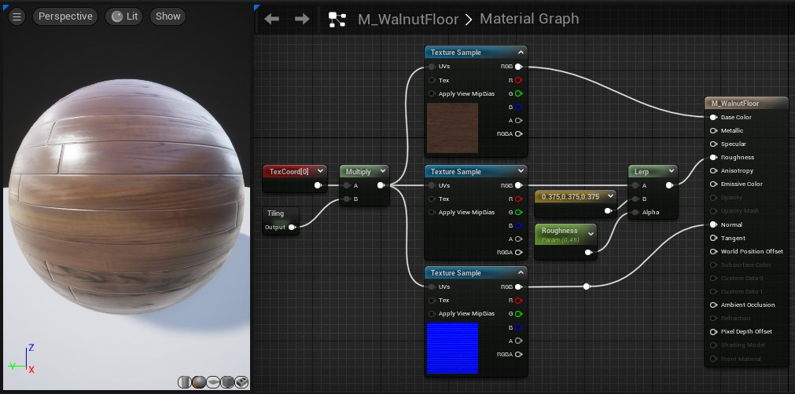
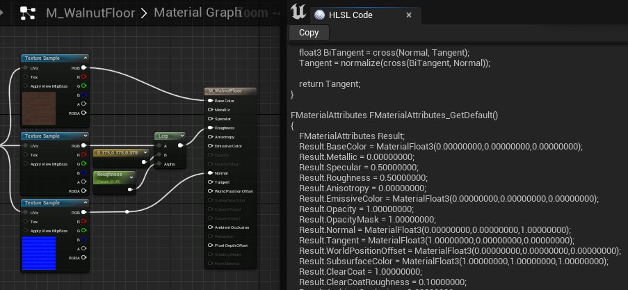
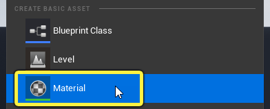
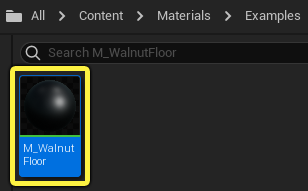
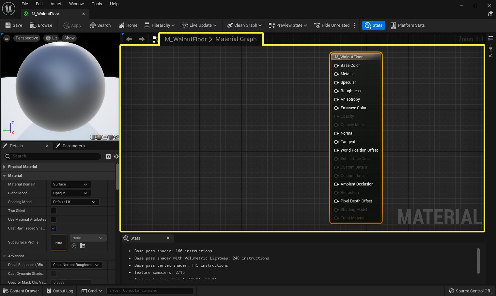
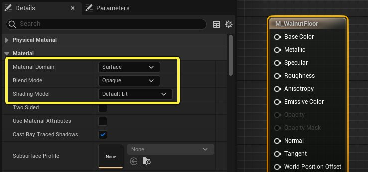
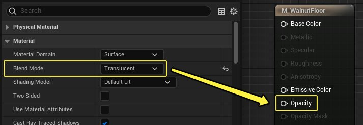
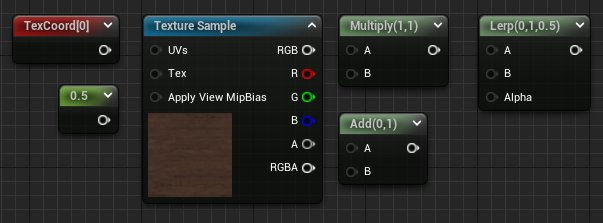

# 材质基本概念

> 路径：虚幻引擎5.7文档 / 设计视觉、渲染和图形效果 / 材质 / 材质基本概念

> 原始页面：https://dev.epicgames.com/documentation/unreal-engine/essential-unreal-engine-material-concepts

虚幻引擎中的 **材质（Materials）** 定义了场景中对象的表面属性。从广义上来讲，你可以将材质理解为涂在网格体上用来控制其视觉外观的"涂料"。

更具体地说，材质能准确地告诉引擎某个表面应该如何与场景中的光源交互。材质定义了表面的各种特性，包括颜色、反射率、粗糙度、透明度等。

## 着色管线概述

在渲染管线中，着色器是定义每个顶点或像素应该如何渲染的程序。虚幻引擎中的着色器用[高级着色语言](https://en.wikipedia.org/wiki/High-Level_Shading_Language)（HLSL）编写。然后，将着色器代码转换为GPU硬件可以执行的一系列汇编语言指令。最终像素颜色就这样输出到了你的显示器。

在虚幻编辑器中，你无需编写HLSL代码即可为你的项目创建着色器。你在名为 **材质编辑器（Material Editor）** 的可视化脚本界面中创建名为 **材质（Materials）** 的资产。

### 材质

在着色器图表中组合名为 **材质表达式（Material Expressions）** 的节点，并将结果传递到[主材质节点](../unreal-engine-material-editor-user-guide/using-the-main-material-node/index.md)上的输入，即可构建材质。

这些节点图表在幕后被默默地转换为HLSL。作为用户，你可以查看HLSL代码，但你无法直接编辑它。这使得虚幻引擎中的材质创建直观且易于使用。

点击 **窗口（Window）** > **着色器代码（Shader Code）** > **HLSL代码（HLSL Code）** ，可以查看材质的HLSL代码。请注意，HLSL代码是只读选项卡，你无法直接在虚幻编辑器中编辑HLSL着色器代码。

## 材质工作流程概述

本小节提供了虚幻引擎中材质创建过程的简要概述。

> [!NOTE]
> 这并非全面的分步指南，而是广泛的概念概述。有关材质编辑器的详细用法，请查看[材质编辑器用户指南](#%E6%9D%90%E8%B4%A8%E7%BC%96%E8%BE%91%E5%99%A8%E7%94%A8%E6%88%B7%E6%8C%87%E5%8D%97)中的页面。

### 创建新材质

虚幻引擎中的材质是一种资产，如静态网格体、纹理或蓝图。你可以通过内容浏览器创建新材质。

1. 在

   内容浏览器（Content Browser）

   中右击。
2. 在上下文菜单的 **创建基本资产（Create Basic Asset）** 分段中选择 **材质（Material）**。

   
3. 材质已在内容浏览器中创建。赋予它唯一的描述性名称。

   

**双击** 材质资产开始编辑材质。**材质编辑器（Material Editor）** 窗口打开，如下所示。

点击查看大图。

突出显示的区域称为 **材质图表（Material Graph）**，这是你在创建材质时完成大部分工作的区域。除了 **主材质节点（Main Material Node）**，新材质中的材质图表为空。主材质节点包含所有控制着材质外观的输入参数。

有关材质编辑器UI的详细分解，[请查看此处](../unreal-engine-material-editor-user-guide/unreal-engine-material-editor-ui/index.md)。

### 材质属性

选择 **主材质节点（Main Material Node）** 后，**细节面板（Details panel）** 中会显示材质的全局属性和设置。你还可以点击材质图表中的空白处，显示材质属性。

其中有三项设置在材质创建过程之初尤为重要，因为它们构成了材质的基础并决定了它的使用方式。

- 材质域（Material Domain）

  – 定义材质在你的项目中的用途。例如，表面、用户界面和后期处理材质是不同的材质域。
- 混合模式（Blend Mode）

  – 定义材质如何与其后面的像素混合。例如，

  不透明（Opaque）

  着色器将完全遮挡后面的对象，而

  半透明（Translucent）

  和

  附加（Additive）

  着色器将以某种方式与背景混合。
- 着色模型（Shading Model）

  – 定义材质如何与光源交互。通常，你的材质将简单地使用默认光照着色模型。但是，虚幻引擎包含针对

  毛发（Hair）

  、

  布料（Cloth）

  和

  皮肤（Skin）

  等事物的特定着色模型，这些模型提供上下文专属输入，以便更轻松地创建这些类型的表面。

这些属性准确地确定在主材质节点上启用哪些输入。在上图中，**不透明度（Opacity）** 显示为灰色，因为不透明混合模式不支持透明度。

如果你选择 **半透明混合模式（Translucent Blend Mode）**，那么 **不透明度（Opacity）** 输入可用，并且之前启用的几个输入将变灰。

创建新材质时，建议你先配置这三个属性。

有关细节面板中其余属性的信息，请查看[材质属性](../unreal-engine-material-properties/index.md)文档。

### 材质表达式节点

如果材质属性是基础，**材质表达式** 则是材质的构建块。

每个材质表达式在材质图表中将执行特定的操作。从技术上讲，材质表达式只是HLSL代码片段的视觉效果呈现。当你组合材质表达式时，你要做的是编写HLSL着色器，而无需查看代码本身。

将电缆连接从一个节点的 **输出引脚** 拖到另一个节点的 **输入引脚**，即可在材质表达式之间传递数据。

> 图片已省略：连接节点

简单的表面可能仅需几个材质表达式定义材质，如下所示，三个纹理示例占大部分比重。 此图表中的其他节点可让美术师更好地控制粗糙度强度。

> 图片已省略：简单材质

这可能是完成的材质，或者你可以在材质图表中使用数学和逻辑继续优化表面。 了解如何组合材质表达式，以便在材质中实现特定结果，是在虚幻中创建材质的基础。

欲了解如何在图表中放置材料表达式，请[查看此处](../unreal-engine-material-editor-user-guide/placing-material-expressions-and-functions/index.md)。

> [!TIP]
> 虚幻引擎包括几十个材质表达式节点。其中的大多数都有鼠标悬停提示文本，但你可以查看[材质表达式参考](../unreal-engine-material-expressions-reference/index.md)页面，了解每个节点的用途。

### 材质表达式属性和数值

每个材质表达式在节点被选中的时候，都有一些属性和数值可以在 **细节面板（Details Panel）** 中进行修改。在一些情况下这些数值还可以直接在材质图表中的节点上进行编辑。

材质表达式属性可以大致分为几个类别。

#### 浮点值

这些数值反映节点储存的数据或者材质表达式中用于运算的数据。比如由[常量](../unreal-engine-material-expressions-reference/constant-material-expressions/index.md)材质表达式定义的数值，或者[数学材质表达式](../unreal-engine-material-expressions-reference/math-material-expressions/index.md)中的算术运算符。你可以在细节面板或者节点上设置这些数值，也可以通过节点的上的引脚来输入数据。

> 图片已省略：Constant value examples

如果在细节面板或者节点上设置了数值，那么通过输入引脚传入的该属性的数据会将其覆盖。

> 图片已省略：Multiply with Constants

1. 左侧的乘法节点进行了一个运算 1 * 2 并且输出数值2。
2. 常量被输入同一个乘法节点时，连接到输入引脚

   A

   和

   B

   的数值会覆盖细节面板中的数值。该节点会计算 2 * 3 并且输出数值6。

#### 功能切换

材质表达式属性还包括切换和下拉菜单，用来控制该节点特定功能的开关，或者更改节点的运作方式。举个例子，**ViewProperty** 节点有一个下拉菜单，可以选择让节点输出哪一个查看属性。类似地，**ComponentMask** 节点由一组切换开关，可以决定哪些数据允许被输出。

> 图片已省略：undefined

#### 变量数据

在一些情况下，节点可能会包含变量，可以在材质表达式中引用其它地方的数据，比如蓝图或者代码。参数名称、排序优先级以及自定义原始数据指数都属于这类属性。这些数值通常为整数或者文本字符串。

### 在图表内编辑数值和属性

很多常用的材质表达式都能够直接在节点本身上修改常量值和属性。对于这些表达式，你不需要选中节点然后在细节面板中编辑数值，而是可以直接在节点的输入区域进行修改。

> 动图已省略：undefined

点击查看大图。

一些材质表达式节点上的属性并不会默认显示。你可以点击材质表达式底部的下拉图标来展开节点并显示更多属性。

### 主材质节点

数据在材质图表中从左到右流动，**主材质节点（Main Material Node）** 是每个材质网络的终点。

主材质节点包含最终输入引脚，这些引脚将确定使用材质编译哪些信息。除非图表中的材质表达式是连接到主材质节点的链的一部分，否则不会影响材质。

在上面的视频中，请注意材质预览仅在纹理示例连接到主材质节点上的相应输入后才会更新。

主材质节点上的每个输入都将定义整个材质的特定属性。这两个页面将帮助你了解每个输入的用途：

1. 基于物理的材质

   ，介绍虚幻基于物理的材质工作流程的原则和最佳实践。
2. 材质输入

   ，介绍主材质节点上每个输入的用途。

### 编译和应用

在编译材质之前，无法在关卡中看到材质的更改。要编译材质，请点击材质编辑器（Material Editor）顶部工具栏中的应用（Apply）或保存（Save）按钮。

> 图片已省略：编译和应用

编译后，你可以将材质直接从内容浏览器（Content Browser）拖到关卡中的Actor上。

> 图片已省略：将材质拖到Actor上

编译可能需要几秒钟，对于复杂的材质，最多可能需要几分钟。这可能会在开发和测试材质时妨碍你的工作进度，但有几种方法可以最大限度地减少编译延迟。

> [!TIP]
> **材质实例化（Material Instancing）** 是一种缩短迭代时间并避免工作时编译长时间延迟的策略。在下面了解更多关于[实例化](#%E6%9D%90%E8%B4%A8%E5%AE%9E%E4%BE%8B%E5%92%8C%E5%8F%82%E6%95%B0%E5%8C%96)的信息。

### 材质编辑器用户指南

上述过程涵盖了虚幻引擎中的基本材质工作流程。上面讨论的每个步骤都在《材质编辑器用户指南》中进行了更全面的介绍。

建议你查看这些页面，了解材质创建的入门知识：

1. 材质编辑器用户界面
2. 放置材质表达式和函数
3. 使用主材质节点
4. 预览和应用材质
5. 整理材质图表

## 工作流程效率概念

你创建的材质很少是一次性资产。为项目中的每个Actor创作全新的着色器效率低下，特别是因为类似的资产往往需要非常相似的材质。

**材质实例（Material Instances）** 和 **材质函数（Material Functions）** 可以使你更轻松地自定义和复用材质，以便你可以更快地迭代并避免重复执行相同的工作。

### 材质实例和参数化

材质实例让你可以从单个父材质快速创建多个变体或实例。

当一组相关资产需要相同的基本材质，但具有不同的表面特征时，将使用实例。如具有多种颜色变体的家具。

> 图片已省略：椅子材质实例

材质实例化让你可以为家具集创建单一的父材质。然后，你将为每种颜色创建材质实例，如上图椅子所示。

使用实例有几个优点：

- 你可以自定义材质实例，无需重新编译父材质。这意味着你对实例所做的更改在所有视口中立即可见。
- 你可以在

  材质实例编辑器

  中向美术师展示

  参数

  。这意味着他们可以快速直观地创建材质变体，无需编辑更复杂的节点图表。

在此处查看[材料实例](../instanced-materials/index.md)，了解轨道。

### 材质函数

**材质函数** 让你可以将材质图表的一部分打包成可重复使用的资产，你可以将其共享到公共库，并轻松插入到其他材质。

它们的目的是即时访问常用的材质节点网络，从而简化材质创建。

例如，下面显示的 **Blend_Overlay** 函数包含图像右侧显示的整个材质表达式网络。 你可以将它从函数库中直接插入到你的图表中，而不用一遍又一遍地构建此节点网络。

> 图片已省略：材质函数示例

虚幻编辑器包括几十个预制的材质函数。你可以编辑任何材质函数来改变其行为，或直接在编辑器中创建自己的函数。

在此处查看有关创建和使用[材质函数](../material-functions/index.md)的更多信息。

## 使用颜色和数据

虚幻引擎使用的是 **RGBA** 色彩模型，意味着每个像素都由四个数值定义，分别对应 **红（Red）、绿（Green）、蓝（Blue）、和Alpha** 通道。

举个例子，RGBA数值 **(0.0, 0.0, 1.0, 1.0)** 表示一个纯蓝色并且完全不透明的像素。在材质编辑器中，这样的一组数值称为 **浮点4（float4）**，因为它储存的是四个 **浮点** 数值。

所有穿过材质图表的信息都由浮点数值表示，但并不是都和上述例子一样四个数值为一组。材质编辑器中有四种数据类型：

| 数据类型 | 定义 | 示例 |
| --- | --- | --- |
| 浮点（Float） | 储存一个浮点数值 | (1.0) |
| 浮点2（Float2） | 储存两个浮点数值 | (1.5, 2.0) |
| 浮点3（Float3） | 储存三个浮点数值 | (0.0, 1.0, 3.5) |
| 浮点4（Float4） | 储存四个浮点数值 | (0.5, 1.0, 0.2, 0.9) |

材质编辑器中的节点和引脚通常都设计为接收特定的数据类型。举个例子，很多针对每个通道运行的材质表达式只有在收到正确的数据类型时才能运作。

正因如此，理解上述四种数据类型才至关重要，还需要明白各种技巧和策略来操作数据并控制信息在你的图表中的流向。在你学习虚幻引擎材质创建的过程中，我们强烈建议参考以下两个页面。

- 材质数据类型
- 数据流和运算
