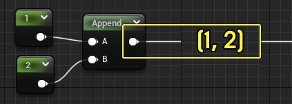
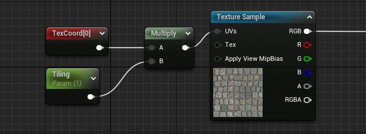
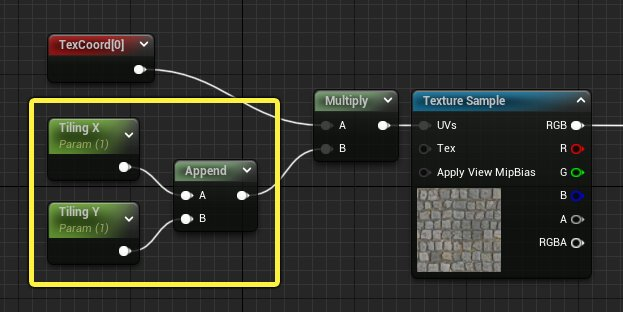
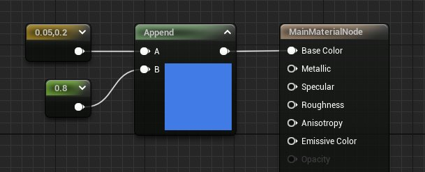
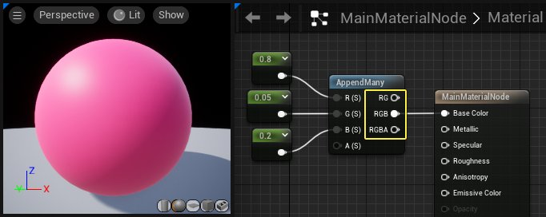
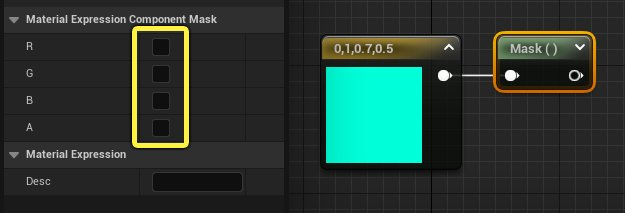
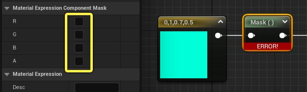
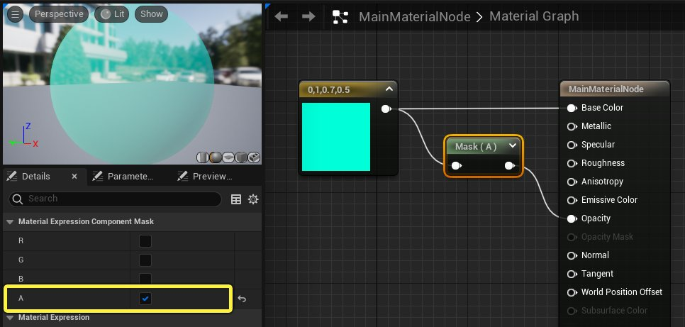

# 材质中的数据处理和运算

> 路径：虚幻引擎5.7文档 / 设计视觉、渲染和图形效果 / 材质 / 材质基本概念 / 材质中的数据处理和运算

> 原始页面：https://dev.epicgames.com/documentation/unreal-engine/material-data-manipulation-and-arithmetic-in-unreal-engine

[材质数据类型](../material-data-types/index.md)页面介绍了四种在材质编辑器中表示数据的方式。要正确创建材质，你不仅需要了解这些数据类型，还需要了解如何处理数据，以及如何控制信息在材质图表中的流动方式。

本文将讨论两个主题。

1. 处理数据类型

   ：如何将浮点数组合成多通道向量，以及反之如何将信息从较大的数据类型中分离出来。
2. 材质图表运算

   ：在具有不同数据类型的材质中执行运算运算的规则和流程。

## 处理数据类型

最初起源于一种数据类型的一段信息并不需要始终保持这种类型。 例如，可以将两个标量参数（float）组合或 **附加** 到一个双通道向量（float2）中，以便将它们传递到需要双通道数据的输入中。 另一方面，也可以使用 **ComponentMask** 从较大的向量中检索特定的通道子集。

本小节中介绍的材质表达式提供了组合和分离数据的方法，以便控制信息在材质图表中流动的方式。

### AppendVector

AppendVector材质表达式将 **输入A** 中的数据与 **输入B** 中的数据进行组合，并输出一个多通道向量（float2、float3或float4）。 在此示例中，两个常量附加在一起输出一个float2向量：**(1, 2)**.

#### 用法示例

如果你希望能够独立修改两个值但需要将它们传递到需要多通道数据的输入中，通常可以使用"附加（Append）"节点。如下图所示，美术师可采用一种方法控制材质实例中纹理的平铺（Tiling）或 **UV缩放**，但只能统一进行控制。

此示例的缺点是材质图表只包含一个参数，但UV坐标有两个通道。 使用此解决方案无法独立控制纹理的宽度和高度。

使用 **AppendVector** 便可以解决这个问题。为每个轴创建一个单独的标量参数，然后将它们传递到"附加（Append）"节点中。 "Append（附加）"节点将这两个参数组合成一个float2向量，然后乘以纹理坐标。

由于 **平铺X（Tiling X）** 和 **平铺Y（Tiling Y）** 是不同的参数，因此现在可以独立控制纹理的宽度和高度。

#### 附加顺序

AppendVector表达式按照数据附加到节点的顺序对数据进行组合。输入B中的数据始终附加到输入A中数据的末尾。请参考下面的两幅图像。

- 在第一张幻灯片中，附加的结果为

  (0.05, 0.2, 0.8)

  ，即节点预览显示的浅蓝色。
- 在第二张幻灯片中，附加的结果为

  (0.8, 0.05, 0.2)

  ，即节点预览显示的粉色。

### AppendMany

**AppendMany** 是一个[材质函数](../../material-functions/unreal-engine-material-functions-overview/index.md)，其功能与AppendVector表达式相同，但最多可以将四个单独的浮点/标量值组合成一个多通道向量。

AppendMany函数的另一个好处是它提供了三个不同的输出引脚。 因此，你可以根据具体情况下的需求，访问部分或全部附加通道。

> [!NOTE]
> AppendMany节点在其输入端仅接受浮点/标量值。如果将float2、float3或float4向量传递到AppendMany节点中，则除第一个值之外的所有值都将被丢弃。

### 分量遮罩

**分量遮罩（Component Mask）** 材质表达式的作用与上文所述的"附加（Append）"节点刚好相反。 ComponentMask不是对数据进行组合，而是提供一种将数据分成其组成部分或通道的方法。

分量遮罩（Component Mask）的功能类似于"门"。 对于连接到输入端的任何数据，都可以准确选择允许哪些通道到达输出端。 下图显示了一个Constant4Vector向量，其中包含值(0, 1, 0.7, 0.5)。 在图表中选择"遮罩（Mask）"节点时，"细节（Details）"面板中会显示四个复选框。

这些复选框确定节点将输出哪些通道。目前没有勾选，所以"遮罩（Mask）"节点不会输出任何信息。 如果尝试将该节点插入下游的输入端，则会显示错误。

通过这些复选框可以过滤信息，仅使用需要的通道。

假设需要使用 **A通道** 中的值来控制材质的不透明度， 则可以通过选中相应的复选框来启用A通道，然后将"遮罩（Mask）"的输出引脚连接到 **不透明度输入（Opacity Input）**。

ComponentMask会丢弃未选中的R、G和B通道，仅输出A通道中的值，在本例中该值为0.5。

## 材质图表运算

在材质图表中处理数据的第二种主要方式是通过数学运算。 材质编辑器中提供了所有常见的运算运算。

> 图片已省略：Arithmetic Material expressions

四个运算材质表达式。 请参阅"数学材质表达式"页面以了解更多信息。

运算节点的基本用途应该是不言而喻的。 例如，如果将常数值 **0.3** 和 **0.2** 插入到"加（Add）"节点，则 **加（Add）** 节点会计算 **0.3 + 0.2** 并输出值 **0.5**。 两个常数值之间的运算简单明了。

> 图片已省略：Simple addition operation

但是，如数据类型页面中所示，信息并不总是作为单独的浮点值在材质图表中流动。 因此，了解在材质中的各种数据类型之间执行运算运算的规则和过程非常重要。 有两个主要方面需要重点关注。

1. 对于运算运算，并非所有数据类型都相互兼容。
2. 运算运算的工作方式因所涉及的数据类型而异。

### 兼容和不兼容的数据类型

上面的示例显示了两个浮点值之间的简单加法运算，即0.3 + 0.2 = 0.5。 由于这两个值都是相同类型的数据，因此该运算有效。 如果向其中一个输入传递另一种不同的数据类型，会发生什么情况？ 以下三点总结了数据类型之间的兼容性：

- **等效数据类型** 之间的运算运算始终有效。例如，**float2 + float2** 会返回一个新的float2。
- 浮点数和任何维度更大的浮点数之间的运算运算有效。 例如，**float + float3** 会返回一个新的 **float3**。
- 两种非等效数据类型之间的运算运算无效。 例如，**float2 + float3** 无效并且返回错误。

换句话说，运算可以跨两种不同数据类型，但前提是其中一种数据类型是浮点数。在下面的图表中，运算 **0.3 + (1,2)** 有效。float与float2中的两个值相加，结果是一个新的float2，其值为 **(1.3, 2.3)**。

> 图片已省略：Float1 plus float2

但是，非等效的float2、float3或float4数据之间的运算运算会返回错误。

> 图片已省略：Float3 plus float2 error

下表总结了材质图表运算的数据类型兼容性。

| 数据类型 | 运算的兼容数据类型 |
| --- | --- |
| Float | 任意 |
| Float2 | Float、Float2 |
| Float3 | Float、Float3 |
| Float4 | Float、Float4 |

### 数据类型之间的运算规则

此外，还需要了解如何在不同数据类型之间执行运算计算。下面的两个场景演示了当一个或两个数据类型均大于某个浮点值时是如何执行运算的。

#### 等效数据类型之间的运算运算

当等效数据类型（例如float2 + float2）之间进行运算运算时，输入A中的每个值都与输入B中的相应值进行运算。下面的示例显示了两个 **Constant2Vector** 表达式之间的加法。

> 图片已省略：Addition between two Float2 variables

如果详细说明，有两个单独的加法运算。每个节点中的第一个值相加：**(1 + 2)**. 然后，每个节点中的第二个值相加 **(3 + 3)**。得到的结果是一个新的float2值：**(2, 6)**.

以下图表显示了四种数据类型中每一种的运算示例。

| 输入A, 输入B | 输入数据 | 数学表示法 | 结果数据 |
| --- | --- | --- | --- |
| Float, Float | (4) / (2) | 4 / 2 = 2 | 8 |
| Float2, Float2 | (1, 3) + (2, 3) | (1 + 2), (3 + 3) | (3, 6) |
| Float3, Float3 | (3, 2, 0.5) * (2, 1, 2) | (3 x 2), (2 x 1), (0.5 x 2) | (6, 2, 1) |
| Float4, Float4 | (2, 2, 2, 3) - (1, 1, 2, 2,) | (2 - 1), (2 - 1), (2 - 2), (3 - 2) | (1, 1, 0, 1) |

#### 浮点和向量之间的运算运算

当浮点数和任何维度更大的数据类型之间进行运算运算时，浮点数会重复用于每个单独的计算。 在下图中，一个 **Constant** 和一个 **Constant3Vector** 相乘。

> 图片已省略：Multiplication between a Float and a Float3

如图所示，Constant中的值将乘以Constant 3Vector中的每个值。此处有三个单独的乘法表达式：**(2 *3)、(2* 1)** 和 **(2 * 2)**。得到的乘积是一个float3值：**(6, 2, 4)**。

浮点数位于输入A还是输入B中，对乘法和加法没有影响，但对除法和减法很重要。

> 图片已省略：Subtraction operation

在上图中，从Constant3Vector (6, 4, 3)中的每个值减去Constant (2)中的值。用数学表示法写成：(6 - 2), (4 - 2), (3 - 2). 得到的float3值为 **(4, 2, 1)**。

如果要颠倒输入顺序，结果会不同。

> 图片已省略：Subtraction with inputs reversed

由于现在浮点数是减法节点中最上面的数字，因此每个运算都是相反的：**(2 - 6), (2 - 4), (2 - 3)**. 得到的float3值为 **(-4, -2, -1)**。

## 总结

本文介绍了你在编写材质图表逻辑时最常见的概念和技巧。下文链接中的参考页面可以帮助你加深对材质编辑器中的数学和数据操作的理解。

- 数学材质表达式
- 向量运算表达式
