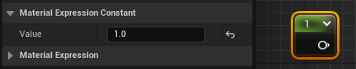
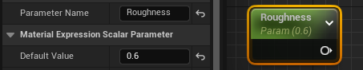
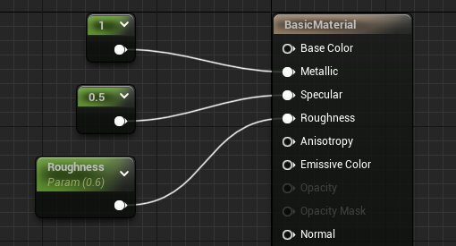
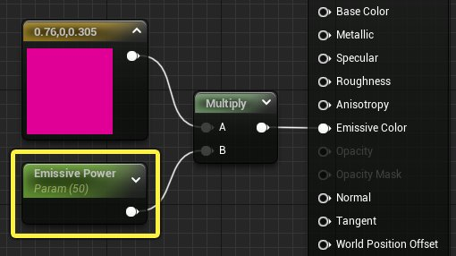
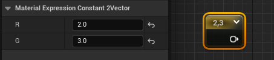
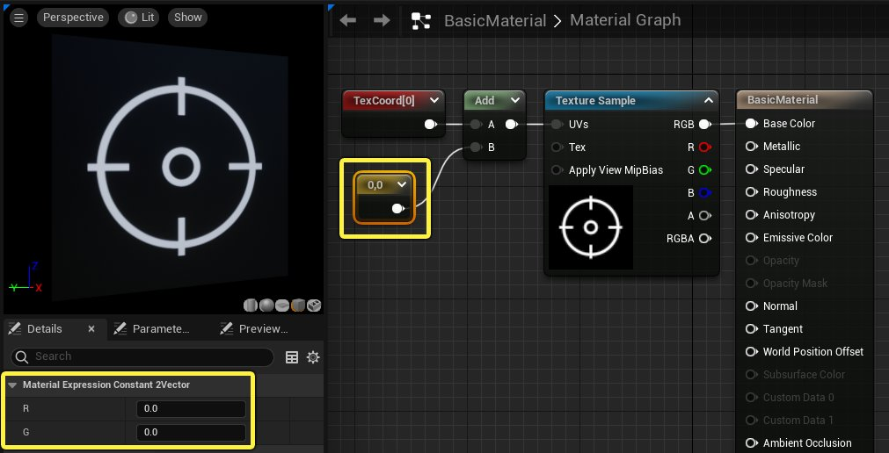
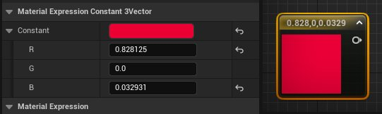
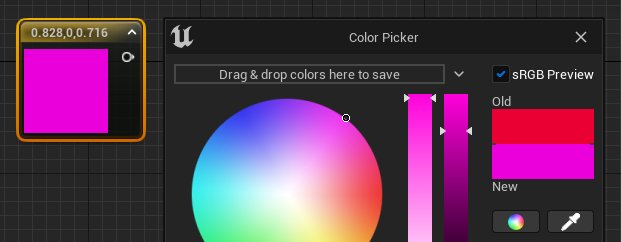

# 材质数据类型

> 路径：虚幻引擎5.7文档 / 设计视觉、渲染和图形效果 / 材质 / 材质基本概念 / 材质数据类型

> 原始页面：https://dev.epicgames.com/documentation/unreal-engine/material-data-types-in-unreal-engine

数据在[材质编辑器](../../unreal-engine-material-editor-user-guide/index.md)中的表示和操作方式是虚幻引擎材质创建中很重要的一个概念。材质的物理属性由[主材质节点](../../unreal-engine-material-editor-user-guide/using-the-main-material-node/index.md)中的输入定义。每个输入都被编程为接受特定类型的数据。同样地，用于创建材质的各种材质表达式节点，除非接收到合适类型的数据，否则将无法通过编译。

本文介绍了材质编辑器中可用的四种数据类型，并举例说明了它们的常用方法。

## 材质数据类型

在计算机图形学中，**浮点（float）** 是一种用于存储单一数值的变量，可以是正数也可以是负数。浮点（Float）是浮点数（floating-point）的简称，表示该数字包含一个小数位，不是整数（即Int）。浮点数的例子包括1.0、-0.5 或 42.0。

本质上说，材质编辑器中的所有数据类型都是浮点变量的变体。它们的区别在于可以保存的数值的数量。float表示一个单一的数字，而float2则保存着两个不连续的浮点值，比如(1.0, 0.5)。

下表列出了材质编辑器中的四种数据类型。

| 数据类型 | 材质表达式 | 数据结构 | 常见用法 |
| --- | --- | --- | --- |
| Float | 常量、标量参数 | (r) | 金属感、粗糙度、算术运算 |
| Float2 | Constant2Vector | (r, g) | UV或XY坐标、比例 |
| Float3 | Constant3Vector | (r, g, b) | 颜色(r, g, b)或3D坐标(x, y, z) |
| Float4 | Constant4Vector、向量参数、纹理 | (r, g, b, a) | 带alpha通道的颜色、纹理(r, g, b, a) |

### 浮点

如上所述，**浮点** 会存储单个浮点值。 它可以为正或为负，并包含一个小数点。 有两个材质表达式可供你用于定义浮点。

#### 常量材质表达式

**常量材质表达式（Constant Material Expression）** 节点会存储单个常量浮点值。由于它是常量，该值在编译材质后不会改变。 下图显示了带有值 **1.0** 的常量节点。

#### 标量参数

**标量参数（Scalar Parameter）** 也存储浮点。与常量不同的是，标量参数在编译材质后，甚至在运行时，还会变为你可以在材质实例中修改的具名变量。下图显示了名称为粗糙度（Roughness）且默认值为 **0.6** 的标量参数。你可以使用它来定义材质的粗糙度属性，同时让美术师能够覆盖材质实例中的值。

如需详细了解何时以及如何使用标量参数而不是常量，请阅读[实例化材质](../../instanced-materials/index.md)文档。

#### 示例

[主材质节点](../../unreal-engine-material-editor-user-guide/using-the-main-material-node/index.md)上的特定输入由浮点定义。例如，**金属感（Metallic）** 、 **高光度（Specular）** 和 **粗糙度（Roughness）** [输入](../../material-inputs/index.md)全都接受0到1之间的浮点值。 因此，你可以将常量材质表达式或标量参数直接传递到主材质节点以定义这些属性。

常量和标量参数常用于控制一些效果的量级。 下面名为自发光能力（Emissive Power）的标量参数会乘以纯色并传递到 **自发光颜色（Emissive Color）** 输入中。更改 **自发光能力（Emissive Power）** 参数的值会使自发光输出更明亮或更暗淡。

### Float2

**Float2** 会存储两个数字值。例如：(2.0, 3.0)。

在材质编辑器中，**常量2Vector** 材质表达式用于定义float2。下面显示了常量2Vector，在其两个通道中的值为 **2.0** 和 **3.0** 。

#### 常量2Vector

**常量2Vector** 很适合随时用于定义或修改需要双通道数据的属性。在细节（Details）面板中，这两个值标记为 **R** 和 **G** ，指的是RGB颜色的红色和绿色通道，但这仅仅是一个可能的用法。坐标(UV, XY)和比例(width, height)是你可以使用常量2Vector定义的其他属性。

在下面的示例中，常量2Vector添加到 **Texture Coordinates** 节点来修改平面上纹理的位置。在第一个幻灯片中，常量2Vector中的值为(0, 0)，所以纹理位置不变。

**Constant2Vector中的值用于控制纹理位置。**

R值更改为0.5时，纹理会沿水平轴偏移，因为它被添加到纹理的U坐标。 这会导致纹理围绕平面的左右边缘。 G值更改为0.5时，纹理会垂直偏移。纹理中心现在位于平面的四个角。

### Float3

**Float3** 会存储三个数字值。 在材质编辑器中，**Constant 3Vector** 节点将定义float3。

#### Constant3Vector

在虚幻引擎中，像素的颜色由表示红色、绿色和蓝色通道的三个值定义。 因此，float3的一个常见用法是定义纯色。

双击 **Constant3Vector** 节点，界面上将显示取色器对话框，让你使用色轮或滴管工具选择颜色。如果你需要创建特定颜色，取色器还提供了字段可输入 **RGB** 、 **HSV** 或 **Hex** 值。 你还可以在细节（Details）面板中点击色条来启动取色器。

Float3的第二个用例是定义(x, y, z)坐标。例如，**世界位置偏移（World Position Offset）** 输入接受三个值，它们将定义材质在世界空间中的x、y和z轴上偏移多少个单位。

在下面的四个幻灯片中，Constant3Vector中的值各自更改为800。你可以看到球体的位置如何变化，首先是在x轴上，然后是y轴，接着是第三个幻灯片中的z轴。

> 图片已省略：世界位置偏移接受三个值，用于分别沿x、y和z轴偏移材质。

**世界位置偏移接受三个值，用于分别沿x、y和z轴偏移材质。**

#### Constant3Vector参数化

右键点击Constant3Vector并从上下文菜单选择 **转换为参数（Convert to Parameter）** ，将其参数化。 这会将节点转换为向量参数。**Vector Parameter** 节点实际会存储四个值(r, g, b, a)，使其成为float4。

但是，需要float3的输入会直接使用前三个值并丢弃第4个值。例如，**基础颜色（Base Color）** 输入接受float3。如果你将向量参数连接到基础颜色，它将使用R、G和B通道，丢弃第四个值（alpha通道）。 由于虚幻引擎知道要丢弃哪个通道，你可以安全地使用向量参数来将float3参数化，尽管该节点在技术上说是float4。

### Float4

**Float4** 会存储四个浮点值。例如：(50.0, 0.0, 100.0, 0.5)。 常用于定义float4的材质表达式共有两个。

#### Constant4Vector

Constant4Vector会存储四个常量值。Constant4Vector最常用于表示RGBA颜色，即带有alpha通道的颜色。你可以像使用Constant3Vector那样，双击节点或点击细节（Details）面板中的色条来访问取色器。

> 图片已省略：Constant4Vector

#### 向量参数

**向量参数（Vector Parameter）** 是参数化的float4。 你可以直接从控制板创建向量参数。**向量参数（Vector Parameter）** 的最常见用法是在材质中创建颜色参数，美术师可以在材质实例中轻松覆盖这些参数。例如，在纹理上乘以向量参数可以为材质的某个方面（比如基础颜色和自发光）添加色调控制。

> 图片已省略：向量参数表达式

除了用于参数化材质工作流程之外，向量参数还有一个额外的优势。不同于此页面上之前的所有示例，向量参数中的每一个数据通道都可通过节点右侧的五个输出引脚来访问。如上所标记，它们是：

1. RGBA

   - 输出float4中的所有值。在上面的示例中：(0.0, 1.0, 0.5, 0.0)。
2. R

   — 仅输出

   R

   通道中的值。
3. G

   — 仅输出

   G

   通道中的值。
4. B

   — 仅输出

   B

   通道中的值。
5. A

   — 仅输出

   A

   通道中的值。

这强调了材质创建过程的一个重要方面。最终，流经材质图表的信息只是以不同方式打包和表示的浮点值。 尽管向量参数的通道在细节（Details）面板中标记为RGBA，这并不意味着材质中需要以这种方式使用这些通道。

除了表示颜色之外，你还可以使用向量参数来将四个离散但相关的值参数化。节点的一种此类用法是，在Megascans父材质中，使用向量参数来将材质的UV平铺和偏移参数化。

> 图片已省略：Megascans材质中的向量参数

> [!NOTE]
> 请注意，RGBA通道在此示例中重命名为平铺X（Tiling X）、平铺Y（Tiling Y）、偏移X（Offset X）和偏移Y（Offset Y）。你可以在细节（Details）面板中的 **参数自定义（Parameter Customization）> 通道名称（Channel Names）** 下重命名向量参数的通道。美术师覆盖参数值时，这些名称在材质实例编辑器中可见。

请在此处阅读关于[向量参数](../../unreal-engine-material-expressions-reference/material-parameter-expressions/index.md#%E5%90%91%E9%87%8F%E5%8F%82%E6%95%B0)节点的更多信息，并在这些页面上详细了解[材质参数化](../../instanced-materials/index.md)。

## 延申阅读

本文介绍的四种数据类型构成了材质图表中所有信息的基础。请注意，数据类型不一定是不可改变的。例如，你可以将两个浮点数合并成一个float2。 同样，你也可以将一个更大的数据类型拆分出单一的浮点数。

请继续阅读关于如何操作数据类型和在材质图表中进行运算：[材质图表中的数据操作和运算](../material-data-manipulation-and-arithmetic/index.md)。
